# qubit_spectroscopy — case manual (v1)

**Authored:** 2026-08-21 · **Source:** docs/131: 71 runs / 217 targets across 5 labs (AS_10TQ9TC, CQT, IQCC_QOP37, KRISS_CR, SNU_1Q), every figure viewed; blind re-classification 8/10

This file and `cases.json` are generated from ONE source. Geometry and prescription language is chip-independent by rule: relative positions, shapes and bounded knob moves only — never absolute frequencies, powers or fluxes, and never a size expressed as a fraction of the swept window.

**Physics.** Drive the qubit while reading out; plot the rotated readout response against drive frequency and fit a Lorentzian. Whether the line appears as a peak or a dip is decided by the readout rotation, not by physics, and it differs between labs and between qubits in one run — so no rule may assume a sign.

## Map cases

### Q1 — clean resolved peak  (seen 90x)

**Geometry:** One feature stands clear of the noise band with a defined crest and two monotone flanks, each of which decays onto a locally flat floor that remains visible for a stretch beyond the feature on BOTH sides. The fitted curve is centred on the crest, its wings track both flanks, and it settles onto the same floor level the data hold. No other excursion in the window has a comparable width-and-height combination. Polarity (upward peak or downward dip) is irrelevant provided the sense is the same as the panel's siblings.

**Prescription:** Adoptable. Before writing, take ONE reproduction at the same span/step/shots with the multiplexing flag toggled (or simply repeated) and require the absolute centre to agree to well inside the fitted width; if the previous run wrote a new centre, re-check that the fitted offset from the new window centre has SHRUNK rather than repeated. Do not narrow the span further just because the fit looks good — a tighter window buys nothing and costs the floor.

**Exemplars:** AS_10TQ9TC/#45_08_qubit_spectroscopy_061005/q6, CQT/#1253_08_qubit_spectroscopy_033636/q7, IQCC_QOP37/#418_08_qubit_spectroscopy_195956/qD4, KRISS_CR/#11_08_qubit_spectroscopy_041945/qA1, SNU_1Q/#52_08_qubit_spectroscopy_222641/q10

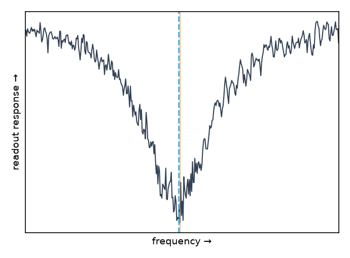
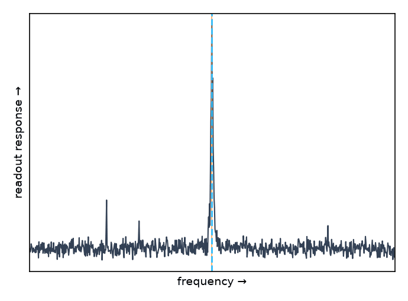
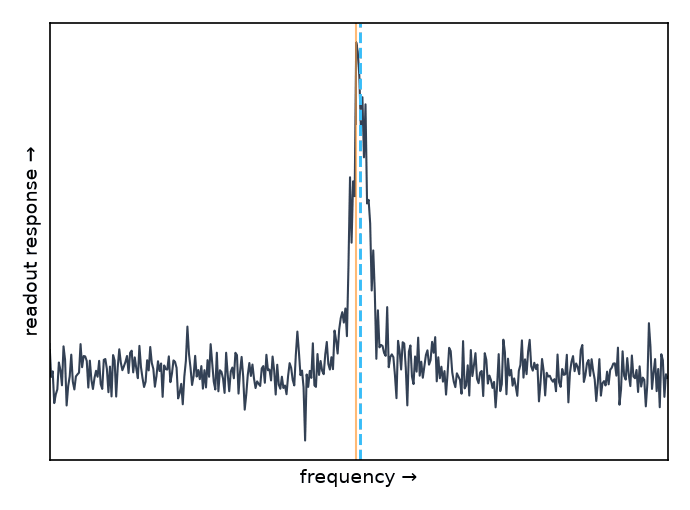

### Q2 — empty window  (seen 12x)

**Geometry:** A band of dense point-to-point scatter of essentially constant thickness runs edge to edge. No group of consecutive samples rises out of the band, there is no rounded shoulder and no local change in the band's centreline or thickness. The largest excursions are isolated single samples of similar height scattered across the whole width, i.e. the tail of the noise rather than a feature. Either no fitted curve is drawn, or a curve is drawn whose height above the local band is comparable to ordinary noise excursions.

**Prescription:** Never adoptable, whatever numbers the record carries. Widen the span by roughly 3-5x about the same centre at an unchanged step-per-span ratio; if still empty, raise the drive amplitude by ~2-5x on the widened span (an empty window at low drive is routinely a drive-level effect, not a missing qubit). If both moves leave the band flat, stop sweeping frequency and escalate to the resonator/readout-rotation and flux nodes — the readout, not the drive, is the likelier fault.

**Exemplars:** KRISS_CR/#5_08_qubit_spectroscopy_040123/qA1, IQCC_QOP37/#427_08_qubit_spectroscopy_205244/qC4, CQT/#1253_08_qubit_spectroscopy_033636/q16, SNU_1Q/#49_08_qubit_spectroscopy_222345/q10, SNU_1Q/#67_08_qubit_spectroscopy_231355/q9

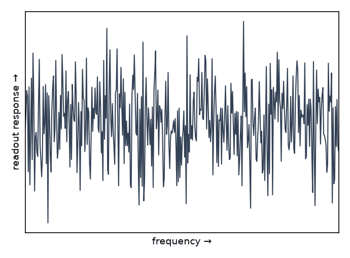
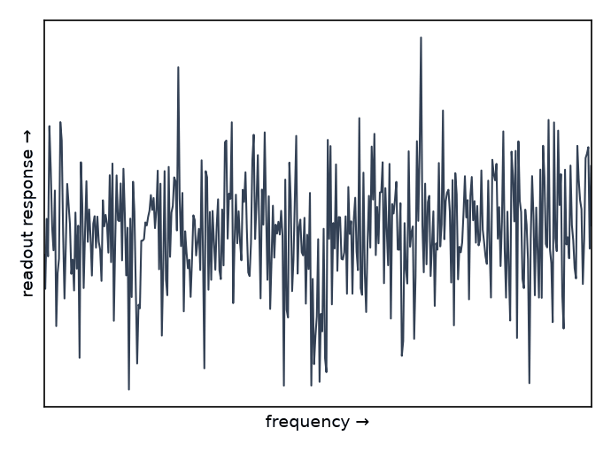

### Q3 — edge feature / monotonic wall  (seen 9x)

**Geometry:** The dominant structure touches a boundary of the swept range: either the trace is already elevated at the first plotted points and reaches its maximum within a few samples of the edge, or it climbs monotonically to the last samples and is still rising when the window closes, or a crest sits so close to a boundary that only one flank is observed. One side of the lineshape and the floor beneath it are never seen. A rising wall may coexist with a fully resolved peak elsewhere in the same panel — in that case the wall is not the case, it is a flag on the peak's case.

**Prescription:** Never adoptable — a centre constrained by one flank is not a measurement. Re-centre the window onto the apparent feature and widen the span by ~1.5-3x so that both flanks and a stretch of floor fall inside; keep drive and shots unchanged so the comparison is clean. If the structure is a monotonic ramp with no crest anywhere, widen in the direction of the rise by a full window before changing anything else.

**Exemplars:** AS_10TQ9TC/#352_08_qubit_spectroscopy_102706/q6, IQCC_QOP37/#417_08_qubit_spectroscopy_194728/qC1, CQT/#1253_08_qubit_spectroscopy_033636/q6, CQT/#1254_08_qubit_spectroscopy_035232/q17, SNU_1Q/#68_08_qubit_spectroscopy_231823/q10

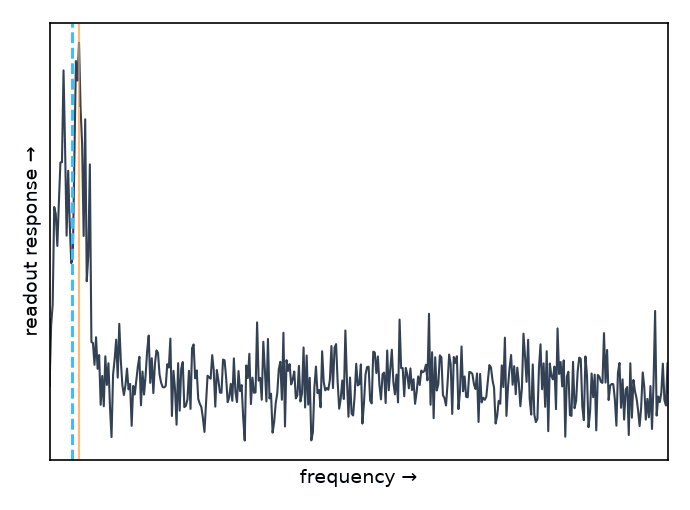

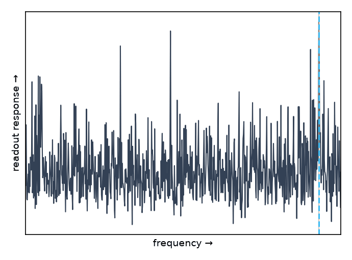

### Q4 — multiple credible features  (seen 45x)

**Geometry:** Two or more separated structures each stand clear of the floor with a resolved shape — a crest plus flanks spanning several samples — and each returns to the floor between them. They may differ in width and height; what makes each credible is that it is many samples wide, not that it is tall. The fitted curve covers one of them and leaves the others entirely untraced. Includes the common asymmetric case of one dominant feature plus a lower, distinctly broader or narrower companion at a fixed offset.

**Prescription:** Do not adopt from this panel. Re-run at a drive amplitude reduced by ~3-5x on the SAME span: a drive-induced companion (two-photon, |1>-|2>, saturation sideband) collapses or moves while the 0-1 line persists at the same absolute frequency. Then narrow the span to ~2-3x the surviving feature's fitted width and confirm. If two features both survive the drive change with comparable prominence, escalate — this node cannot decide which is the qubit.

**Exemplars:** AS_10TQ9TC/#23_08_qubit_spectroscopy_044954/q6, CQT/#1250_08_qubit_spectroscopy_031805/q9, CQT/#1254_08_qubit_spectroscopy_035232/q11, SNU_1Q/#47_08_qubit_spectroscopy_222205/q9, AS_10TQ9TC/#32_08_qubit_spectroscopy_050601/q7

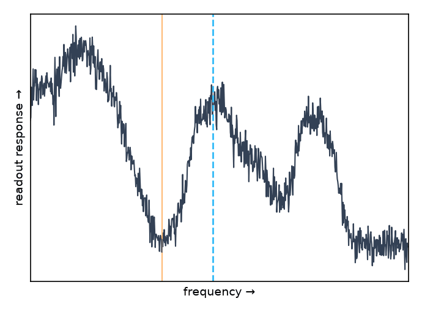

### Q5 — weak feature at the noise margin  (seen 22x)

**Geometry:** A group of consecutive raised samples forms a coherent rise, but its height above the surrounding band is comparable to — at most a small multiple of — the band's own largest excursions, so continuity across several samples is the only thing separating it from the background. The flanks exist but are barely traceable, and one or more unrelated excursions elsewhere in the window reach a similar height. Distinct from the merely broad case: here the problem is margin, not width.

**Prescription:** Do not adopt from one panel. Increase the shot count by ~4x at unchanged span, step and drive (buys ~2x in noise) and repeat; a real line grows in prominence while the floor shrinks. If the margin does not improve, step the drive DOWN by ~2x (over-drive can bury a line in a lifted floor) and repeat once more. Adopt only on two repeats agreeing on absolute centre; if the feature is only credible because earlier runs put it in the same place, record that dependency explicitly.

**Exemplars:** AS_10TQ9TC/#27_08_qubit_spectroscopy_045740/q7, IQCC_QOP37/#417_08_qubit_spectroscopy_194728/qC4, SNU_1Q/#72_08_qubit_spectroscopy_235240/q9, CQT/#1254_08_qubit_spectroscopy_035232/q19, IQCC_QOP37/#436_08_qubit_spectroscopy_223724/qC4

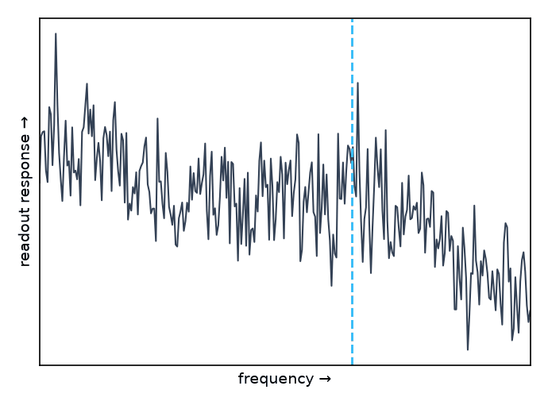
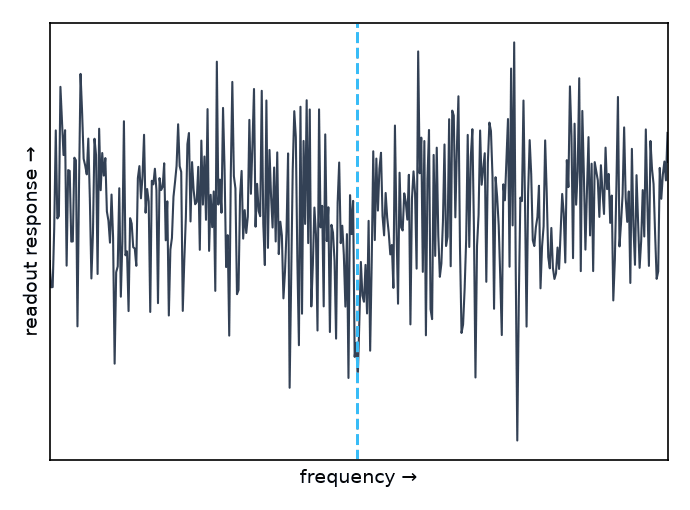
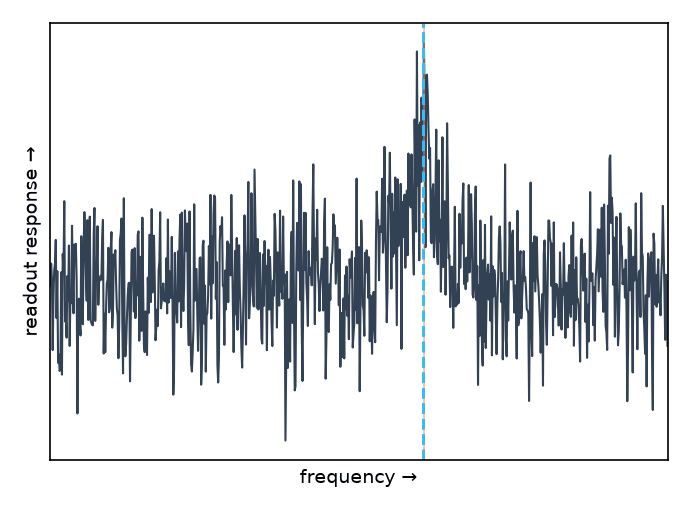

### Q6 — resolved but broadened  (seen 11x)

**Geometry:** One feature, correctly centred and standing well clear of the noise — margin is NOT the issue — whose flanks decay gradually over many times more samples than the same target's line elsewhere in the session, or than a sibling panel's line in the same figure. The crest is rounded or slightly ragged but is still a single crest, and the floor is reached inside the window on both sides. The fitted curve usually tracks it, and any derived drive amplitude computed from the width collapses relative to the narrow-line runs.

**Prescription:** The centre is usually usable; the width and everything derived from it are not. Reduce the drive amplitude by ~3-10x at unchanged span/step and repeat. Expect the width to shrink; repeat the reduction until the width stops shrinking, and adopt from THAT run. If the width does not respond to drive at all, the broadening is not power broadening — re-centre the window first (a badly off-centre window can present a line as a broad hump) and only then suspect the qubit.

**Exemplars:** KRISS_CR/#158_08_qubit_spectroscopy_115018/qA1, KRISS_CR/#118_08_qubit_spectroscopy_090012/qA1, CQT/#1254_08_qubit_spectroscopy_035232/q14, SNU_1Q/#52_08_qubit_spectroscopy_222641/q9, CQT/#1254_08_qubit_spectroscopy_035232/q7

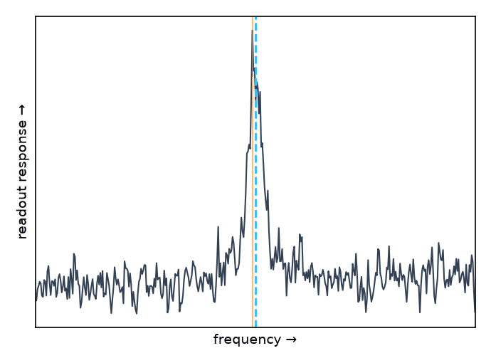
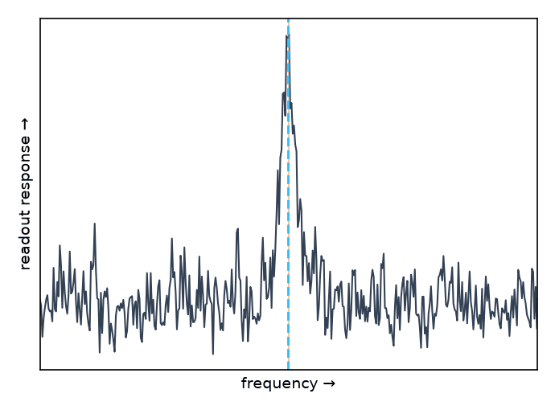
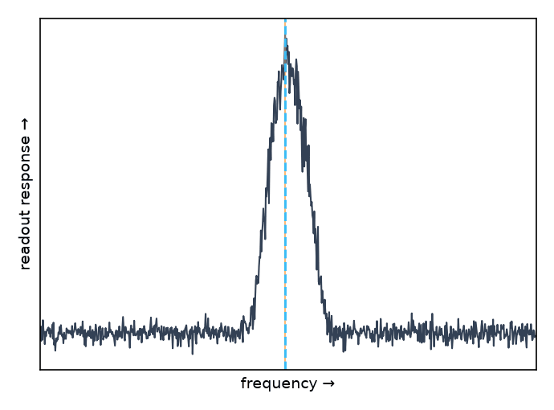

### Q7 — saturated flat top / split line  (seen 9x)

**Geometry:** The feature has no single maximum: an elevated block with steep outer flanks whose top is flat, ragged or carries two crests of comparable height separated by a shallow notch. Its total width is many times that of the same target's resolved line at lower drive. A single-Lorentzian fit either lands its centre IN the notch, or picks one crest and describes the whole block's width.

**Prescription:** Never adopt centre or width. Cut the drive amplitude by at least 5x at unchanged span and step and re-measure; the block should resolve into one crest (or into a set of narrow lines — see the comb case). Adopt only from the low-drive run. If the split survives a large drive reduction, it is not saturation and must be escalated as a genuine doublet.

**Exemplars:** CQT/#1239_08_qubit_spectroscopy_030349/q10, CQT/#1240_08_qubit_spectroscopy_030414/q10, SNU_1Q/#51_08_qubit_spectroscopy_222512/q9, CQT/#1272_08_qubit_spectroscopy_041553/q18, CQT/#1279_08_qubit_spectroscopy_042132/q18

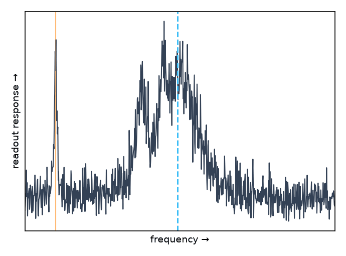

### Q8 — merged multi-peak (multi-peak AND power-broadened)  (seen 3x)

**Geometry:** Several broad rounded humps occupy one part of the window, their intervening dips no longer reaching the floor, with the tallest often flat-topped; the rest of the window is flat noise. It is the same spectrum as a comb of narrow lines seen at lower drive, with the individual lines broadened until they overlap. Neither the multi-peak nor the saturated case alone describes it: there are several features AND each is over-driven.

**Prescription:** Do not adopt. This shape is only diagnosable as a PAIR: re-run the identical span with the drive reduced by ~5x and read the two panels together. If the merged humps resolve into discrete narrow lines, the low-drive panel is the measurement and the count/spacing of the lines is the finding. Never fit a single Lorentzian across the merged group and never derive a drive amplitude from its width.

**Exemplars:** CQT/#1247_08_qubit_spectroscopy_031321/q10, CQT/#1249_08_qubit_spectroscopy_031652/q10, CQT/#1244_08_qubit_spectroscopy_030719/q10

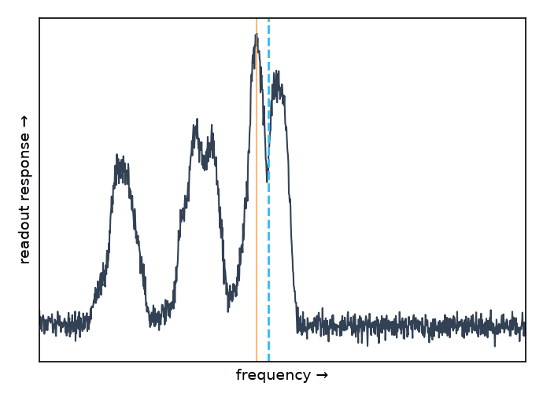
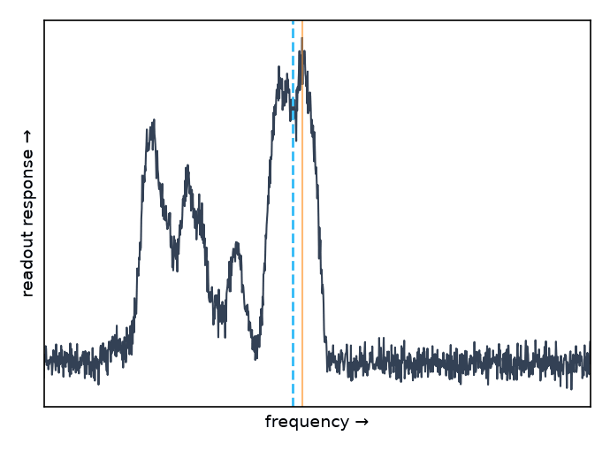

### Q9 — periodic comb  (seen 5x)

**Geometry:** Three or more narrow features of comparable width stand above a flat floor with roughly regular spacing between neighbours, occupying one side or one region of the window while the rest is featureless. Heights vary; the spacing does not. Each member is a resolved line (several samples wide with flanks), not a single-sample spike. A single-Lorentzian record can only name the tallest member.

**Prescription:** Do not adopt any member from this panel. Keep the drive low and widen the span by ~2-3x to map how far the comb extends and whether the spacing stays constant; a comb bounded on one side and regularly spaced points at a systematic cause (sideband/aliasing/multi-photon ladder) rather than at stray defects. Escalate: this node's single-line model cannot settle which member is the 0-1 transition.

**Exemplars:** CQT/#1244_08_qubit_spectroscopy_030719/q10, CQT/#1243_08_qubit_spectroscopy_030617/q10, CQT/#1254_08_qubit_spectroscopy_035232/q6, CQT/#1253_08_qubit_spectroscopy_033636/q11

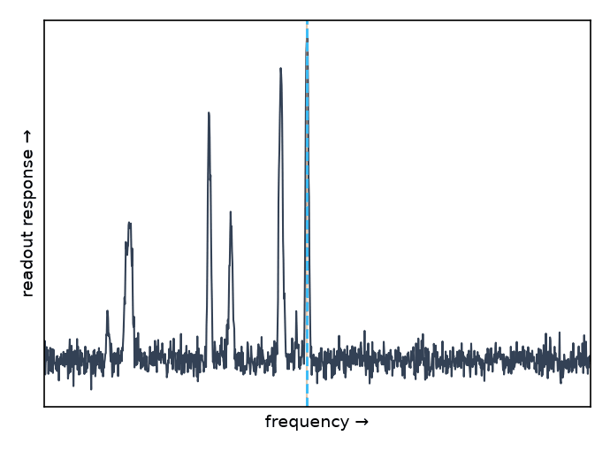
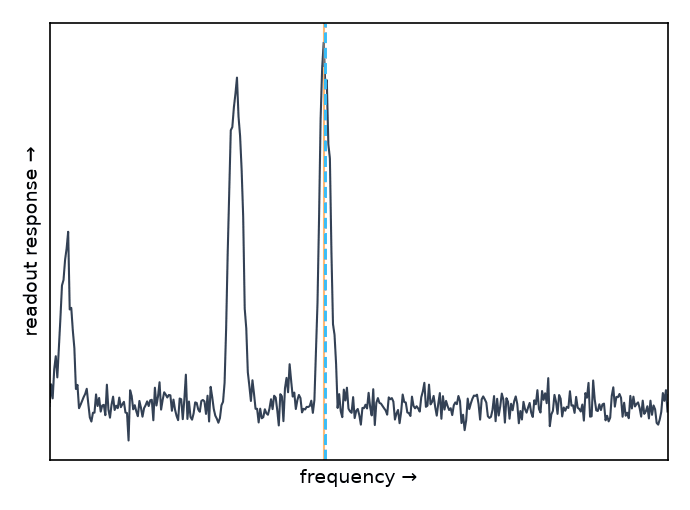
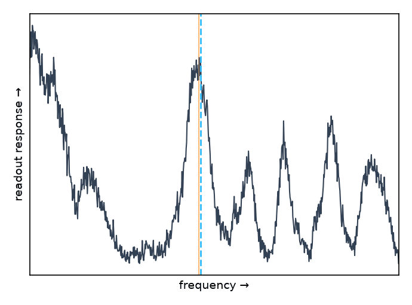

### Q10 — narrow core on a broad pedestal  (seen 9x)

**Geometry:** Two width scales coexist at the SAME position: a sharp, tall crest spanning a few samples sits on top of a much wider, lower elevation whose own flanks decay over many samples before reaching the floor. A single fitted curve must choose one of them — when it takes the pedestal its crest passes visibly below the data's apex and its wings are far wider than the core; when it takes the core the reported width is a small fraction of the same target's width in a sibling run with no visible change in the data.

**Prescription:** Adopt the CENTRE only; refuse the width and every quantity derived from it. Refine the frequency step by ~2-3x so the core is sampled by many points, and reduce the drive by ~2x, then repeat: if the pedestal shrinks with drive and the core does not, the core is the line. Escalate to a dedicated linewidth/power measurement rather than letting this node's single-Lorentzian width propagate.

**Exemplars:** IQCC_QOP37/#412_08_qubit_spectroscopy_193052/qC4, IQCC_QOP37/#414_08_qubit_spectroscopy_193414/qC5, IQCC_QOP37/#417_08_qubit_spectroscopy_194728/qD1, SNU_1Q/#54_08_qubit_spectroscopy_222719/q10, SNU_1Q/#71_08_qubit_spectroscopy_235157/q10, AS_10TQ9TC/#356_08_qubit_spectroscopy_103223/q6

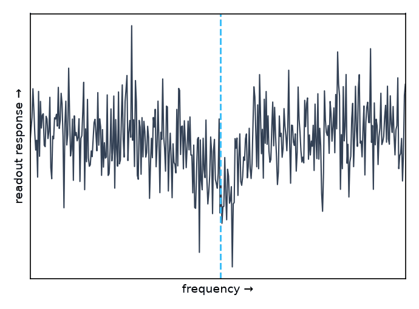
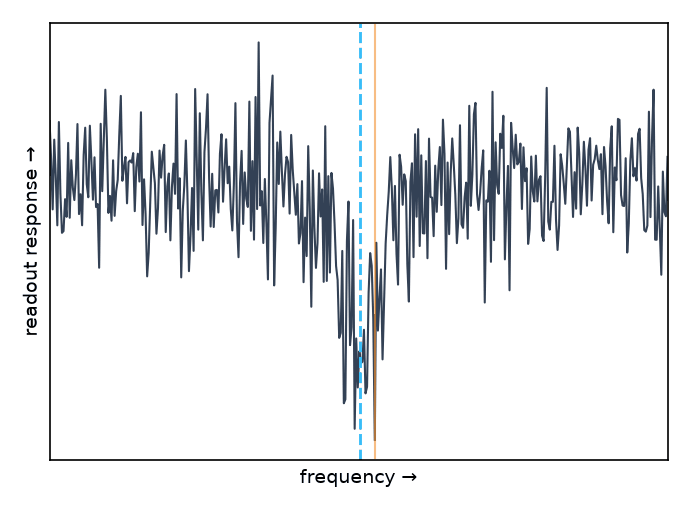
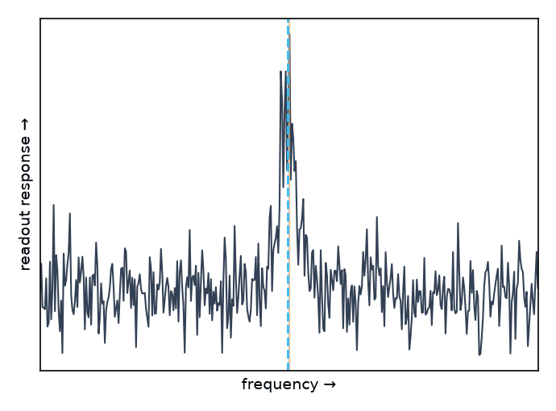

### Q11 — under-sampled line (unresolved spike)  (seen 6x)

**Geometry:** The feature is essentially one tall sample, with at most one or two raised neighbours and no flanks at all, standing far above a flat floor — height is not the problem, body is. The fitted curve is a rounded hump broader than the entire feature whose apex falls well short of the data's, and whose flanks sit above the data on both sides. The reported width is a fixed multiple of the sweep step and is identical to many digits across different targets in the same run; coarsening the step enlarges it proportionally.

**Prescription:** Refine the frequency step by at least 3x (or narrow the span at a fixed point count) until roughly 8-10 samples fall across the fitted width; do NOT change drive first — raising the drive leaves this shape unchanged, refining the step fixes it. The centre may be within a step of correct but is grid-locked, so re-derive it after the step refinement rather than adopting it.

**Exemplars:** IQCC_QOP37/#53_08_qubit_spectroscopy_214302/qA1, IQCC_QOP37/#54_08_qubit_spectroscopy_214347/qA2, IQCC_QOP37/#56_08_qubit_spectroscopy_214554/qA1

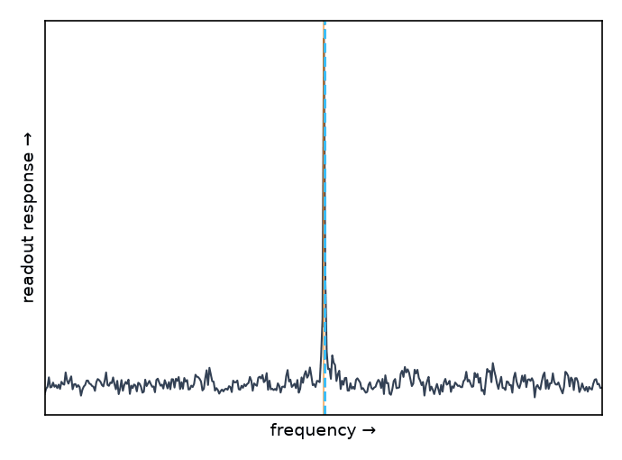
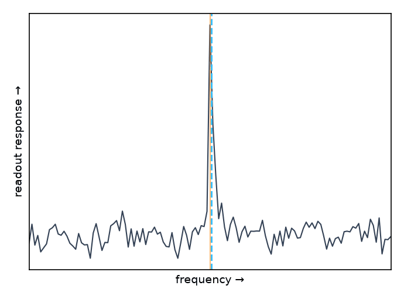

### Q12 — window too narrow for the line  (seen 4x)

**Geometry:** A single well-formed feature is centred in the window and the fit sits on its crest, but BOTH flanks are still descending when they reach the panel edges — no flat floor appears on either side. The centre is well constrained by the crest; the width, the baseline and the contrast are constrained only by the fitter's assumptions, because the data never show what the line decays onto.

**Prescription:** Adopt the centre if it reproduces; refuse the width, baseline and contrast. Widen the span by ~2-3x about the same centre at unchanged drive and shots so that a flat floor is visible beyond both flanks, then re-fit. Distinguish from the edge case (feature against a boundary) and from the broadened case (flanks DO reach a floor, just slowly).

**Exemplars:** AS_10TQ9TC/#33_08_qubit_spectroscopy_050627/q6, AS_10TQ9TC/#33_08_qubit_spectroscopy_050627/q7, AS_10TQ9TC/#28_08_qubit_spectroscopy_045932/q7

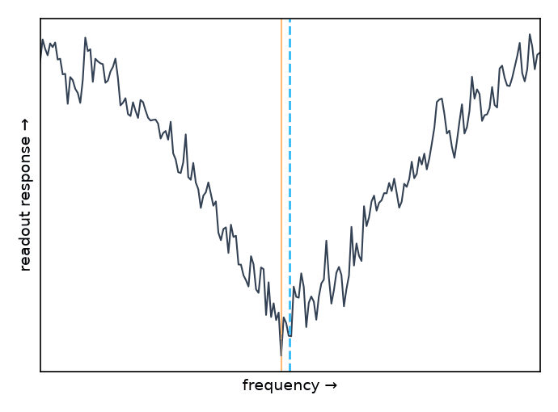
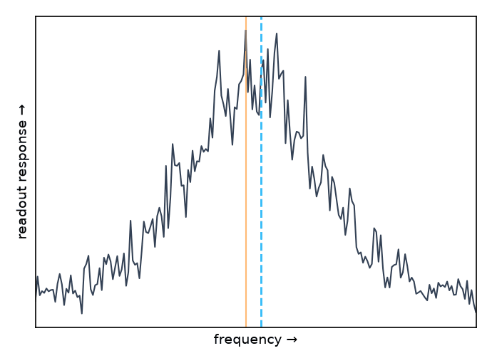

### Q13 — apex clipped by the value axis  (seen 3x)

**Geometry:** A feature rises steeply and its top runs off the upper limit of the drawn value range, so the panel shows two flanks and a gap where the crest should be. Any fitted centre is drawn inside that invisible gap. This is a VALUE-axis truncation, not a frequency-window edge, and it can coexist with fully visible features elsewhere in the same panel.

**Prescription:** Never adopt — the panel cannot confirm the claimed centre. First re-render with the full value range; if the clipping is in the acquired data rather than the plot, reduce the drive amplitude by ~2-5x (or the readout gain) and repeat at the same span. Re-run the target alone at full panel size if it was one tile of a many-qubit sheet, to rule out a rendering artefact of the grid.

**Exemplars:** CQT/#1255_08_qubit_spectroscopy_035402/q18, CQT/#1254_08_qubit_spectroscopy_035232/q18, CQT/#1253_08_qubit_spectroscopy_033636/q18

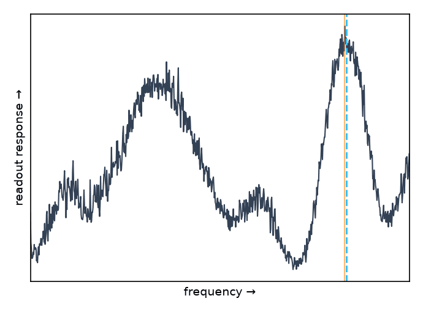
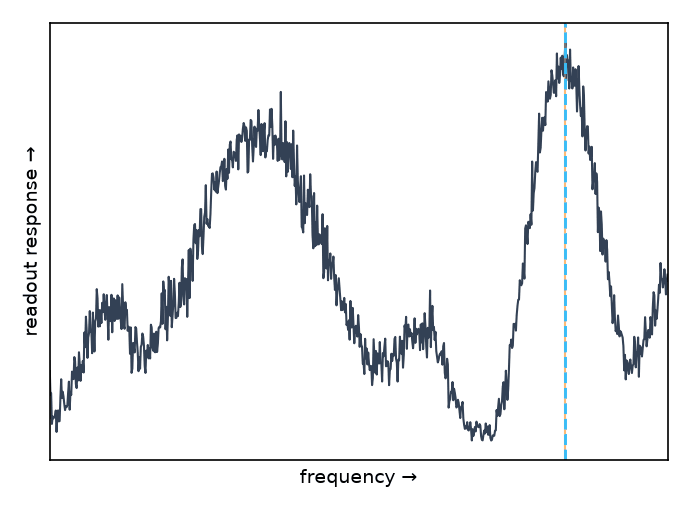

### Q14 — fit with no lineshape at all  (seen 1x)

**Geometry:** The drawn fit contains no crest, no flanks and no inflection anywhere: it is a nearly straight segment that simply follows the local baseline (typically a tilted one), while the record still reports a centre and a near-zero contrast. Any marker sits on a single-sample excursion no larger than several others in the panel. Distinct from a fit that is merely mis-placed — there is nothing to place.

**Prescription:** Never adoptable; treat a success verdict on this shape as a defect in the acceptance rule. Re-derive the readout rotation for the target and re-run at the same settings, because this shape has been produced by a rotation flipped relative to the target's sibling runs (the response then reads as a dip while the model fits a rise). If the polarity is confirmed correct, treat the window as empty and follow that case's prescription.

**Exemplars:** AS_10TQ9TC/#26_08_qubit_spectroscopy_045721/q6

### Q15 — spike forest (no resolved lineshape)  (seen 6x)

**Geometry:** The window's only excursions are one- or two-sample spikes standing above an otherwise flat, thin band — several of them, of varying and sometimes comparable height, with no flanks and no width. Each is narrower than any resolved line the same session produces. The window is not empty (things stand clear of the band) and the spikes are not credible features (a spectroscopic line has a width), so a fit planted on the tallest of them reports a full centre-plus-width set from something that is not a line.

**Prescription:** Never adopt. Repeat once at identical settings: instrumental spurs recur at exactly the same positions while noise spikes move. Then raise the drive by ~2-3x — a real, very narrow line broadens and grows flanks, a spur does not. If the spikes persist unchanged in position and width across both moves, mask them and treat the window as empty (widen the span). Never let the fitter choose among spikes by height.

**Exemplars:** CQT/#1253_08_qubit_spectroscopy_033636/q11, CQT/#1253_08_qubit_spectroscopy_033636/q12, SNU_1Q/#64_08_qubit_spectroscopy_230131/q10, SNU_1Q/#67_08_qubit_spectroscopy_231355/q10

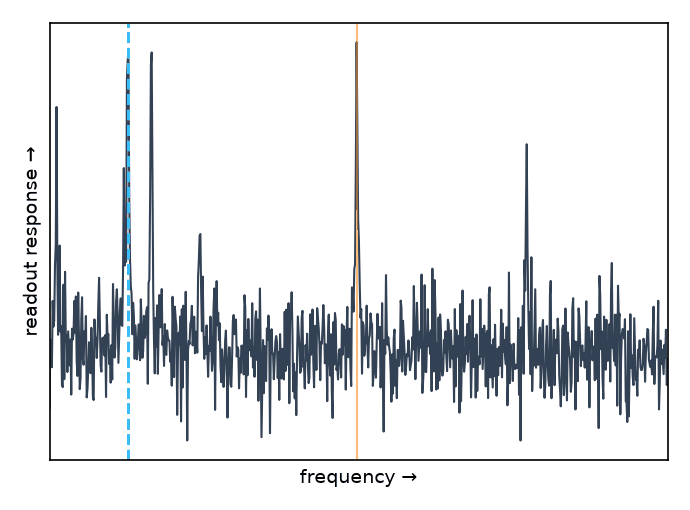
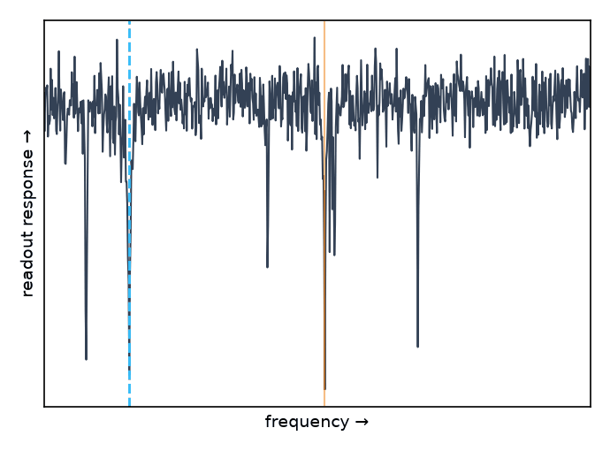
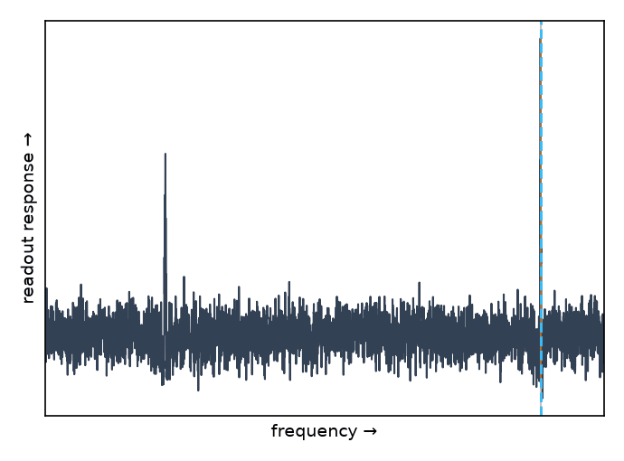

## Flags (orthogonal to map geometry)

A flag can sit on ANY case.

### F01 — fit placed on the wrong feature  (seen 14x)

**Signature:** The panel contains more than one candidate and the fitted curve sits on one of them while a broader, taller or larger-area structure elsewhere in the window is left entirely untraced. Frequently the chosen one is a narrow near-edge excursion and the ignored one is the broad hump that later runs converge on.

**Prescription:** Refuse the value. Re-run at a drive reduced ~3-5x on the same span and see which candidate survives; then narrow the window around the survivor to ~2-3x its width. Record the ignored candidate's position — a later node sweeping that region needs to know it exists.

**Exemplars:** AS_10TQ9TC/#23_08_qubit_spectroscopy_044954/q6, CQT/#1253_08_qubit_spectroscopy_033636/q10, SNU_1Q/#68_08_qubit_spectroscopy_231823/q10, SNU_1Q/#47_08_qubit_spectroscopy_222205/q9

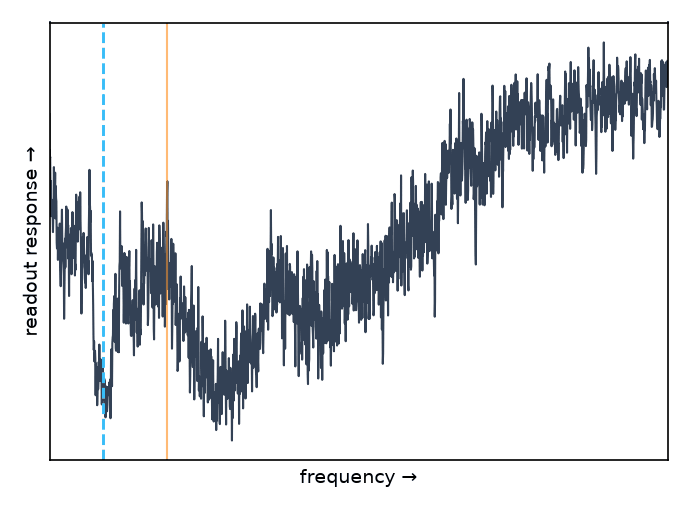
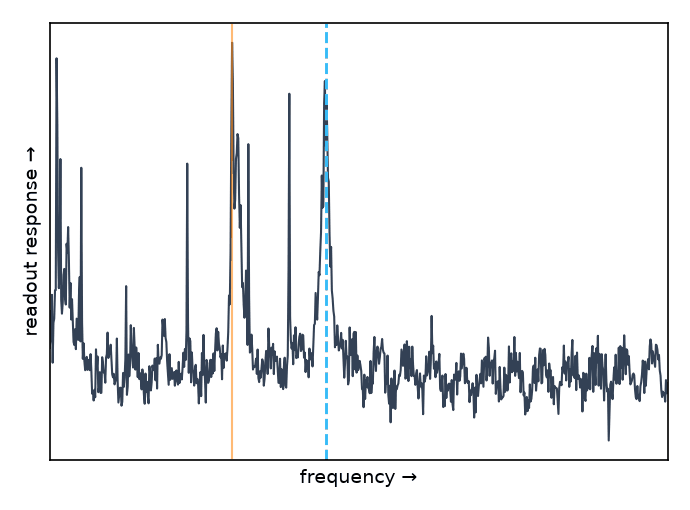
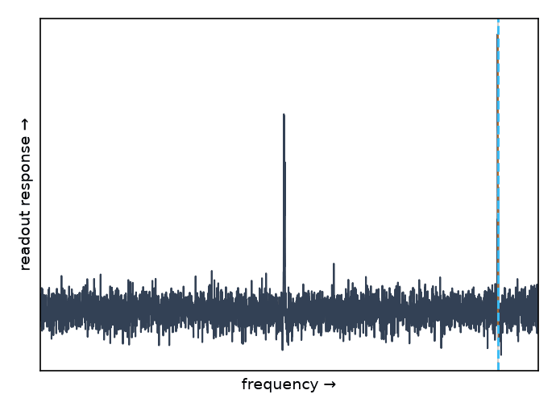

### F02 — fitted centre in the dip between two crests  (seen 5x)

**Signature:** The feature's top carries two crests of similar height separated by a shallow notch, and the fit's centre line lands IN the notch — i.e. at a local MINIMUM of the data — while the fitted curve cuts across the whole block, wider and lower than either crest.

**Prescription:** Refuse the value outright; this is not 'slightly off peak', it is a centre placed where the data are lowest. Reduce drive ≥5x and re-measure. If the split survives, fit two components or escalate.

**Exemplars:** CQT/#1239_08_qubit_spectroscopy_030349/q10, CQT/#1240_08_qubit_spectroscopy_030414/q10, CQT/#1241_08_qubit_spectroscopy_030532/q10, CQT/#1247_08_qubit_spectroscopy_031321/q10, CQT/#1272_08_qubit_spectroscopy_041553/q18

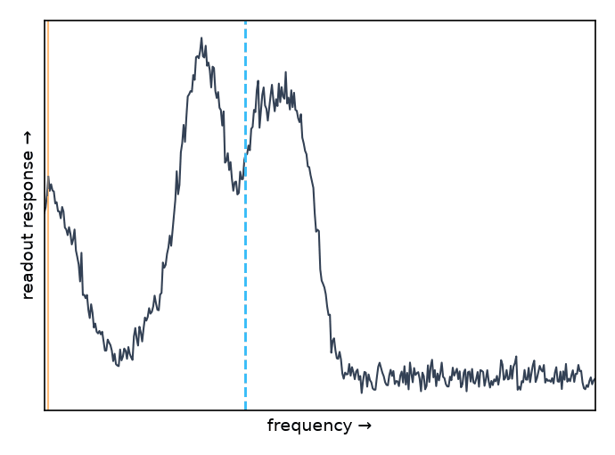
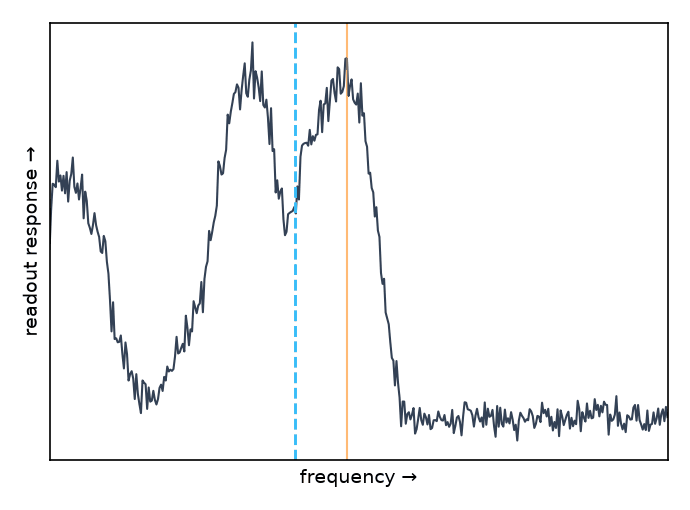

### F03 — fit planted on a noise excursion in a blank window  (seen 5x)

**Signature:** A uniform noise band with no coherent group anywhere, and a hair-thin fitted sliver drawn over one or two adjacent samples — narrower than the band's own point-to-point scatter and with no supporting structure on either side. The record nevertheless carries a centre, a width and derived drive amplitudes; the reported goodness-of-fit is at or below zero.

**Prescription:** Never adopt, and never let the derived amplitudes leave the node. Treat as an empty window and follow that prescription. A fitter that emits a full parameter set from a flat band should be made to refuse instead.

**Exemplars:** AS_10TQ9TC/#25_08_qubit_spectroscopy_045653/q7, KRISS_CR/#5_08_qubit_spectroscopy_040123/qA2, SNU_1Q/#64_08_qubit_spectroscopy_230131/q9, SNU_1Q/#67_08_qubit_spectroscopy_231355/q9

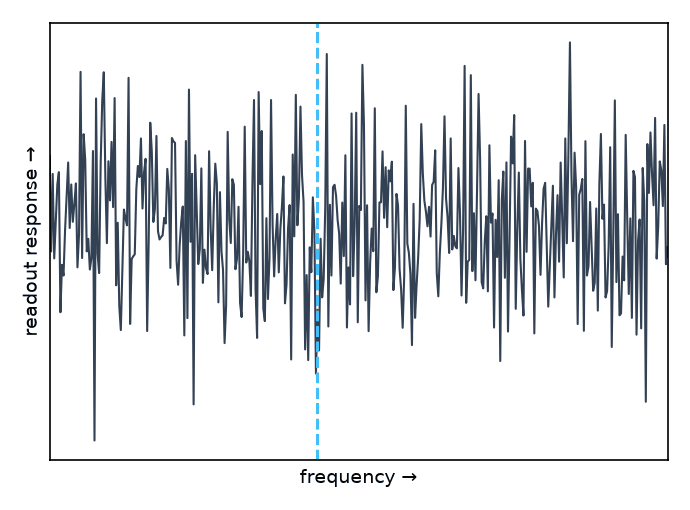
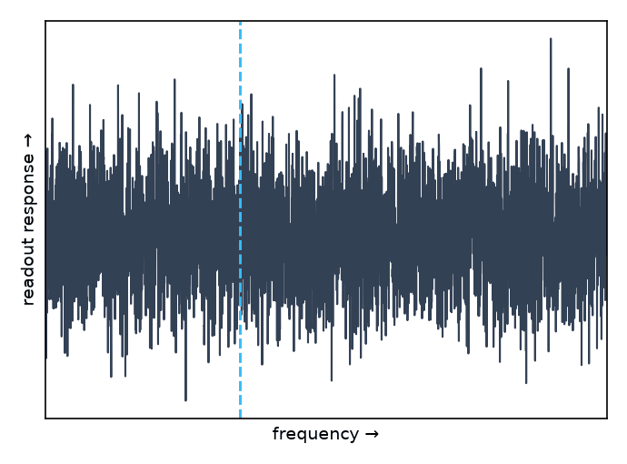

### F04 — fit anchored on a narrow spur while a broad line is present  (seen 6x)

**Signature:** A one- or two-sample excursion, far narrower than any resolved line in the session and recurring at a fixed position across runs, carries the fitted curve, while a broad rounded response with real flanks sits elsewhere in the same window untraced.

**Prescription:** Refuse. Mask candidates narrower than a floor set by the sweep step (require several samples across the fitted width) and re-fit. Confirm by lowering the drive: the broad response collapses into a fittable line, the spur is unchanged.

**Exemplars:** SNU_1Q/#47_08_qubit_spectroscopy_222205/q9, SNU_1Q/#50_08_qubit_spectroscopy_222449/q9, AS_10TQ9TC/#23_08_qubit_spectroscopy_044954/q7

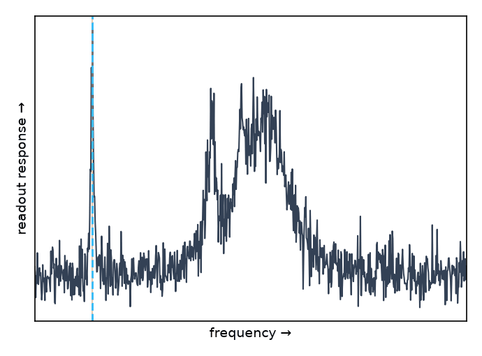

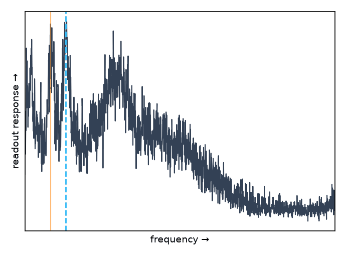

### F05 — fitted width disagrees with the visible feature  (seen 20x)

**Signature:** The fit is centred correctly but its half-height span is visibly wider (curve sits above the data on both flanks, wings extending well past where the data return to the floor) or visibly narrower than the feature it covers. In the wide case the fitted wings often absorb a stepped or sloping baseline.

**Prescription:** Adopt the centre only if it reproduces; refuse the width and every derived amplitude. Widen the span until a flat floor is visible on both sides so the fitter's baseline is constrained, then re-fit before believing any width.

**Exemplars:** AS_10TQ9TC/#27_08_qubit_spectroscopy_045740/q6, CQT/#1254_08_qubit_spectroscopy_035232/q3, IQCC_QOP37/#414_08_qubit_spectroscopy_193414/qD1, SNU_1Q/#53_08_qubit_spectroscopy_222659/q9, AS_10TQ9TC/#356_08_qubit_spectroscopy_103223/q6

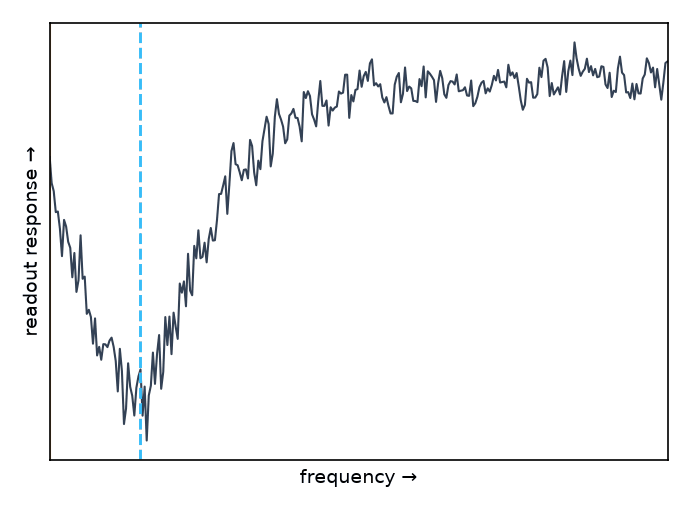

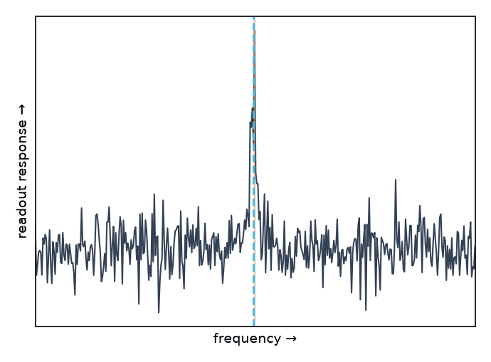

### F06 — fit crest below the data apex  (seen 16x)

**Signature:** The fitted curve's maximum stops well short of the data's tallest samples at the same position — often reaching only a fraction of the feature's height — so the model describes a pedestal or an average while the centre is right.

**Prescription:** Refuse the contrast/height and anything derived from them; the centre may still be usable. Refine the step across the core and re-fit; if a broad pedestal is genuinely present, the panel needs two components, not one.

**Exemplars:** SNU_1Q/#54_08_qubit_spectroscopy_222719/q10, SNU_1Q/#71_08_qubit_spectroscopy_235157/q10, IQCC_QOP37/#414_08_qubit_spectroscopy_193414/qC4, IQCC_QOP37/#436_08_qubit_spectroscopy_223724/qD2

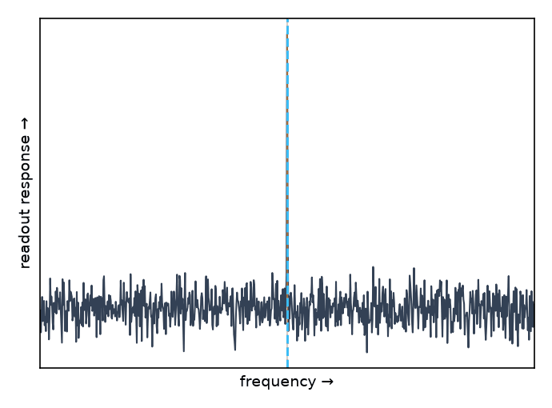
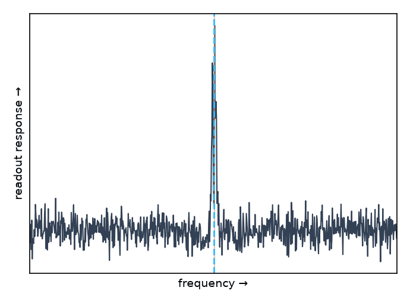
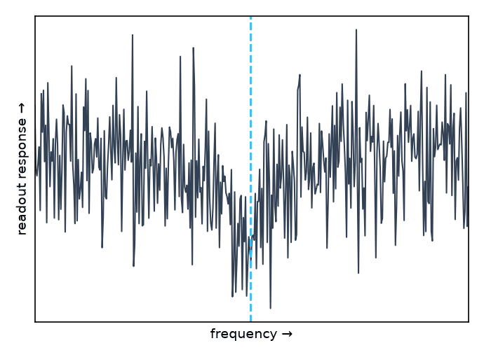

### F07 — fitted baseline disagrees with the data floor  (seen 8x)

**Signature:** Away from the crest the fitted wings do not settle onto the level the data hold: they either keep descending BELOW the surrounding floor on both sides (so the curve crosses the data on each flank and only touches near the apex) or float clearly ABOVE the local band. A correct centre can coexist with either.

**Prescription:** Refuse width and contrast; treat the reported goodness-of-fit as describing the baseline error, not the line. Widen until a flat floor is present on both sides and re-fit before adopting anything but the centre.

**Exemplars:** IQCC_QOP37/#429_08_qubit_spectroscopy_212349/qD3, CQT/#1250_08_qubit_spectroscopy_031805/q9, SNU_1Q/#50_08_qubit_spectroscopy_222449/q9, CQT/#1256_08_qubit_spectroscopy_035427/q18

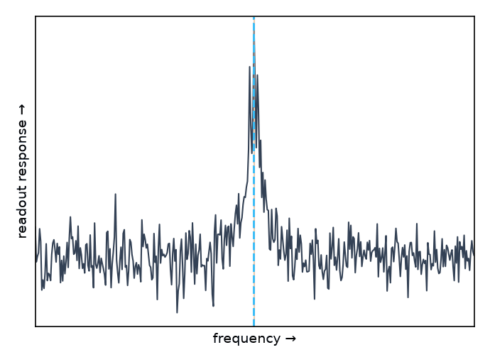
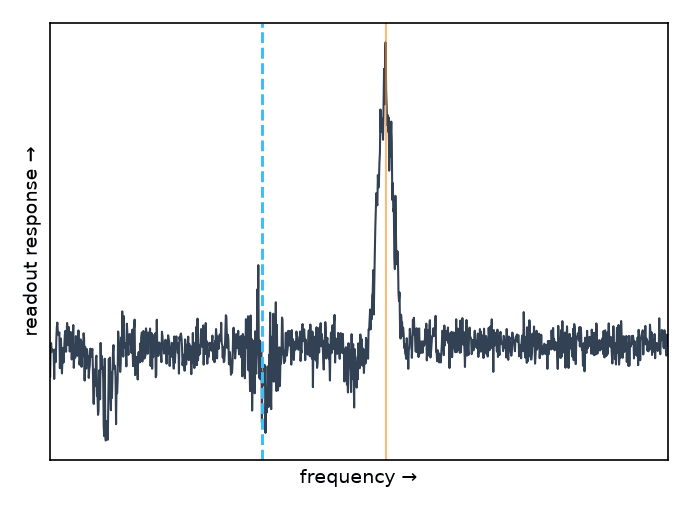
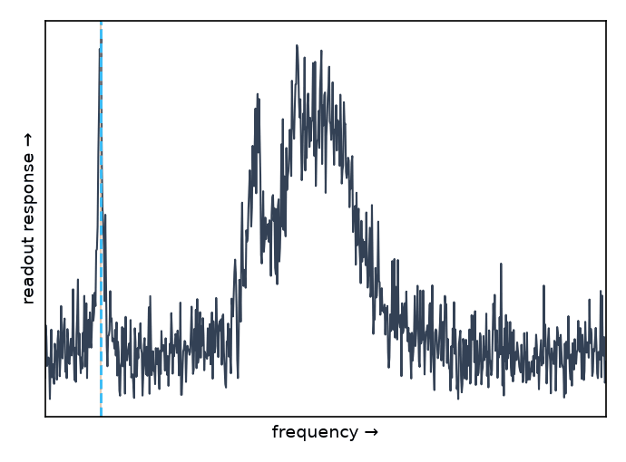

### F08 — fit drawn over only part of the feature  (seen 2x)

**Signature:** The dashed curve is rendered across a restricted stretch of frequency around its centre rather than across the structure it claims to describe, so a neighbouring crest, notch or flank of the same block lies outside the drawn fit and is silently excluded from the comparison.

**Prescription:** Treat the panel as unverified: the fit's agreement with the data cannot be judged where it is not drawn. Re-fit over the full feature or refuse.

**Exemplars:** CQT/#1242_08_qubit_spectroscopy_030553/q10

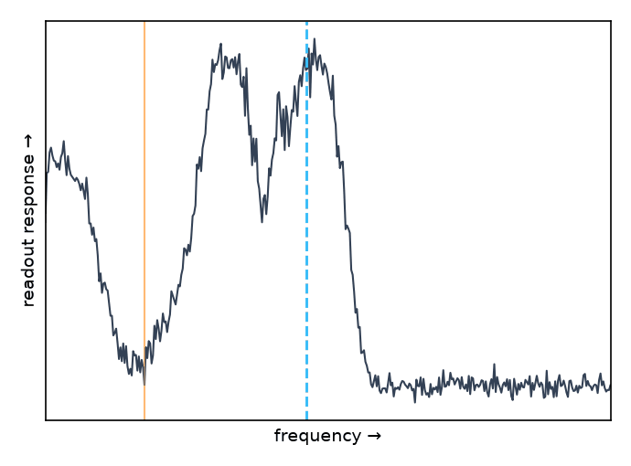

### F09 — fitted width pinned at a bound  (seen 7x)

**Signature:** The reported width is an exactly round value, or is identical to many digits across different targets in the same run, or equals a fixed multiple of the sweep step and scales proportionally when the step is coarsened. The figure's feature is visibly narrower than that value implies.

**Prescription:** The record is reporting a limit, not a measurement — never adopt the width or any derived drive amplitude. Refine the step until the width moves off the bound; if it will not, the line is unresolved at this sampling.

**Exemplars:** IQCC_QOP37/#53_08_qubit_spectroscopy_214302/qA1, IQCC_QOP37/#56_08_qubit_spectroscopy_214554/qA2, CQT/#1244_08_qubit_spectroscopy_030719/q10

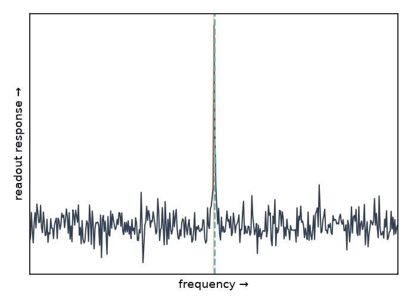
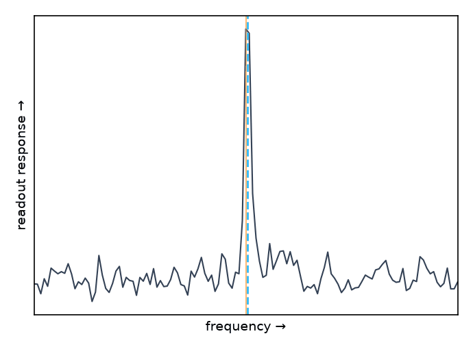

### F10 — centre quantised to the sweep grid  (seen 12x)

**Signature:** Invisible in the figure; visible only across records. The reported centre lands exactly on a sweep sample, is bit-identical to a previous run's, reports an offset of exactly zero, or differs from the previous repeat by exactly one step or half a step. Two supposedly independent measurements are then not independent.

**Prescription:** Do not treat two such runs as an agreeing pair. Require an interpolated (non-grid) centre before adopting, and re-derive after refining the step. A zero-offset report on a window centred by the previous run is a seed fallback until proven otherwise.

**Exemplars:** IQCC_QOP37/#428_08_qubit_spectroscopy_210353/qC1, IQCC_QOP37/#429_08_qubit_spectroscopy_212349/qC1, IQCC_QOP37/#55_08_qubit_spectroscopy_214427/qA1, IQCC_QOP37/#53_08_qubit_spectroscopy_214302/qA2

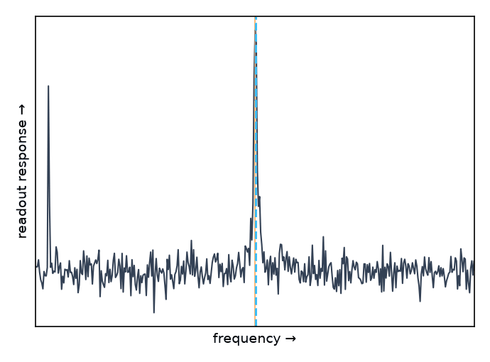
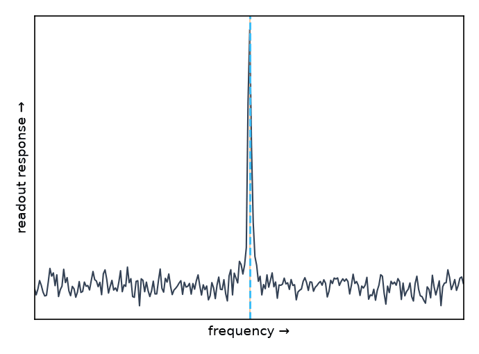

### F11 — derived drive amplitude implausible  (seen 25x)

**Signature:** Record-level, independent of the figure: the derived saturation/x180 amplitude is orders of magnitude away from the same target's accepted runs, differs by more than an order of magnitude between neighbouring runs whose panels look identical, or exceeds the normalized full-scale drive limit.

**Prescription:** Use as a cheap independent veto: refuse the whole target when it fires, even if the node reported success and the panel looks acceptable. It is downstream of the width, so it fires exactly when the width is garbage. Do not clamp it — refuse and re-measure.

**Exemplars:** AS_10TQ9TC/#25_08_qubit_spectroscopy_045653/q7, IQCC_QOP37/#436_08_qubit_spectroscopy_223724/qC1, SNU_1Q/#64_08_qubit_spectroscopy_230131/q10, SNU_1Q/#55_08_qubit_spectroscopy_222913/q10, AS_10TQ9TC/#26_08_qubit_spectroscopy_045721/q6

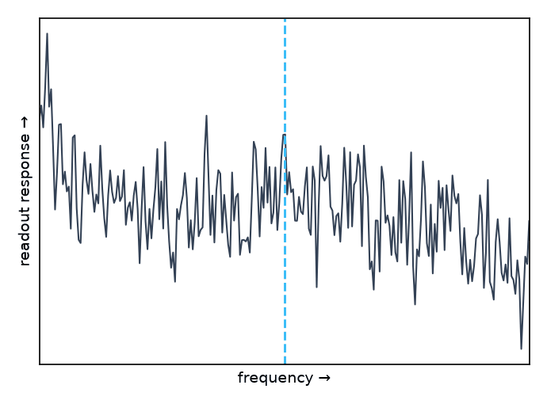
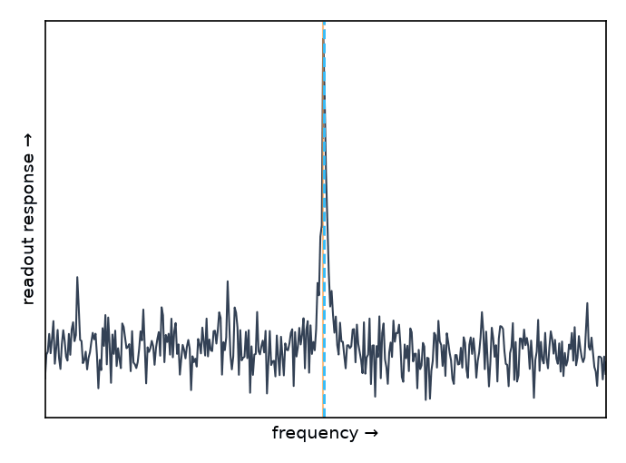

### F12 — contrast scale not comparable  (seen 10x)

**Signature:** Two panels in the same figure that look equally healthy report contrast values orders of magnitude apart; the panel with the huge value is the one whose rotated baseline sits essentially on the zero of the value axis, so a ratio-style contrast diverges.

**Prescription:** Never gate acceptance on contrast alone, and never compare contrast across targets, runs or labs. Use peak-height-to-noise-band and flank resolution instead. If a contrast threshold exists in the acceptance rule, it must be replaced by an absolute (non-ratio) measure.

**Exemplars:** AS_10TQ9TC/#28_08_qubit_spectroscopy_045932/q7, CQT/#1253_08_qubit_spectroscopy_033636/q2, CQT/#1253_08_qubit_spectroscopy_033636/q14, AS_10TQ9TC/#236_08_qubit_spectroscopy_201850/q7

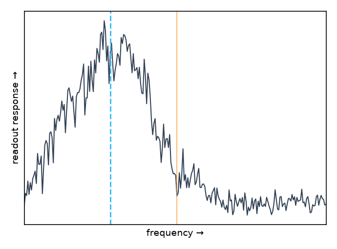
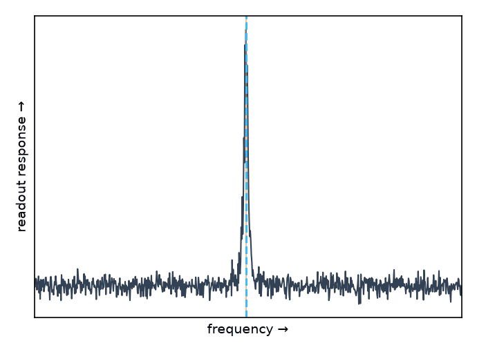
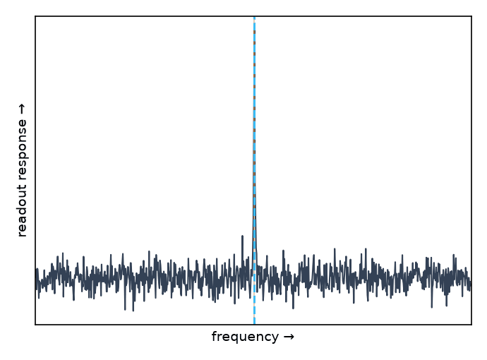

### F13 — refusal of a readable figure  (seen 9x)

**Signature:** A panel showing one resolved feature with the fit centred on it, matching flanks, good margin above the noise, and the best goodness-of-fit in its own session, stamped as a failure. Often the only unusual property is that the line is broad, or that a derived amplitude is out of family.

**Prescription:** Do not discard the run — it is frequently the most informative one in the session. Record the centre as a candidate, identify which gate fired (width, derived amplitude, shape), and confirm with one repeat. Where the gate is a width threshold, the correct response is a drive/step change, not a re-run at the same settings.

**Exemplars:** CQT/#1243_08_qubit_spectroscopy_030617/q10, CQT/#1254_08_qubit_spectroscopy_035232/q7, CQT/#1254_08_qubit_spectroscopy_035232/q3, SNU_1Q/#49_08_qubit_spectroscopy_222345/q9, SNU_1Q/#53_08_qubit_spectroscopy_222659/q9

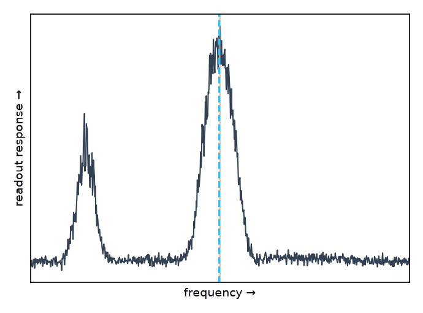
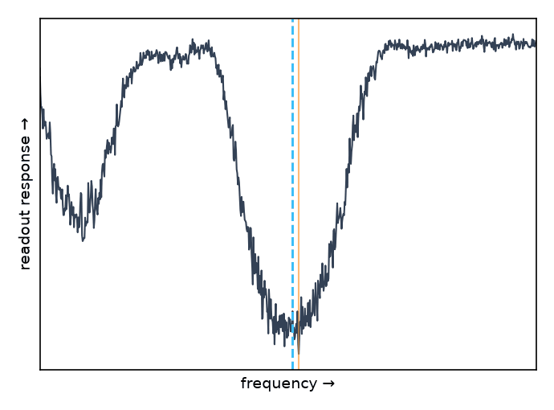

### F14 — success contradicted by the figure  (seen 12x)

**Signature:** A success verdict on a panel whose geometry refutes it: a centre in a dip, a fit with no crest, a curve whose crest is a fraction of the data's, or a reported goodness-of-fit far below every sibling in the same run. The record and the drawing disagree.

**Prescription:** Block adoption on figure evidence regardless of the verdict. Treat the pair (verdict, geometry) as the unit of truth; a success flag alone is never sufficient to write a value to the chip.

**Exemplars:** AS_10TQ9TC/#26_08_qubit_spectroscopy_045721/q6, CQT/#1239_08_qubit_spectroscopy_030349/q10, IQCC_QOP37/#429_08_qubit_spectroscopy_212349/qD3, CQT/#1247_08_qubit_spectroscopy_031321/q10

### F15 — verdict unstable across identical repeats  (seen 6x)

**Signature:** Two runs with the same span, step, shots and drive return the same fitted centre (sometimes bit-identical) and a comparable width, yet one passes and the other fails; or two panels of the same target one minute apart, geometrically indistinguishable, get opposite verdicts. The instability is in the acceptance rule, not in the data or the fit.

**Prescription:** Never let a single verdict decide. Require agreement of the FIGURE across two repeats, and treat a flipped verdict with unchanged geometry as a defect to be reported against the gate. Do not respond by changing the physics knobs.

**Exemplars:** IQCC_QOP37/#57_08_qubit_spectroscopy_214703/qA1, SNU_1Q/#49_08_qubit_spectroscopy_222345/q9, SNU_1Q/#73_08_qubit_spectroscopy_235753/q9, SNU_1Q/#74_08_qubit_spectroscopy_235908/q9

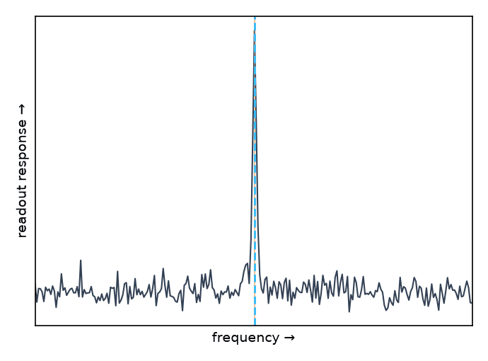
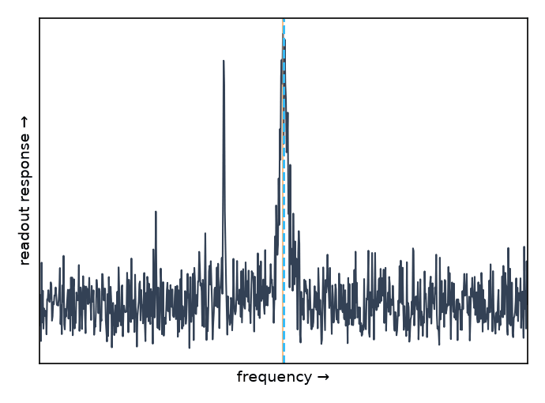
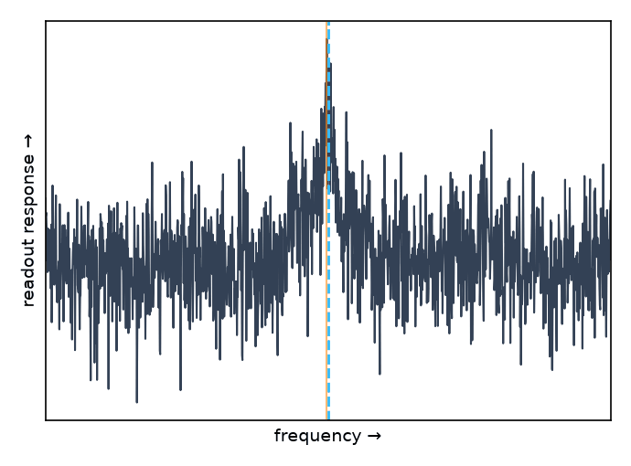

### F16 — success with no state written  (seen 14x)

**Signature:** Record-level: the target is marked successful and carries a full parameter set, but the run emits no patch for it (or emits only the readout-rotation patch and withholds the frequency), while sibling targets in the same run are patched normally.

**Prescription:** Treat as an unexplained partial acceptance, not as a silent pass. Determine whether the frequency was withheld deliberately (a jump the node distrusted) and, if so, surface that as a first-class verdict; a value that is good enough to report is either adoptable or must say why it is not.

**Exemplars:** KRISS_CR/#30_08_qubit_spectroscopy_072905/qA2, KRISS_CR/#118_08_qubit_spectroscopy_090012/qA1, SNU_1Q/#50_08_qubit_spectroscopy_222449/q10, IQCC_QOP37/#428_08_qubit_spectroscopy_210353/qD4, AS_10TQ9TC/#236_08_qubit_spectroscopy_201850/q8

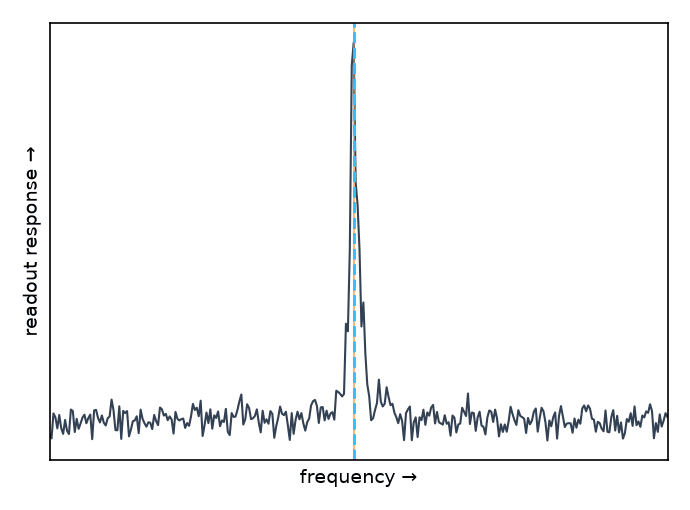

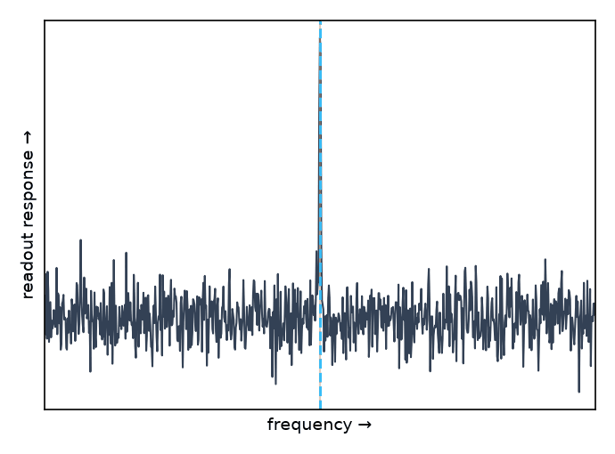

### F17 — patched value differs from the fitted centre  (seen 1x)

**Signature:** Record-level: the frequency written into state is not the centre printed on the figure — the two differ by a fixed offset — so the next run's window is centred somewhere the panel never pointed at, and the two panels of that target become incomparable.

**Prescription:** Hard stop. The applied value must equal the fitted centre shown to the operator. Until reconciled, refuse to chain runs (each run's window will be seeded by a value the previous panel did not claim).

**Exemplars:** CQT/#1256_08_qubit_spectroscopy_035427/q18

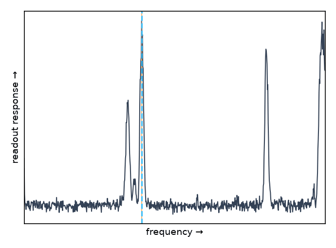

### F18 — non-convergent re-centring  (seen 6x)

**Signature:** Cross-run only: consecutive runs return the crest at nearly the SAME offset from the window centre, even though the previous run's own fitted value moved that centre. Each fit is internally consistent; the value chases itself and never lands.

**Prescription:** Stop re-centring after two repeats of the same offset. Instead double the span at the UNCHANGED centre and look for the feature on the other side (see mirror ambiguity), and check whether the applied value equals the fitted centre. Never keep writing.

**Exemplars:** AS_10TQ9TC/#30_08_qubit_spectroscopy_050108/q6, AS_10TQ9TC/#31_08_qubit_spectroscopy_050147/q6, AS_10TQ9TC/#30_08_qubit_spectroscopy_050108/q7

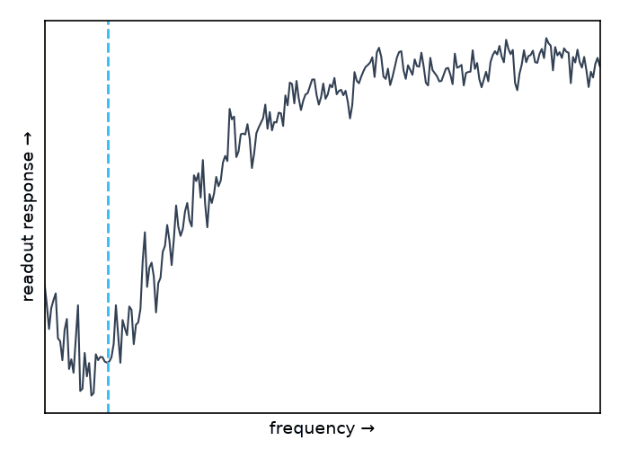
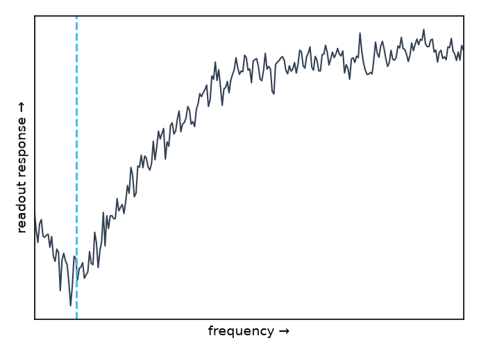
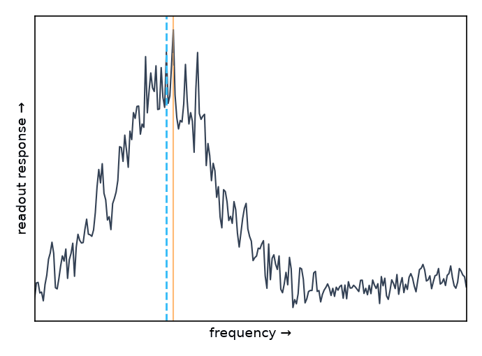

### F19 — mirror-offset ambiguity  (seen 2x)

**Signature:** Cross-run only: at one window centre a narrow-span run finds a clean feature at an offset on one side; a wider-span run with the SAME centre finds a clean feature at a nearly equal-and-opposite offset on the other side, and the first feature is absent. No single panel can say which side is the real line.

**Prescription:** Before adopting from any narrow window, run once at ≥2x span with the same centre. Adopt the feature that survives the widening. If both persist, escalate — this is a drive-chain/image question, not a fitting question.

**Exemplars:** AS_10TQ9TC/#32_08_qubit_spectroscopy_050601/q6, AS_10TQ9TC/#32_08_qubit_spectroscopy_050601/q7

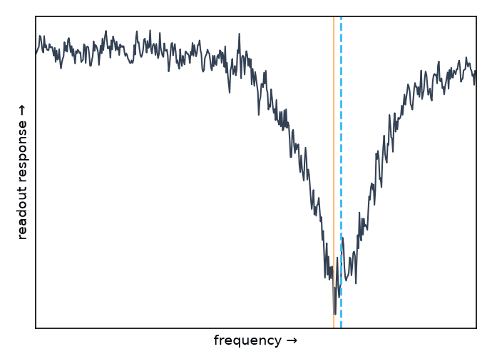

### F20 — cross-run intermittency  (seen 5x)

**Signature:** Cross-run only: the same target under byte-identical repeats gives a resolved line, then a completely empty window, then empty again, then a resolved line, then a marginal bump. Each single panel maps cleanly to a case; the defect exists only in the sequence.

**Prescription:** Never adopt from a single lucky repeat. Require at least two agreeing repeats on absolute centre, and mark the target as unstable so downstream nodes know its value is provisional. Investigate the target's readout/flux rather than its drive frequency.

**Exemplars:** IQCC_QOP37/#427_08_qubit_spectroscopy_205244/qC4, IQCC_QOP37/#428_08_qubit_spectroscopy_210353/qC4, IQCC_QOP37/#429_08_qubit_spectroscopy_212349/qC4, IQCC_QOP37/#436_08_qubit_spectroscopy_223724/qC4

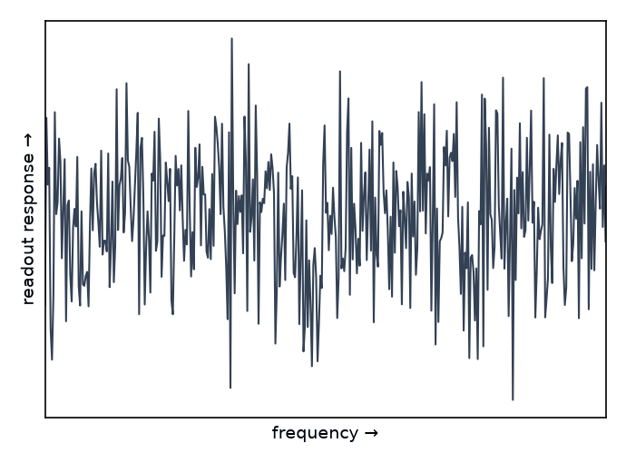
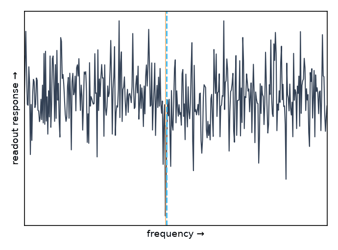

### F21 — width unstable across repeats with a stable centre  (seen 9x)

**Signature:** Cross-run only: repeats of one recipe return widths differing by a large factor for the same target while the fitted centre barely moves, and the panels show no corresponding change — typically because the fitter alternates between a narrow core and a broader pedestal, or between a line and its own skirts.

**Prescription:** Refuse the width and all derived amplitudes for that target until the pedestal/core question is resolved by a step refinement or a two-component fit. A centre that is stable across the swing is still usable.

**Exemplars:** IQCC_QOP37/#417_08_qubit_spectroscopy_194728/qD4, IQCC_QOP37/#429_08_qubit_spectroscopy_212349/qC5, IQCC_QOP37/#415_08_qubit_spectroscopy_193532/qC4, IQCC_QOP37/#59_08_qubit_spectroscopy_215031/qA1

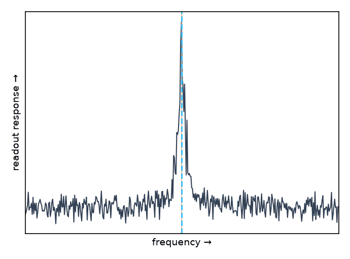
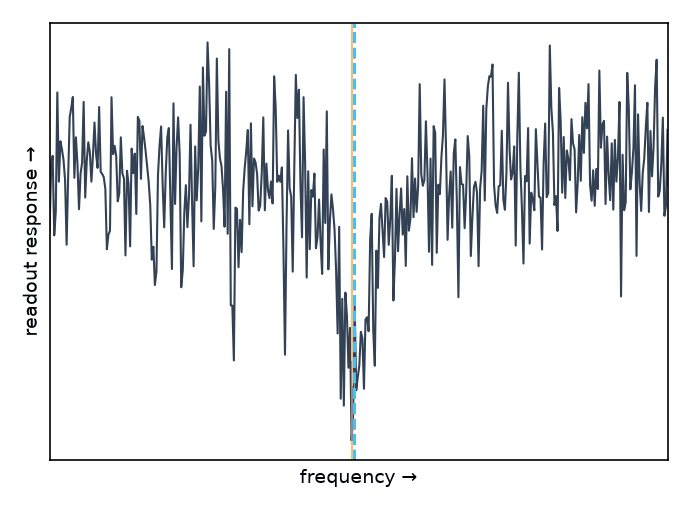
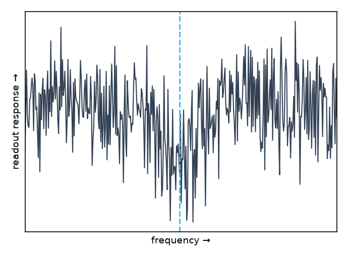

### F22 — recurring narrow spur at a fixed offset  (seen 20x)

**Signature:** A one- or two-sample excursion appears at the SAME position in every panel of a target across runs with different spans, shots and drive levels, is many times narrower than any fitted linewidth in that session, and can reach or exceed the real line's height.

**Prescription:** Mask by width, not by height: never allow a candidate narrower than a step-derived floor. Record its position so it is not repeatedly rediscovered, and escalate once to decide whether it is instrumental (LO/clock) or a genuine very narrow transition.

**Exemplars:** IQCC_QOP37/#429_08_qubit_spectroscopy_212349/qD2, IQCC_QOP37/#428_08_qubit_spectroscopy_210353/qC2, SNU_1Q/#54_08_qubit_spectroscopy_222719/q9, SNU_1Q/#48_08_qubit_spectroscopy_222234/q9, KRISS_CR/#158_08_qubit_spectroscopy_115018/qA2

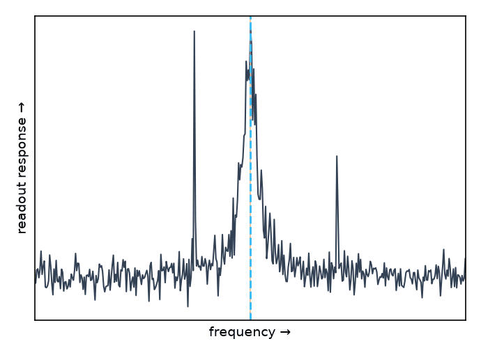
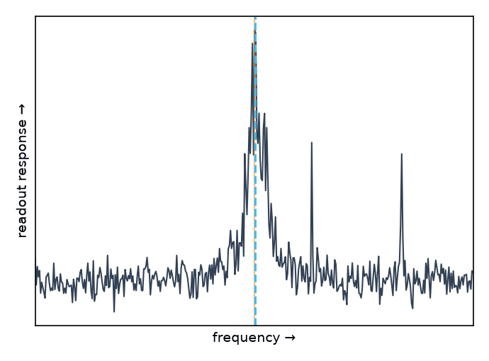
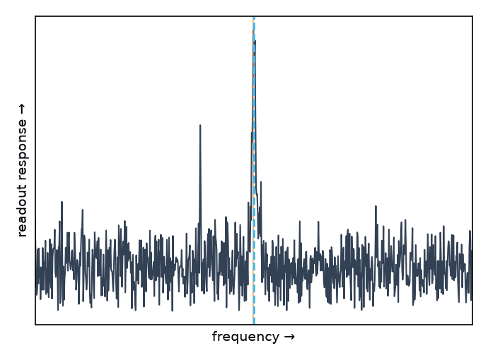

### F23 — spur at the window edge  (seen 8x)

**Signature:** A narrow spike sits hard against a boundary of the swept range, recurring there across runs, and reaches a large fraction of the real line's height. It is exactly where a peak search that also has an edge-tolerant seed can latch on.

**Prescription:** Exclude a margin at each boundary from candidate selection (a fixed fraction of the span), and require both flanks to be inside the window. If the edge structure is the only candidate, re-centre and widen rather than fitting it.

**Exemplars:** IQCC_QOP37/#427_08_qubit_spectroscopy_205244/qC1, IQCC_QOP37/#428_08_qubit_spectroscopy_210353/qC1, IQCC_QOP37/#415_08_qubit_spectroscopy_193532/qC1, CQT/#1253_08_qubit_spectroscopy_033636/q12

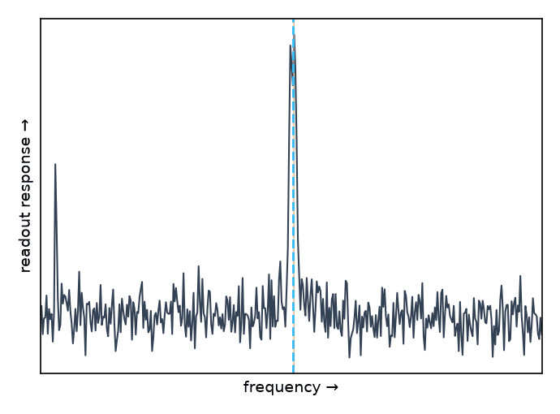
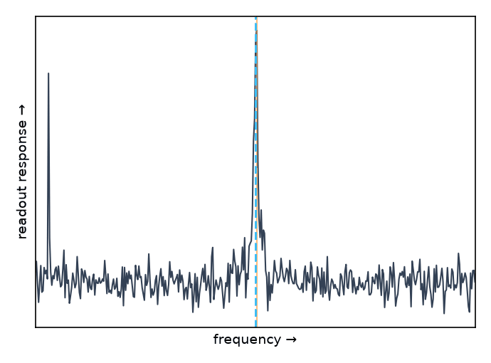
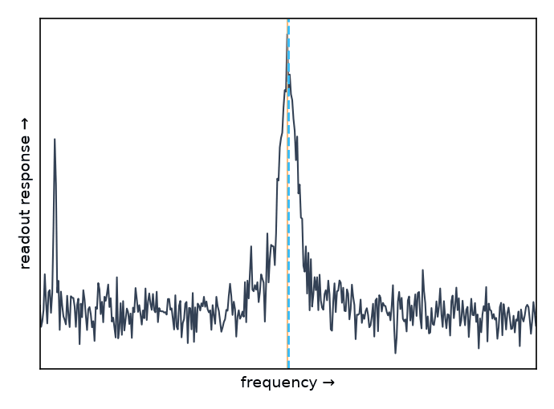

### F24 — sloping or stepped instrument baseline  (seen 14x)

**Signature:** The floor the feature rides on is not flat: it tilts monotonically across the whole panel, or steps between two plateaus with the feature sitting on the transition, or is lifted across one region. 'Above the noise' then means different things at the two ends, and a single-Lorentzian fit can absorb the tilt into its wings or mistake a step for the feature.

**Prescription:** Judge prominence against the LOCAL floor around the feature, never against the panel's overall range. Widen enough that the local floor is flat on both sides; if the tilt persists at every span, fit with a baseline term or refuse the width, and treat the tilt as an instrument finding.

**Exemplars:** AS_10TQ9TC/#22_08_qubit_spectroscopy_044933/q6, AS_10TQ9TC/#27_08_qubit_spectroscopy_045740/q6, AS_10TQ9TC/#353_08_qubit_spectroscopy_102744/q7, CQT/#1249_08_qubit_spectroscopy_031652/q10

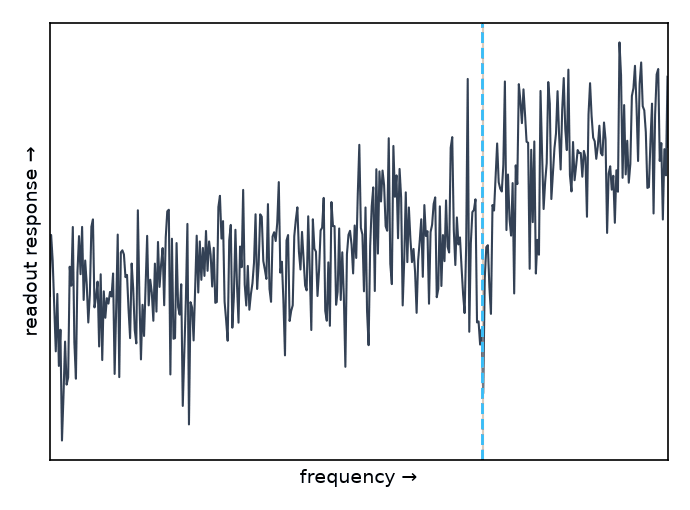

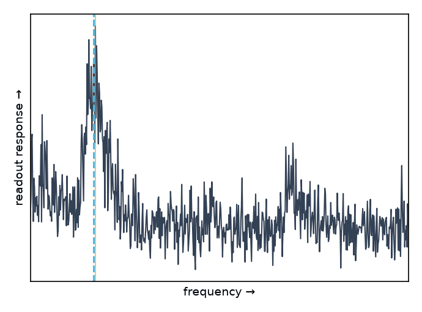

### F25 — readout polarity inverted relative to siblings  (seen 1x)

**Signature:** The panel's response has the opposite sense to every other run of the same target (the feature reads as a downward excursion where siblings show an upward one, and the baseline tilt is mirrored), because the readout rotation differs by about half a turn. A fitter that models one polarity then finds nothing, or fits the baseline.

**Prescription:** Refuse the run and re-derive the readout rotation before re-measuring. Make the fitter polarity-agnostic. Never compare contrast or height across a polarity flip. Within a consistent session, peak-vs-dip is cosmetic; a flip BETWEEN runs of one target is a defect.

**Exemplars:** AS_10TQ9TC/#26_08_qubit_spectroscopy_045721/q6

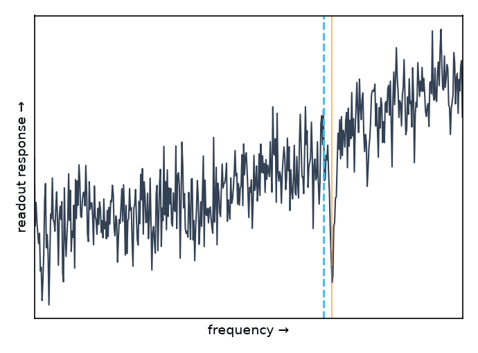

### F26 — one flank truncated at the window edge  (seen 10x)

**Signature:** The crest and one full flank are inside the window and reach a flat floor, but the other flank is still descending when the panel ends. The centre is usually well determined; the width and the floor on the truncated side are not.

**Prescription:** Adopt the centre with a reproduction; refuse the width. Shift and/or widen the span by ~1.5-2x so both flanks reach the floor, then re-fit. Distinguish from the edge case (crest itself at the boundary) and from the too-narrow case (both sides truncated).

**Exemplars:** AS_10TQ9TC/#28_08_qubit_spectroscopy_045932/q6, AS_10TQ9TC/#29_08_qubit_spectroscopy_050005/q7, AS_10TQ9TC/#31_08_qubit_spectroscopy_050147/q7

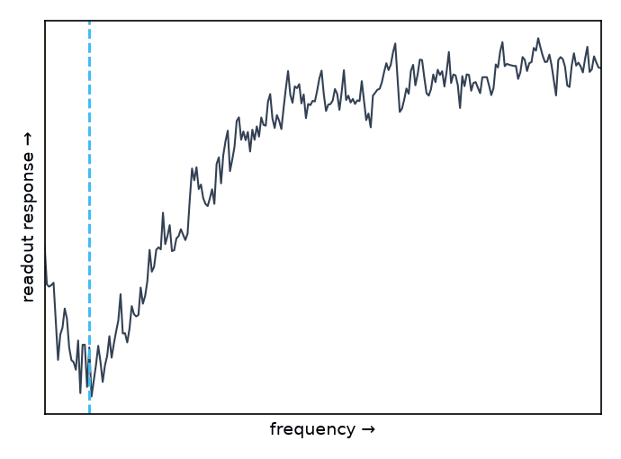
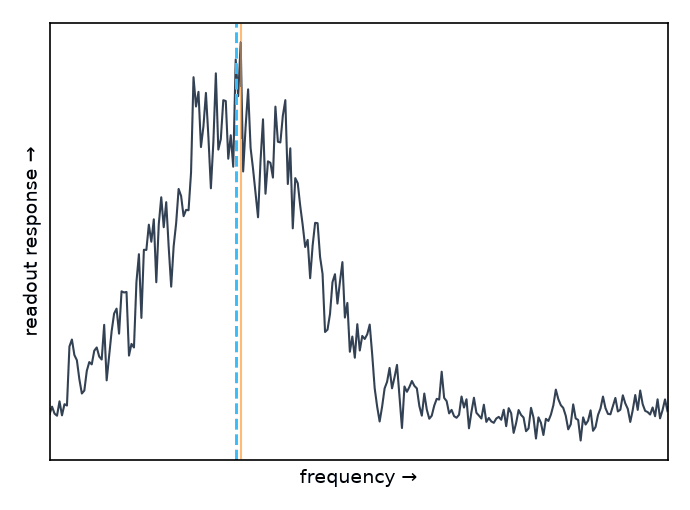
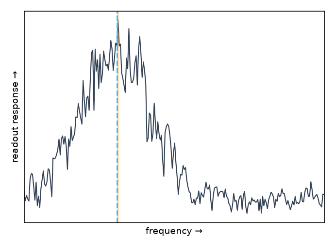

### F27 — unmodelled edge wall beside a fitted peak  (seen 10x)

**Signature:** A fully resolved peak sits well inside the window and carries the fit, while a separate structure runs off a boundary — a monotonic ramp still rising at the last sample, or a plateau entering the window already elevated — and is left entirely unaccounted for. It is often the largest excursion in the panel.

**Prescription:** The fitted centre may still be adoptable, but the run is incomplete: extend the span in the direction of the wall by about one window and re-measure, so the wall's own structure is identified before it is inherited by a later node.

**Exemplars:** CQT/#1253_08_qubit_spectroscopy_033636/q18, CQT/#1254_08_qubit_spectroscopy_035232/q15, CQT/#1239_08_qubit_spectroscopy_030349/q10, CQT/#1254_08_qubit_spectroscopy_035232/q9

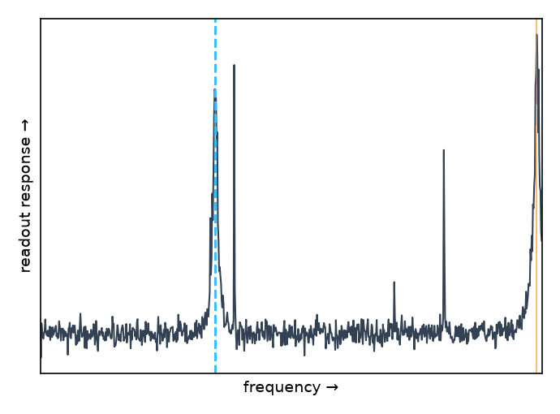
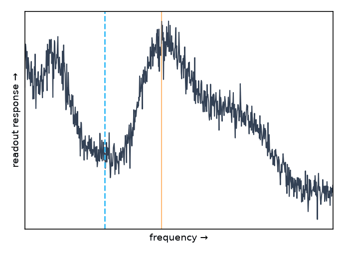
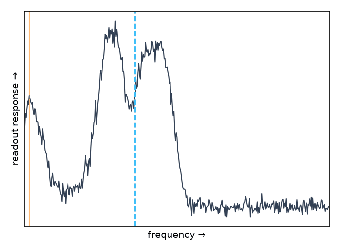

### F28 — secondary credible feature unmodelled  (seen 35x)

**Signature:** Besides the fitted feature, at least one other structure with a resolved shape (crest plus flanks over several samples) stands clear of the floor and is not mentioned anywhere in the record. The fit's own choice may well be correct; the omission is the defect.

**Prescription:** Allow adoption of the fitted centre if it reproduces, but record every additional credible feature's position and width alongside it. A single-line record over a multi-feature window is a silent loss of information a later sweep will pay for.

**Exemplars:** AS_10TQ9TC/#32_08_qubit_spectroscopy_050601/q7, CQT/#1253_08_qubit_spectroscopy_033636/q4, AS_10TQ9TC/#356_08_qubit_spectroscopy_103223/q7, CQT/#1254_08_qubit_spectroscopy_035232/q1

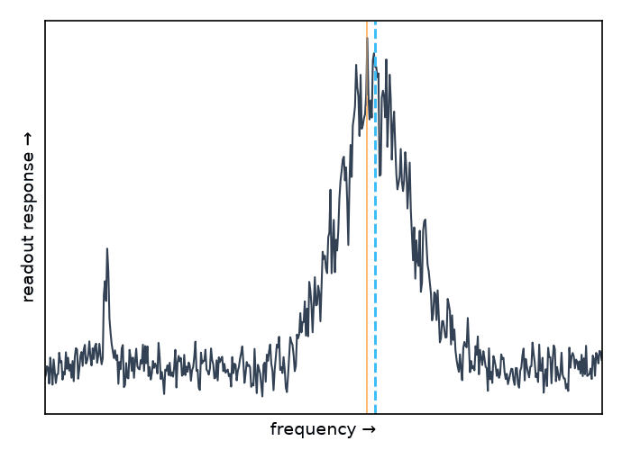
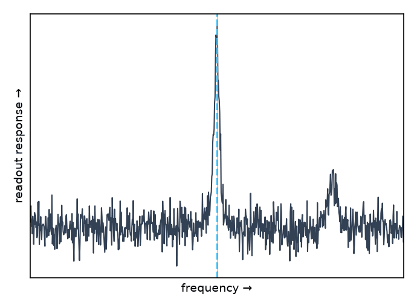
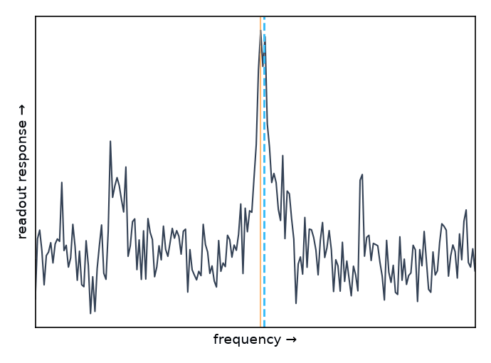

### F29 — window moved by the previous run  (seen 8x)

**Signature:** Cross-run only: two panels of one target are drawn over different swept ranges because the earlier run wrote a new centre, so an apparent 'shift' of the feature is bookkeeping rather than physics, and a feature present in one panel can be simply outside the other.

**Prescription:** Compare absolute frequency, never offset-from-window-centre, when reasoning across runs. Before treating two runs as a repeat, confirm the swept ranges overlap; if they do not, they are not a repeat.

**Exemplars:** CQT/#1257_08_qubit_spectroscopy_035514/q18, CQT/#1256_08_qubit_spectroscopy_035427/q18, AS_10TQ9TC/#30_08_qubit_spectroscopy_050108/q6

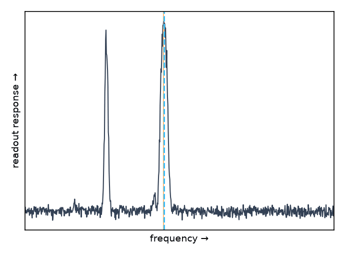

### F30 — drive-dependent identity  (seen 12x)

**Signature:** Cross-run only: the same target moves empty -> resolved -> broadened -> flat-topped purely as the drive amplitude is stepped, and its partner in the same run moves the opposite way, so no single panel is diagnosable in isolation. The same drive that rescues one target erases the other.

**Prescription:** Never diagnose a shape from one panel when a sibling at another amplitude exists; read the ladder. Where two targets need opposite drive levels, run them separately rather than choosing a compromise amplitude that satisfies neither.

**Exemplars:** SNU_1Q/#49_08_qubit_spectroscopy_222345/q10, SNU_1Q/#48_08_qubit_spectroscopy_222234/q9, CQT/#1243_08_qubit_spectroscopy_030617/q10, CQT/#1254_08_qubit_spectroscopy_035232/q15

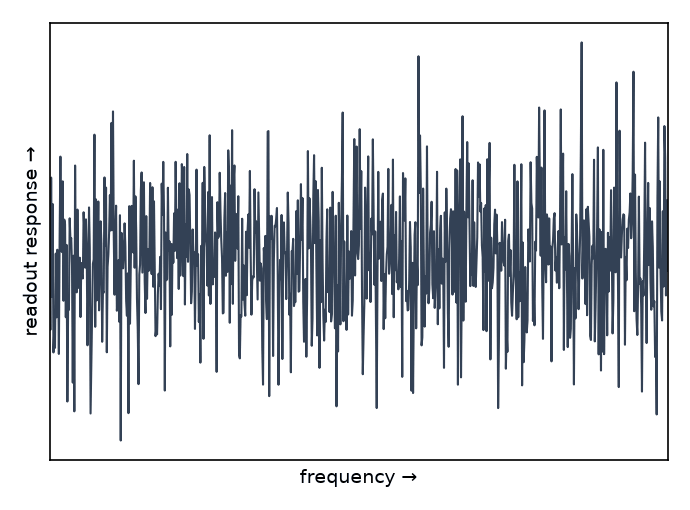
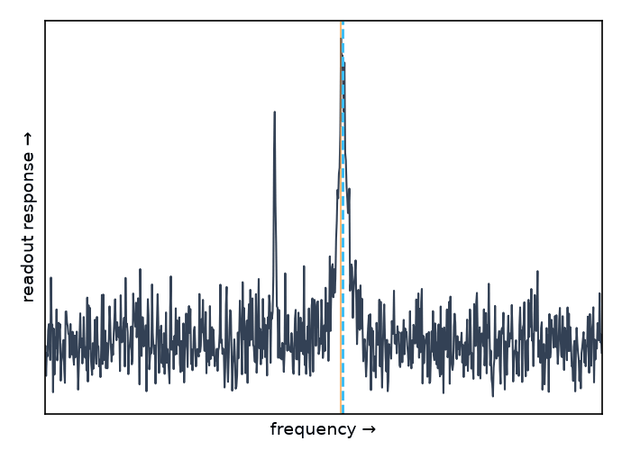

### F31 — honest refusal / honest no-fit  (seen 20x)

**Signature:** The record refuses the target and the panel agrees: a uniform noise band with no fit drawn and a NO-FIT stamp, or a visible feature pressed against a boundary refused for that reason, or an amber 'shape poor, not applied' verdict on an unresolved spike. Nothing is claimed that the figure does not show.

**Prescription:** Record as correct behaviour and do not 'fix' it. This is the majority behaviour in every lab here and is the baseline against which the two mismatch flags must be measured; suppressing it would trade honest refusals for silent bad writes.

**Exemplars:** CQT/#1253_08_qubit_spectroscopy_033636/q16, IQCC_QOP37/#417_08_qubit_spectroscopy_194728/qC1, KRISS_CR/#5_08_qubit_spectroscopy_040123/qA1, IQCC_QOP37/#53_08_qubit_spectroscopy_214302/qA1, AS_10TQ9TC/#23_08_qubit_spectroscopy_044954/q7

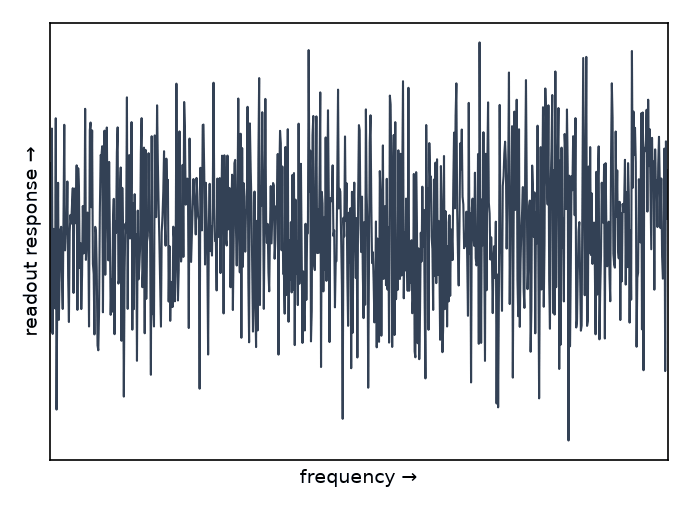
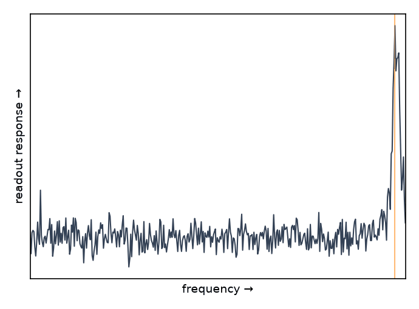

### F32 — multiplex-only single-bin spike  (seen 9x)

**Signature:** Isolated one-sample spikes appear at fixed positions in panels acquired with simultaneous drive/readout of several targets, and are absent from the same target's sequential panels. They carry no width and can stand taller than the real line.

**Prescription:** Treat multiplexed panels as centre-confirming only after one sequential (or repeated) reproduction. Mask by width. Do not conclude 'multiplexing causes spurs' generally — in another lab a multiplex on/off A/B produced no visible difference at all.

**Exemplars:** IQCC_QOP37/#415_08_qubit_spectroscopy_193532/qD2, IQCC_QOP37/#415_08_qubit_spectroscopy_193532/qC5, IQCC_QOP37/#417_08_qubit_spectroscopy_194728/qC2, IQCC_QOP37/#415_08_qubit_spectroscopy_193532/qC2

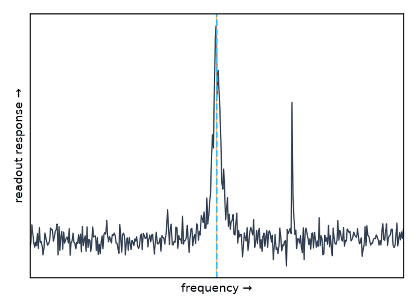
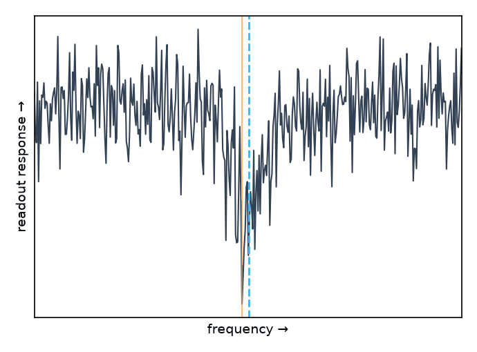
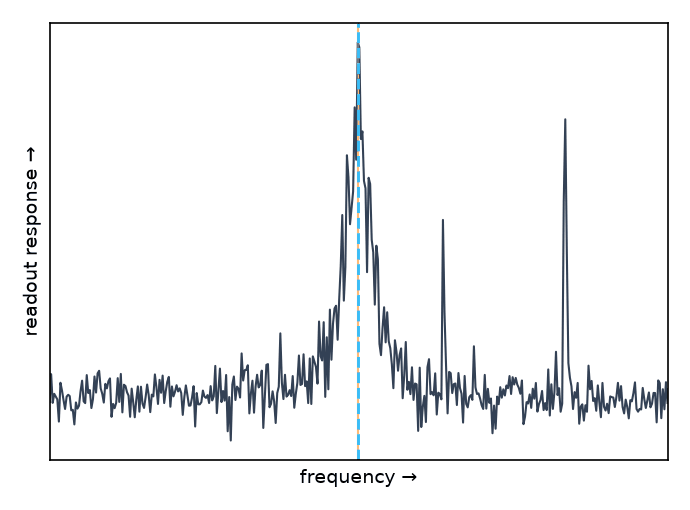

## Rules

### R01 — Adoptability is a geometry test, not a verdict

A fitted centre may be written only when the panel itself shows: one feature carrying the fit, both flanks monotone and reaching a LOCALLY flat floor inside the window, the floor visible for a stretch beyond the feature on both sides, and the fitted curve settling onto that floor. The node's success/failure flag is evidence of nothing on its own — in all five labs this batch contains successes whose figures refute them AND refusals of clean, correctly centred lines.

### R02 — Centre and width are separately adoptable

Position and shape fail independently. A fit can be centred exactly on the crest while its width, height or baseline describe something else (a pedestal, a saturated block, a tilted floor). Adopt the centre and the width as separate decisions, and never let a rejected width silently veto a good centre or a good centre bless a bad width.

### R03 — Never adopt a width from an under-sampled line

A width is meaningless unless several samples (roughly 8-10) fall across the fitted FWHM and the reported value is not a fixed multiple of the sweep step, an exactly round number, or identical to many digits across different targets in the same run. When those hold, the record is reporting a fitter bound; refine the step, do not raise the drive.

### R04 — Derived drive amplitudes are a veto, never an output

saturation_amp / x180_amp are extrapolations from the fitted width and are unbounded by the data. Use them only as a cheap independent quality veto — refuse the target when they sit orders of magnitude off the same target's accepted runs, swing by more than an order of magnitude between neighbouring runs, or exceed normalized full scale. They should not be written to the chip from this node.

### R05 — The written value must be the value on the figure

The frequency applied to state must equal the fitted centre displayed for that target. A fixed offset between them breaks every subsequent run (the next window is centred where no panel pointed) and makes the target's panels mutually incomparable. Treat any mismatch as a hard stop.

### R06 — Convergence is the test that a re-centring worked

After a centre is written, the next run's fitted offset from the NEW window centre must shrink. Two consecutive runs returning nearly the same offset from a centre the previous run itself moved means the value is chasing itself: stop writing, and widen at the unchanged centre instead.

### R07 — Widen once before adopting from a narrow window

Before a value from a narrow span is written, take one run at >=2x span with the same centre. A real line stays at the same absolute frequency; a mirror/image candidate appears at the opposite offset and the original vanishes. This is the only way the equal-and-opposite ambiguity is detectable, and no single panel can show it.

### R08 — Any broad, flat-topped, split or merged panel must be re-measured at lower drive

Broadening, flat tops, split crests, merged humps and combs are one physical family seen at different drive strengths. Reduce the amplitude by 3-10x on the identical span and adopt from the low-drive run; keep reducing until the width stops responding. A width measured at a drive level that has not been shown to be non-broadening is not a linewidth.

### R09 — Candidates are chosen by width, never by height

A one- or two-sample excursion is never adoptable however tall it is: a spectroscopic line has a width. Require a candidate to span several sweep steps with monotone flanks. This one rule removes the noise-spike fits, the fixed instrumental spurs and the edge spikes that the fitters in four of the five labs latched onto.

### R10 — Exclude a boundary margin from candidate selection

A candidate whose fitted centre falls within a fixed fraction of the span from either boundary, or whose flanks are not both inside the window, must be refused and answered with a re-centre-and-widen, not with a fit. Edge candidates were the single most common wrong choice in the wide-span hunts.

### R11 — Multiplexed runs confirm, sequential runs establish

A multiplexed batch may be trusted for centres only when at least one target-by-target (or simply repeated) run reproduces them at the same absolute frequency. Multiplexed panels have been observed to carry fixed single-bin spikes absent from sequential panels — but also to make no difference at all in another lab, so neither trust nor distrust may be assumed; it must be measured per setup.

### R12 — Two agreeing repeats, on absolute frequency

No value is written from a single panel. Require two runs whose swept ranges overlap and whose fitted centres agree to well inside the fitted width, compared as ABSOLUTE frequency — never as offset-from-window-centre, because a previous write moves the centre. Intermittent targets (present/absent across identical repeats) need the pair plus an explicit instability mark.

### R13 — Refuse anything the panel cannot show

Never write from a panel whose feature apex runs off the drawn value range, whose fitted curve contains no crest at all, whose fit is drawn over only part of the structure it claims, or whose fit is drawn over the very feature whose height is in question. What is not visible cannot be confirmed, and each of these has been accepted by a node at least once.

### R14 — Polarity must be handled, not assumed

Peak versus dip is set by the readout rotation, not by physics, and the fitter must be polarity-agnostic. A sense flipped relative to the same target's sibling runs invalidates the run: refuse it, re-derive the rotation, re-measure. Contrast and height are never comparable across a polarity flip.

### R15 — Prominence is measured against the local floor

When the baseline tilts, steps or is lifted over a region, 'above the noise' means different things at the two ends of the panel. Judge a feature against the floor immediately around it, and refuse the width whenever the fitted wings can absorb the tilt. A tilted floor that survives every span is an instrument finding to report, not a fitting nuisance to hide.

### R16 — Contrast is not a gate

Contrast as recorded is scale-dependent — a rotated baseline sitting near zero inflates it by orders of magnitude — so it is not comparable between two targets in the same figure, let alone across runs or labs. Gate on peak-to-local-noise and on flank resolution instead, and treat any contrast threshold in an acceptance rule as a bug.

### R17 — Diagnose fault before knob

Match the response to the geometry: an unresolved spike is a STEP problem (raising drive does nothing); a broad or flat-topped feature is a DRIVE problem; a marginal feature is a SHOTS problem; an edge or truncated feature is a WINDOW problem; a comb or persistent doublet is an ESCALATION, not a knob. Every move must be expressed relative to the current settings, since spans, steps and drive conventions differ by more than an order of magnitude between labs.

### R18 — Record what was NOT modelled

Every additional credible feature (resolved shape, several samples wide) in the window must be recorded with its position even when the fit's choice is correct, and every honest refusal must be preserved as correct behaviour. A single-line record over a multi-feature window silently discards the information the next node needs, and suppressing honest refusals would trade them for silent bad writes.

## What the reader reports, and which case it means

The reader measures shapes and returns a semantic signal; this table is where that meets the manual's own vocabulary.

| reader signal | case |
|---|---|
| `line_clean` | Q1 |
| `line_edge_clipped` | Q3 |
| `line_empty` | Q2 |
| `line_multi_feature` | Q4 |
| `line_split_flat_top` | Q7 |
| `line_weak_broad` | Q5 |

## Exemplar images

Axes are NORMALISED and UNLABELLED: no absolute frequency, power or flux leaves this pack, and a picture without numbers cannot teach an absolute scale (Clause B). Orientation follows the labs' own convention: frequency rightwards, the swept quantity upwards. Overlays: orange = the tracked feature, cyan dashed and magenta dotted = the record's own frequency claims, red = the sweep value it chose. Markers are the RECORD's claims, drawn even when they contradict the map — that contradiction is the lesson in the mislabelled and off-feature cases. Whether the feature is a dip or a peak is MEASURED per run, because the readout rotation decides it and it differs between labs.

## Cross-lab evidence

INVARIANT ACROSS ALL FIVE LABS (this is the chip-independence evidence).

1. The reference shape is identical everywhere: one symmetric resolved feature, both flanks decaying onto a locally flat floor visible beyond the feature on both sides, fit tracking crest and both tails. AS #45, CQT #1253, IQCC #418, KRISS #11 and SNU #52 panels are interchangeable in geometry despite completely different spans, step sizes, shot counts, drive pulses and qubit-naming schemes.

2. Drive amplitude is the master knob for shape in every lab: narrow line -> broad rounded hump -> flat/double-crested top -> merged humps, with the reverse ladder resolving a block back into discrete lines. Observed independently at CQT (q10 amplitude ladder), SNU (q9 ladder), KRISS (qA1 across days) and AS (#26/#52-equivalent behaviour). The taxonomy needed the same three cases (broad-resolved, saturated, merged-multi-peak) at four labs that never shared code.

3. Fitters emit a full centre+width+derived-amplitude set from a blank noise band in every lab that produced a blank band (AS #25 q7, KRISS #5 qA2, SNU #64/#67 q9, CQT #1253 q19). This is not one lab's fitter.

4. Derived saturation/x180 amplitudes being orders of magnitude out of family is a reliable, figure-independent garbage tell at AS, IQCC, SNU and CQT alike.

5. Sample-wide spurs at FIXED positions, recurring across runs with different spans/shots/drive, appear at IQCC (per-qubit spurs incl. one hard against a window edge), SNU (q9's low-side spur in every panel), KRISS (#158 qA2) and CQT (#1253 q20). Width, not height, separates them from lines everywhere.

6. Verdict/figure mismatch occurs in BOTH directions in every lab: readable centred lines refused (CQT #1243, #1254 q3/q7; SNU #49 q9; IQCC #57 qA1) and figure-refuted panels accepted (AS #26 q6; CQT #1239-#1242, #1247; IQCC #429 qD3). No lab's verdict may be trusted alone.

7. The two-width-scale shape (sharp core on a broad pedestal) was invented independently by the IQCC and SNU annotators, and the broad-but-resolved case independently by the KRISS, SNU and CQT annotators — new cases converged from separate labs, which is what makes them chip-independent rather than local.

8. Honest refusals dominate everywhere: no lab refused an unambiguously readable line more often than it accepted one, and NO-FIT/empty-window records were honest in all five.

WHAT LOOKED UNIVERSAL BUT IS ONE LAB'S CONVENTION.

a. "A broad flat-topped block means something is wrong." At CQT the DEFAULT 08 recipe drives with the x180 pulse at full amplitude, so saturated blocks are the normal opening panel there; AS, IQCC and KRISS open with a low-power saturation pulse and a block is exceptional. The CASE is the same; the base rate is a lab convention and must never be turned into a prior.

b. "Multiplexing produces single-bin spurs." True at IQCC (spikes present only in multiplexed panels). AS ran an explicit multiplex-on/off A/B at identical span and shots (#29/#30/#31) and found NO visible difference — that is what let AS rule out crosstalk. Do not generalise either result.

c. "A missing dashed curve means the node refused." Panel annotation is lab-specific: IQCC stamps amber titles with "freq OK / shape poor" and "not applied" while still DRAWING a fit and still reporting success; CQT and IQCC both print "NO FIT" but CQT also draws fits on refused runs. The presence/absence of a curve, the colour of a title and the success flag are three different channels and their coupling differs per lab.

d. "The floor is flat." AS panels routinely ride a strongly sloping or stepped instrument baseline that the fit can absorb into its wings; IQCC and KRISS floors are flat. Acceptance criteria must therefore be phrased as "the floor is locally flat AROUND the feature", never "the panel is flat".

e. "Contrast is a quality number." Its scale is set by where the rotated baseline sits: AS #28 q7 and CQT #1253 q2/q14 report contrasts orders of magnitude above their same-figure siblings purely because their baselines sit on zero. It is not comparable across targets in one figure, let alone across labs.

f. "Peak up." AS #26 q6 has a readout rotation flipped ~half a turn relative to its own sibling runs, making the feature a downward spike and defeating a one-polarity fitter. Peak-vs-dip is cosmetic within a consistent session and is a hard defect between runs of one target.

g. "Centres are interpolated." Grid-quantised centres (bit-identical across repeats, offsets of exactly zero or exactly half a step) were only DEMONSTRATED at IQCC, because only there were byte-identical repeats compared record-to-record. This is very likely a fitter property, not a lab property — the difference is detection opportunity, so the check must be run everywhere.

h. Absolute settings share nothing across labs: spans differ by more than an order of magnitude (AS narrow-span/high-shot, CQT thousand-wide hunts, IQCC coarse-step ladders), as do step sizes, shot counts and drive conventions. Every prescription in this manual is therefore a RELATIVE move; any absolute number would be one lab's habit.

i. Naming conventions differ completely (q1..q20, q6/q7, qA1/qA2, qC4/qD3). No rule may key on a target's name, and pair/partner reasoning must come from the run's target list, not from name adjacency.

## Open questions

1. Should the fitter be polarity-agnostic, or should the readout rotation be pinned before 08 runs at all? AS #26 q6 shows a half-turn rotation flip turning the response into a dip and producing an ACCEPTED fit with no lineshape. Decide whether a polarity differing from a target's sibling runs invalidates the run automatically.
2. Does a width gate belong in the acceptance rule? It refused clean, correctly centred, high-contrast lines at CQT (#1243, #1254 q3 and q7) and at IQCC (#53-#57 'shape poor'), while accepting centres placed in the dip of a saturated block. If the answer is yes, the gate must at minimum be drive-aware.
3. Should 08 ever write saturation_amp / x180_amp at all, or only frequency and readout rotation, leaving drive amplitudes to power Rabi? They are unbounded extrapolations from a width the node frequently cannot measure, and in this corpus they exceeded normalized full scale several times.
4. What is the minimum number of samples across the fitted FWHM for an adoptable width, and should a width from a window with no visible floor on both sides ever be adoptable?
5. In the pedestal+core shape (IQCC qC4/qC5/qD1, SNU q10), which component is the qubit linewidth, should the panel be fitted with two components, and which width does the downstream consumer want?
6. Is the AS mirror ambiguity (a feature at nearly equal-and-opposite offsets from one window centre) a drive-chain image/aliasing artefact? If so the fix is hardware or LO configuration, not fitting, and the widen-once rule is only a detector.
7. What produces the regularly spaced combs at CQT — a multi-photon ladder, |1>-|2>, a TLS forest, or an instrumental sideband comb? Spacing is the discriminator and this node cannot use it; decide which experiment settles it.
8. Are the persistent one-sample spurs at fixed offsets (IQCC per-qubit spurs, SNU q9's low-side spur, the IQCC window-edge spur) instrumental lines that must be permanently masked, or genuine very narrow transitions worth investigating once?
9. How many agreeing repeats does an intermittent target need before its value may be adopted, and should such a target be marked unstable for downstream nodes? IQCC qC4 gave resolved / empty / empty / resolved / marginal under byte-identical repeats.
10. What is the stop rule when a chip is drifting mid-session? AS #28-#31 shows four self-consistent fits each returning the same offset from a centre the previous run moved, i.e. the value chasing itself, and the operator only escaped by doubling the span.
11. Should contrast be redefined as an absolute rather than a ratio quantity so it is comparable across targets and labs, and should the current definition be removed from any acceptance rule until then?
12. Which side owns the offset seen at CQT #1256 q18, where the applied frequency was not the fitted centre printed on the figure? Until that is resolved, no chained sequence of 08 runs at that lab is interpretable.
13. When two targets in one multiplexed run need opposite drive levels (SNU q9 and q10), should the loop split them into separate runs automatically, and on what evidence?
14. Should a batch/multiplexed pass be allowed to write state at all, or only to propose candidates that a sequential confirmation run adopts?

## Fit-vs-figure disagreements

- AS_10TQ9TC/#25_08_qubit_spectroscopy_045653/q7 — featureless noise on a mildly tilted baseline; the fit is nearly a flat line with a small bump whose centre marker sits essentially ON the window centre (reported offset ~zero), i.e. the fitter fell back to its seed. Largest excursion in the panel is at the low-frequency edge and is not the fitted one; largest derived x180 amplitude in the batch with the lowest reported goodness-of-fit.
- AS_10TQ9TC/#26_08_qubit_spectroscopy_045721/q6 — SUCCESS whose dashed curve is a nearly straight segment following a rising baseline: no crest, no flanks, no inflection anywhere. Centre marker sits on a single-sample downward excursion matched by others elsewhere; readout rotation is flipped ~half a turn versus every sibling run of this qubit, and reported contrast is at the numerical floor.
- AS_10TQ9TC/#352_08_qubit_spectroscopy_102706/q7 — the dominant structure is a shoulder entering the window already at maximum and running off the left boundary; the fit is placed instead on a two-to-three-sample spike in the right half that is barely taller than several other noise excursions in the same stretch. Derived drive amplitudes far above every sibling in the session.
- CQT/#1239_08_qubit_spectroscopy_030349/q10 — wide flat-topped block with two crests separated by a shallow dip; the fit's centre line lands IN the dip (a local minimum of the data) and the fitted curve is far wider and lower than either crest. Reported width more than an order of magnitude above the requested target peak width, on a success verdict.
- CQT/#1240_08_qubit_spectroscopy_030414/q10 — identical repeat of the preceding panel: same double-crested block, fit centre again in the dip between the crests, fitted curve much broader and lower than the crests it straddles.
- CQT/#1241_08_qubit_spectroscopy_030532/q10 — third identical repeat; the dip between the crests is deeper here and the fit centre still falls in it. Worst reported goodness-of-fit of the three repeats, and the reported centre moved between supposedly identical runs by more than the crest separation makes meaningful.
- CQT/#1247_08_qubit_spectroscopy_031321/q10 — the low-drive comb has merged into three broad humps; the fit sits on the tallest, whose top is flat and double-crested, with its centre line in the dip between those two crests. Two further credible humps are left entirely unmodelled and the fitted curve is wider than the hump it covers.
- CQT/#1253_08_qubit_spectroscopy_033636/q15 — no isolated peak: a shallow rise in the left third, then a steep monotonic climb to the right boundary that leaves the window still rising and holds the panel's largest values. The dashed fit lies almost flat over the shallow left region and never approaches the rising limb.
- CQT/#1253_08_qubit_spectroscopy_033636/q19 — dense scatter of uniform amplitude across the whole width with no coherent raised group; the fit is a narrow blip drawn over two or three adjacent noise points left of centre. The record's own goodness-of-fit is below zero.
- CQT/#1254_08_qubit_spectroscopy_035232/q16 — a scatter band with no isolated raised group anywhere and a slight overall upward drift on the right; the fit is a very narrow blip over two or three adjacent noise points left of centre. Empty in both the low-drive and full-drive passes.
- KRISS_CR/#5_08_qubit_spectroscopy_040123/qA2 — dense edge-to-edge scatter of constant spread with no smooth feature; a narrow fit is drawn onto the single tallest upward excursion just left of centre, its crest barely clearing the surrounding band and its width comparable to one or two individual noise excursions. Centre, width and derived amplitudes are all reported.
- SNU_1Q/#47_08_qubit_spectroscopy_222205/q9 — two entirely different features share the panel: a few-sample spike far toward the low-frequency edge and a broad rounded hump nearer the middle with flanks spanning many samples. The fit and its marker sit on the narrow spike; the broad hump — which is the qubit's response, since it changes shape with drive while the spike does not — is left completely untraced.
- SNU_1Q/#50_08_qubit_spectroscopy_222449/q9 — same two-feature panel at full drive; the fit is again planted on the narrow spur AND its dashed wings sit clearly above the local scatter band on both sides rather than settling onto it, so the curve floats over the data away from its crest. Worst reported fit quality of this qubit's attempts that session.
- SNU_1Q/#64_08_qubit_spectroscopy_230131/q9 — a noise band of essentially constant thickness from edge to edge with no local change in centreline or thickness; the fit is a hair-thin vertical sliver planted on one sample left of centre, narrower than the band's own point-to-point scatter, and the derived saturation and x180 amplitudes land far beyond normalized full scale.
- SNU_1Q/#67_08_qubit_spectroscopy_231355/q9 — uniform flat band end to end, fit again a thin sliver standing on a single sample with no shoulders on either side; the record's own goodness-of-fit is NEGATIVE (the fitted curve describes the data worse than a flat line) yet a centre and a linewidth are reported.
- SNU_1Q/#68_08_qubit_spectroscopy_231823/q10 — a tall narrow spike stands well inside the window on the low-frequency side and is ignored; the fit is planted instead on a much narrower feature close to the high-frequency boundary, drawn as a near-vertical sliver with only a sliver of baseline beyond it, while high contrast and SNR are claimed.

## Blind verification

8 of 10 agree. Method: located each run folder via the 'folder' field in b4_qubit_spectroscopy__*.json (runs live under D:\work\dataset\AS_10TQ9TC\ and D:\work\Customer_Codes\CQT\data\), viewed figures.amplitude.png myself — cropping and upscaling the target panel out of the 5x5 20-qubit sheets for #1253/#1254 — and formed a judgment before reading the claimed case. For the two calls that hinged on a marginal feature I additionally re-derived the rotated-I trace from ds_raw.h5 (NetCDF-classic, read via scipy.io.netcdf_file) rather than trusting the eye or the node's own reported SNR. Two disagreements, both in the same direction — the claimed case is more generous to the fit than the figure supports: (1) #27/q7 claimed Q5 weak/broad is really Q2 empty window; the window is pure noise on a slope, every detrended residual is under 3 sigma and scattered, and the fit centre is not even a local maximum in the smoothed residuals, so the reported peak_snr=3.5 is not backed by anything visible. (2) #31/q6 claimed Q1 clean peak is really Q3 edge-clipped; f0 is 4.90 MHz from the left window edge against a 5.94 MHz HWHM, so the half-max point lies outside the sweep and the rising flank is never measured, even though the fit itself is good (r2=0.92) and a maximum is visible. The eight agreements include two over-driven x180 runs (#1242, #1254) where Q7 and Q4 both partly apply; I resolved them on whether the lobes return to baseline between features (they do in #1254 -> Q4, they do not in #1242 -> Q7), and the claimed labels match that rule. No NEW: case was needed — the seven draft cases covered every figure.