# qubit_spectroscopy_vs_flux — case manual (v1)

**Authored:** 2026-08-21 · **Source:** docs/131: 57 runs / 165 targets across 5 labs (lab-A, lab-B, lab-C, lab-D, lab-E), every figure viewed; blind re-classification 8/10

This file and `cases.json` are generated from ONE source. Geometry and prescription language is chip-independent by rule: relative positions, shapes and bounded knob moves only — never absolute frequencies, powers or fluxes, and never a size expressed as a fraction of the swept window.

**Physics.** Qubit spectroscopy repeated across a flux (or current) sweep. The qubit frequency traces an ARCH whose turning point is the flux sweet spot. The labs plot flux on the horizontal axis and frequency on the vertical one.

## Map cases

### F1 — Full arch, turning point measured inside the window  (seen 46x)

**Geometry:** A single connected contrast feature (bright ridge or dark trough) crosses the swept flux range without interruption: it rises out of one edge, rounds over a turning point that lies well inside the swept flux columns, and falls again, with both flanks sampled and both ending inside the plotted frequency band. Curvature is visible on both sides of the turning point, and the extremum region is narrow compared with the swept flux span. Neighbouring flux columns are linked by the feature everywhere along its length.

**Prescription:** Adoptable as-is. Confirm with ONE identical repeat before writing; if the turning point sits within about one flux column of either edge, shift the flux window by roughly half its span toward that edge and re-run first. If the extremum region spans more than about a quarter of the swept flux columns, treat it as the broad-crest case instead.

**Exemplars:** lab-A/#38/q6, lab-A/#46/q7, lab-C/#432/qD3, lab-C/#425/qC1, lab-A/#245/q7, lab-C/#437/qC3

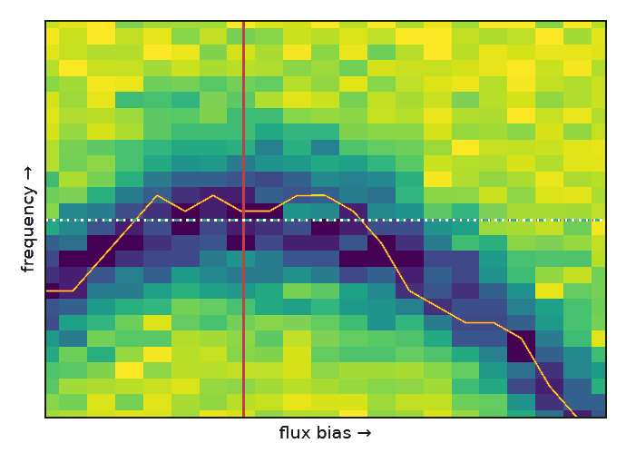
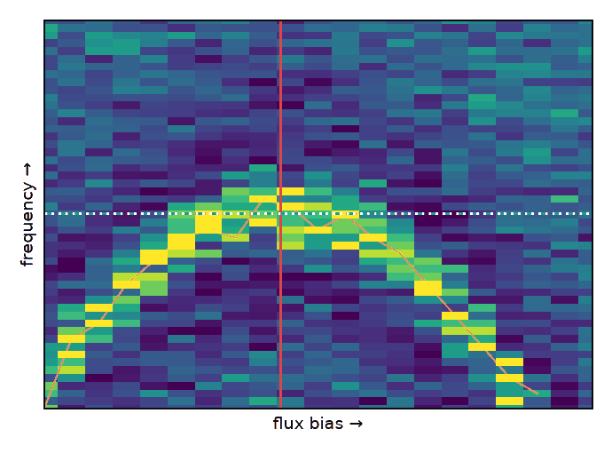
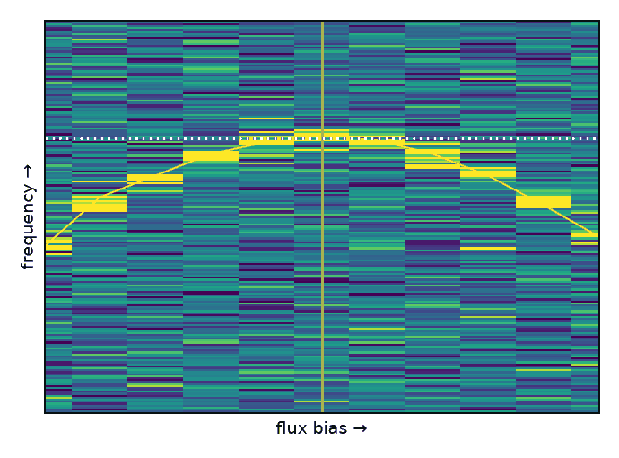

### F1b — Broad-crest arch — frequency determined, flux weakly determined  (seen 13x)

**Geometry:** Same connected rise-and-fall as the full arch, but the extremum is a broad, essentially level plateau spanning several flux columns, and the total rise and fall are small compared with the thickness of the feature itself. The flanks may be sharper than the crest, so the best-defined part of the curve is exactly the part that does not locate the vertex. Repeats of the identical measurement place the marker at different columns of the same crest while the crest itself does not move.

**Prescription:** Adopt the extremum FREQUENCY; hold the flux offset. Narrow the flux window to roughly a third of its current span, centred on the crest, and/or raise shots by 2-4x, then re-run. Write the offset only if two identical runs agree on its sign and land within the crest width.

**Exemplars:** lab-A/#237/q6, lab-A/#243/q8, lab-C/#430/qD1, lab-C/#425/qD3, lab-C/#437/qC1

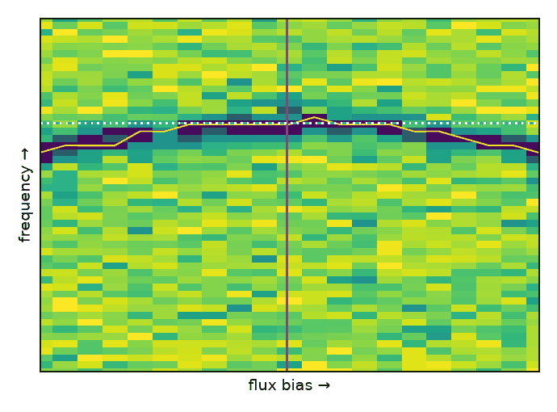
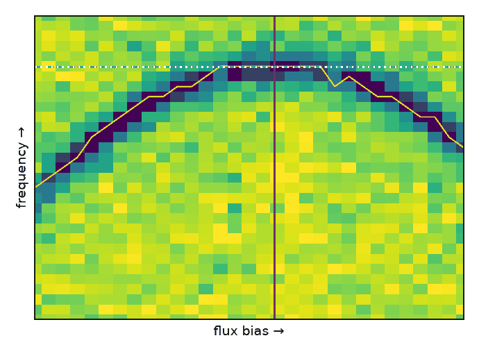
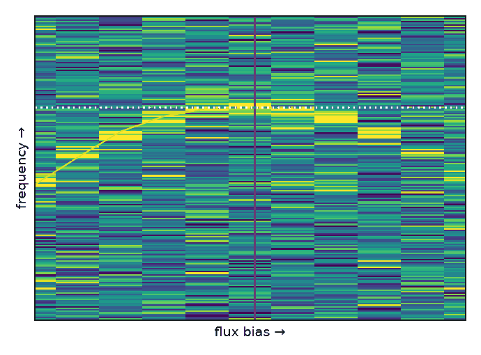

### F1i — Inverted arch — extremum is a MINIMUM inside the window  (seen 2x)

**Geometry:** A connected feature crosses the whole flux range forming a clean U: it descends over one part of the flux axis, bottoms out at a turning point comfortably inside the swept columns, and rises again, ending at a level comparable to or above where it started. Curvature is smooth on both sides of the minimum. Geometrically identical to the full arch apart from the sign of the curvature.

**Prescription:** Treat exactly like the full arch, but check that the record's orientation field says the lower branch and that the value lands in the lower sweet-spot slot; a fit reporting the opposite orientation on this shape is disqualified. Confirm with one identical repeat, and confirm with the lab that the lower extremum is an acceptable idle point before writing an offset.

**Exemplars:** lab-E/#125/q10, lab-E/#86/q10

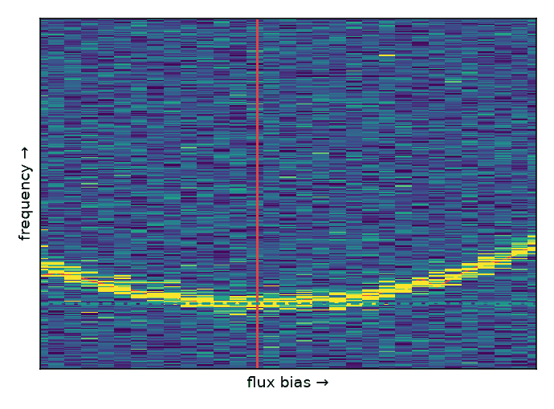
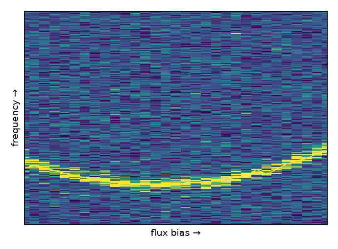

### F1p — Shoulder / plateau arch — extremum present but not localizable  (seen 2x)

**Geometry:** A strong connected feature descends (or climbs) steeply over one part of the flux range, the slope slackens progressively, and over the rest of the range the feature lies essentially level and never turns back. There is no mirrored second flank inside the window, so the extremum is somewhere under the flat stretch and its flux position is arbitrary within it. Distinct from the monotonic case: the slope demonstrably goes to zero inside the window.

**Prescription:** Do not write a flux offset. Extend or shift the flux window by roughly half to one full current span toward the flat side to bring the return flank into view, keeping the frequency span; re-run. If the flat stretch persists over the extended window, escalate to a flux-response check rather than more spectroscopy.

**Exemplars:** lab-E/#85/q10, lab-B/#150/q2

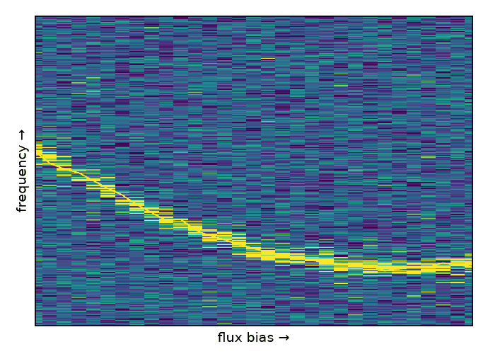

### F1s — Blob-chain arch — readable turning point, no traceable line  (seen 3x)

**Geometry:** The flux axis is sampled so coarsely that the response appears as one broad blob per flux column rather than a thin line. The blob heights nevertheless trace an unmistakable, often symmetric rise-and-fall with the extremum in the central columns; the chain is unbroken column to column but never merges into a continuous trace. Readable to a human, hard for a peak-tracer.

**Prescription:** Increase flux point density by 2-3x over the SAME flux span (do not widen anything) and re-run; optionally refine the frequency step by about 2x to sharpen each column's peak. A refusal on this geometry is a tracer limitation, not evidence of absence — never mark the qubit dead from it.

**Exemplars:** lab-C/#437/qC5, lab-C/#433/qC2

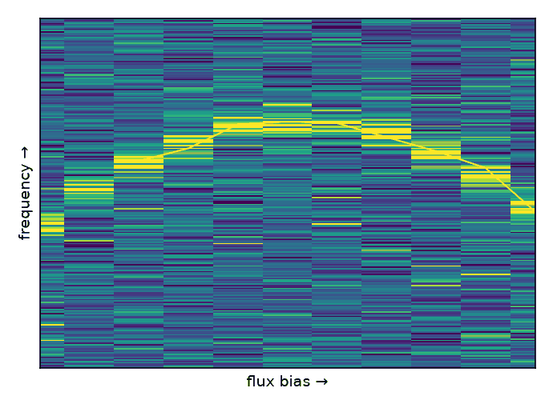
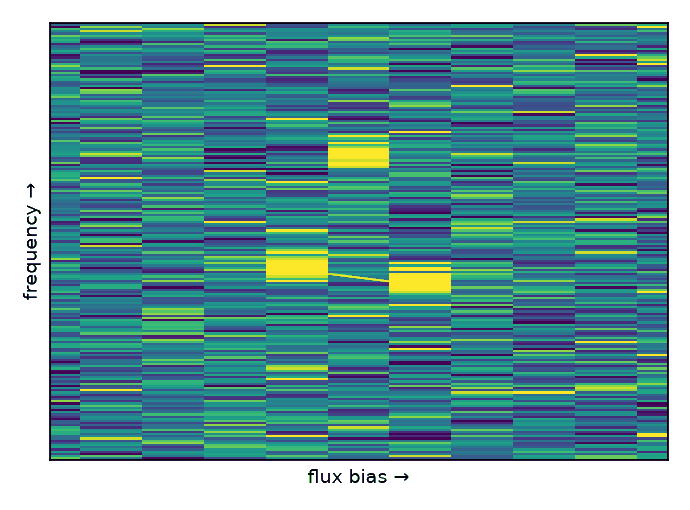

### F2 — Monotonic ridge — no turning point inside the window  (seen 2x)

**Geometry:** A connected feature crosses the swept flux range without ever levelling: it enters at one edge and leaves through an edge of the plot (side or top/bottom) while still visibly sloping. No curvature reversal anywhere on the panel. Any extremum a fit reports is an extrapolation beyond what was measured.

**Prescription:** Shift the flux window by roughly one full current span in the direction the feature is climbing (or widen it about 2x if the period is unknown) and re-run. Never write the extrapolated vertex, regardless of what the extrapolation flag says.

**Exemplars:** lab-A/#37/q6, lab-A/#37/q7

### F3 — Flat line — a feature exists but does not move with flux  (seen 5x)

**Geometry:** One horizontal band of constant frequency runs edge to edge across the whole flux axis with no systematic tilt or curvature, jittering only within its own width. The rest of the panel is background. The band is real and well contrasted; what is absent is any flux dependence.

**Prescription:** Do not write a flux offset; the frequency may be usable. Widen the flux window by 3-10x and re-run once to rule out a window far narrower than the period; if the band is still flat over the wide window, escalate to a flux-line / wiring / crosstalk check rather than repeating spectroscopy.

**Exemplars:** lab-B/#16/q2, lab-B/#35/q2, lab-C/#419/qC2, lab-D/#90/qA1

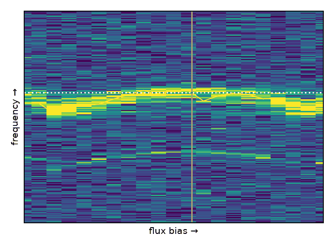

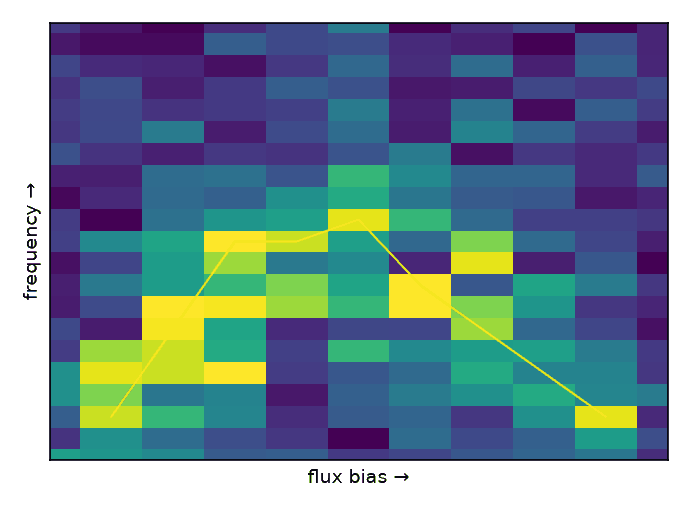

### F3m — Multiple parallel flux-independent bands  (seen 2x)

**Geometry:** Two or more distinct horizontal features span the entire flux axis at different constant frequencies, roughly parallel, separated by background, none of them tilting or curving. Line identity — which band, if any, is the flux-tunable transition — cannot be decided from the panel, and a fitter will silently pick one.

**Prescription:** Reduce drive amplitude by about 2x (power broadening and multi-photon branches), widen the frequency span enough to contain every visible band, and widen the flux window 3-5x so that whichever band responds to flux reveals itself. Never adopt a value while more than one candidate band is present.

**Exemplars:** lab-B/#36/q2, lab-B/#149/q2

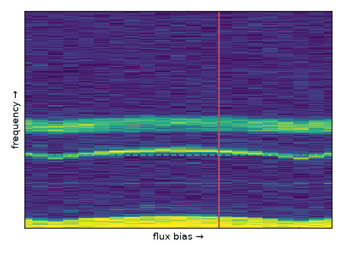
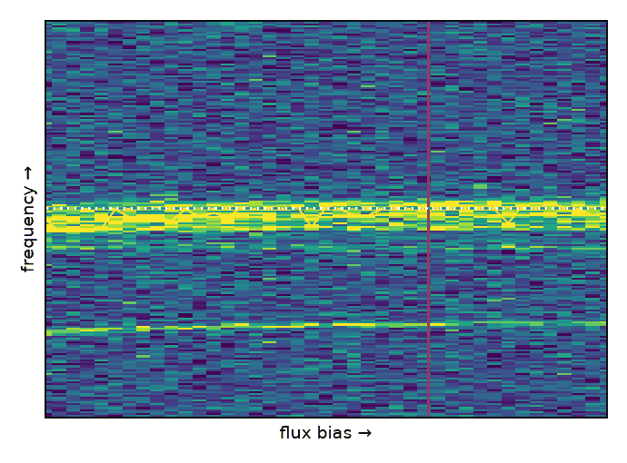

### F4 — Partial ridge — feature visible over only part of the flux range  (seen 11x)

**Geometry:** A connected feature is present over a contiguous sub-range of flux columns and absent (background only) over the rest, with no interruption-and-return pattern. The visible fragment may or may not contain curvature; where it stops, contrast simply fades into background rather than the feature crossing something.

**Prescription:** Narrow the flux window to roughly the populated sub-range (about half the current span) and re-run, or raise shots 2x if the loss is contrast-driven. If the fragment is only a couple of columns wide, treat it as reconnaissance and do not adopt any number from it.

**Exemplars:** lab-A/#237/q7, lab-C/#433/qC1, lab-C/#434/qC2, lab-A/#38/q7

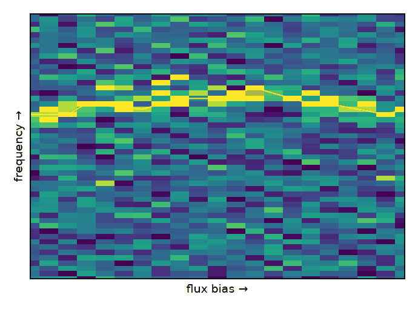

### F4f — Arch truncated by the FREQUENCY window  (seen 8x)

**Geometry:** The turning point is inside the swept flux range but the flanks leave the plotted frequency band through its top or bottom edge rather than through the flux edges — in the mild form both flanks run off the band near the flux edges; in the severe form only the few flux columns nearest the extremum carry any response at all and everything further out is background because the feature has already left the band. Widening the flux axis without widening the frequency axis produces the severe form.

**Prescription:** Widen the frequency span by about 2x, or narrow the flux window by about half, so both flanks stay inside the band; keep the other axis fixed so the change is attributable. Do not trust a curvature term derived from flanks that were clipped.

**Exemplars:** lab-A/#36/q6, lab-A/#238/q5, lab-C/#433/qD1, lab-C/#433/qC3

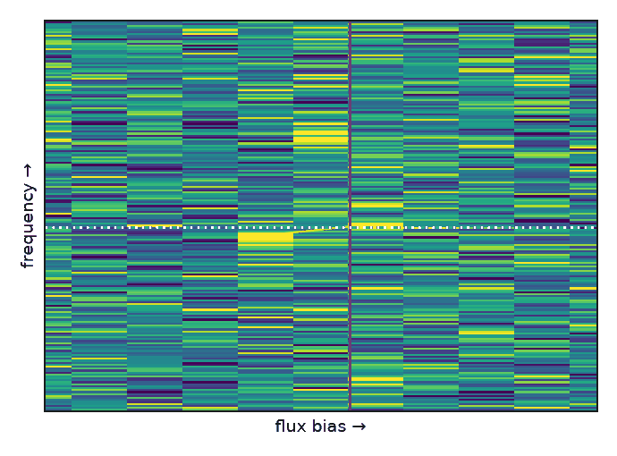

### F4e — Extremum riding the edge of the frequency band  (seen 2x)

**Geometry:** The highest (or lowest) visible cells of the feature sit on the first or last row of the plotted frequency window, so the response is cut off there and the true extremum may lie outside the band. The visible part may still curve, but the apex coincides with the window boundary rather than with a resolved turn.

**Prescription:** Shift the frequency window by about half its span in the direction the extremum is pinned, keeping the span and the flux window fixed, and re-run. Do not adopt the extremum frequency or the curvature from a boundary-pinned apex.

**Exemplars:** lab-E/#79/q10, lab-B/#35/q2

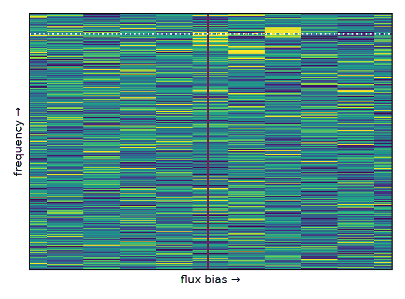
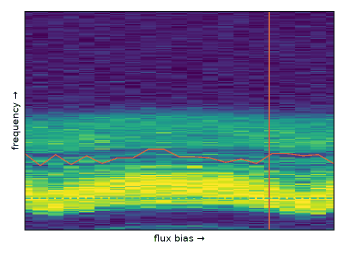

### F5 — Interrupted / anticrossing ridge  (seen 4x)

**Geometry:** A connected feature is broken, split or displaced at one or a few specific flux columns — a gap, a step offset between two otherwise-aligned segments, or a staircase of short offset pieces — while the feature resumes on the far side. The interruption is localized in flux, unlike a contrast fade.

**Prescription:** Narrow the flux window to one side of the interruption (about half the span) and re-run so the fit never spans the crossing; raise shots 2x to confirm the break is real. If the break repeats at the same flux across runs, escalate to a TLS / resonator-crossing investigation instead of re-fitting.

**Exemplars:** lab-A/#37/q7, lab-A/#239/q7, lab-A/#243/q7

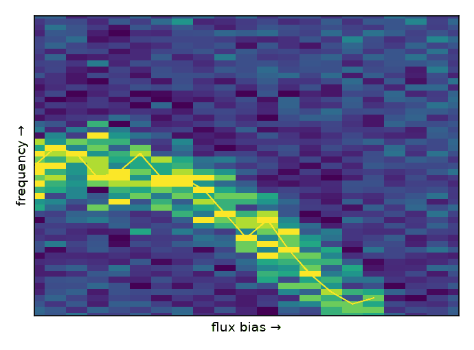
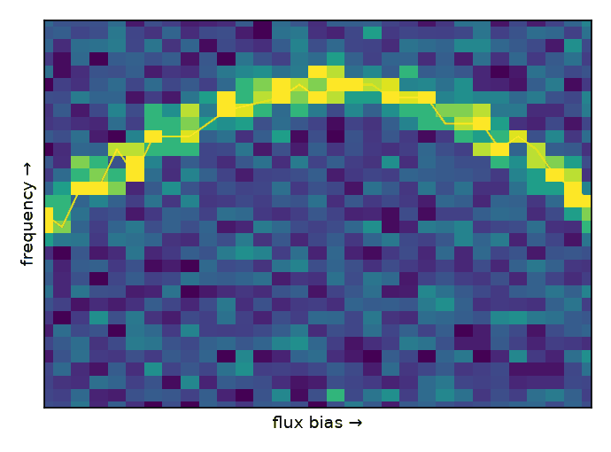
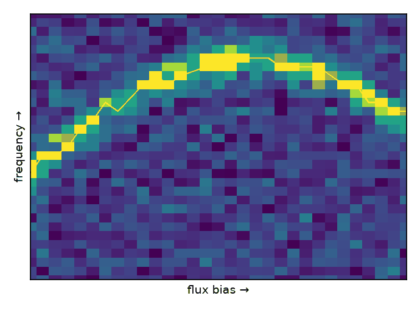

### F5b — Second parallel branch inside the arch  (seen 1x)

**Geometry:** A fainter feature runs alongside the main arch with a similar shape, typically inside/below it, present over a substantial part of the flux range rather than at a single crossing. Two candidate traces coexist steadily, and a peak-finder can latch onto either.

**Prescription:** Reduce drive amplitude by about 2x to suppress the weaker branch and re-run; verify the fit tracks the stronger branch. Do not adopt a value while the assignment between the two branches is undecided.

**Exemplars:** lab-A/#36/q6

### F6 — Featureless map — data present, no feature  (seen 62x)

**Geometry:** The panel carries data (speckle, per-column blocks, horizontal row striping) but nothing at any frequency persists into a neighbouring flux column: no band, no fragment, no curvature. Contrast under any drawn curve is indistinguishable from contrast anywhere else on the panel.

**Prescription:** Write nothing. Escalate ONE knob at a time: shots 2-4x, then drive amplitude ~2x, then frequency span ~2x around the last known frequency. If sibling qubits on the same multiplexed sheet are readable at these settings, re-run this qubit alone before concluding anything about it.

**Exemplars:** lab-E/#82/q9, lab-C/#421/qD1, lab-B/#13/q2, lab-B/#201/q14, lab-C/#425/qC4

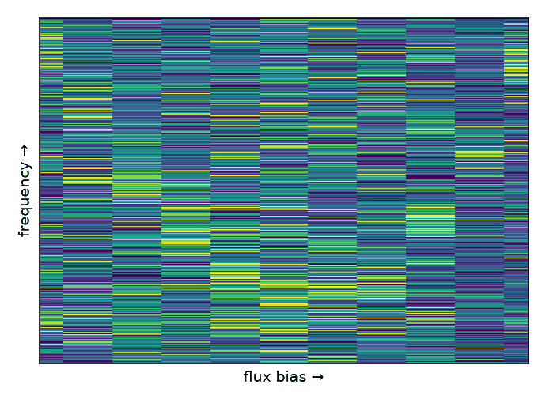
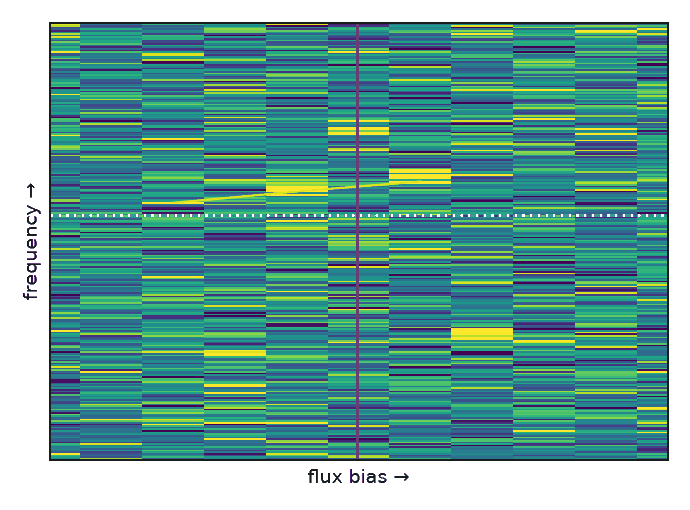

### F6b — Blank panel — no data at all  (seen 3x)

**Geometry:** The plotting area is a single uniform colour edge to edge with no pixel-to-pixel variation of any kind, while axes, ticks and title render normally. Not speckle, not low contrast — the absence of structure is total.

**Prescription:** Stop sweeping. Check acquisition for that channel (readout/data path, de-multiplexed vs multiplexed execution) and repeat the identical run; do not change sweep ranges in response, and never mark the qubit absent on this evidence.

**Exemplars:** lab-C/#424/qC1, lab-C/#424/qC2, lab-C/#424/qC3

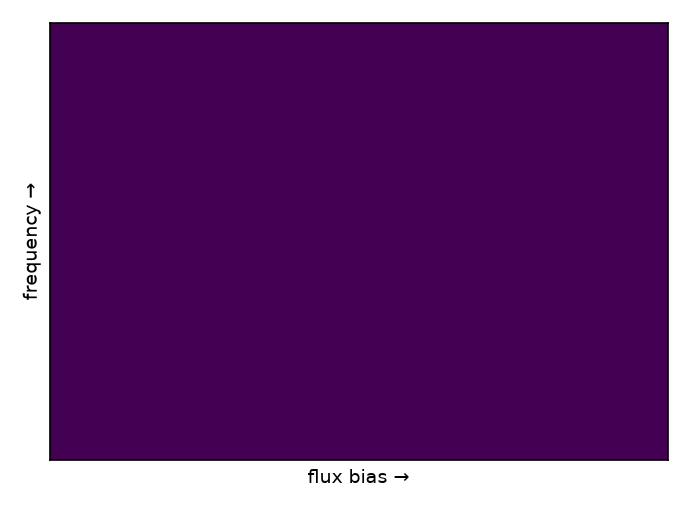

### F6c — Non-ridge background structure only  (seen 4x)

**Geometry:** No frequency-dependent feature exists, but the background is not uniform: a broad left-to-right brightness gradient with no frequency structure, a sharp step in background level at one flux column, or heavy row striping at constant frequency. These carry flux-axis structure a fitter can latch onto while carrying no spectroscopic information.

**Prescription:** Treat as empty for adoption purposes. Re-run the same window at 2x shots after checking for a drifting background or a background-level step coinciding with a sweep boundary; if the gradient or step reproduces, investigate the source before any further fitting.

**Exemplars:** lab-A/#34/q6, lab-A/#37/q6, lab-A/#35/q6

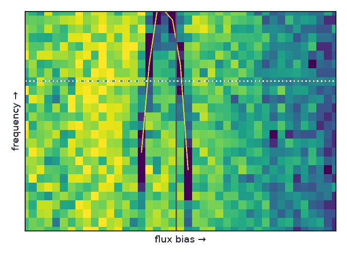
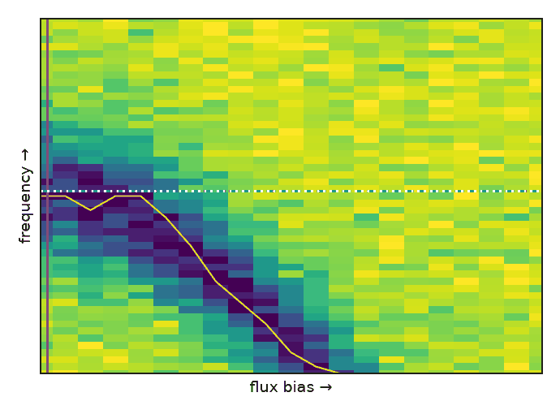

### F7 — Multi-period window  (seen 0x)

**Geometry:** The flux window spans more than one period of the flux response: two or more equivalent extrema of the same kind appear, separated by a full oscillation, so no single extremum is 'the' sweet spot from this panel alone.

**Prescription:** Record the period from the extremum spacing, then narrow the flux window to roughly one period (or less) around the chosen branch and re-run before adopting an offset. Only this geometry licenses the period-derived fields.

### F8 — Under-sampled steep arch — isolated near-vertical segments  (seen 4x)

**Geometry:** No continuous curve appears; instead short near-vertical segments stand at a few isolated flux columns, each spanning a large stretch of the frequency axis, with background between them. The feature is too steep relative to the flux sampling and the frequency span to render as a curve, so no extremum is resolved. Distinct from flat (nothing moves), empty (no feature) and partial (a curve that stops).

**Prescription:** Do the OPPOSITE of what an empty map suggests: widen the frequency span 4-10x, or narrow the flux range 3-5x, and increase flux point density; change one of these at a time. The segments' near-vertical slope is itself the measurement telling you which axis is mis-scaled.

**Exemplars:** lab-A/#34/q6, lab-A/#35/q6, lab-A/#34/q7

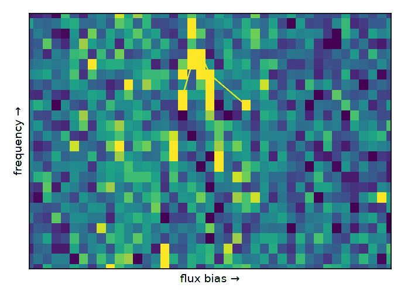

## Flags (orthogonal to map geometry)

A flag can sit on ANY case.

### X1 — Fit reported successful over a map with no feature  (seen 40x)

**Signature:** A parabola, an extremum marker and an idle-offset line are drawn on a panel where nothing links neighbouring flux columns; the contrast under the curve and under the marker matches the contrast everywhere else. The record carries a finite sweet spot, a finite curvature term and no extrapolation warning.

**Prescription:** Hard-block the write. The success flag on this family tracks fit convergence, not the presence of a feature; require an independent connected-feature test under the drawn curve before any value from the run is ingested.

**Exemplars:** lab-B/#13/q2, lab-E/#83/q9, lab-C/#422/qC3, lab-B/#187/q16, lab-C/#426/qD3

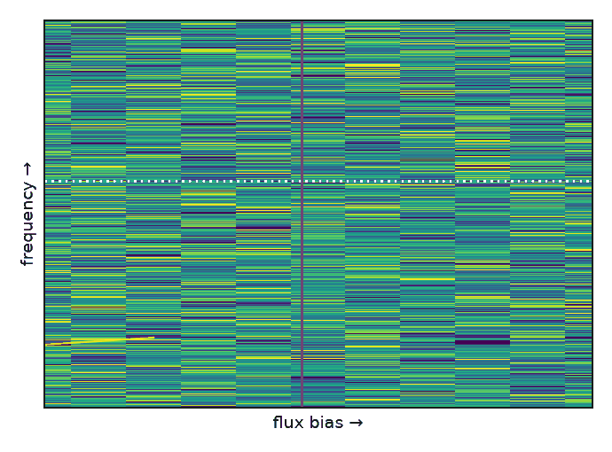

### X2 — Refusal of a readable figure  (seen 14x)

**Signature:** The panel shows a connected feature with a turning point plainly inside the swept flux range — sometimes the highest-contrast panel on the sheet — and no fit curve, marker or offset line is drawn; the record is all-empty.

**Prescription:** Never treat as evidence of absence. Re-run the same qubit alone with a finer frequency step and/or 2-4x shots (and denser flux points if the response is one blob per column); the same measurement commonly fits on a later identical repeat.

**Exemplars:** lab-A/#243/q5, lab-A/#244/q7, lab-E/#86/q10, lab-C/#437/qC5, lab-A/#238/q7

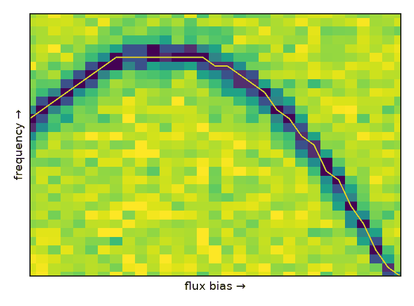
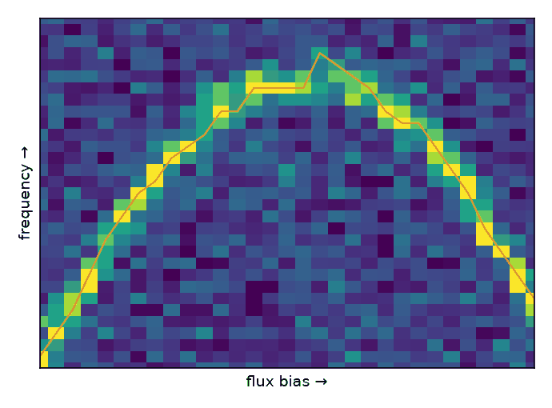

### X3 — Curvature sign inverted against the figure  (seen 3x)

**Signature:** The map shows an unambiguous maximum (or minimum) and the record reports the opposite: a minimum fitted onto a visible maximum, with the drawn curve, the orientation field and the sign of the quadratic term all self-consistently opposite to the picture.

**Prescription:** Disqualify the entire record, not just the offset — an inverted curvature invalidates the frequency and the period fields too. Re-run unchanged once; if the inversion repeats, escalate to the analysis owner.

**Exemplars:** lab-A/#36/q6, lab-A/#35/q6

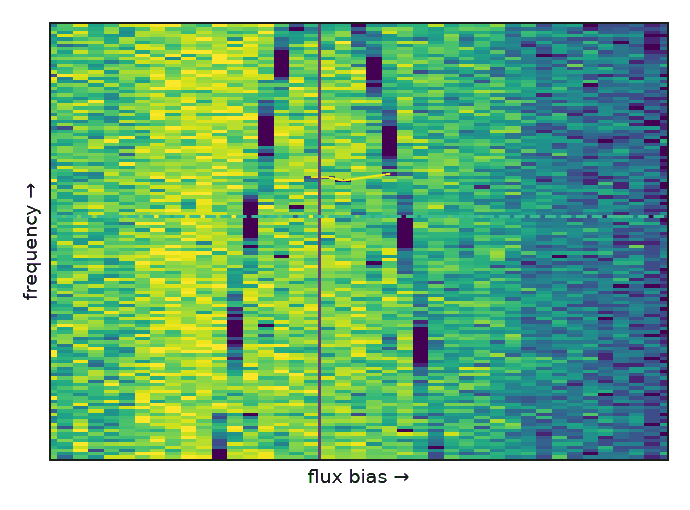

### X4 — Fit centred off the visible feature  (seen 8x)

**Signature:** A connected feature is present and the drawn curve or its marker sits beside it: the marker toward one end of a broad crest rather than its centre, one row below the brightest cell directly above it, on the descending flank rather than the turn, or the extremum planted where the feature has already left the panel.

**Prescription:** Do not adopt. Re-run with the flux window narrowed to about a third around the visible extremum so the fit has no room to drift, and compare the marker position against the feature before ingesting.

**Exemplars:** lab-A/#243/q6, lab-C/#434/qC2, lab-A/#36/q6, lab-A/#243/q8

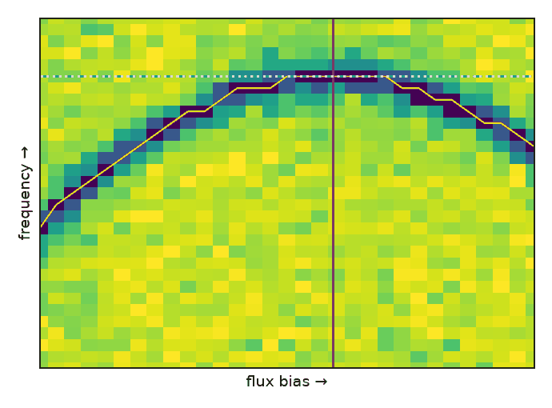
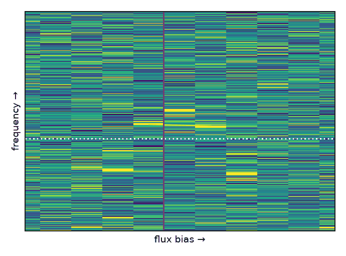

### X5 — Extremum pinned to a sweep boundary sample  (seen 5x)

**Signature:** The reported extremum and the idle-offset line sit exactly on the first or last swept flux column, and the recorded fit bounds coincide with the sweep limits, while the feature (if any) is still visibly sloping there. The extrapolation flag reads false, which is literally true for a boundary sample and practically meaningless.

**Prescription:** Treat a boundary value as a LIMIT, never a measurement. Shift the flux window by about half its span in that direction and re-run; block the write regardless of the extrapolation flag.

**Exemplars:** lab-A/#37/q6, lab-E/#80/q9, lab-D/#90/qA1, lab-E/#84/q9

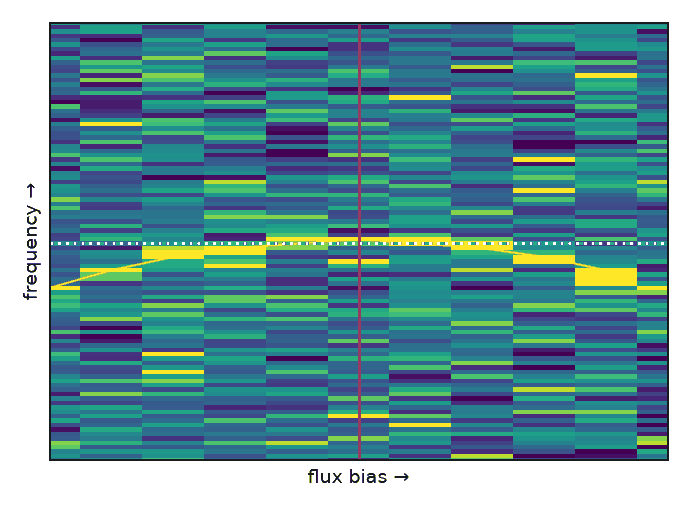

### X6 — Extremum outside the swept range — marker exists only in the legend  (seen 2x)

**Signature:** The legend announces a sweet-spot marker but no marker appears anywhere inside the axes, and the drawn curve is a single monotonic branch. The record still carries a concrete flux value, sometimes together with a failure verdict.

**Prescription:** Discard the value. Recognise the missing in-axes marker as the visual tell for an out-of-range vertex; shift or widen the flux window and re-run.

**Exemplars:** lab-C/#433/qD3, lab-B/#186/q16

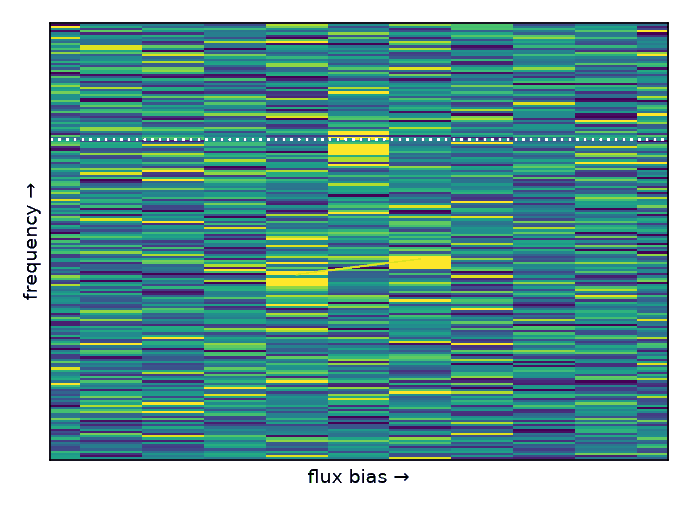

### X7 — Extrapolation flag false while the vertex is unsupported  (seen 18x)

**Signature:** The record asserts that the vertex was not extrapolated, yet the fit's own support covers only part of the swept flux range, or no feature exists under the curve at all, or the vertex sits on a boundary sample.

**Prescription:** Never use this flag as a safety net; it was false in essentially every unsupported fit across all five labs. Gate on fit support plus visible feature instead.

**Exemplars:** lab-B/#44/q2, lab-E/#80/q9, lab-B/#13/q2, lab-E/#84/q9

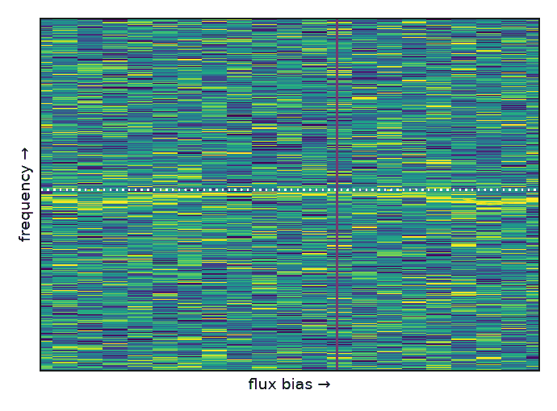

### X8 — Fit support covers only part of the swept flux axis  (seen 12x)

**Signature:** The drawn curve begins and ends well inside the swept flux range (often over one half or only the central columns) while the record publishes a whole-window sweet spot; the columns outside the drawn span contribute nothing.

**Prescription:** Require the drawn/recorded fit bounds to bracket the vertex with data on BOTH sides before adoption. Otherwise narrow the sweep to the supported sub-range and re-run so support and window coincide.

**Exemplars:** lab-B/#43/q2, lab-E/#84/q9, lab-C/#433/qD1, lab-E/#56/q9

### X9 — Degenerate fit — drawn curve is visually straight or flat  (seen 6x)

**Signature:** The overlaid curve has no perceptible curvature across the whole flux axis (a horizontal line, or a gently sloping monotonic line), yet a finite extremum flux and a finite curvature term are reported and a marker is placed on it. In the extreme case no curve is visible at all while the legend announces one.

**Prescription:** Block: an extremum on a visually straight curve is unconstrained even within the fit's own geometry. Re-run only after the map itself shows curvature.

**Exemplars:** lab-B/#15/q2, lab-B/#44/q2, lab-E/#87/q9

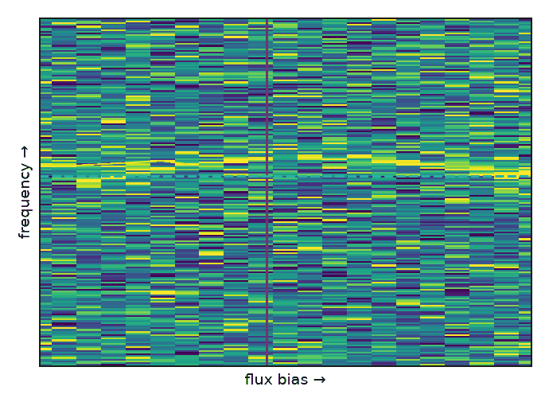

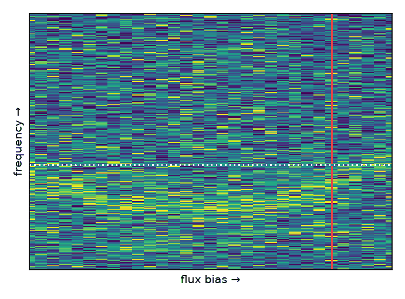

### X10 — Marker does not lie on the fit's own curve  (seen 2x)

**Signature:** The reported extremum marker is drawn offset from the plotted parabola — above it, or displaced along flux from its apex — so the record and its own overlay disagree independently of what the map shows.

**Prescription:** Treat as a rendering/record inconsistency and quarantine the run; check the plotting and fit code paths rather than the physics.

**Exemplars:** lab-C/#426/qD3, lab-C/#426/qC3

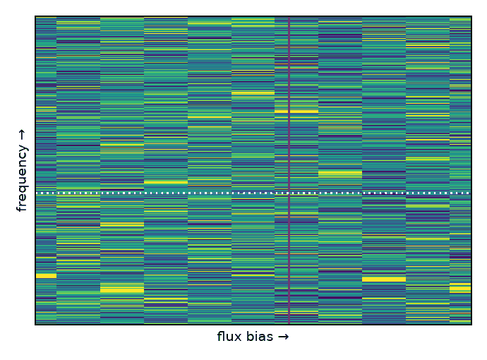

### X11 — Sibling disagreement inside one run  (seen 8x)

**Signature:** Within one multi-qubit figure, panels of comparable geometry receive opposite verdicts, or accepted offsets for several qubits all jump to the opposite side of the sweep centre relative to their own repeats while the visible extrema stay put.

**Prescription:** Suspect a run-level cause rather than a per-qubit one; do not ingest any offset from that run until a repeat reproduces the sign, and re-run the refused panels individually.

**Exemplars:** lab-A/#243/q6, lab-A/#243/q8, lab-A/#237/q5

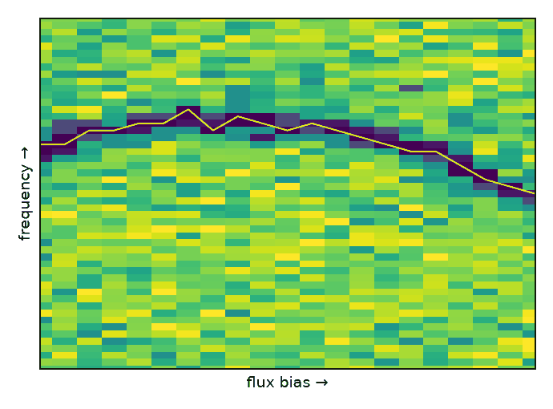

### X12 — Cross-run contradiction between settings  (seen 20x)

**Signature:** The same qubit measured at two sweep settings within the same session yields extrema separated by far more than the feature's own thickness — characteristically the wide-span/wide-flux runs land systematically on one side of the value the readable narrow-sweep runs measure.

**Prescription:** Do not average. Prefer the run whose panel shows a connected feature under the curve; discard the other. Treat a systematic offset that tracks the sweep setting as proof the wide-setting fits are noise.

**Exemplars:** lab-C/#421/qD1, lab-C/#434/qC1, lab-C/#426/qC2

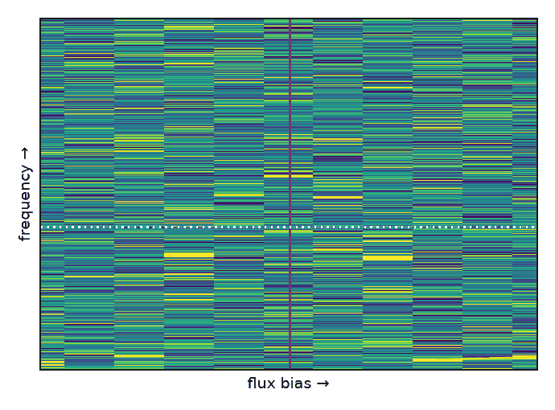
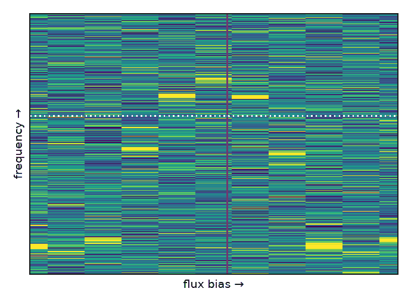

### X13 — Identical parameters, different map  (seen 6x)

**Signature:** Two back-to-back runs with the same target and the same sweep parameters produce qualitatively different panels — one blank/featureless, the other carrying strong bands or a full feature — or place extrema on opposite sides of the sweep centre from equally featureless maps.

**Prescription:** Freeze adoption for that qubit and repeat at least twice more unchanged; the variable is the instrument state, not the settings, so parameter escalation will not resolve it.

**Exemplars:** lab-B/#148/q2, lab-B/#149/q2, lab-E/#80/q9, lab-E/#81/q9

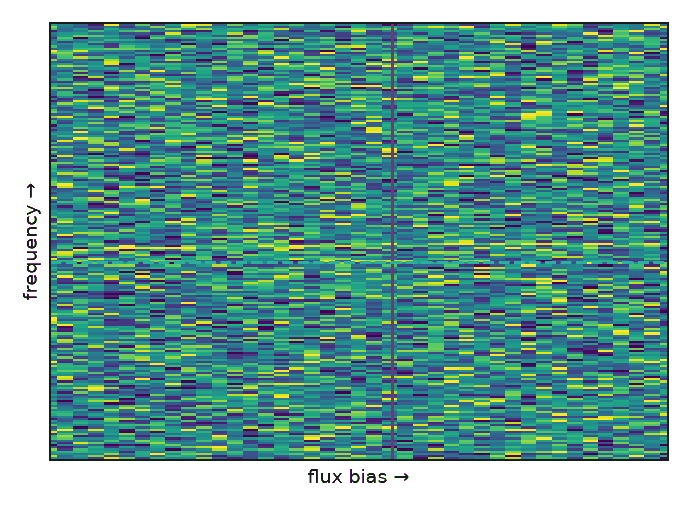

### X14 — Succeeds only where the map is unreadable  (seen 3x)

**Signature:** Across a session, a given qubit is refused in every run whose panels carry visible features and reported successful only in the runs whose panels are featureless.

**Prescription:** Read the pattern as a fitter property, never as a measurement: discard all such successes and judge the qubit only from the runs where its neighbours are readable.

**Exemplars:** lab-C/#422/qC3, lab-C/#423/qC3, lab-C/#426/qC3

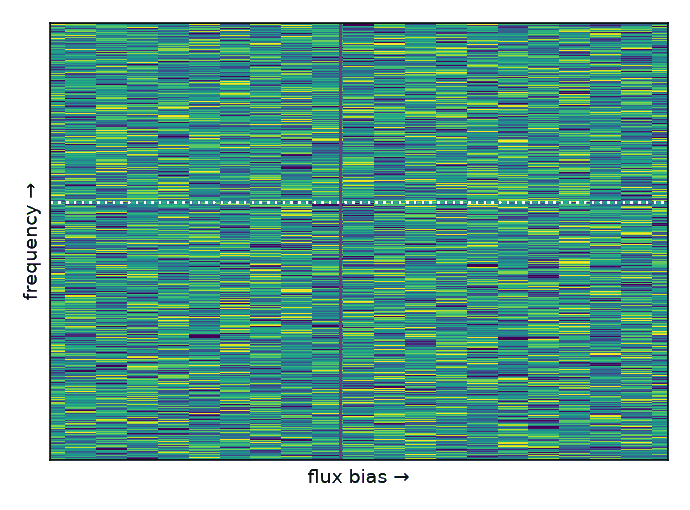
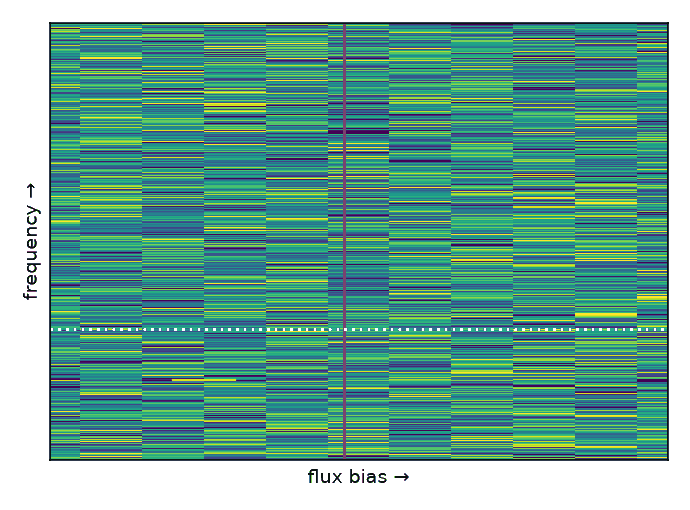

### X15 — Asymmetric flanks — window not centred on the extremum  (seen 6x)

**Signature:** Within one panel the two flanks of the feature have markedly different steepness, one side running off the panel while the other barely descends; the extremum sits well away from the centre of the swept flux range.

**Prescription:** Re-centre: shift the flux window by roughly the offset between the visible extremum and the window centre, keeping the span, and re-run before adopting. Asymmetry is also the best available explanation for a fitter struggling on an otherwise readable panel.

**Exemplars:** lab-A/#238/q5, lab-A/#243/q5, lab-C/#425/qD1

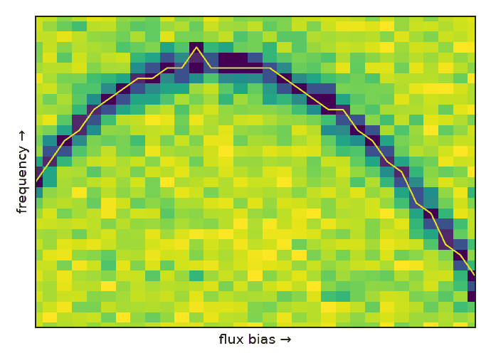

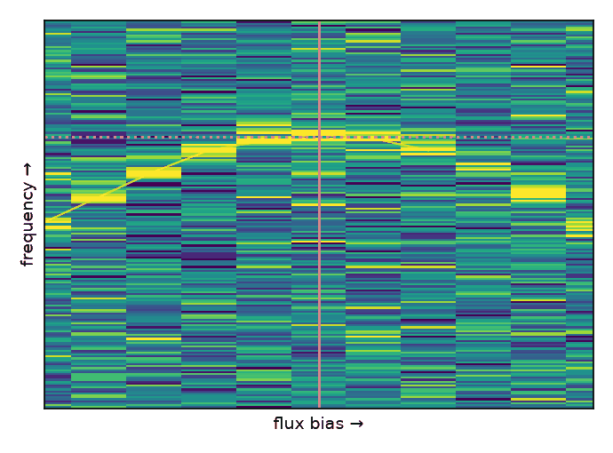

### X16 — Response polarity is dark, not bright  (seen 5x)

**Signature:** The qubit renders as a dark trough on a bright ground while sibling panels in the SAME figure render as bright ridges on a dark ground; per-panel colour normalisation makes brightness incomparable across panels.

**Prescription:** Detect a contrast EXTREMUM of either sign per panel; never hard-code 'bright ridge'. Verify any automated tracer on both polarities before trusting a sheet.

**Exemplars:** lab-A/#244/q5, lab-C/#433/qC3, lab-A/#36/q6

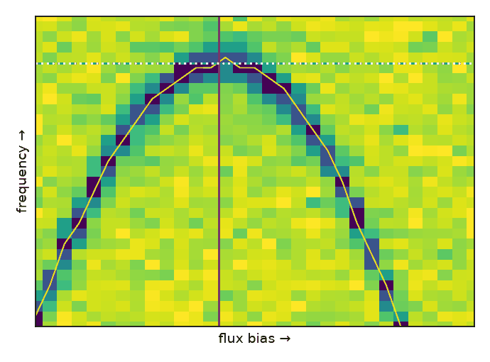
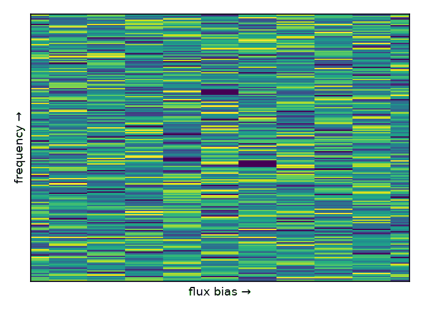
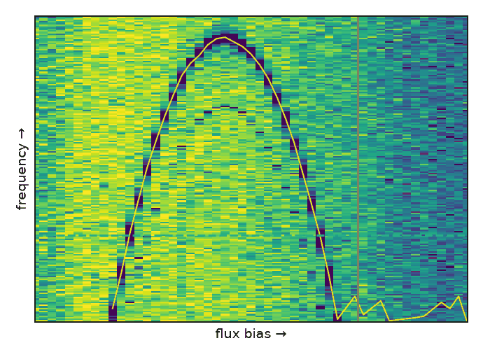

### X17 — Curvature term incoherent across repeats  (seen 7x)

**Signature:** Reported quadratic terms for one qubit within one session span orders of magnitude and/or both signs, while the panels show either the same feature or no feature at all; the drawn arch width changes correspondingly from very tight to nearly straight.

**Prescription:** Require sign agreement and same-order-of-magnitude agreement across at least two repeats before writing any curvature-derived quantity; a term that swings this far is describing noise.

**Exemplars:** lab-E/#83/q9, lab-E/#84/q9, lab-B/#43/q2

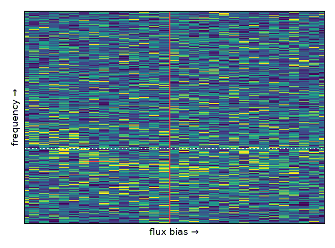
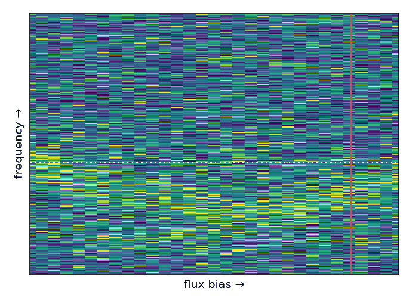
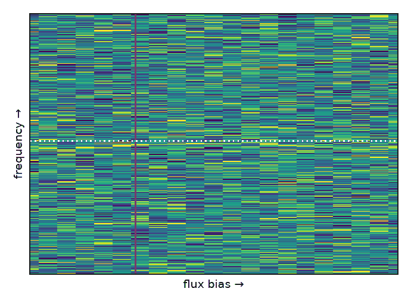

### X18 — Period fields derived from a boundary or from a single branch  (seen 2x)

**Signature:** A second (lower/upper) sweet spot, or period-derived quantities, are reported from a window containing only one extremum — with the second optimum landing exactly on a sweep boundary column — while in every other record of the family those fields are empty.

**Prescription:** Leave period fields empty unless at least two extrema of the same kind are inside the window; never derive a period from a boundary sample.

**Exemplars:** lab-D/#90/qA1, lab-B/#13/q2

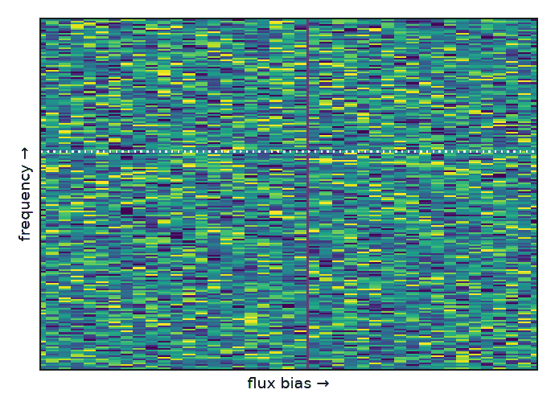

### X19 — State written from an unsupported fit  (seen 3x)

**Signature:** A run whose panel carries no flux-dependent feature (or only a flat band) is the one that patches the chip: qubit frequency, drive frequency, curvature term and a flux joint offset all written.

**Prescription:** Block writes behind the connected-feature test. Where a frequency is defensible but the flux is not, split the write: adopt the frequency, refuse the offset.

**Exemplars:** lab-B/#16/q2, lab-B/#150/q2, lab-E/#80/q9

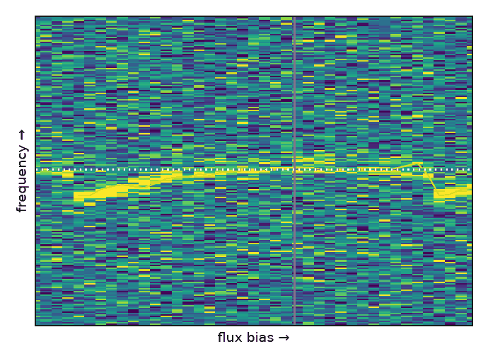
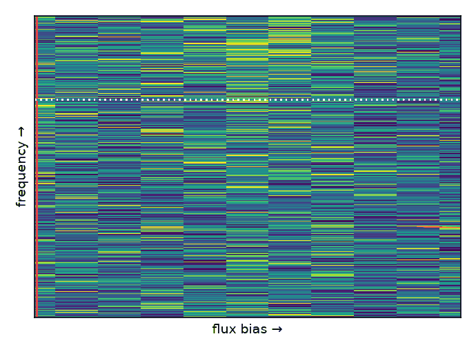

### X20 — Numbers recorded despite a failure verdict  (seen 2x)

**Signature:** The record is marked failed yet still carries a concrete extremum flux (typically far outside the swept range), while the panel shows no feature and no in-axes marker.

**Prescription:** Never harvest values from failed records; treat any non-empty field on a failed verdict as a defect to report upstream.

**Exemplars:** lab-C/#433/qD3, lab-B/#186/q16

### X21 — Patch set inconsistent with the verdicts  (seen 2x)

**Signature:** Within one run, some successful targets are patched and others are not, or a patched target receives its frequency targets but no flux-offset target while equally successful siblings receive one.

**Prescription:** Reconcile verdict-to-patch mapping per run before trusting the chip state; a missing patch is silent and leaves the chip half-updated.

**Exemplars:** lab-C/#420/qD3, lab-C/#420/qD1

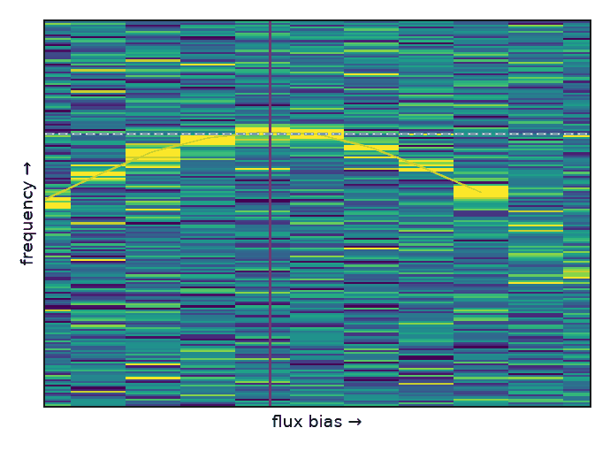
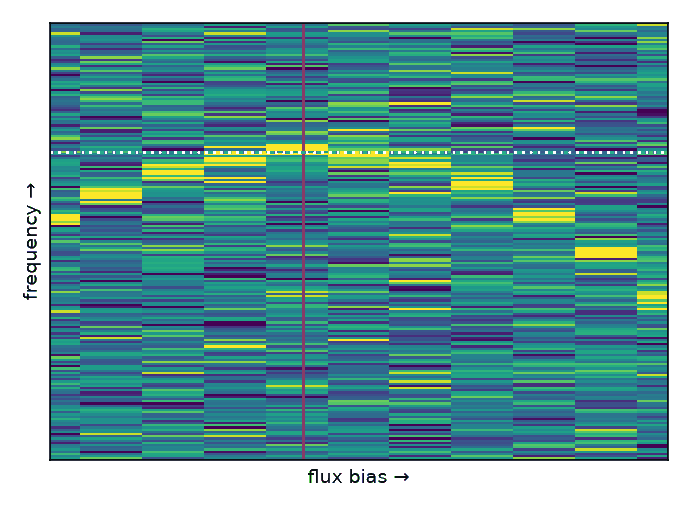

### X22 — Feature present but low contrast / discontinuous  (seen 7x)

**Signature:** A feature is traceable but only about one cell thick and competing with speckle, or it advances as a staircase of short offset segments with small gaps, so continuity has to be inferred rather than seen.

**Prescription:** Raise shots 2-4x and refine the frequency step by about 2x over the same windows before adopting; if the fit succeeds only at low contrast, require a higher-contrast repeat to confirm.

**Exemplars:** lab-A/#39/q7, lab-A/#237/q7, lab-A/#38/q7

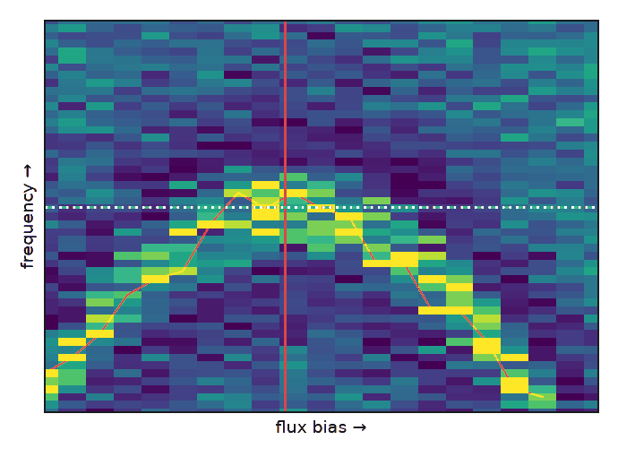

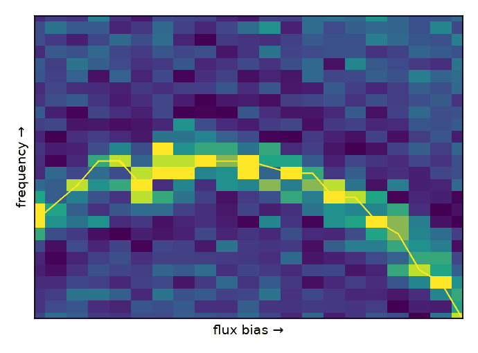

### X23 — Flux axis under-sampled for the swept span  (seen 9x)

**Signature:** Few, wide flux columns relative to the span, so the response cannot render as a curve and a real feature survives only as isolated blocks; widening the flux span at unchanged column count makes this worse.

**Prescription:** Increase flux point density with the span, or narrow the span; never widen the flux range without either adding columns or widening the frequency span.

**Exemplars:** lab-C/#433/qC1, lab-A/#34/q6, lab-B/#186/q16

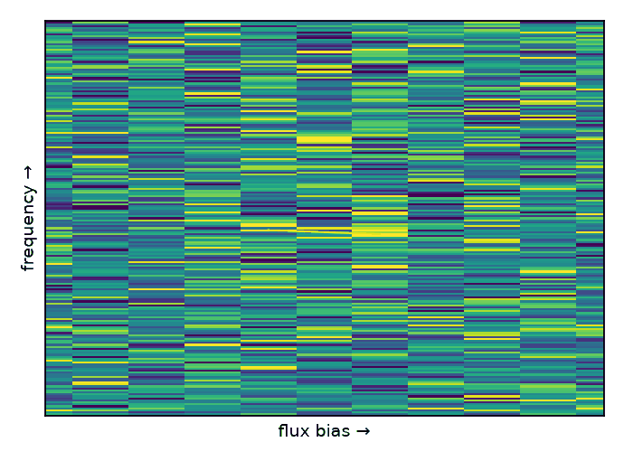

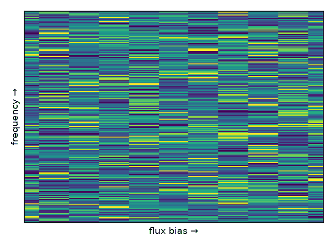

### X24 — Reconnaissance run mistaken for a measurement  (seen 12x)

**Signature:** Run parameters differ from the last accepted run by more than one knob (span, step, flux points, shots, drive all moving), and the panel is a first look rather than a refinement; the sequence of neighbouring runs shows an escalation pattern.

**Prescription:** Mark such runs as search steps and exclude them from adoption by policy, even when they report success; require a settled-settings repeat before any write.

**Exemplars:** lab-A/#34/q6, lab-C/#423/qD1, lab-E/#56/q9

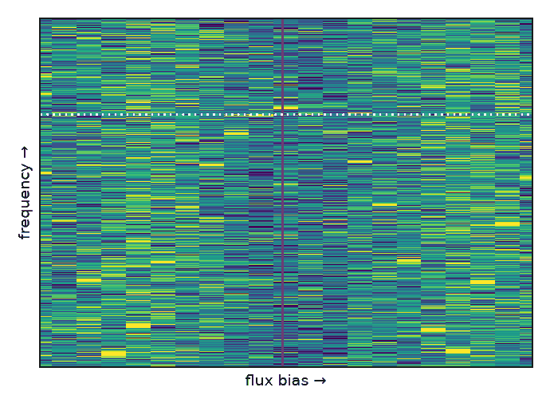
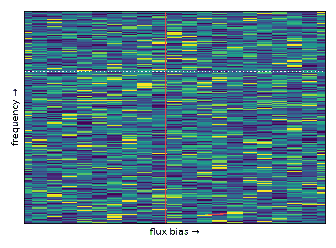

## Rules

### R1 — No connected feature, no value

A fit from this family is adoptable only if a contrast feature (of either polarity) links neighbouring flux columns along the drawn curve, and the cells under the curve are distinguishable from the cells elsewhere on the panel. The node's success flag tracks parabola convergence, not the presence of a feature — across five labs it was set on more than forty panels containing nothing at all. The connected-feature test, not the flag, is the gate.

### R2 — Frequency and flux offset are adopted separately

A panel can determine the extremum FREQUENCY while determining the extremum FLUX badly or not at all: flat bands, broad crests and plateaus all have this shape. Split every write. Where the feature is real but flux-independent or flat-topped, adopt the frequency and refuse the offset rather than accepting or rejecting the record as a unit.

### R3 — A boundary or out-of-range vertex is a limit, never a measurement

An extremum sitting on the first or last swept flux column, or outside the swept range (marker present only in the legend), must never be written. The record's extrapolation flag does not protect against this: it read false in essentially every unsupported fit in every lab, including vertices exactly on the boundary sample. Gate on fit support and marker position instead.

### R4 — The fit's support must bracket the vertex

Require the fit's own flux bounds to contain the reported vertex with measured data on both sides of it. A parabola drawn over only one half or only the central columns of the sweep publishes a whole-window claim it cannot support; where support is partial, narrow the sweep to the supported sub-range and re-measure.

### R5 — Broad crests must repeat before they are written

When the extremum region spans more than roughly a quarter of the swept flux columns, the flux value is weakly determined by construction. Require two identical runs whose apex flux agrees in SIGN and lands within the crest width. Observed scatter across three verbatim repeats was sub-column on well-peaked arches and crossed zero on broad-crested ones.

### R6 — Curvature must be coherent to be used

Adopt a curvature/quadratic term only when repeats agree in sign and within the same order of magnitude. Terms that swing by orders of magnitude and both signs between consecutive runs on one qubit are describing the noise; anything derived from them (period, sensitivity) inherits that.

### R7 — Prefer the readable run; never average across settings

When one qubit is measured at several sweep settings, the run whose panel shows a connected feature under the curve wins outright. A wide-span or wide-flux claim that contradicts a readable narrow-sweep claim by more than the feature's own thickness is discarded, not blended — the contradictions observed were systematic in one direction and tracked the sweep setting, not the device.

### R8 — Multiplexed sheets are judged per panel

On a multi-qubit figure each panel has its own colour normalisation, its own polarity and its own verdict. Never propagate one panel's quality to the group, never infer a qubit is dead because the group run refused it, and when a qubit is refused across repeated group runs at rising shot counts, re-run it alone before drawing any conclusion — that escalation converted persistent group failures into clean fits in more than one lab.

### R9 — Refusal is not evidence of absence

An empty record on a panel with a visible turning point is a tracer/threshold failure. It must trigger a bounded retry (finer frequency step, 2-4x shots, denser flux points on blob-chain geometry), not a 'no signal' conclusion. The same measurement repeated unchanged has fitted perfectly hours later.

### R10 — Search runs are steps, not measurements

A run whose parameters differ from the last accepted run by more than one knob is window-finding. Exclude it from adoption by policy even when it reports success, and change only one knob per retry so that a change in the map is attributable to it.

### R11 — Read polarity-agnostically

The qubit response appears as a bright ridge on some panels and as a dark trough on others — sometimes within a single figure. Any detector, prescription or manual sentence must speak of a contrast extremum, never of brightness.

### R12 — A blank panel is an acquisition fault

A uniformly coloured plotting area with no pixel structure is categorically different from a noisy empty map. Do not respond by changing sweep ranges, do not record the qubit as featureless, and do not let any fit output from it enter the loop; check the data path and repeat the identical run.

### R13 — Orientation must match the picture

The extremum can legitimately be a maximum (upper) or a minimum (lower); both occur and the record has slots for both. What is never acceptable is a reported orientation opposite to the visible curvature — that invalidates the whole record, frequency included, not merely the offset.

### R14 — Period fields require a period

Second sweet spot, flux period and sensitivity fields may only be filled when at least two extrema of the same kind lie inside the window. A second optimum landing on a sweep boundary is the boundary, not a second sweet spot. In practice these fields are empty in almost every honest record of this family.

### R15 — Wide flux and narrow frequency are not independent

Widening the flux window without widening the frequency span (or adding flux columns) destroys a previously clean arch: the flanks leave the frequency band and only the columns nearest the extremum survive. Treat the pair as one coupled knob and require the flanks to stay in band.

### R16 — Session instability suspends adoption

When two runs identical in target and parameters produce qualitatively different panels, or place extrema on opposite sides of the sweep centre, freeze adoption for that qubit and repeat unchanged; parameter escalation cannot resolve an instrument-state variable and will manufacture confident, contradictory numbers while it is present.

### R17 — Verdict-to-patch mapping must be checked

Some runs patch only a subset of their successful targets, or write frequency targets without the flux offset. After every run, reconcile which targets were declared successful against which were actually written; a silently missing patch leaves the chip half-updated and invisible to the next node.

## What the reader reports, and which case it means

The reader measures shapes and returns a semantic signal; this table is where that meets the manual's own vocabulary.

| reader signal | case |
|---|---|
| `curve_arch_vertex_inside` | F1 |
| `curve_broken_ridge` | F5 |
| `curve_empty` | F6 |
| `curve_flat_no_response` | F3 |
| `curve_full_swing` | F1 |
| `curve_monotonic_vertex_outside` | F2 |
| `curve_multi_period` | F7 |
| `curve_partial_ridge` | F4 |

## Exemplar images

Axes are NORMALISED and UNLABELLED: no absolute frequency, power or flux leaves this pack, and a picture without numbers cannot teach an absolute scale (Clause B). Orientation follows the labs' own convention: frequency rightwards, the swept quantity upwards. Overlays: orange = the tracked feature, cyan dashed and magenta dotted = the record's own frequency claims, red = the sweep value it chose. Markers are the RECORD's claims, drawn even when they contradict the map — that contradiction is the lesson in the mislabelled and off-feature cases. Whether the feature is a dip or a peak is MEASURED per run, because the readout rotation decides it and it differs between labs.

## Cross-lab evidence

INVARIANT ACROSS ALL FIVE LABS (lab-A, lab-B, lab-C, lab-E, lab-D)\n\n1. The physics geometry: a connected contrast feature whose frequency traces a smooth rise-and-fall (or fall-and-rise) against flux, with the turning point being the quantity of interest. Every good panel in every lab has the same shape, and the same three sub-shapes recur everywhere: well-peaked, broad-crested, and truncated by an axis.\n\n2. The overlay convention: a fitted parabola, a diamond/point extremum marker, and a vertical idle-offset line through the marker; on refusal, no overlay at all and an all-empty (all-NaN) record. This held in all five labs and is the single most reliable cross-lab reading aid.\n\n3. The dominant defect: the success flag reports parabola convergence, not the presence of a feature. Confidently reported extrema on featureless maps occurred at lab-B (q2, q14, q16), lab-C (four to five qubits per wide-span run), lab-E (q9, both nights) and lab-D (qA1). It is a family-level property of the analysis, not one lab's setup.\n\n4. The mirror defect: refusal of a plainly readable figure occurred at AS (q5/q7 across four group runs), lab-C (qC5 at full drive) and lab-E (q10, fitted on an identical later repeat). Also family-level.\n\n5. The extrapolation flag is useless everywhere. `vertex_extrapolated` read false on boundary-pinned vertices, on part-of-range fits and on pure-noise fits, in every lab that reported it.\n\n6. The coupled-axis failure (widen flux, keep frequency span -> arch survives only near the extremum) reproduced at lab-C (#433/#434) and AS (#34-#36 in the opposite direction), on different chips and different sweep hardware.\n\n7. Escalation grammar is the same everywhere: shots, frequency span, frequency step, flux points, flux span, drive amplitude, multiplexed on/off. The one knob that rescued genuinely weak qubits was drive amplitude (lab-C #437) or frequency step (lab-E #79), never flux range.\n\nLOOKED UNIVERSAL, IS ACTUALLY ONE LAB'S CONVENTION OR ONE SESSION'S ACCIDENT\n\nA. "Bright ridge". NOT universal, and not even per-lab: in a single AS figure one qubit renders as a DARK dip on a bright ground while its neighbour renders as a bright ridge on a dark ground, and an lab-C panel (#433/qC3) shows the response as a dark trough while its siblings are bright. Per-panel colour normalisation makes brightness incomparable even within one file. Any rule phrased in terms of brightness will silently skip half the panels.\n\nB. "The sweet spot is the maximum". This is a convention of the labs whose qubits were measured near an upper flux sweet spot. lab-E q10 (#86, #125) shows a clean U with a MINIMUM inside the window, the record's orientation field says lower, and the value is written into the lower sweet-spot slot. lab-D is the only record in the batch reporting both an upper and a lower optimum in one fit — and its lower one is a sweep-boundary artefact. Orientation must be read from the record and checked against the picture, never assumed.\n\nC. "Panels are one qubit each". lab-B, lab-E and lab-D runs are single-qubit full-width panels; AS and lab-C are multiplexed multi-panel sheets with independent per-panel normalisation and independent per-panel verdicts. A rule written against either style breaks on the other.\n\nD. Background texture is a lab/rendering signature, not a diagnostic. lab-B and lab-E featureless maps show heavy horizontal ROW striping at constant frequency plus column banding at the flux pitch; lab-C and AS show per-column blocks of speckle. Both mean the same thing ("data present, no feature"), and neither should be read as structure.\n\nE. "Coarse flux sampling" is relative. lab-C group runs use about a dozen flux columns (so a real arch renders as one blob per column), lab-E uses roughly thirty-one, lab-B uses dense grids. The blob-chain geometry is a consequence of the column count relative to the feature width, not a property of any lab.\n\nF. Blank uniform panels (no data at all) were seen only at lab-C, and only in a de-multiplexed repeat of a multiplexed run — three of seven panels blank in one figure. Treat as an execution-mode hazard of that setup, not as a general shape.\n\nG. Flux axis quantity and units differ between labs (voltage offsets, current, QDAC bias on the 03c twin). Absolute offsets, curvature magnitudes and "how wide is wide" are never comparable across labs; only the geometry and the relative knob moves are.\n\nH. Data-hygiene artefact in this annotation set: batch 4 contains placeholder rows named with a "_dup_guard" suffix that duplicate a real qubit's verdict and are explicitly marked "ignore-this-row". They are not measurements and must be dropped before any counting or ingestion.

## Open questions

1. Adoption threshold for a broad crest: what fraction of the swept flux span may the level top occupy before the flux offset is refused, and how many identical repeats (and what agreement window) license a write? Observed scatter was sub-column on peaked arches and sign-flipping on flat-topped ones, with no principled boundary between them.
2. Is a LOWER (minimum) sweet spot an acceptable idle point for these devices, or must the loop always drive toward the upper branch? lab-E q10 was fitted and its lower value recorded; nothing in the family's fields says whether that is a valid operating point or a mis-identified branch.
3. Offset write semantics per generation: at lab-C the written flux target differs from the reported idle offset (increment), elsewhere it appears to be an assignment. Which nodes assign and which increment must be confirmed per lab/generation before any automated write, or the loop will double-apply.
4. What is the operational definition of 'a connected feature' that should gate the success flag — column-to-column contrast continuity, a minimum contrast-to-background ratio, a minimum number of consecutive populated columns — and can it be added inside the node rather than as an external check?
5. Retry ordering for a refusal on a readable panel: frequency step first, shots first, or drive amplitude first? The evidence shows drive rescued weak qubits and frequency step rescued unresolved ones, but never both tried in a controlled order.
6. For the lab-B q2 flat bands seen over BOTH wide and narrow flux windows: is the flux line unresponsive/mis-wired, is the visible line not this qubit's transition, or is the qubit far off its expected frequency? This needs a hardware/wiring decision, not more spectroscopy.
7. Are the never-visible qubits (one lab-C qubit appeared under no setting of the session) dead, outside the searched frequency range, or under-driven? Define the stopping criterion that lets the loop declare a qubit out of scope instead of looping.
8. Should the loop be allowed to classify a run as reconnaissance from its parameter diff against the last accepted run, and is that diff reliably available in the run metadata across generations?
9. Which flags hard-block a write versus warn: proposed hard blocks are featureless-map success, curvature-sign inversion, boundary/out-of-range vertex, partial fit support, and blank panel — this list needs an owner's sign-off.
10. Sign and unit convention of the reported quadratic term across generations (and of the QDAC twin's current axis), so that cross-run coherence checks are comparing like with like.
11. Whether a second, fainter parallel branch should be suppressed by lowering drive or resolved and assigned deliberately (two-photon vs neighbouring mode) — the loop currently has no policy and the fitter can latch onto either.
12. Whether the loop should refuse to ingest any run in which the verdict-to-patch mapping is incomplete, given that partial patching was observed on otherwise clean runs.

## Fit-vs-figure disagreements

- lab-A/#34/q6 — full arch drawn over a panel holding only isolated near-vertical segments and a featureless brightness gradient; apex marker touches nothing.
- lab-A/#35/q6 — near-straight fit with a MINIMUM marked on no visible feature, opposite curvature sign to the same qubit's previous run.
- lab-A/#36/q6 — map shows an unambiguous maximum with the turning point inside the window; the fit lies on the descending flank and marks a minimum low and to the right where the ridge has already left the panel.
- lab-A/#36/q7 — clear continuous ridge with a rounded turning point on screen, no fit curve, marker or offset line drawn.
- lab-A/#37/q6 — ridge is still descending at the left edge; apex marker and idle-offset line planted exactly on the first swept flux column while the record denies extrapolating.
- lab-A/#237/q5 — highest-contrast arch on the sheet, turning point plainly inside the window, refused while two shallower panels beside it were accepted.
- lab-A/#238/q5 — sharper version of the same arch, still no overlay of any kind.
- lab-A/#238/q7 — bright ridge with an unambiguous rounded top and a contiguous right flank, refused.
- lab-A/#239/q5 — same strong arch as its multiplexed twin, still refused; de-multiplexing changed neither map nor verdict.
- lab-A/#239/q7 — clear rounded top and descending right flank, refused.
- lab-A/#243/q5 — cleanest version of this arch in the batch, fourth consecutive refusal; the next single-qubit run at the same settings succeeded.
- lab-A/#243/q7 — clear rounded top left of centre, refused for the fourth consecutive run.
- lab-A/#244/q7 — continuous bright arch with the turning point inside the window; record is all-NaN with success false.
- lab-B/#13/q2 — uniform speckle with no line anywhere; a shallow inverted curve reported successful with BOTH an upper and a lower sweet spot, the lower one at the flux-range edge.
- lab-B/#14/q2 — featureless speckle; upward-opening parabola with a marked minimum, opposite curvature sign to the immediately preceding run on the same qubit.
- lab-B/#15/q2 — featureless speckle; the drawn fit is visually a straight horizontal line yet a finite vertex flux and curvature are reported.
- lab-B/#16/q2 — a single flux-INDEPENDENT horizontal band; the fit bends imperceptibly and places a sweet-spot flux the band itself does not distinguish, and this run patched the chip.
- lab-B/#35/q2 — broad flux-independent bright region clipped by the bottom of the frequency window; fit drawn over only part of the flux axis with a vertex the region cannot support.
- lab-B/#36/q2 — three parallel flux-independent bands; the fitter silently follows the middle one and reports a sweet-spot flux none of them supports.
- lab-B/#43/q2 — featureless speckle (same parameters as a run that showed three bands); tight inverted arch over a short stretch of flux, curvature two orders of magnitude away from its siblings.
- lab-B/#44/q2 — featureless speckle; the drawn curve is essentially monotonic across the window yet a vertex inside the range is reported with no extrapolation warning.
- lab-B/#148/q2 — empty narrowed-window map; clearly curved upward parabola with a marked minimum near the centre on plain background.
- lab-B/#149/q2 — two flux-independent horizontal bands; fit lies along the upper one with invisible curvature and marks a flux position the band does not distinguish.
- lab-B/#186/q16 — featureless coarse map; verdict failed yet a concrete vertex is emitted, lying outside the swept flux range so no marker can be drawn inside the axes.
- lab-B/#187/q16 — featureless map; parabola over a short central stretch reported successful, texture under the curve identical to texture elsewhere.
- lab-B/#201/q14 — featureless map; upward-opening parabola with its minimum on speckle indistinguishable from the rest of the panel.
- lab-C/#421/qD1 — broad parabola over uniform striped speckle; crest claim far below the same qubit's readable moderate-span runs of the same hour.
- lab-C/#421/qD3 — shallow parabola over speckle with no band tracking either arm.
- lab-C/#421/qC1 — parabola over speckle; isolated bright cells near the arm form no band.
- lab-C/#421/qC2 — parabola over speckle; apex region indistinguishable from background.
- lab-C/#422/qD1 — broad shallow parabola over speckle; crest claim drifts further down as the span widens.
- lab-C/#422/qD3 — parabola over speckle, no column-to-column continuity anywhere.
- lab-C/#422/qC3 — parabola over uniform speckle for a qubit that fails every readable run of the session.
- lab-C/#422/qC1 — parabola over speckle; crest claim well below the moderate-span value.
- lab-C/#422/qC2 — wide parabola over speckle with no feature crossing more than one column.
- lab-C/#423/qD1 — parabola over finely striped speckle; doubling the flux points produced no ridge at this span.
- lab-C/#423/qD3 — parabola over speckle, crest claim inconsistent with the readable siblings.
- lab-C/#423/qC3 — parabola over speckle with the marker offset from its own apex.
- lab-C/#423/qC1 — parabola over speckle, no continuity beyond a single column.
- lab-C/#423/qC2 — parabola over speckle, crest disagrees with the moderate-span runs.
- lab-C/#424/qD1 — parabola over speckle; sequential (de-multiplexed) acquisition changed nothing.
- lab-C/#424/qD3 — parabola over speckle, both arms over indistinguishable background.
- lab-C/#426/qD1 — parabola over speckle taken minutes after the same qubit's clean arch at the moderate span, and systematically low against it.
- lab-C/#426/qD3 — parabola over speckle AND the marker sits above the drawn curve rather than on its apex.
- lab-C/#426/qC3 — parabola over speckle with the marker off its own curve; qubit fails every readable run.
- lab-C/#426/qC1 — parabola over speckle; isolated cells near the apex form no band.
- lab-C/#426/qC2 — parabola over speckle, crest below the moderate-span value.
- lab-C/#433/qD1 — success reported from a short, nearly flat arc confined to the few columns nearest the sweep centre; apex frequency disagrees with three preceding identical-qubit runs by far more than those runs disagreed among themselves.
- lab-C/#433/qD3 — monotonic branch with nothing following it; failed verdict yet a sweet-spot flux far outside the swept range and no marker inside the axes.
- lab-C/#434/qD1 — full arch drawn over dense streak noise; apex region carries no brightening at all.
- lab-C/#434/qC1 — wide arch whose curvature is anchored only by isolated outer-column cells, with no feature at the apex.
- lab-C/#434/qC2 — drawn apex sits one row below the bright block directly above it, with no continuous ridge anywhere on the panel.
- lab-C/#437/qC5 — every flux column carries a blob and their heights trace a clean symmetric rise-and-fall with the turning point inside the window; record is empty with all fields NaN.
- lab-E/#80/q9 — curve falls monotonically from the leftmost swept column; marker and offset line sit on that boundary column over a map with no feature, and the extrapolation flag reads false.
- lab-E/#81/q9 — identical parameters to the run before it, opposite side of the sweep centre and a far-away frequency, again from a panel with no visible feature.
- lab-E/#83/q9 — featureless map at the lowest averaging in the batch; fit drawn over the right half only, sweet spot reported in full.
- lab-E/#84/q9 — featureless map; parabola supported only by the right-hand columns with its apex near the sweep edge and no extrapolation warning.
- lab-E/#85/q10 — strong continuous ridge descending into a broad plateau, refused outright; the extremum is real, only its flux position is ill-conditioned.
- lab-E/#86/q10 — continuous ridge forming a clean U with the minimum comfortably inside the window, refused; an identical repeat hours later fitted it perfectly.
- lab-E/#87/q9 — featureless map; marker and offset line drawn while no fit curve is visible at all.
- lab-E/#56/q9 — featureless wide-flux map; curve over the central portion only, complete sweet-spot claim reported.
- lab-E/#57/q9 — featureless map; a visually convincing symmetric arch over nothing, disagreeing with its one-minute-earlier partner on both offset and frequency.

## Blind verification

Blind pass agrees on 8 of 10. Method: located each run's folder in the b4_qubit_spectroscopy_vs_flux__*.json records, viewed figures.amplitude.png (cropping and enlarging the named qubit's panel on the multi-qubit sheets), and for every row also re-derived the ridge independently from ds_raw.h5 (NetCDF-classic on these labs, read via scipy.netcdf_file) as a per-flux-column MAD-z trace of IQ_abs with column-median background removal, plus a top-N multi-peak trace where more than one band was in play. Classified first, compared to the claim after.

Two disagreements, of different kinds:

- #38 q7: claimed F4, I get F1. This is a substantive disagreement. The per-column peak trace is continuous over all 21 flux points (z+ 2.5-16.1, no dropout) and traces a clean parabola from 3.8362 GHz at flux -0.050 up to a 3.8442-3.8462 plateau near flux -0.015 and down to 3.8202 GHz at +0.050 -- turning point inside the window, both flanks reaching both edges. The ridge is low-contrast and the node's own fit FAILED for this qubit, which is plausibly what pulled the call toward "partial", but a dim continuous ridge is not a lost one. If the taxonomy needs it, F1 with a low-contrast qualifier.

- #36 q2: claimed NEW:multiple_flat_bands, I get F3. This is a granularity disagreement, not an observational one -- I see the same three bands (4.598-4.607 saturated edge, sharp 4.663-4.670, broad 4.687-4.699), all present at every flux point and all flat (the sharp one wanders only ~7 MHz non-monotonically over the full +/-0.25 V sweep). Since none of the bands responds to flux, the verdict and the operator action are exactly F3's; the multiplicity belongs as a modifier on the row (it explains how the fitter can lock onto a spurious feature and still report success) rather than as its own case.

Confirmed as claimed:
- #35 q6 (NEW:steep_flanks_only) -- I arrived at the same new case independently. Two dark branches enter the top of the frequency window at flux ~-0.10 and ~0.00 and descend out of the bottom at ~-0.23 and ~+0.13, converging above 4.1835 GHz. The apex is outside the FREQUENCY range, which is what separates it from F2 (vertex outside the FLUX range, one monotonic ridge) and from F4 (signal lost; here the qubit has simply left the window).
- #237 q8, #239 q7, #244 q7 -- all genuine F1, verified by continuous traces with the turning point inside the sweep. Worth flagging that #239 q7 and #244 q7 are recorded as FAILED fits despite #244 being the cleanest arch in the set; figure case and fit outcome are independent here.
- #187 q16, #419/#420/#421 qC4 -- all genuine F6. The three qC4 runs are a widening ladder (10 -> 100 -> 200 MHz span) that never finds the qubit, while sibling qubits in the same #421 sheet do fit arches, so it is qC4-specific rather than a run-level failure. #187 q16 is the more dangerous row: pure noise, yet the record carries success=true with vertex_extrapolated=false -- a false accept.