# resonator_spectroscopy_vs_coupler_flux — case manual (v1)

**Authored:** 2026-08-21 · **Source:** docs/131: 34 runs / 34 targets across 2 labs (lab-A, lab-B), every figure viewed; blind re-classification 5/5

This file and `cases.json` are generated from ONE source. Geometry and prescription language is chip-independent by rule: relative positions, shapes and bounded knob moves only — never absolute frequencies, powers or fluxes, and never a size expressed as a fraction of the swept window.

**Physics.** The same 2-D shape as node 06, but the swept knob is the COUPLER's flux. The resonator moves only through the coupler-mediated interaction, so a weak or absent modulation can be the correct physics rather than a failed measurement — which is exactly why this family's cases must be read with the swept range in mind.

## Map cases

### C1 — R1_clear_modulation  (seen 4x)

**Geometry:** The extracted dip positions complete at least one full oscillation inside the swept flux window: a crest, a trough, and a return toward a second crest, with both extrema interior (not at an edge). The fitted sinusoid passes through the middle of the dip-point cloud everywhere and the drawn max/min markers stand on its crest and trough with a separation of exactly half the crest-to-crest distance. The decisive property is amplitude relative to two yardsticks: the peak-to-peak excursion is clearly larger than the point-to-point scatter of the dip positions, and in the strongest instances it is a multiple of the vertical thickness of the dip band itself, so the curve — not the straight stripe — is the dominant feature of the map.

**Prescription:** Nothing needs widening. Confirm before adopting: repeat once with the flux window narrowed to roughly half its present span, centred on the claimed idle extremum, and the frequency span narrowed ~2x; require the extremum to reproduce to within a small fraction of the crest's flat region. If the modulation depth exceeds the dip-band thickness (curve dominates), also confirm the frequency window is centred on the same band as the previous run before comparing any number.

**Exemplars:** lab-A/#230_07_resonator_spectroscopy_vs_coupler_flux_195913/coupler_q6_q7, lab-A/#16_07_resonator_spectroscopy_vs_coupler_flux_042946/coupler_q6_q7, lab-B/#295_07_resonator_spectroscopy_vs_coupler_flux_101121/q4-5, lab-A/#229_07_resonator_spectroscopy_vs_coupler_flux_195856/coupler_q6_q7

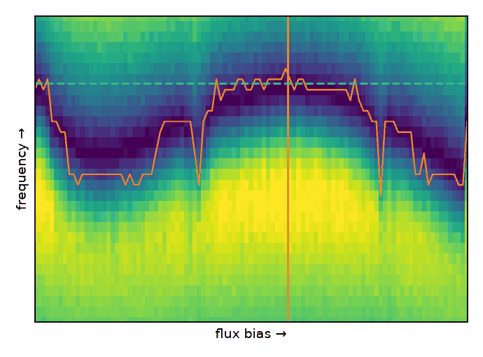

### C2 — R3_partial_period_single_turning_point  (seen 5x)

**Geometry:** One broad arch spans the whole flux window: the dip trace rises to a single crest (or falls to a single trough), sags away on both sides, and never turns back — so exactly one turning point is inside the window. One extremum marker is drawn, the other is absent. The two flanks are usually asymmetric, one edge descending more steeply than the other. The arch's total excursion is small compared with the thickness of the dip band it sits in, and the crest is often a broad flat top rather than a point, so the extremum's flux position is localisable only to the width of that flat region. The corresponding record is a legitimate partial fill: an idle offset with period and minimum offset unset.

**Prescription:** Widen the flux window by roughly 2-4x, preferentially on the side where the trace is still descending steeply, holding frequency span, step and shots constant, until a second turning point enters the frame. Do not spend the budget on shots — a flat top is a conditioning limit, not a noise limit. Report the idle offset with an uncertainty of order the flat-top width; do not report a period.

**Exemplars:** lab-A/#15_07_resonator_spectroscopy_vs_coupler_flux_042919/coupler_q6_q7, lab-A/#20_07_resonator_spectroscopy_vs_coupler_flux_043518/coupler_q6_q7, lab-A/#18_07_resonator_spectroscopy_vs_coupler_flux_043402/coupler_q6_q7, lab-A/#17_07_resonator_spectroscopy_vs_coupler_flux_043043/coupler_q6_q7

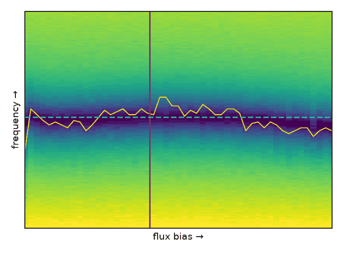

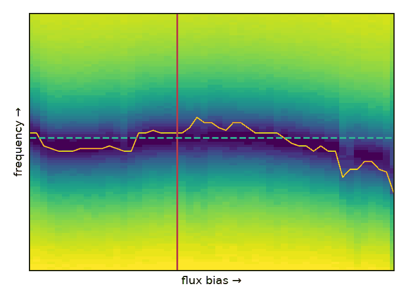

### C3 — R2a_flat_window_limited  (seen 1x)

**Geometry:** The dip positions lie on one straight horizontal line from the left edge of the swept flux axis to the right edge — no curvature, no tilt, no turning point — and the dip band keeps a constant vertical position and constant thickness in every flux column. What distinguishes this from a genuinely flat chip is context, not the picture: the flux window is at or near the narrowest of the session, and a sibling run on the same target at a several-fold wider flux window does show curvature. The correct record here is a refusal with every field unset, and that refusal is good behaviour — there is nothing in the frame a sinusoid could be anchored to.

**Prescription:** Widen the flux window by 3-5x in both directions, holding shots, frequency span and frequency step fixed; that single move is what converts this figure into a readable arch. Never write 'this coupler does not move this resonator' from a figure taken at the session's narrowest flux window.

**Exemplars:** lab-A/#14_07_resonator_spectroscopy_vs_coupler_flux_042859/coupler_q6_q7

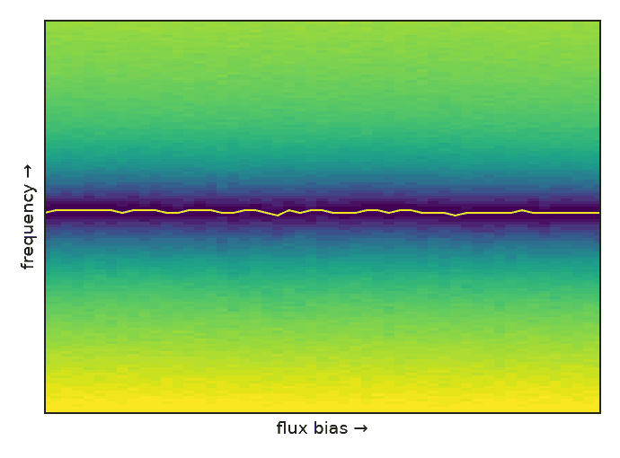

### C4 — R2b_flat_over_wide_flux_at_correct_zoom  (seen 7x)

**Geometry:** A single narrow trace (dark dip, occasionally bright ridge) crosses the entire flux axis dead straight, with the frequency window narrow enough that a modulation of the size seen elsewhere on the chip would be plainly visible, and the flux range wide — in the strongest instances several-fold wider than a sibling and still without a bend of even the trace's own thickness. Marker scatter is smaller than the trace thickness and uniform along its length. The fitter nevertheless emits an idle offset, a minimum offset and a period; these are internally self-consistent (extrema exactly half a period apart) and rest on no visible feature, with the period always of the order of the swept range.

**Prescription:** Treat the frequency claim as usable and the flux offsets as unusable. Before recording flatness as physics, run two bounded controls: narrow the frequency span 2-4x around the reported resonator frequency (rules out zoom-induced flatness), and widen the flux window 2x (rules out under-sweep). Then run an out-of-figure control on the same bias line — the qubit-flux node, or a flux setting known to move something else — because this figure cannot distinguish weak coupling from a bias line that never reached the chip. If several pairs in one pass are all flat, escalate to the wiring control before accepting any of them.

**Exemplars:** lab-B/#492_07_resonator_spectroscopy_vs_coupler_flux_182702/q3-8, lab-B/#1225_07_resonator_spectroscopy_vs_coupler_flux_024116/q14-15, lab-B/#494_07_resonator_spectroscopy_vs_coupler_flux_183045/q3-8, lab-B/#1238_07_resonator_spectroscopy_vs_coupler_flux_030255/q10-15, lab-B/#1271_07_resonator_spectroscopy_vs_coupler_flux_041455/q14-18

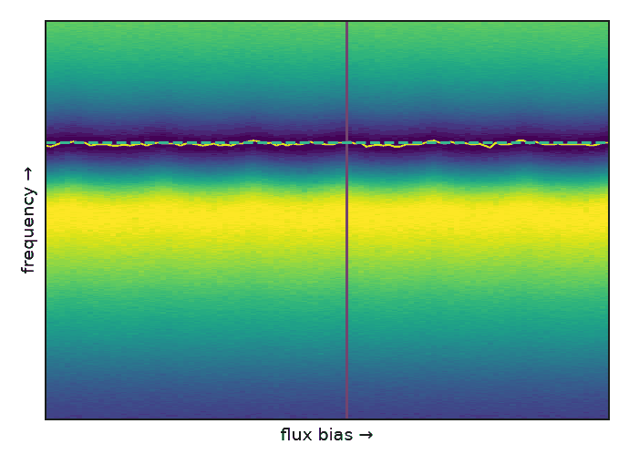
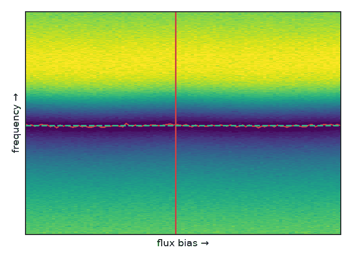

### C5 — flat_at_this_frequency_zoom  (seen 1x)

**Geometry:** With a very wide frequency span the resonance collapses to a thin, perfectly straight horizontal line with broad bright/dark fields above and below; no curvature, no splitting, no second branch approaches it anywhere. The fit lies flat on the line and the markers are indistinguishable from it. The tell is the aspect ratio of the evidence, not the shape: the frequency span is many times any modulation the same target shows at a tighter zoom, so the arch is compressed below one pixel row. The extremum markers pick out flux columns that look identical to every other column.

**Prescription:** Narrow the frequency span by 3-10x around the reported resonator frequency, keeping the same flux range and step, and re-read the shape. Record the flat verdict only together with the frequency zoom it was read at; a flat verdict from a wide-span frame is an answer to 'is there an anticrossing or a large push', not to 'does this coupler move the resonator'.

**Exemplars:** lab-B/#446_07_resonator_spectroscopy_vs_coupler_flux_171915/q1-4

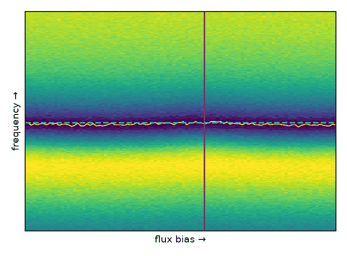

### C6 — sub_linewidth_coherent_modulation  (seen 3x)

**Geometry:** A clean, thick, continuous dip band spans the whole flux axis; the extracted markers sit inside it and trace a smooth, coherent arch — depressed toward the ends, cresting near the middle, sometimes lifting again at the far ends so that a little more than one period is in view. The defining measurement is a double comparison: the peak-to-peak swing is plainly SMALLER than the vertical thickness of the band, but plainly LARGER than the point-to-point scatter of the markers, and it varies smoothly from one flux column to the next rather than jittering. This is the characteristic geometry of the family and it is correct physics — a coupler that pushes this resonator by less than its own linewidth — not a measurement defect.

**Prescription:** Do not prescribe more shots; averaging does not change a sub-linewidth swing. Increase the flux point count ~2x and narrow the frequency span ~2x so the swing rises further above the marker scatter; if a period is wanted, widen the flux window ~2x to bring a second trough in. Adopt the crest position, treat the period as provisional until a wider-window sibling reproduces it.

**Exemplars:** lab-B/#259_07_resonator_spectroscopy_vs_coupler_flux_092808/q1-4, lab-B/#294_07_resonator_spectroscopy_vs_coupler_flux_101018/q3-4, lab-B/#297_07_resonator_spectroscopy_vs_coupler_flux_101237/q4-5

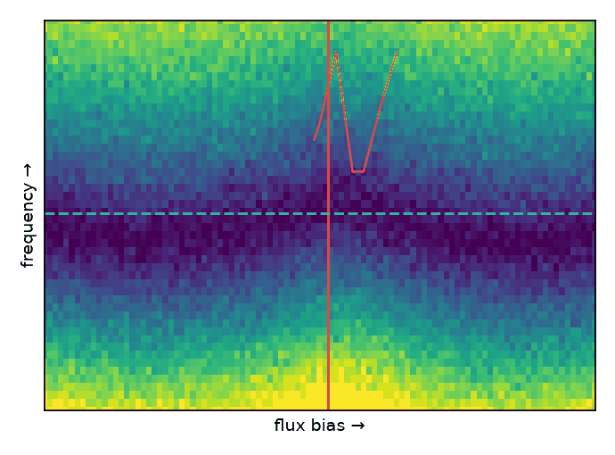

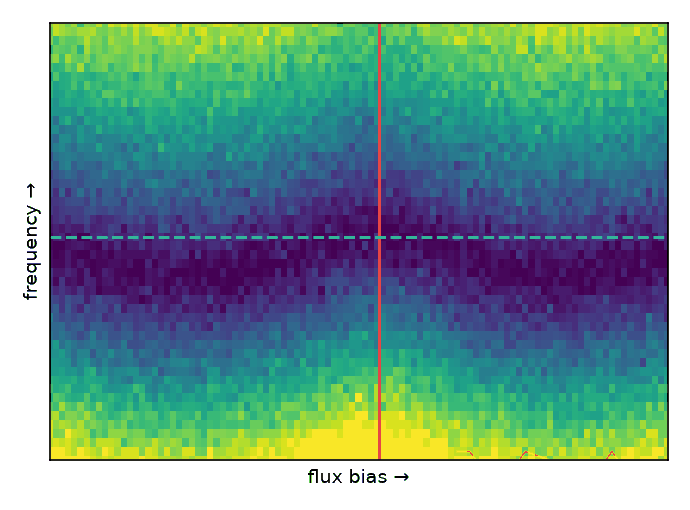

### C7 — near_flat_marginal_modulation  (seen 4x)

**Geometry:** The dip band is clean, thick and low-noise and the markers sit tightly inside it along an essentially horizontal line; the fitted curve carries a very shallow ripple — a slight dimple and a slight bump, or several short cycles — whose peak-to-peak height is no larger than the marker scatter and far smaller than the band thickness. Neither extremum can be picked out of the raw marker cloud by eye; the markers show no corresponding up-down alternation. Distinguished from a noisy map (C8) by the cleanliness of the band: the data are good, the effect is at or below the scatter floor.

**Prescription:** Do not adopt the offsets or the period from this figure alone. Widen the flux window 2-4x to bring multiple periods into view (this is what converts marginal ripple into a legible pattern), and only then narrow the frequency span ~2x. Adopt nothing until an immediate sibling taken with a different flux window AND a different frequency step reproduces the same extremum ORDERING at nearly the same flux positions — that cross-run predicate, not any single figure, is what separates weak-but-real from fit-to-noise. Doubling shots here is measured to change nothing.

**Exemplars:** lab-B/#298_07_resonator_spectroscopy_vs_coupler_flux_101333/q4-9, lab-B/#299_07_resonator_spectroscopy_vs_coupler_flux_101411/q4-9, lab-A/#309_07_resonator_spectroscopy_vs_coupler_flux_082718/coupler_q6_q7, lab-B/#258_07_resonator_spectroscopy_vs_coupler_flux_092731/q1-4

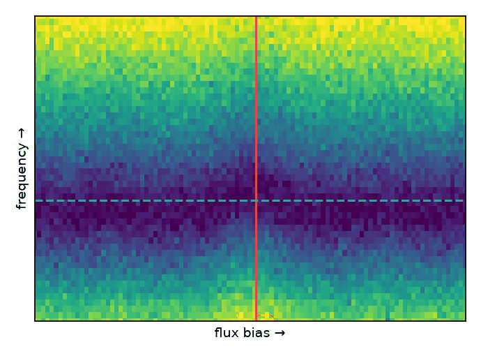
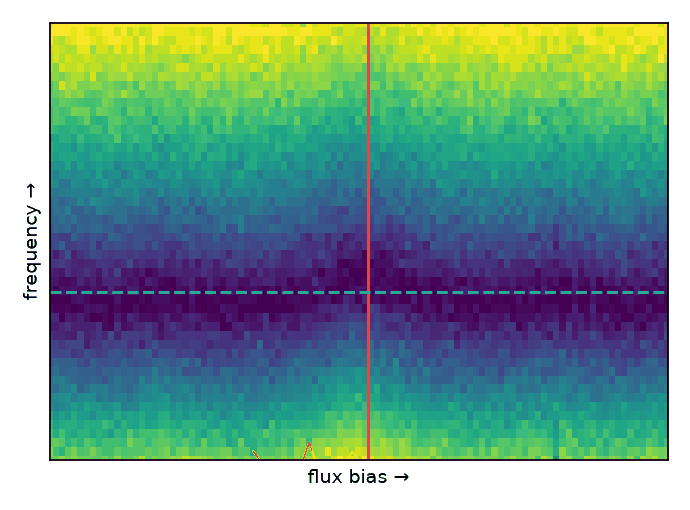

### C8 — R7_noisy_scattered_trace  (seen 0x)

**Geometry:** Reserved for the other half of the old R7: the dip band itself is broken, faint or intermittent, the marker cloud scatters by an appreciable share of the frequency window with markers jumping between rows in adjacent flux columns, and any fitted curve is threaded through disorder rather than through a stripe. The discriminator against C7 is the quality of the BAND, not the size of the swing — here the measurement is degraded; in C7 the measurement is good and the effect is small.

**Prescription:** Increase shots 2-4x and/or increase readout drive amplitude one step, and narrow the frequency span 2x to raise dip contrast, before any flux-axis change. Re-classify after the band is clean; a swing judged on a broken band is meaningless.

### C9 — R8_quantised_step_trace  (seen 1x)

**Geometry:** The extracted dip positions do not form a curve at all: they collapse onto two (occasionally three) discrete horizontal rows and lay out a rectangular staircase — short run at one row, long plateau at another, a step back — because the frequency step is coarser than the whole modulation depth. A sinusoid can still be threaded through the staircase and the phase can even be approximately right (plateaux in the correct order and roughly the right places), so the node reports success; but the markers fall inside plateaux rather than at any resolvable extremum, and the only geometric information about extremum location is where a plateau ENDS. Reported offsets carry precision the data cannot support.

**Prescription:** Reduce the frequency step by 3-5x so that at least 5-10 frequency points span the modulation depth, trading shots down if the budget requires it; keep the flux window unchanged so the result is comparable with the coarse sibling. Never adopt an offset from a two-row staircase, and never let its disagreement with a finer-step sibling be read as chip drift.

**Exemplars:** lab-A/#310_07_resonator_spectroscopy_vs_coupler_flux_083041/coupler_q6_q7

### C10 — R6_multi_period  (seen 2x)

**Geometry:** Two or more complete oscillations across the flux window: a central crest with a trough symmetrically placed on each side and the curve lifting again toward both extreme ends. The marker cloud supports the pattern — markers group lower around each trough and higher at the crest and the ends — even when the swing remains under the band thickness. The structural consequence is degeneracy: two or more troughs of equal depth are in view, so the reported minimum offset is a CHOICE between them and can land on opposite sides of zero in otherwise identical sibling runs without any physical contradiction.

**Prescription:** Adopt the period (this is the only geometry that constrains it well) and adopt the crest as the idle point. Never adopt the minimum offset as a unique parking point — either record all degenerate troughs, or re-run with the flux window narrowed ~2x around the single trough you intend to use. If the period is wanted more precisely, narrow the frequency span ~2x rather than adding shots.

**Exemplars:** lab-B/#312_07_resonator_spectroscopy_vs_coupler_flux_102441/q4-9, lab-B/#311_07_resonator_spectroscopy_vs_coupler_flux_102410/q4-9

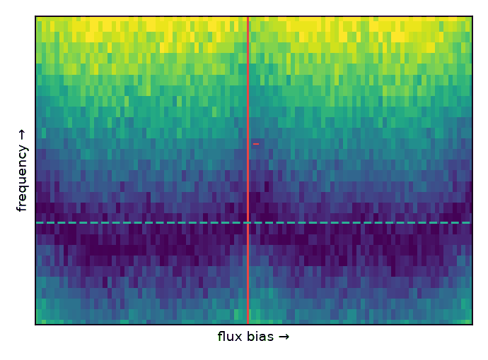

### C11 — R4_anticrossing  (seen 0x)

**Geometry:** The dip trace splits or bends sharply over a narrow flux interval: two branches approach, repel and exchange character, or a second branch crosses the frame and the tracked trace jumps between them. Distinguished from C15 by extent and structure — an anticrossing occupies a resolvable flux interval with a visible avoided gap, not one or two isolated columns. Not observed anywhere in this corpus; the wide-span exploratory runs were specifically taken to look for one and found none.

**Prescription:** Do not fit a sinusoid across the crossing. Narrow the flux window to ~1/3 around the crossing and increase flux point density 2-4x to resolve the gap, and widen the frequency span ~2x so both branches stay in frame; escalate to the two-tone / coupler-spectroscopy family for the interaction strength.

### C12 — R5_empty_no_resonance  (seen 0x)

**Geometry:** No trackable feature anywhere in the frame: no dip band, no ridge, only structureless background, so the marker series is meaningless in every flux column. Distinguished from C14 by the absence of any visible resonance — in C14 an obvious unfitted band sits elsewhere in the same frame.

**Prescription:** Widen the frequency span 3-5x around the stored resonator value to re-acquire the resonance, or increase readout drive amplitude one step; if still empty, escalate to a single-tone resonator spectroscopy on the same qubit before any further coupler-flux run.

### C13 — NEW:inverted_contrast_bright_ridge  (seen 4x)

**Geometry:** The resonator presents as a broad BRIGHT ridge spanning the full flux width with darker fields above and below, rather than as a dark dip. The ridge is straight and unbroken. A minimum-seeking extractor can never land on it: the markers ignore the ridge entirely and populate the dark fields or pin themselves to a frequency-window boundary, leaving the ridge bare of markers, and the fitted curve — which can be perfectly smooth, single-arch or many-cycle — never touches the visible feature. The map is fully readable by eye; it is the extractor's polarity assumption that fails, and the node still reports success.

**Prescription:** Do not re-run the same node hoping a narrower window helps — narrowing and widening were both tried here and neither helps, because the failure is polarity, not framing. Flip the extractor to seek maxima (or fit |S21| with inverted sign), or change the readout demodulation angle / drive amplitude one step so the feature reads as a dip, then re-classify. Every number from a bright-ridge run must be discarded, including the resonator frequency.

**Exemplars:** lab-B/#1174_07_resonator_spectroscopy_vs_coupler_flux_014604/q13-14, lab-B/#1177_07_resonator_spectroscopy_vs_coupler_flux_014920/q13-14, lab-B/#1176_07_resonator_spectroscopy_vs_coupler_flux_014759/q13-14, lab-B/#1175_07_resonator_spectroscopy_vs_coupler_flux_014702/q13-14

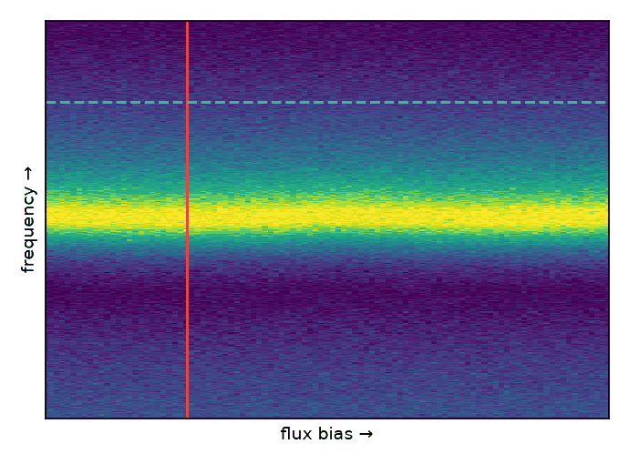
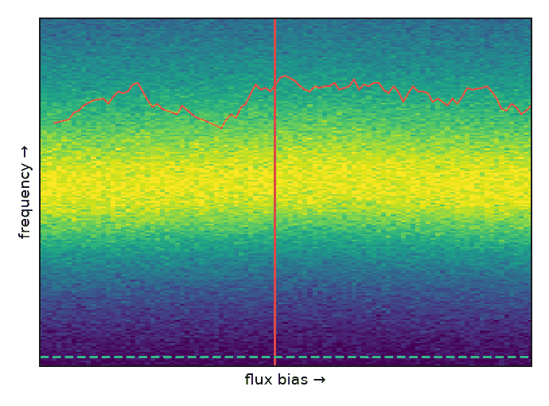

### C14 — NEW:edge_latched_spurious_fit  (seen 1x)

**Geometry:** A genuine resonance is unmistakable in the frame — a broad, dark, perfectly horizontal stripe continuous across the whole flux axis — while almost all extracted markers sit somewhere else, hugging the first or last row of the swept frequency window in the dim roll-off region, with only a stray marker or two on the real stripe. The fitted sinusoid oscillates rapidly ALONG that boundary, completing many periods with a swing far smaller than the true band's thickness, and the reported resonator frequency lands at the window boundary rather than on the visible stripe. Detectable with no absolute reference: fitted trace on an extreme row + an obvious unfitted band elsewhere + a period far shorter than the marker cloud supports.

**Prescription:** Reject the record entirely (frequency and offsets alike) and immediately re-frame: reduce the frequency span 2-4x and shift its centre onto the visible stripe, keeping the flux range fixed. This is a framing repair, not a physics question — the corrected sibling run recovers the resonance on the first attempt.

**Exemplars:** lab-B/#489_07_resonator_spectroscopy_vs_coupler_flux_182144/q3-8

### C15 — NEW:localised_column_discontinuity  (seen 2x)

**Geometry:** An otherwise smooth, well-fitted modulation (C1/C6 geometry) is interrupted by one or a few narrow flux columns where the dip positions step off the curve and a vertical discontinuity crosses the map — the column is visibly brighter or darker than its neighbours and its markers scatter to one side of the fit. Too localised in flux to be an avoided crossing, too structured and too repeatable in position to be called scatter. Often sits near a claimed extremum, where it directly biases the reported offset.

**Prescription:** Re-run with the flux window narrowed to a small interval bracketing the anomalous columns and the flux point density raised 2-4x, to decide whether the step resolves into a narrow avoided crossing or is a bias-line/TLS glitch. Exclude those columns from the sinusoid fit before adopting any offset; do not adopt an extremum that sits within a few columns of the discontinuity.

**Exemplars:** lab-A/#230_07_resonator_spectroscopy_vs_coupler_flux_195913/coupler_q6_q7, lab-A/#16_07_resonator_spectroscopy_vs_coupler_flux_042946/coupler_q6_q7

### C16 — NEW:asymmetric_window_one_sided_period  (seen 1x)

**Geometry:** The swept flux window is deliberately pushed much further to one side than the other, so the geometric centre of the plot is NOT the centre of the physics. Typically only the extended side carries the extra turning point: a crest near the plot's left, a trough far right of it, a second crest further right again. The fit is well conditioned and returns a period, but every extremum on the extended side lies outside the symmetric window used by sibling runs, so no sibling can confirm it.

**Prescription:** Accept the period as the session's working value but immediately schedule one confirmation run whose window is symmetric about the newly-claimed extremum (roughly the extended side's span, re-centred), not about zero. Never compare an extremum from an asymmetric window against a symmetric sibling as if the two covered the same physics; note the asymmetry in the record.

**Exemplars:** lab-A/#16_07_resonator_spectroscopy_vs_coupler_flux_042946/coupler_q6_q7

### C17 — NEW:sub_period_coverage_phase_unconstrained  (seen 1x)

**Geometry:** The fitted period is comparable to or larger than the entire swept flux range, so less than one full oscillation is covered and the sinusoid's phase is unconstrained. The visible trace shows no curvature at all; the fit is a straight line on it; and the drawn max and min markers fall near the two OPPOSITE ENDS of the narrowed range, roughly symmetric about its centre. This is the classic degenerate solution of a sinusoid fitted to a flat line over less than a period, and is what the fitter falls back to whenever there is no signal — a returned period of the order of the swept range should therefore never be read as a measured coupler period.

**Prescription:** Widen the flux window by 2-3x until at least 1.5 fitted periods are covered, holding the frequency framing fixed; if the trace is still straight at that width, re-classify as C4 and run the bias-line control. Refuse the record's offsets outright — extrema at the two ends of the range are a fit artefact, not a measurement.

**Exemplars:** lab-B/#493_07_resonator_spectroscopy_vs_coupler_flux_182834/q3-8

## Flags (orthogonal to map geometry)

A flag can sit on ANY case.

### F1 — fit_centred_off_the_visible_feature  (seen 6x)

**Signature:** The fitted curve and the visible resonance never touch: an obvious continuous band (dark or bright) crosses the frame while the marker series and the magenta curve live somewhere else entirely — in the noise floor, in the dark field beside the band, or along a window boundary — separated from the band by several band thicknesses. Can sit on any nominal case, because the shape the fit describes has nothing to do with the shape in the picture.

**Prescription:** Reject every scalar in the record, including the resonator frequency. Re-frame: reduce frequency span 2-4x and recentre on the visible band; if the feature is a bright ridge, flip the extractor polarity instead. Never re-run the identical settings.

**Exemplars:** lab-B/#489_07_resonator_spectroscopy_vs_coupler_flux_182144/q3-8, lab-B/#1174_07_resonator_spectroscopy_vs_coupler_flux_014604/q13-14, lab-B/#1176_07_resonator_spectroscopy_vs_coupler_flux_014759/q13-14

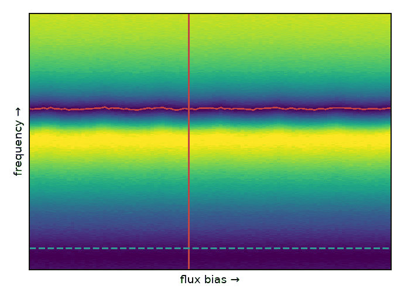

### F2 — markers_pinned_to_frequency_window_boundary  (seen 3x)

**Signature:** The extracted marker series becomes a thin, almost continuous line lying exactly on the first or last row of the swept frequency window, so the 'measured' resonator frequency is a property of the sweep bounds rather than of the chip. Often accompanied by a shallow single hump or a fast ripple fitted along that boundary.

**Prescription:** Automatic reject, no interpretation. Recentre the frequency window on the actual feature and reduce its span 2-4x; add a pipeline guard that refuses any fit whose markers occupy an extreme row across most of the flux axis.

**Exemplars:** lab-B/#1177_07_resonator_spectroscopy_vs_coupler_flux_014920/q13-14, lab-B/#489_07_resonator_spectroscopy_vs_coupler_flux_182144/q3-8, lab-B/#1174_07_resonator_spectroscopy_vs_coupler_flux_014604/q13-14

### F3 — extrema_unsupported_by_visible_modulation  (seen 12x)

**Signature:** The record asserts an idle offset and a minimum offset at specific flux values while the map is uniform at those columns — the trace looks identical there and everywhere else. The two extrema are always exactly half the returned period apart, so the output is internally self-consistent and completely unfalsifiable from the figure. This is what a sinusoid fitter emits on a flat map; it is the single most common defect in the corpus.

**Prescription:** Never consume an offset without first checking that the map curves by more than the marker scatter. Report such fields as unset rather than as numbers; if a value is genuinely needed, widen the flux window 2-4x and re-measure.

**Exemplars:** lab-B/#1225_07_resonator_spectroscopy_vs_coupler_flux_024116/q14-15, lab-B/#494_07_resonator_spectroscopy_vs_coupler_flux_183045/q3-8, lab-B/#446_07_resonator_spectroscopy_vs_coupler_flux_171915/q1-4, lab-B/#298_07_resonator_spectroscopy_vs_coupler_flux_101333/q4-9

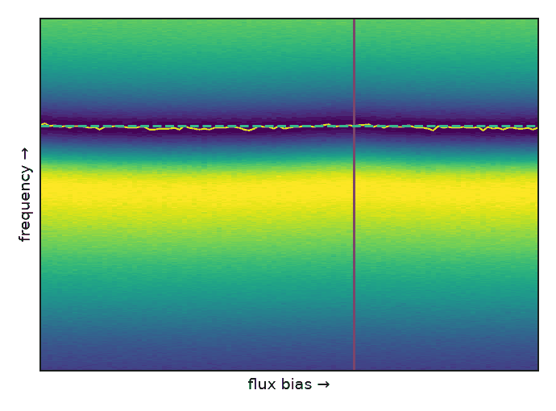

### F4 — fitted_period_of_the_order_of_the_swept_range  (seen 9x)

**Signature:** The returned period is a substantial fraction of, equal to, or larger than the whole swept flux range, so at most one oscillation is nominally covered and the extrema are placed by extrapolation. This is the fitter's degenerate fallback on featureless data and appears on every flat map in the corpus.

**Prescription:** Treat a period of this order as 'period not identifiable', never as a measured coupler period. Widen the flux window until at least 1.5-2 fitted periods fit inside it before the period is allowed to enter any record or downstream calculation.

**Exemplars:** lab-B/#1271_07_resonator_spectroscopy_vs_coupler_flux_041455/q14-18, lab-B/#1238_07_resonator_spectroscopy_vs_coupler_flux_030255/q10-15, lab-B/#493_07_resonator_spectroscopy_vs_coupler_flux_182834/q3-8

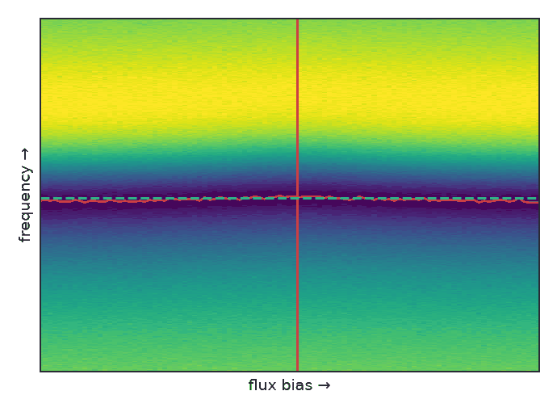

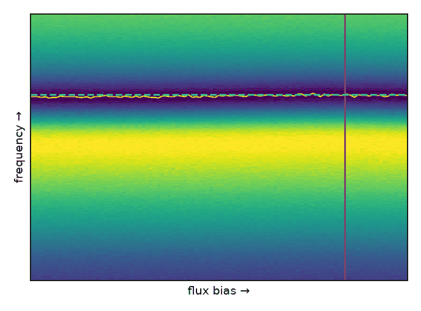

### F5 — harmonic_ambiguity_period_flips_between_siblings  (seen 4x)

**Signature:** Back-to-back runs on the same target at the same or similar windows return periods differing by roughly a factor of two (or worse, a factor of four and again a factor of two), while the crest position stays put. The faster-rippling fit shows several short cycles that the marker cloud does not follow. A set-level defect: each individual figure can look acceptable.

**Prescription:** Do not average or arbitrate between the periods. Widen the flux window 2-4x so that multiple periods are unambiguously in view, and adopt the period only from that run; record 'period not identifiable' for the earlier siblings.

**Exemplars:** lab-B/#299_07_resonator_spectroscopy_vs_coupler_flux_101411/q4-9, lab-B/#1175_07_resonator_spectroscopy_vs_coupler_flux_014702/q13-14, lab-B/#1176_07_resonator_spectroscopy_vs_coupler_flux_014759/q13-14

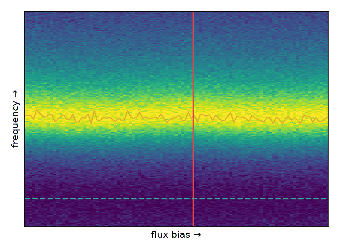
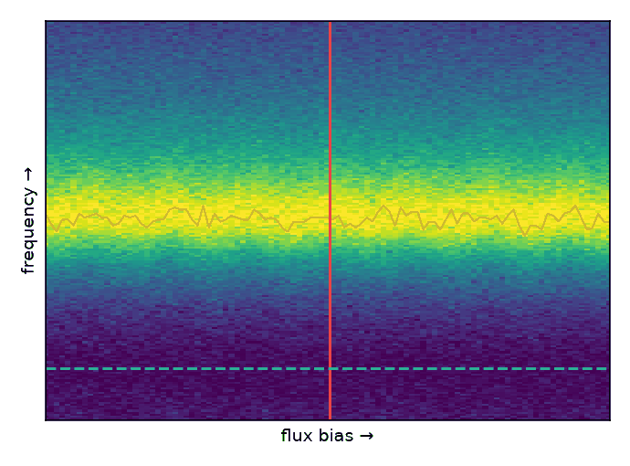

### F6 — degenerate_extrema_min_offset_not_unique  (seen 5x)

**Signature:** Once a full period or more is in view, two (or more) troughs of equal depth sit symmetrically about the crest, and the drawn minimum marker lands on one of them arbitrarily; an otherwise identical sibling run picks the mirror trough, so the reported minimum offset flips sign between runs with no physical change. The map is fine; the scalar simply is not unique.

**Prescription:** Adopt the crest, not the trough, as the single-valued parking point; or record the full set of degenerate minima. If one trough must be chosen, re-run with the flux window narrowed ~2x around the intended trough so the choice is made by the sweep, not by the fitter.

**Exemplars:** lab-B/#312_07_resonator_spectroscopy_vs_coupler_flux_102441/q4-9, lab-B/#311_07_resonator_spectroscopy_vs_coupler_flux_102410/q4-9, lab-B/#259_07_resonator_spectroscopy_vs_coupler_flux_092808/q1-4

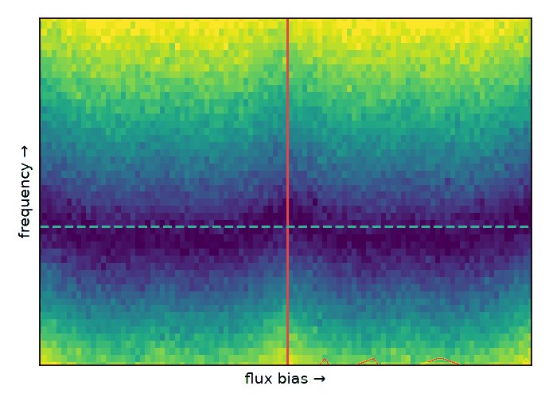

### F7 — success_reported_on_an_unusable_fit  (seen 7x)

**Signature:** The node declares success and fills every field on a figure where the fitted curve never touches the data, or where no resolvable curvature exists at all. The defect is the absence of a rejection criterion in the pipeline: nothing notices that the fit is not on the resonance, or that the trace is quantised to two rows, or that the markers lie on a window edge.

**Prescription:** Add a pre-adoption gate independent of the fitter's own residual: require the marker series to lie on the same band as the visible feature, to be off both frequency-window boundary rows, and to show a peak-to-peak swing exceeding the marker scatter. Escalate any run failing the gate to a re-frame rather than to a write.

**Exemplars:** lab-B/#1174_07_resonator_spectroscopy_vs_coupler_flux_014604/q13-14, lab-B/#489_07_resonator_spectroscopy_vs_coupler_flux_182144/q3-8, lab-A/#310_07_resonator_spectroscopy_vs_coupler_flux_083041/coupler_q6_q7

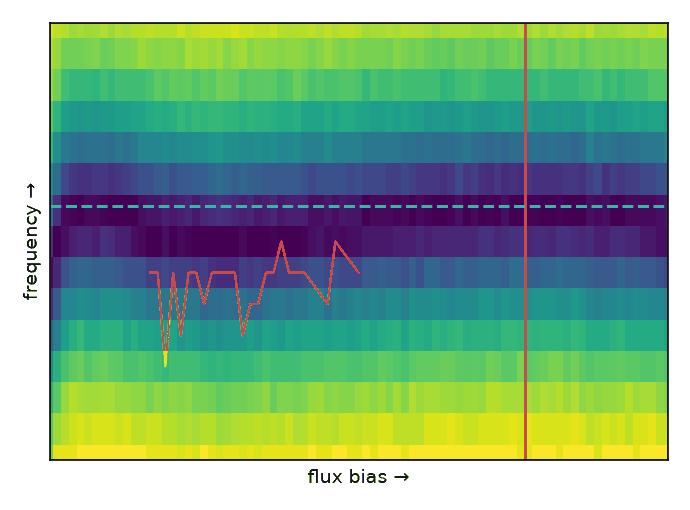

### F8 — resonance_near_window_edge_flank_clipped  (seen 2x)

**Signature:** The fit is on the real feature, but the feature sits close to a boundary of the frequency window: the field on one side of the band is only a thin sliver, so one flank is cut off. Different from F2 — the extracted line is the resonance, not the boundary — but it is exactly the geometry that degrades into F2 if the sweep is repeated without recentring, and a slightly deeper coupler push would be cropped out of view.

**Prescription:** Recentre the frequency window on the band (shift centre, keep or slightly widen span) before the next run on this target; do not deepen the flux sweep until the band is centred.

**Exemplars:** lab-B/#1248_07_resonator_spectroscopy_vs_coupler_flux_031541/q9-10, lab-B/#295_07_resonator_spectroscopy_vs_coupler_flux_101121/q4-5

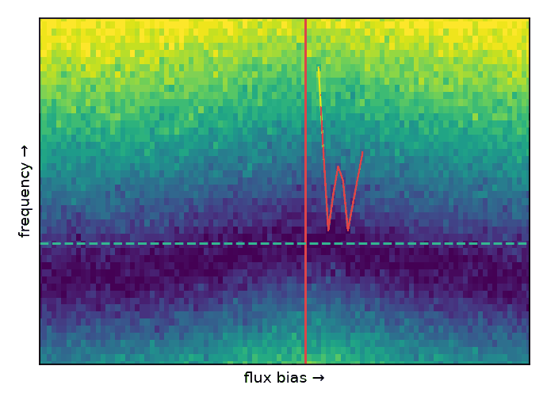

### F9 — frequency_window_moved_to_a_different_resonator_band  (seen 2x)

**Signature:** Two runs seconds apart under the SAME target label have their frequency windows centred on different resonator bands; each map can be individually clean and even textbook-quality, and the recorded frequency shift of one is an order of magnitude larger than every other run of that target. Invisible to any per-map shape classifier — the defect is one of identity/targeting, visible only by comparing the frequency axes of siblings.

**Prescription:** Before pooling, differencing or trending any two records of one target, compare the frequency window centres. Where they differ by more than a band width, treat the runs as different observables and refuse to combine them; re-run the intended band explicitly.

**Exemplars:** lab-A/#230_07_resonator_spectroscopy_vs_coupler_flux_195913/coupler_q6_q7, lab-A/#229_07_resonator_spectroscopy_vs_coupler_flux_195856/coupler_q6_q7

### F10 — cross_session_operating_point_drift  (seen 3x)

**Signature:** The same coupler measured hours or a day apart yields individually clean, individually correct maps whose extracted idle offset lands on the OPPOSITE side of zero, with the resonator's own centre frequency also moved. No single figure is anomalous; the sequence is. A per-run classifier cannot see it.

**Prescription:** Never pool or average records from different sessions of this family without first checking the figure's frequency band and the sign of the claimed offset. On detecting a sign flip across sessions, re-measure both the resonator centre and the arch in one fresh run before adopting anything; treat the older record as describing a different chip state.

**Exemplars:** lab-A/#229_07_resonator_spectroscopy_vs_coupler_flux_195856/coupler_q6_q7, lab-A/#309_07_resonator_spectroscopy_vs_coupler_flux_082718/coupler_q6_q7, lab-A/#20_07_resonator_spectroscopy_vs_coupler_flux_043518/coupler_q6_q7

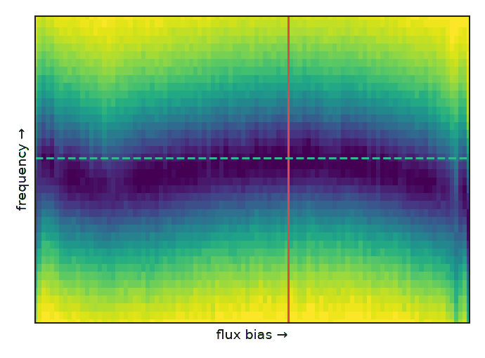
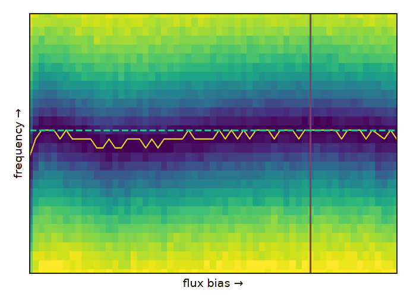
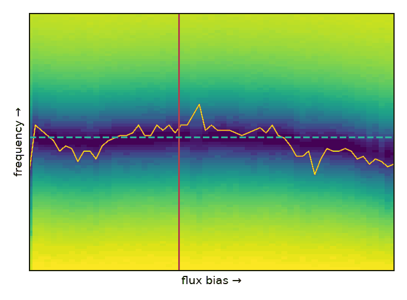

### F11 — sibling_disagreement_on_period_or_extremum  (seen 6x)

**Signature:** Consecutive runs on one target, minutes apart, report mutually incompatible periods or opposite-sign frequency shifts; or one run's period places a minimum inside a flux span that the very next run sweeps and finds no trough in. Each figure is internally consistent with its own fit, so the contradiction exists only at the set level.

**Prescription:** Escalate: run one arbitration measurement whose flux window is wide enough to contain the disputed extremum with margin (2-3x the disputed separation), at the finest frequency step of the group. Until then adopt neither value. Check F13 first — a control/target switch is a legitimate cause of apparent disagreement.

**Exemplars:** lab-A/#16_07_resonator_spectroscopy_vs_coupler_flux_042946/coupler_q6_q7, lab-A/#17_07_resonator_spectroscopy_vs_coupler_flux_043043/coupler_q6_q7, lab-B/#1175_07_resonator_spectroscopy_vs_coupler_flux_014702/q13-14

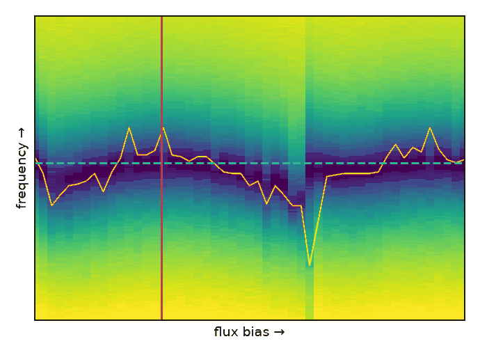
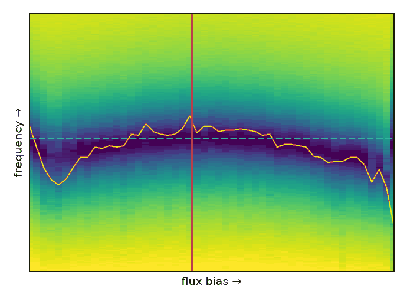

### F12 — precision_reported_beyond_what_the_data_localises  (seen 3x)

**Signature:** The record states extremum positions to full numeric precision while the figure localises them only to the width of a broad flat crest, or to the width of a quantisation plateau. Symptom: repeats of the same target under tighter windows and more shots scatter the claimed offset by a sizeable fraction of that flat region, and the scatter does not shrink with added shots.

**Prescription:** Attach an uncertainty of order the flat-top / plateau width to every offset from a broad or quantised extremum, and gate adoption on that uncertainty rather than on the fitter's formal error. If better precision is needed, change conditioning (narrow the frequency step, widen the flux window to bring in the second turning point) — never add shots.

**Exemplars:** lab-A/#18_07_resonator_spectroscopy_vs_coupler_flux_043402/coupler_q6_q7, lab-A/#310_07_resonator_spectroscopy_vs_coupler_flux_083041/coupler_q6_q7, lab-A/#20_07_resonator_spectroscopy_vs_coupler_flux_043518/coupler_q6_q7

### F13 — measure_qubit_switch_masquerading_as_disagreement  (seen 3x)

**Signature:** Two runs on the same pair label report resonator frequencies differing by far more than any drift could explain — and that is CORRECT, because the node's measure_qubit parameter selected the control in one and the target in the other, so the two runs watch different resonators. Conversely, several different pair labels in one session can all resolve to a single qubit's resonator, making them directly comparable measurements of different couplers on one observable.

**Prescription:** Read measure_qubit (and resolve pair label -> watched qubit) before flagging any sibling disagreement or before treating two records as independent. Group records by the WATCHED RESONATOR, not by the pair label, when surveying which couplers move what.

**Exemplars:** lab-B/#1226_07_resonator_spectroscopy_vs_coupler_flux_024527/q14-15, lab-B/#1225_07_resonator_spectroscopy_vs_coupler_flux_024116/q14-15, lab-B/#294_07_resonator_spectroscopy_vs_coupler_flux_101018/q3-4

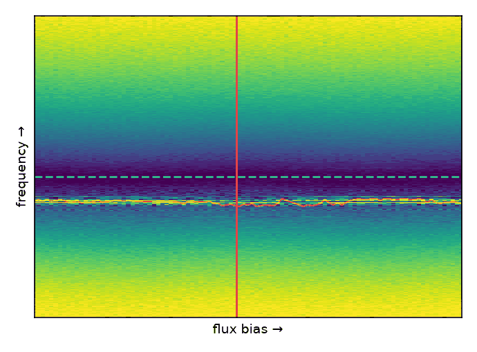

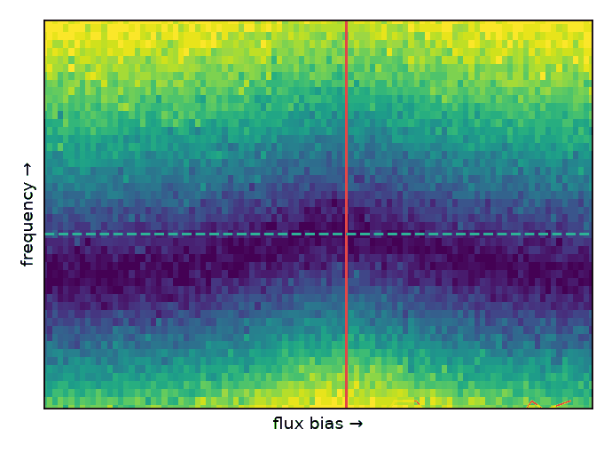

### F14 — frequency_shift_misread_as_modulation_depth  (seen 5x)

**Signature:** The record's frequency_shift is the distance from the STORED resonator value (a re-centring against a possibly stale reference), not the depth of any flux modulation and not a quantity comparable between runs. Symptom: a large shift on a figure whose band is dead straight, or a shift that changes by orders of magnitude between two siblings whose maps look the same, purely because the stored reference changed in between.

**Prescription:** Never read frequency_shift as coupler strength and never difference it across runs. If modulation depth is wanted, take it from the fitted peak-to-peak swing on the figure. Refresh the stored reference before interpreting a large shift as physics.

**Exemplars:** lab-B/#297_07_resonator_spectroscopy_vs_coupler_flux_101237/q4-5, lab-A/#230_07_resonator_spectroscopy_vs_coupler_flux_195913/coupler_q6_q7, lab-B/#494_07_resonator_spectroscopy_vs_coupler_flux_183045/q3-8

### F15 — survey_mode_success_that_never_reached_the_chip  (seen 22x)

**Signature:** Every run in a batch reports success while update_flux_min is False and patches are empty — 'successful' means only 'a curve was fitted', not 'a calibration was accepted'. Whole sessions in this corpus are of this kind, so a reader who trusts the success flag will over-trust a set of numbers nothing ever validated against the chip.

**Prescription:** Display survey vs calibration mode alongside the outcome in every record view, and never let a survey-mode success arm an adoption. Nothing in this family should be written to state from a run whose own node declined to write.

**Exemplars:** lab-B/#311_07_resonator_spectroscopy_vs_coupler_flux_102410/q4-9, lab-B/#1225_07_resonator_spectroscopy_vs_coupler_flux_024116/q14-15, lab-B/#494_07_resonator_spectroscopy_vs_coupler_flux_183045/q3-8

### F16 — extremum_at_the_edge_of_the_swept_flux_range  (seen 2x)

**Signature:** A drawn extremum marker sits essentially against the left or right boundary of the swept flux axis, so its position is set by where the sweep stopped rather than by any turning of the trace. Frequently paired with F4 (period of the order of the range).

**Prescription:** Refuse the value as extrapolated. Widen the flux window by at least 1.5x on that side and re-measure; only an extremum with visible curvature on BOTH sides of it is adoptable.

**Exemplars:** lab-B/#1271_07_resonator_spectroscopy_vs_coupler_flux_041455/q14-18, lab-B/#493_07_resonator_spectroscopy_vs_coupler_flux_182834/q3-8

### F17 — averaging_applied_to_a_conditioning_limit  (seen 2x)

**Signature:** Shots are doubled between siblings and the figure is visibly unchanged: the crest is no sharper, the ripple no more legible, the marker scatter about the same relative to a swing that is set by coupling strength or by the flatness of a broad extremum. The limit is conditioning (flat top, sub-linewidth swing, coarse frequency step), not noise.

**Prescription:** Redirect the budget: narrow the frequency step, narrow the frequency span around the band, add flux points, or widen the flux window to bring a second turning point in. Treat 'more shots changed nothing' as positive evidence that the effect is weak-but-real rather than noisy.

**Exemplars:** lab-A/#18_07_resonator_spectroscopy_vs_coupler_flux_043402/coupler_q6_q7, lab-B/#299_07_resonator_spectroscopy_vs_coupler_flux_101411/q4-9

### F18 — second_unmodelled_flux_independent_trace_in_window  (seen 1x)

**Signature:** A second, fainter horizontal streak lies near the fitted trace, also flux-independent and also straight — a neighbouring resonator, a spurious mode or a readout artefact. Harmless when the fitter stays on the right band, but it is the standing hazard for a minimum-seeking extractor, which can latch onto it in a noisier or less-contrasted repeat.

**Prescription:** Record the presence of the second trace with the run. Where it is within a few band widths of the fitted one, narrow the frequency span so it leaves the frame, or constrain the extractor to a band around the stored resonator value, before trusting repeats.

**Exemplars:** lab-B/#1226_07_resonator_spectroscopy_vs_coupler_flux_024527/q14-15

### F19 — flat_verdict_recorded_without_its_frequency_zoom  (seen 2x)

**Signature:** A 'flat / no modulation' conclusion is stored with no record of the frequency span it was read at. The same target over the same flux range reads as a coherent arch at a tight zoom and as a dead-straight line at a wide one, in the same session — so the verdict alone carries no information.

**Prescription:** Always store the frequency span (and step) alongside a flat verdict and refuse to consume a flat verdict taken at a span many times the chip's typical modulation. Re-read at a 3-10x tighter span before the verdict is allowed to close a target.

**Exemplars:** lab-B/#446_07_resonator_spectroscopy_vs_coupler_flux_171915/q1-4, lab-B/#259_07_resonator_spectroscopy_vs_coupler_flux_092808/q1-4

### F20 — no_control_that_the_coupler_bias_reached_the_chip  (seen 7x)

**Signature:** Several or all pairs in one pass return dead-straight traces. One flat coupler is ordinary second-order physics on a tunable-coupler chip; six flat couplers in one pass is also exactly what a dead or mis-addressed bias line looks like, and nothing inside any of the figures distinguishes the two.

**Prescription:** On the second flat pair in a pass, stop surveying and run an out-of-figure control: the qubit-flux node on the same physical line, or a coupler bias setting known to move a different observable. Carry the ambiguity explicitly in the record instead of letting a flat map imply physics.

**Exemplars:** lab-B/#1238_07_resonator_spectroscopy_vs_coupler_flux_030255/q10-15, lab-B/#1248_07_resonator_spectroscopy_vs_coupler_flux_031541/q9-10, lab-B/#1271_07_resonator_spectroscopy_vs_coupler_flux_041455/q14-18

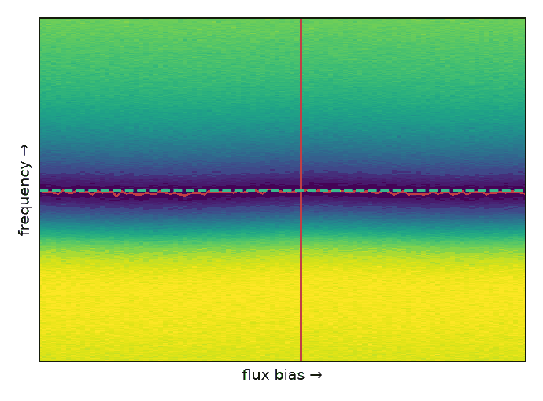
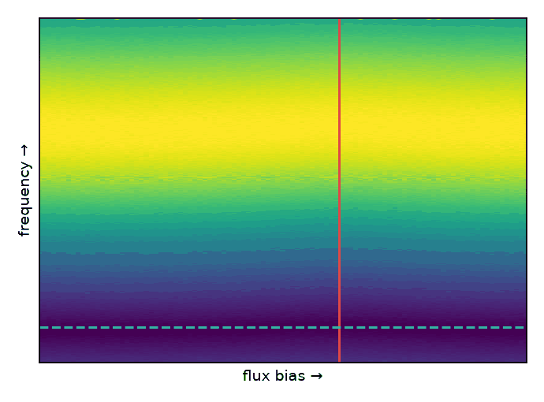

### F21 — refusal_of_a_readable_figure  (seen 0x)

**Signature:** The node declines and leaves every field unset on a map that does contain a fittable feature (visible curvature exceeding the marker scatter, both extrema interior). The inverse of F7. Not observed in this corpus — the one refusal here was correct, on a genuinely featureless map.

**Prescription:** Re-run once with the flux window unchanged and the frequency span narrowed ~2x to raise contrast; if the refusal repeats on a visibly curved trace, treat it as an extractor defect (check polarity, F-band constraint) rather than as a chip statement.

### F22 — partial_record_is_the_correct_outcome_not_a_defect  (seen 5x)

**Signature:** The node reports success with an idle offset while leaving period and minimum offset unset. On a single-turning-point arch this is the honest, complete answer and must not be read as a defective or truncated record; the missing fields state that one extremum was in the window.

**Prescription:** Consume the idle offset, refuse to synthesise the missing period, and if the period is needed schedule a widening run (2-4x flux window) rather than re-running the same settings hoping the fields fill.

**Exemplars:** lab-A/#15_07_resonator_spectroscopy_vs_coupler_flux_042919/coupler_q6_q7, lab-A/#19_07_resonator_spectroscopy_vs_coupler_flux_043434/coupler_q6_q7

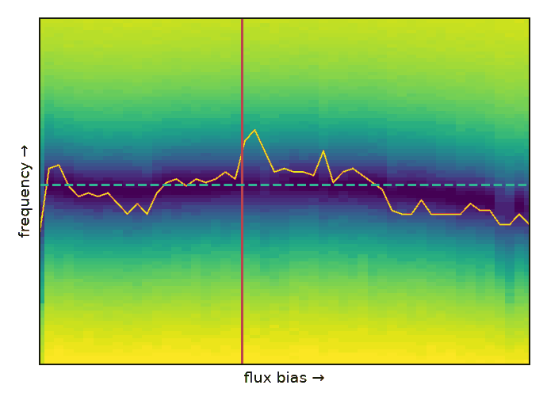

## Rules

### RU-1 — Two yardsticks decide every verdict

Never judge a modulation in absolute terms. Compare the fitted peak-to-peak swing against TWO things visible in the same frame: (a) the point-to-point scatter of the dip markers, and (b) the vertical thickness of the dip band. swing > scatter and swing > band thickness = C1, adopt. swing > scatter but < band thickness = C6, adopt the crest with a stated uncertainty — this is the family's NORMAL case, not a defect. swing <= scatter = C7/C4, adopt nothing on the flux axis. This single comparison is chip-independent and is what the draft's R1/R2/R7 split failed to express.

### RU-2 — An offset is adoptable only from visible curvature on both sides

A flux offset may be written only if the trace visibly turns within the swept window with curvature on BOTH sides of the extremum, the swing exceeds the marker scatter, and the extremum sits away from both flux-axis boundaries. Extrema placed by extrapolation (F16), extrema half a period apart on a straight line (F3), extrema inside a quantisation plateau (C9), and extrema at the ends of a sub-period sweep (C17) are never adoptable, regardless of the node's success flag.

### RU-3 — A period of the order of the swept range is not a period

If the returned period is comparable to, equal to, or larger than the whole flux range, record 'period not identifiable' and refuse the value. The period is adoptable only when at least one full oscillation — preferably two — is visible in the marker cloud, not merely in the fitted curve. A period that changes by a factor of two or more between back-to-back siblings is a fit on noise (F5), and neither value may be used.

### RU-4 — Weak is the expected answer; refuse the map only for measurable reasons

On a coupler, the resonator's excursion is expected to be small next to its own linewidth — a shallow but coherent arch is physics, not failure. The evidence that it is physics is smoothness across neighbouring flux columns plus reproduction of the extremum ORDERING and placement by a sibling taken with a DIFFERENT flux window and a DIFFERENT frequency step. That cross-run predicate — not any single figure — is the discriminator between weak-but-real and fit-to-noise, so a calibration loop must be able to schedule and compare the sibling, and must record the comparison with the verdict.

### RU-5 — A flat verdict is meaningless without its frequency zoom and its flux width

Never record 'this coupler does not move this resonator' from (a) the session's narrowest flux window, or (b) a frequency span many times any modulation the chip shows elsewhere. Both produce identical dead-straight pictures from opposite causes, and both are disproved in this corpus by a sibling on the same target. A flat verdict must carry the frequency span, the frequency step and the flux width it was read at, and must survive one 3-5x flux widening and one 2-4x frequency narrowing before it closes a target.

### RU-6 — On the second flat pair, stop and prove the bias reached the chip

One flat coupler is ordinary second-order physics; a whole pass of flat couplers is indistinguishable from a dead or mis-addressed bias line, and no figure in this family can separate the two. After the second consecutive flat pair, the loop must run an out-of-figure control on the same physical line (the qubit-flux node, or a bias setting known to move another observable) before recording any of the flat results as physics. Until that control exists, the records carry the ambiguity explicitly.

### RU-7 — Gate on the figure, not on the fitter's residual

Before any adoption, require: the marker series lies on the same band as the visible feature; the markers are not pinned to the first or last row of the frequency window; there is resolvable curvature (more than two distinct frequency rows across the modulation); and the swing exceeds the marker scatter. Every catastrophic record in this corpus — edge-latched fits, bright-ridge fits, two-row staircases — passed the node's own success test and fails this gate. The node's 'successful' is not evidence.

### RU-8 — Contrast polarity is an assumption, and it fails

The extractor seeks minima. When the resonator presents as a bright ridge, the extractor cannot ever land on it and will fit the noise floor or a window edge while reporting success, and no amount of window narrowing or widening helps. The loop must detect polarity from the figure (is the flux-independent structure darker or brighter than its surroundings?) and either flip the extractor or change the readout demodulation/drive before re-running. Every scalar from a wrong-polarity run, including the resonator frequency, is discarded.

### RU-9 — Group records by the watched resonator, never by the pair label

The unit of the record is a pair, but the observable is one qubit's readout resonator, selected by the node's measure_qubit parameter. Several pair labels in one session can resolve to one resonator (making them a comparable survey of different couplers on one observable), and two runs on ONE pair label can watch two different resonators (making an apparent frequency disagreement correct). Resolve pair -> watched qubit before flagging any sibling disagreement, before pooling, and before trending.

### RU-10 — frequency_shift is a re-centring, not a coupling strength

The record's frequency_shift is fitted-minus-stored resonator frequency. It changes when the stored reference changes, it can be large on a perfectly straight band, and it can differ by orders of magnitude between two siblings whose maps are identical. It must never be read as modulation depth, never differenced across runs, and never used to rank couplers. Modulation depth comes from the fitted peak-to-peak swing on the figure.

### RU-11 — Never pool records across sessions without checking the frequency band

The same coupler's claimed idle offset moves from one side of zero to the other between sessions, and the resonator's own centre moves with it. Two runs seconds apart under one target label can even be centred on different resonator bands, in which case their numbers are not comparable at all. Before averaging, differencing or trending, compare the frequency window centres and the session boundary; where either differs, treat the records as describing different chip states and re-measure instead.

### RU-12 — Precision follows conditioning, not shots

A broad flat crest, a sub-linewidth swing and a coarse frequency step are all conditioning limits: doubling the shots is measured here to change nothing visible. When precision is insufficient, move the knobs that change conditioning — narrow the frequency step (at least 5-10 points across the modulation depth), narrow the frequency span onto the band, add flux points, or widen the flux window to bring in the second turning point. Report every offset with an uncertainty of order the flat-top or plateau width, and gate adoption on that, not on the fitter's formal error.

### RU-13 — Degenerate minima: adopt the crest, or narrow the sweep to choose

Once a full period is in view there are two or more equally deep troughs and the reported minimum offset is a choice between them; identical siblings legitimately return opposite signs. Downstream consumers must never treat min_offset as a unique parking point. Either adopt the crest (single-valued), or record the full degenerate set, or re-run with the flux window narrowed around the intended trough so the sweep — not the fitter — makes the choice.

### RU-14 — A partial record is a complete answer; an asymmetric window is a declared one

Success with an idle offset and unset period/minimum is the correct outcome of a single-turning-point arch and must not be treated as a defective record or repaired by synthesising the missing fields. Symmetrically, when a window is deliberately pushed to one side to hunt a second turning point, the geometric centre of the plot is not the centre of the physics: record the asymmetry, and never compare an extremum found on the extended side against a symmetric sibling as if both had covered it.

### RU-15 — Survey success is not calibration; nothing is written without an accepted write

In this corpus every run with update_flux_min False and empty patches still reports 'successful', meaning only that a curve was fitted. A calibration loop must display survey vs calibration mode next to the outcome, must never let a survey-mode success arm an adoption, and must never write a coupler flux offset that the producing node itself declined to write.

### RU-16 — Widen flux first, tighten frequency second

The observed successful escalation order in both labs is: (1) if flat or single-arch, widen the flux window 2-5x, asymmetrically if one flank is still descending; (2) once a turning point or period is legible, narrow the frequency span 2-4x onto the band and/or increase flux point density; (3) only then consider shots. Frequency step must never be coarsened as a trade for shots — that is what produced the corpus's one quantised-staircase record. Re-check window centring against the visible band after any span change.

## What the reader reports, and which case it means

The reader measures shapes and returns a semantic signal; this table is where that meets the manual's own vocabulary.

| reader signal | case |
|---|---|
| `curve_arch_vertex_inside` | C2 |
| `curve_broken_ridge` | C15 |
| `curve_empty` | C12 |
| `curve_flat_no_response` | C3 |
| `curve_full_swing` | C1 |
| `curve_monotonic_vertex_outside` | C17 |
| `curve_multi_period` | C10 |
| `curve_partial_ridge` | C7 |

A flat map is mapped to the window-limited case, not to the genuinely-flat one: the two look identical and only the second claims physics, so the reader takes the reading whose prescription is to look again.

## Exemplar images

Axes are NORMALISED and UNLABELLED: no absolute frequency, power or flux leaves this pack, and a picture without numbers cannot teach an absolute scale (Clause B). Orientation follows the labs' own convention: frequency rightwards, the swept quantity upwards. Overlays: orange = the tracked feature, cyan dashed and magenta dotted = the record's own frequency claims, red = the sweep value it chose. Markers are the RECORD's claims, drawn even when they contradict the map — that contradiction is the lesson in the mislabelled and off-feature cases. Whether the feature is a dip or a peak is MEASURED per run, because the readout rotation decides it and it differs between labs.

## Cross-lab evidence

SCOPE CAVEAT FIRST: the task framing says five labs and chips, but the annotations carry exactly TWO lab identifiers across the three batches — lab-A (12 runs, all one coupler, coupler_q6_q7, across four sessions) and lab-B (22 runs over ~11 pair labels, on at least two distinct chips/campaigns: the 2026-08-16 daytime q1-4/q3-4/q4-5/q4-9/q3-8 survey and the overnight q13-14/q14-15/q10-15/q9-10/q14-18 pass). Everything below is a two-lab comparison; any claim of five-lab universality would be unsupported by this evidence.

WHAT IS INVARIANT (chip- and lab-independent, and therefore safe to build the taxonomy on):
- The plot idiom is identical: flux on x, frequency on y, an amplitude map with a flux-independent band, extracted dip markers, a magenta fitted sinusoid, and two dashed vertical lines for max and min. Every geometric case in this manual is expressed in that idiom alone.
- The dominant physics is the same in both labs: the resonator's flux excursion is SMALLER than its own dip-band linewidth. C6 (sub-linewidth coherent modulation) and C2 (single broad arch) are the normal shapes in lab-A and in lab-B alike; C1 with the curve dominating the band appears once per lab at most and is the exception.
- The fitter's degenerate behaviour is identical in both labs: on a featureless map it emits an idle offset and a minimum offset exactly half a returned period apart, with the period of the order of the swept flux range, and reports success. Same signature, different chips, different sessions.
- The escalation reflex is the same in both labs and is the strongest cross-lab regularity in the corpus: when a map reads flat, the operator WIDENS. lab-A widened the flux window (#14 -> #15) and lab-B widened the flux window (#295 -> #297, #299 -> #311); lab-B also widened the frequency span (#258 -> #446, #489). Both directions of widening appear in both labs.
- 'Success' means 'a curve was fitted' in both labs. Empty patches / update_flux_min False were observed across whole lab-B sessions and no adoption occurred anywhere in the corpus.
- frequency_shift is fitted-minus-stored in both labs, and is misleading in both.
- Broad-crest non-localisation is lab-independent: added shots failed to sharpen an extremum in lab-A (#18) and failed to lift a ripple in lab-B (#299).

WHAT DIFFERED (and must not be generalised):
- Sampling strategy. lab-A is one coupler chased intensively — seven runs in ten minutes, then revisits at +15 h and +28 h, with the flux window as the primary knob and deliberate asymmetric windows. lab-B is a breadth survey — one or a few runs per pair, marching across the couplers around a qubit at fixed settings, with the frequency span as the primary knob. Consequently lab-A supplies the cross-session-drift and asymmetric-window evidence and lab-B supplies the cross-pair-flatness and framing-failure evidence; neither lab alone would have produced this taxonomy.
- Target labelling. lab-A names the coupler directly (coupler_q6_q7); lab-B names the PAIR (q1-4, q13-14) and selects the watched qubit through measure_qubit. The pair-label/observable trap (RU-9, F13) is a lab-B convention, not a family property — a loop that assumes 'target = coupler' will mis-group lab-B records, and one that assumes 'target = pair, resolve via measure_qubit' will over-think lab-A ones.
- Contrast polarity. Bright-ridge resonators (C13) appear only in the lab-B overnight q13-14 series. Every lab-A figure and every other lab-B figure shows a dark dip. So 'the resonator is a dark dip' looked universal and is NOT — it is a per-chip/per-readout-configuration fact, and it is the single assumption whose failure produced four consecutive worthless records in minutes.
- Framing failures. Edge-latched fits (C14) and markers pinned to a window boundary (F2) occur only in lab-B, where the very wide exploratory frequency spans are used. lab-A's tighter spans never produced one. This is a consequence of the lab's sweep convention, not of the chip.
- Instrumental quantisation. The two-row staircase (C9) occurs once, in lab-A, and arose from a deliberate shots-for-step trade. It is a knob-choice defect that any lab can reproduce.
- Flatness prevalence. lab-B's overnight pass is flat on six consecutive pairs; lab-A's single coupler always curves once the window is wide enough. The 'all couplers are flat' pattern is therefore a property of that lab-B chip/pass, and is exactly the pattern that requires the RU-6 bias-line control before it may be called physics.
- Multi-period visibility. Only lab-B reached clean two-period maps (#311/#312), because only lab-B opened the flux range that far on a coupler whose swing was legible. lab-A obtained a period only via an asymmetric one-sided push.

LOOKED UNIVERSAL, ISN'T — the explicit warnings: (1) 'the resonator shows as a dark dip' (lab-B q13-14 disproves it); (2) 'the target label names the coupler' (lab-B pair labels + measure_qubit disprove it); (3) 'a flat map means the coupler does not couple' (both labs disprove it, from opposite causes — narrow flux window in lab-A, wide frequency span in lab-B); (4) 'a big frequency_shift means a strong coupler' (it is a stale-reference re-centring in both labs); (5) 'sibling disagreement means one run is wrong' (a measure_qubit switch in lab-B makes it correct); (6) 'more shots improve the number' (refuted in both labs).

## Open questions

1. Weak vs absent: the corpus cannot separate 'this coupler genuinely does not push this resonator' from 'the coupler bias never reached the chip', and one lab-B pass is flat on six consecutive pairs. What is the accepted out-of-figure control — the qubit-flux node on the same bias line, a known-good coupler bias setting, or a room-temperature line check — and at what point in a survey must the loop stop and run it?
2. What is the expected second-order coupler-to-readout push on a tunable-coupler chip of this design, expressed as a fraction of the resonator linewidth? Without that number, 'sub-linewidth swing is normal physics' (C6) rests on the corpus's own consistency rather than on theory, and a genuinely dead coupler could hide inside the case.
3. How should the two-yardstick threshold in RU-1 be operationalised numerically — what multiple of the marker scatter, and what fraction of the band FWHM, marks the boundary between C6 (adopt the crest) and C7 (adopt nothing)? The annotations describe this comparison qualitatively and every borderline verdict in the corpus was marked confidence 'med'.
4. Should the family's node be changed to REFUSE rather than report success when its own markers are not on the visible band, when they sit on a frequency-window boundary row, when fewer than N distinct frequency rows span the modulation, or when the fitted period exceeds the swept range? Every catastrophic record here passed the node's success test.
5. Is polarity-agnostic extraction the right fix for the bright-ridge case (fit whichever extremum the band presents), or should the readout configuration be corrected so the resonator always reads as a dip? The first is cheap and general; the second keeps one assumption true chip-wide.
6. When a full period is in view, which trough should be the canonical minimum offset — nearest zero, nearest the previous session's value, or should min_offset be deprecated in favour of the crest plus the period? The corpus shows identical siblings choosing mirror troughs and reporting opposite signs.
7. Across sessions the same coupler's idle offset changed sign and its resonator centre moved. Is that genuine chip drift (retuning, thermal cycle, bias history), a change of flux quantum branch, or a bookkeeping/reference change? The answer determines whether cross-session records may ever be trended at all.
8. What flux-step density and frequency-step resolution should be mandated per run so that a period is identifiable and a crest is localisable, given that shots are demonstrably the wrong currency here? Concretely: how many frequency points must span the expected modulation depth, and how many flux points per expected period?
9. Should this node's flux offsets ever be adoptable automatically, or is the family survey-only by policy — the coupler idle point being set instead by the two-qubit-gate or coupler-spectroscopy families, with this node reduced to a diagnostic that reports resonator frequency plus a qualitative coupling verdict?
10. One lab-B run's frequency window moved to a different resonator band between two runs seconds apart under the same target label. Was that an operator retune, a stored-value change, or a node/parameter defect? It determines whether F9 needs an automatic guard or only a comparison rule.
11. Are the localised single-column discontinuities (C15) narrow avoided crossings, TLS, or bias-line glitches? They sit near claimed extrema and therefore bias adopted offsets, and the corpus has no run dense enough in flux to resolve them.
12. Where multiple pair labels resolve to one watched resonator, should the survey record be keyed by (coupler, watched resonator) rather than by pair, and should the loop deliberately measure both control and target resonators for each coupler as standard?

## Fit-vs-figure disagreements

- lab-B/#489_07_resonator_spectroscopy_vs_coupler_flux_182144/q3-8 — the real resonance is a broad dark horizontal stripe in the upper map, yet nearly all markers hug the bottom boundary of the frequency window and the fitted sinusoid ripples along that boundary through many periods; the reported resonator frequency lands at the window edge, the claimed shift is large while the visible band does not move at all, and only two stray markers touch the true stripe.
- lab-B/#493_07_resonator_spectroscopy_vs_coupler_flux_182834/q3-8 — the record asserts a maximum and a minimum at specific flux values on an image that is uniform everywhere: a dead-straight dark line with no curvature, marker scatter uniform along its length, and a fitted period comparable to the entire narrowed sweep, so the extrema fall near the two opposite ends of the range purely as the degenerate solution of a sinusoid fitted to a flat line over less than one period.
- lab-B/#1174_07_resonator_spectroscopy_vs_coupler_flux_014604/q13-14 — the only structure is a bright ridge, which the minimum-seeking extractor cannot reach: the markers form two clouds (one on the upper window boundary, one in the dark field below) leaving the ridge bare, and the fitted single-arch cosine crests several ridge thicknesses ABOVE the ridge, so the reported resonator frequency lies on a phantom crest and the reported shift contradicts the two same-pair siblings minutes later.
- lab-B/#1175_07_resonator_spectroscopy_vs_coupler_flux_014702/q13-14 — halving the frequency span did not help because the failure is polarity: the bright band is flat and unmarked while every marker sits in the unstructured dark cloud below it, and the fitted curve threads that cloud through several complete cycles with an amplitude no larger than the scatter; the returned period is roughly a quarter of the immediately preceding run's on the same pair.
- lab-B/#1176_07_resonator_spectroscopy_vs_coupler_flux_014759/q13-14 — at four times the flux width the bright band is still perfectly straight and still bare of markers; the fit degenerated further into dozens of identical fine cycles across the range whose peak-to-peak height is a small part of the marker scatter it lies in, and the two extremum lines collapse onto nearly the same flux column.
- lab-B/#1177_07_resonator_spectroscopy_vs_coupler_flux_014920/q13-14 — zooming in converted the noise cloud into a hard edge artefact: the markers form a thin continuous line jammed against the LOWER boundary of the frequency window, far below the still-straight bright band, and the fitted curve lies along that boundary with one shallow hump, so the reported resonator frequency is a property of the sweep bounds rather than of the chip — the fourth mutually inconsistent value for this pair inside four minutes.

## Blind verification

5/5 agree. I classified each figure from the image first and then cross-checked with an independent dip-trace extraction from ds_raw.h5 (per-flux amplitude minimum plus a weighted centroid, sinusoid fit at the recorded dv_phi0, amplitude compared against both the dip-position scatter and the frequency step); every visual call survived the numbers. The set splits cleanly into one resolved-but-shallow oscillation (#16, amp 0.30 MHz at 6x the frequency resolution, 1.7 periods), two clean flats (#493, #1226 — sharp dips that do not move, amp/resid <= 1.5), and two marginal cases in between. On the prompt's physics question: for 07 the weak/absent modulation is the correct physics in all four non-R1 runs, not a failed measurement — the coupler reaches these readout resonators only indirectly, and #309 proves it by being the SAME coupler as #16 measured at 4x coarser frequency steps over less than one period, where a real ~0.6 MHz peak-to-peak effect necessarily disappears. The one place this labeling could legitimately drift is the #309 (R7) vs #298 (NEW:near_flat_marginal_modulation) boundary: both are statistically marginal (amp/resid 1.2 and 0.7), and they are separated only by which failure is visually dominant — per-pixel noise plus sub-resolution steps in #309, versus a clean dip carrying a visible-but-unproven wave in #298. I would keep both labels but define the split explicitly on 'is the fitted amplitude below one frequency step' (#309 yes, #298 no), otherwise future runs will get sorted inconsistently. Separate from case assignment, three of the five records carry fit outputs their figures do not support — most starkly #493, whose frequency_shift reads 7.80 MHz on a map where the dip is immobile — so any gate consuming frequency_shift/idle_offset/min_offset on R2 or near-flat runs is reading noise as physics.