# resonator_spectroscopy_vs_flux — case manual (v1)

**Authored:** 2026-08-21 · **Source:** docs/131: 46 runs / 150 targets across 4 labs (AS_10TQ9TC, CQT, IQCC_QOP37, SNU_1Q), every figure viewed; blind re-classification 8/10

This file and `cases.json` are generated from ONE source. Geometry and prescription language is chip-independent by rule: relative positions, shapes and bounded knob moves only — never absolute frequencies, powers or fluxes, and never a size expressed as a fraction of the swept window.

**Physics.** Readout-resonator spectroscopy repeated across a flux sweep. The resonator frequency modulates with flux through the qubit's own flux dispersion, so the dip traces a smooth periodic curve. The labs plot flux horizontally and frequency vertically.

## Map cases

### C1 — Single extremum, sub-period window  (seen 28x)

**Geometry:** One continuous dip band crosses the whole flux axis unbroken. It bows into exactly one rounded turning point (usually a maximum) somewhere inside the window and falls away toward BOTH sweep boundaries without ever turning back. No second turning point of the opposite sense exists anywhere in the panel. The fit, where drawn, lies on the darkest pixels along the entire trace and the max-offset marker stands on the crest; no min-offset marker is drawn.

**Prescription:** The apex is adoptable as it stands; the period is not. If the period is wanted, extend the flux range by ~50-100% on ONE side only — the side that is still descending — keeping step density and frequency window fixed, until a trough enters. Do not widen the frequency span; the band never left it.

**Exemplars:** IQCC_QOP37/#435_06_resonator_spectroscopy_vs_flux_223530/qC5, IQCC_QOP37/#297_06_resonator_spectroscopy_vs_flux_050441/qD4, CQT/#328_02e_resonator_spectroscopy_vs_flux_qdac_114336/q3, CQT/#257_06_resonator_spectroscopy_vs_flux_092518/q4, IQCC_QOP37/#12_06_resonator_spectroscopy_vs_flux_000728/qA2

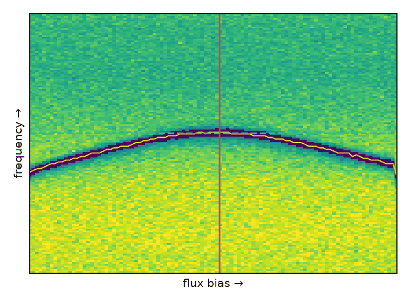
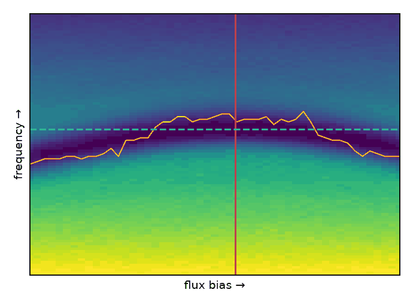

### C2 — Full swing — apex and trough both inside the window  (seen 60x)

**Geometry:** One continuous dip band showing a rounded maximum AND a rounded minimum inside the swept flux range, i.e. roughly one full modulation contained in the panel. The band is thin relative to its own vertical excursion, the fit overlays the darkest pixels along the whole length, the max-offset marker sits on the crest and the min-offset marker in the trough. Often asymmetric: one flank turns comfortably inside the panel while the other only just flattens near a boundary.

**Prescription:** Sweep settings are adequate; do not widen anything. Repeat once at identical settings and require the crest position to reproduce to within a small fraction of the arch width before adopting. If the trough marker sits within roughly the outermost tenth of the flux axis, extend that side of the flux range by ~30% and re-run before trusting any period-derived quantity.

**Exemplars:** AS_10TQ9TC/#308_06_resonator_spectroscopy_vs_flux_082351/q6, AS_10TQ9TC/#228_06_resonator_spectroscopy_vs_flux_195719/q5, IQCC_QOP37/#435_06_resonator_spectroscopy_vs_flux_223530/qD2, SNU_1Q/#18_06_resonator_spectroscopy_vs_flux_181825/q17, AS_10TQ9TC/#13_06_resonator_spectroscopy_vs_flux_042601/q6

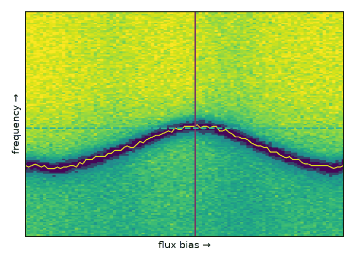

### C3 — Multi-period window  (seen 8x)

**Geometry:** More than one full modulation across the flux axis: at least two turning points of each sense, alternating at even spacing, with the band continuous and of roughly constant thickness edge to edge. The fit rides the band through every turning point without drifting off at any of them.

**Prescription:** This is the only shape that genuinely pins the period; keep it as the period reference. For the operating point, narrow the flux range by ~2-3x around the chosen crest at the same step count to localize the apex, rather than adopting an apex read off a compressed multi-period panel.

**Exemplars:** SNU_1Q/#109_06_resonator_spectroscopy_vs_flux_012344/q17, SNU_1Q/#9_06_resonator_spectroscopy_vs_flux_173425/q17, SNU_1Q/#9_06_resonator_spectroscopy_vs_flux_173425/q10, SNU_1Q/#7_06_resonator_spectroscopy_vs_flux_162458/q3

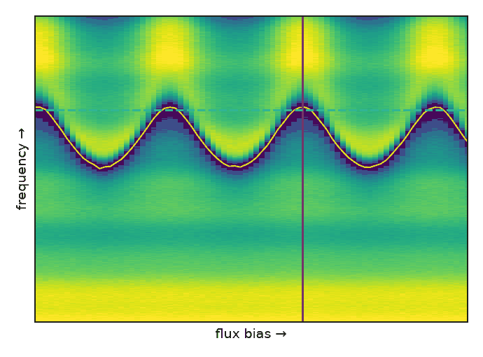
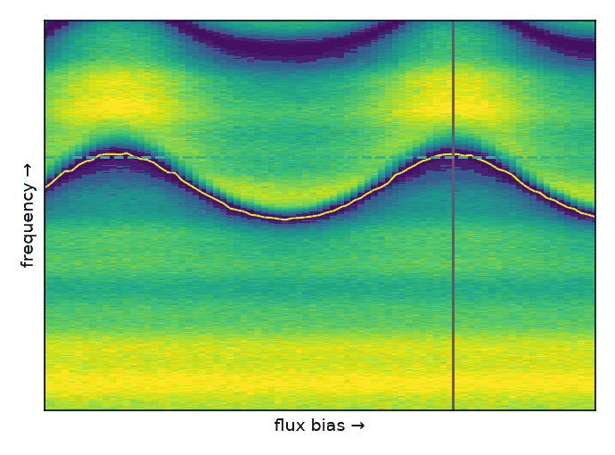

### C4 — Monotonic across the window — extremum outside  (seen 0x)

**Geometry:** The dip band rises or falls monotonically from one flux boundary to the other with no turning point anywhere in the panel and no flattening at either edge. Curvature may be visible but never reverses.

**Prescription:** Extend the flux window by ~50% in the direction the band is heading, keeping step density; if still monotonic after one such extension, double the range once at half the flux-point density as a coarse survey before spending shots. Never report an offset from this shape — any extremum is an extrapolation.

### C5 — Shallow modulation — excursion comparable to the band's own linewidth  (seen 14x)

**Geometry:** A continuous, fully traced dip band that is curved in the same sense along its whole length, but whose total vertical excursion between the crest and the sweep boundaries is comparable to or smaller than the thickness of the band itself. The crest is broad and flat-topped rather than a point, so its flux position is weakly localized. Neighbouring panels in the same figure typically show the same curvature sense with several times the excursion.

**Prescription:** Widen the flux range by ~2x before adding shots — more curvature per window is cheaper than more averaging. If the excursion is still not several times the band linewidth after one doubling, double the shots once. If the band itself remains thick, escalate to a readout retune (drop readout amplitude a few dB, re-centre the readout frequency) rather than repeating this sweep.

**Exemplars:** IQCC_QOP37/#523_06_resonator_spectroscopy_vs_flux_133555/qC2, IQCC_QOP37/#537_06_resonator_spectroscopy_vs_flux_002252/qC1, IQCC_QOP37/#524_06_resonator_spectroscopy_vs_flux_140428/qC1, CQT/#239_02e_resonator_spectroscopy_vs_flux_qdac_083002/q1, SNU_1Q/#18_06_resonator_spectroscopy_vs_flux_181825/q6

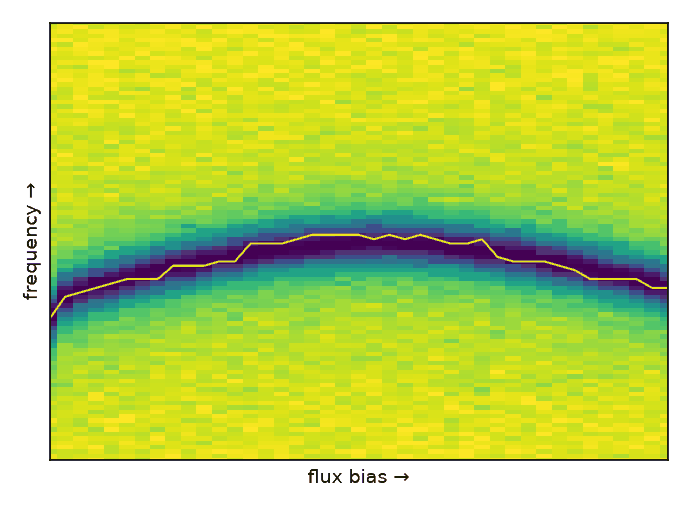

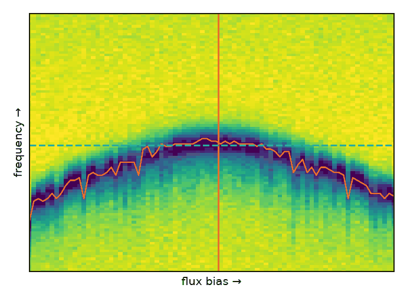

### C6 — Level trace with a shallow reproducible bump  (seen 3x)

**Geometry:** The extracted dip trace is level across most of the flux axis, then executes one smooth, systematic rise-and-fall over a limited stretch — an excursion far shallower than a normal arch and typically located where sibling panels of the same figure place their crest. Frequently a bright, high-amplitude plume cuts upward through the band over exactly that stretch, so the excursion may be the tracker following the plume's edge rather than the resonance.

**Prescription:** Neither accept nor refuse from this map. Re-run once at identical settings: if the bump reproduces at the same flux, narrow the frequency span ~2x around the band to raise contrast and drop the readout amplitude a few dB to suppress the plume. If the plume survives, escalate to a readout power sweep at fixed flux. Compare against the same target's neighbouring sessions before concluding the response is absent.

**Exemplars:** AS_10TQ9TC/#330_06_resonator_spectroscopy_vs_flux_093400/q8, AS_10TQ9TC/#331_06_resonator_spectroscopy_vs_flux_093544/q8, AS_10TQ9TC/#332_06_resonator_spectroscopy_vs_flux_093652/q8

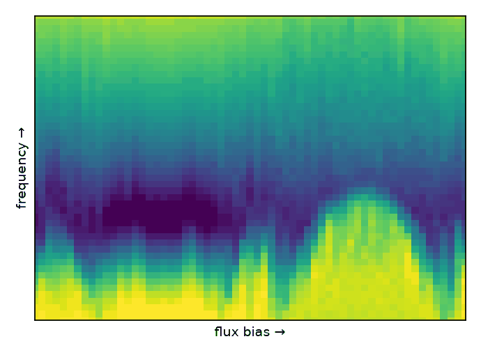

### C7 — Genuinely flat — sharp band, no motion, acquisition noise present  (seen 4x)

**Geometry:** A well-contrasted, frequency-localized dip band runs horizontally from one flux boundary to the other with no rise, fall or curvature. Column-to-column pixel noise IS present, and the marker scatter about the constant level is a small part of the band's own thickness. Other bands in the panel, if any, are equally horizontal.

**Prescription:** Widen the flux range by ~3x at coarser flux steps (same total acquisition time) once; if still flat, widen the frequency span ~5x to confirm the tracked band is the intended resonance rather than a neighbour. Only after BOTH a range change of ≥3x and a span change of ≥3x may a no-flux-response verdict be recorded, and it must be recorded as bounded by those ranges.

**Exemplars:** CQT/#324_02e_resonator_spectroscopy_vs_flux_qdac_113514/q3, CQT/#238_02e_resonator_spectroscopy_vs_flux_qdac_082551/q1

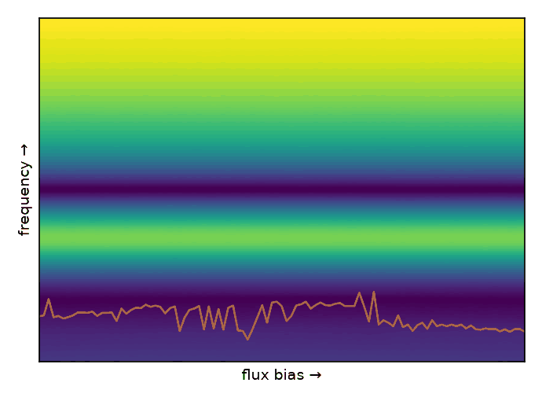
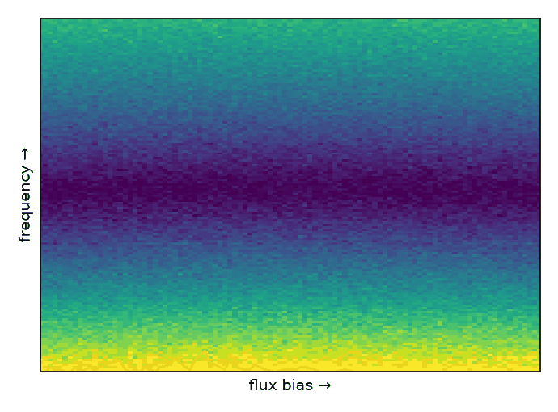

### C8 — Degenerate identical columns — zero acquisition variance  (seen 5x)

**Geometry:** The map carries no column-to-column variation whatsoever: every flux column is the same smooth vertical profile, there is no visible pixel noise anywhere, and the extracted markers lie on a mathematically straight line with no scatter at all. Nothing in the image differs between the two flux boundaries. Distinguishable from ordinary flatness by the ABSENCE of noise, and decisive when a panel from the same multiplexed acquisition is visibly noisy.

**Prescription:** Stop sweeping this target — no knob on this node will help. Treat as an instrumentation check: verify the bias source output, its trigger/enable and the channel wiring. Confirm by re-running one map with the flux range changed by ≥4x (a real flat resonator still shows shot noise varying column to column) and one multiplexed alongside a known-noisy neighbour.

**Exemplars:** CQT/#241_02e_resonator_spectroscopy_vs_flux_qdac_083427/q3, CQT/#275_02e_resonator_spectroscopy_vs_flux_qdac_094428/q3, CQT/#245_02e_resonator_spectroscopy_vs_flux_qdac_084043/q3, CQT/#274_02e_resonator_spectroscopy_vs_flux_qdac_094338/q3

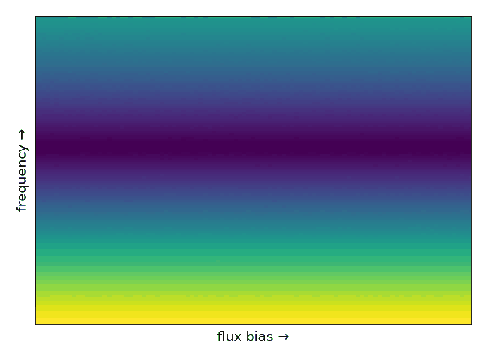
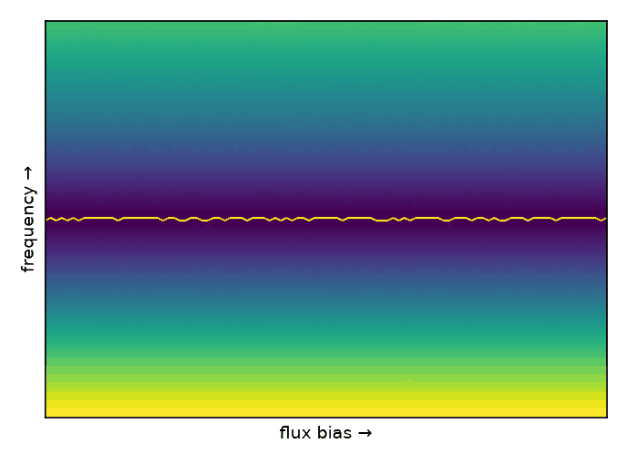

### C9 — Two curved bands — extractor hops between branches  (seen 15x)

**Geometry:** Two or more dip bands share the frequency window and both visibly bow with flux. The extracted markers do not follow one band: they occupy the upper band over some stretches of flux and the lower band over others, switching where the bands approach each other, so the marker chain is two or more disjoint segments at different heights rather than one continuous curve. Because a chain alternating between branches has a nearly constant mean, this geometry systematically masquerades as flatness while the panel shows unmistakable curvature.

**Prescription:** Never accept, and never record a flat verdict, from this map. Narrow the frequency span ~2x centred on the band carrying the deepest contrast so the second band falls outside the window, keeping the flux range fixed, and re-run. If both bands must stay in view, pin band ownership explicitly before extraction. Turning multiplexing off does not help — verified — so do not spend a run on it.

**Exemplars:** SNU_1Q/#9_06_resonator_spectroscopy_vs_flux_173425/q11, SNU_1Q/#18_06_resonator_spectroscopy_vs_flux_181825/q5, SNU_1Q/#25_06_resonator_spectroscopy_vs_flux_184132/q6, SNU_1Q/#26_06_resonator_spectroscopy_vs_flux_185020/q15

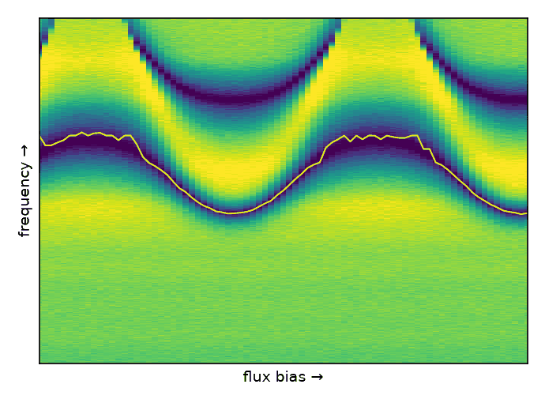

### C10 — Two flat bands — extractor hops between static branches  (seen 1x)

**Geometry:** Two dip bands of similar depth run side by side across the whole flux axis, both perfectly horizontal, separated by a bright band; neither shows curvature or tilt. The markers alternate between the two, forming two interleaved horizontal rows rather than one trace. Pixel noise is often comparable to the bands' own contrast.

**Prescription:** Two independent faults: fix the trace first, then the physics. Narrow the frequency span to isolate one band, then widen the flux range ~3x to test whether the isolated band moves at all. Do not report a period or an offset, and do not record no-flux-response until one band has been owned and swept over a range ≥3x this one.

**Exemplars:** CQT/#325_02e_resonator_spectroscopy_vs_flux_qdac_113737/q5

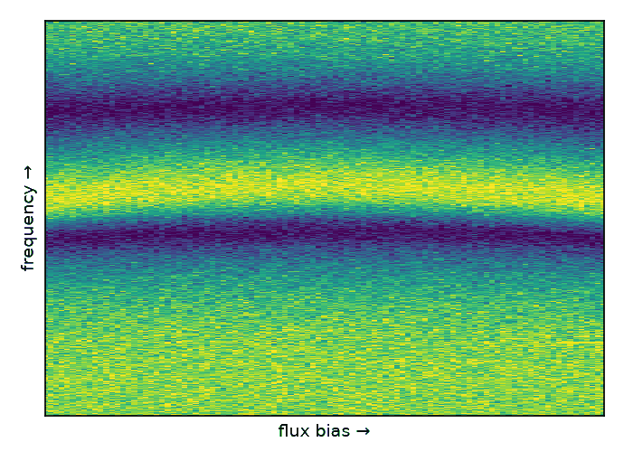

### C11 — Modulation deeper than the frequency window  (seen 3x)

**Geometry:** The band's excursion exceeds the swept frequency span: it appears as arcs that enter and exit through the top (or bottom) of the panel, visible only near its turning points and near the frame edges, with broad featureless lobes in between. Markers exist only over the stretches where the band is inside the frame. The extremum IS inside the flux window — it is the frequency axis that is too short, not the flux axis.

**Prescription:** Widen the frequency span by ~3-5x at the same flux range and step. If that is unaffordable, halve the flux range instead so less excursion is demanded of the window. Do NOT add shots — the data is strong wherever it is visible. Refuse any offset read from a flux where the band is off-panel.

**Exemplars:** SNU_1Q/#7_06_resonator_spectroscopy_vs_flux_162458/q7, SNU_1Q/#7_06_resonator_spectroscopy_vs_flux_162458/q1, SNU_1Q/#7_06_resonator_spectroscopy_vs_flux_162458/q8

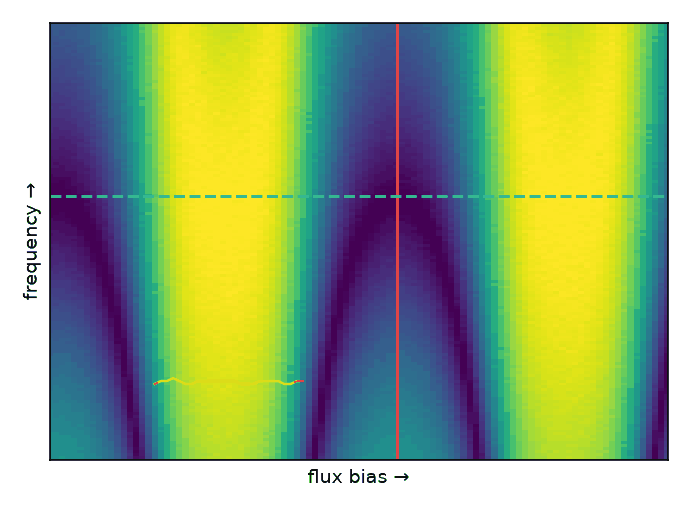

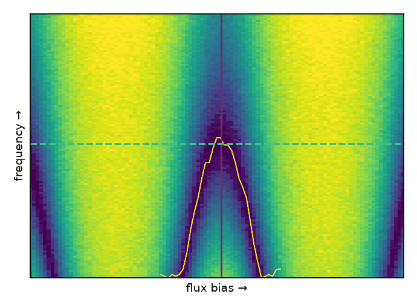

### C12 — Mis-centred frequency window — only a flank is in view  (seen 2x)

**Geometry:** Intensity trends monotonically toward one edge of the frequency axis and the dark region runs off that edge; no closed dip minimum exists inside the window, only the resonance's flank. Markers scatter thickly through the flank, often with contiguous gaps, and any apparent hump is smaller than the marker-to-marker scatter.

**Prescription:** Shift the frequency window centre by roughly the distance from the window edge to the visible flank and widen the span ~2x; leave the flux range untouched. Never record flat or no-flux-response from this shape — there is no dip inside the window whose motion could be judged.

**Exemplars:** CQT/#331_02e_resonator_spectroscopy_vs_flux_qdac_115446/q5, CQT/#242_02e_resonator_spectroscopy_vs_flux_qdac_083524/q5

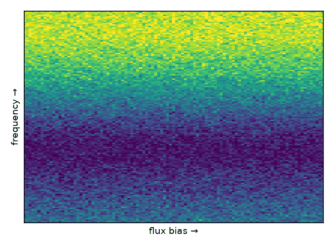

### C13 — Empty window — no feature, intensity trending to an edge  (seen 1x)

**Geometry:** No isolated band and no local minimum anywhere inside the panel. Intensity either trends monotonically from one frequency edge to the other or is uniform noise. No dip markers are drawn at any flux point and coverage is honestly zero.

**Prescription:** Step the frequency window centre by one full span in the direction of the intensity trend and widen the span ~5x; keep flux fixed. If a second placement is still empty, escalate to a 1-D resonator spectroscopy at a single flux point to confirm the readout reaches the device before spending another 2-D map.

**Exemplars:** CQT/#246_02e_resonator_spectroscopy_vs_flux_qdac_084220/q9

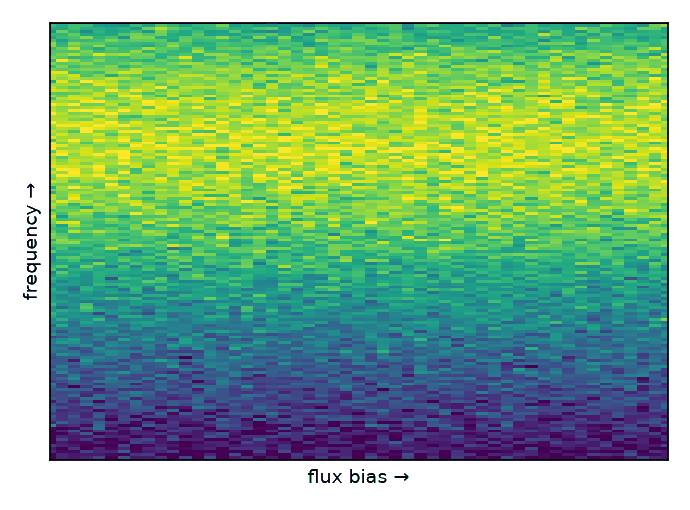

### C14 — Flux-striped map with no frequency-localized dip  (seen 4x)

**Geometry:** The map is organized in vertical stripes — whole flux columns uniformly bright or uniformly dark — with strong structure along the flux axis and none along the frequency axis. No horizontal band of reduced amplitude persists across neighbouring columns. The few markers sit at unrelated heights with long stretches carrying none, forming no continuous trace. The map is full of structure; it is simply not frequency-localized.

**Prescription:** Rebalance the two axes: reduce the flux range by ~2-4x and increase the frequency span ~2x, so resolution is spent on the axis that must localize the dip. Add shots only after a frequency-localized band appears. Never label this flat — flatness asserts a dip that does not move, and there is no dip here.

**Exemplars:** SNU_1Q/#6_06_resonator_spectroscopy_vs_flux_162317/q1, SNU_1Q/#6_06_resonator_spectroscopy_vs_flux_162317/q3, SNU_1Q/#6_06_resonator_spectroscopy_vs_flux_162317/q7

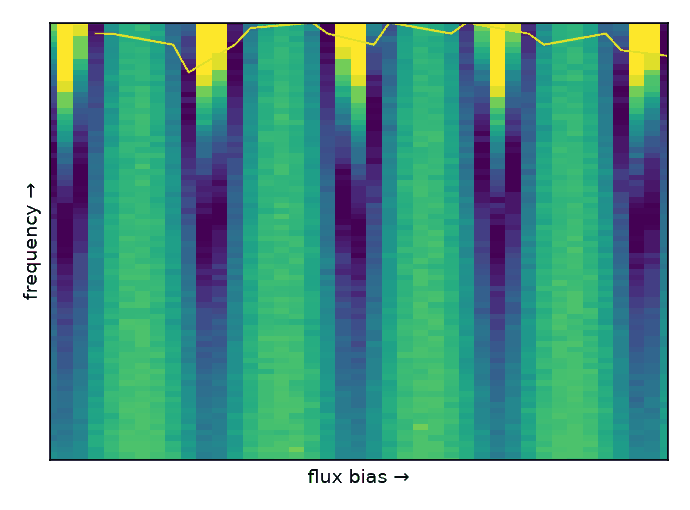
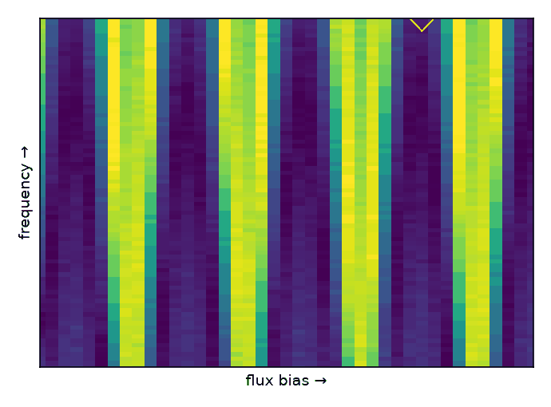
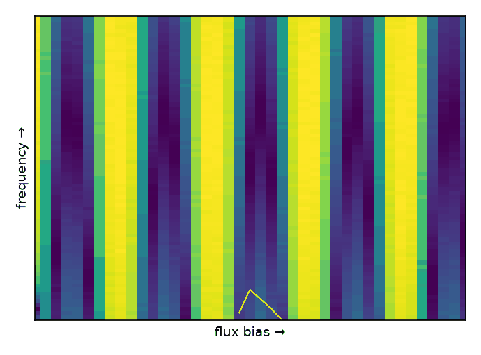

### C15 — Broad unresolved dip — tracked everywhere, localized nowhere  (seen 4x)

**Geometry:** A wide, diffuse dark region rather than a narrow band, whose vertical thickness is a large fraction of the dark area's own extent. A lowest pixel exists in every flux column so coverage reads complete, but the trough has no sharp core: markers scatter over a spread comparable to the region's thickness and often ride its upper or lower boundary rather than its centre. Any modulation smaller than that thickness is undetectable, so a flat verdict here is a bound, not a measurement.

**Prescription:** Sharpen the dip before touching flux: drop the readout amplitude a few dB and/or narrow the frequency span ~2x around the region. If the band stays broad after both, escalate to a readout power sweep at fixed flux. Do not add shots — the defect is contrast/linewidth, not variance.

**Exemplars:** AS_10TQ9TC/#235_02e_resonator_spectroscopy_vs_flux_qdac_080732/q1, AS_10TQ9TC/#236_02e_resonator_spectroscopy_vs_flux_qdac_080819/q1, CQT/#275_02e_resonator_spectroscopy_vs_flux_qdac_094428/q7, CQT/#242_02e_resonator_spectroscopy_vs_flux_qdac_083524/q5

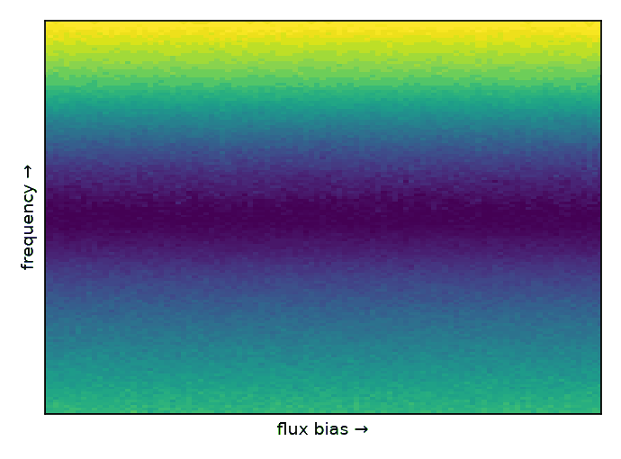

### C16 — Traceable over only part of the flux range  (seen 6x)

**Geometry:** The dip band itself fades in and out against the background so that it is followable over only part of the flux axis: the marker chain is broken by gaps, usually contiguous and concentrated on one flank or at one boundary, while the shape that IS visible is a normal arch. Distinct from a continuous band whose markers merely thin out — here the band's own contrast disappears.

**Prescription:** Restore or double the averaging at the same windows first. If the gaps are contiguous at one end of the flux axis, shift or extend the frequency window ~25% on that side instead of adding shots — the band is probably leaving the window there. Adopt an offset only if the crest region itself is fully covered.

**Exemplars:** IQCC_QOP37/#537_06_resonator_spectroscopy_vs_flux_002252/qD3, IQCC_QOP37/#537_06_resonator_spectroscopy_vs_flux_002252/qD1, SNU_1Q/#10_06_resonator_spectroscopy_vs_flux_173913/q17, AS_10TQ9TC/#332_06_resonator_spectroscopy_vs_flux_093652/q7

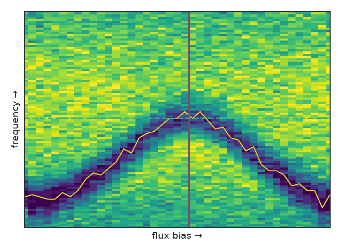
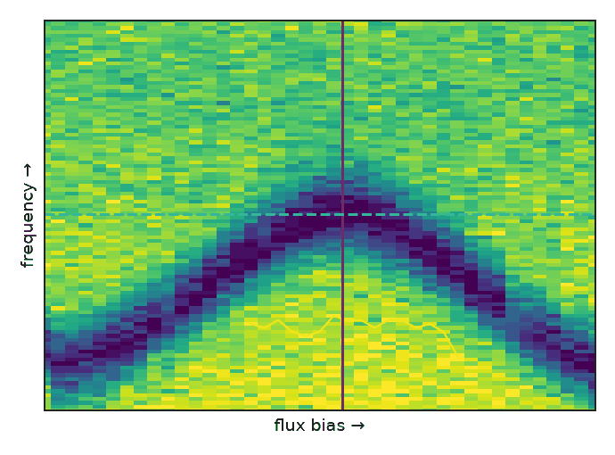

### C17 — Anticrossing — band splits or jumps at a crossing  (seen 0x)

**Geometry:** The dip band is smooth over most of the flux axis but splits into two branches, or jumps discontinuously in frequency, over a narrow flux interval, with avoided-crossing curvature on either side of the interval. Distinct from branch hopping in that the SPLIT is in the data, not in the marker chain, and it is localized to a narrow flux window rather than spanning the sweep.

**Prescription:** Narrow the flux range to roughly a third around the crossing and double the flux-point density to resolve the splitting; escalate to qubit spectroscopy vs flux to identify what is crossing. Choose the idle point away from the crossing interval; never fit a single smooth curve through the split.

## Flags (orthogonal to map geometry)

A flag can sit on ANY case.

### F1 — Readable figure, no fit produced  (seen 12x)

**Signature:** A continuous, fully traced dip chain with unambiguous curvature (or a clean arch with an interior extremum) is drawn, and no fit curve and no offset markers appear on the panel at all.

**Prescription:** Do not re-acquire — the map is already adequate. Re-run the extraction/fit offline on the stored trace, or hand-seed the fit from the visible crest. Escalate as an analysis defect; a repeat sweep at the same settings has repeatedly reproduced the same refusal.

**Exemplars:** CQT/#240_02e_resonator_spectroscopy_vs_flux_qdac_083306/q1, CQT/#244_02e_resonator_spectroscopy_vs_flux_qdac_084012/q1, IQCC_QOP37/#297_06_resonator_spectroscopy_vs_flux_050441/qB3, IQCC_QOP37/#523_06_resonator_spectroscopy_vs_flux_133555/qC3

### F2 — Flat claim contradicted by visible curvature  (seen 16x)

**Signature:** The record/panel asserts no flux response while the panel shows one or more bands that visibly bow, with a total excursion several times the marker-to-marker scatter.

**Prescription:** Reject the verdict, not the data. Check first whether the marker chain is single-branch; if it alternates between bands, treat as branch hopping and isolate one band by narrowing the frequency span ~2x. Never propagate a flat verdict that the panel contradicts.

**Exemplars:** SNU_1Q/#9_06_resonator_spectroscopy_vs_flux_173425/q11, SNU_1Q/#18_06_resonator_spectroscopy_vs_flux_181825/q5, CQT/#323_02e_resonator_spectroscopy_vs_flux_qdac_113200/q1, SNU_1Q/#26_06_resonator_spectroscopy_vs_flux_185020/q6

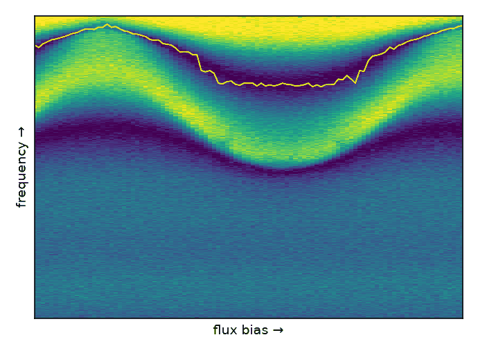

### F3 — Flat label applied where there is no dip at all  (seen 5x)

**Signature:** The panel is titled/recorded as flat, but no frequency-localized dip band exists anywhere in the window (striped, empty, or only a flank in view). Flatness asserts a dip that does not move; there is nothing here to move.

**Prescription:** Re-record as a window/acquisition failure and act on the window: rebalance flux vs frequency span, or re-centre the frequency window. Suppress the flat verdict downstream so the qubit is not written off.

**Exemplars:** SNU_1Q/#6_06_resonator_spectroscopy_vs_flux_162317/q1, SNU_1Q/#6_06_resonator_spectroscopy_vs_flux_162317/q3, CQT/#331_02e_resonator_spectroscopy_vs_flux_qdac_115446/q5

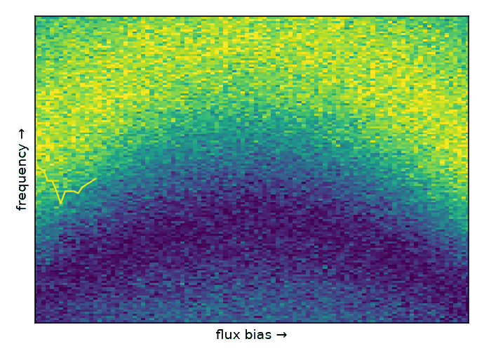

### F4 — Offset marker pinned at or beside the sweep boundary  (seen 18x)

**Signature:** A max- or min-offset marker stands within the outermost few percent of the flux axis, at a flux where the band has only just flattened or has not turned at all, so the turning point is extrapolated rather than observed.

**Prescription:** Extend the flux range ~30-50% on that side only, at the same step density, and re-run before adopting anything derived from that turning point. Treat any period computed from it as provisional.

**Exemplars:** IQCC_QOP37/#523_06_resonator_spectroscopy_vs_flux_133555/qD2, IQCC_QOP37/#435_06_resonator_spectroscopy_vs_flux_223530/qD1, AS_10TQ9TC/#332_06_resonator_spectroscopy_vs_flux_093652/q5, IQCC_QOP37/#537_06_resonator_spectroscopy_vs_flux_002252/qD5

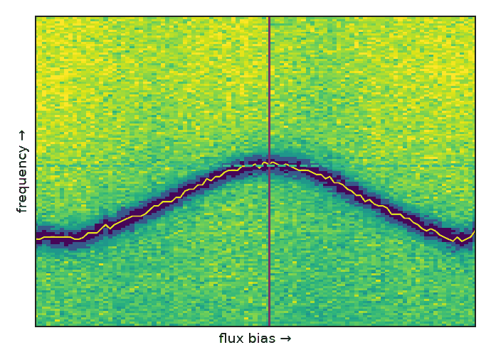
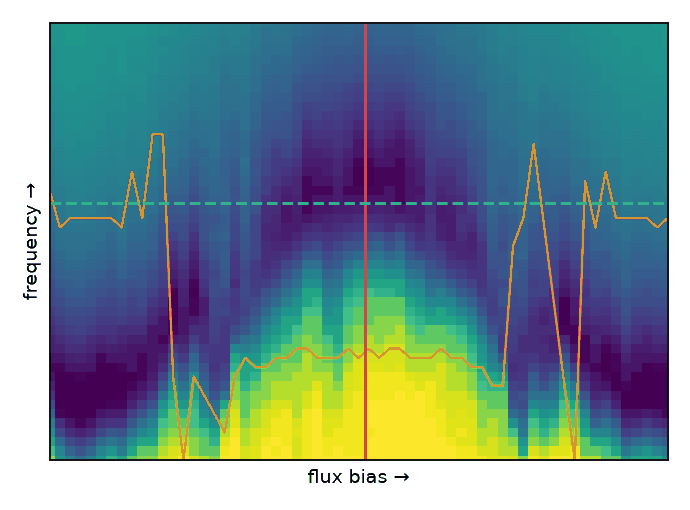

### F5 — Period reported without an observed trough  (seen 4x)

**Signature:** A period/flux-quantum quantity is present in the record while the panel shows only one turning point and the band descends to both boundaries without turning, or turns only at the frame edge.

**Prescription:** Refuse the period and anything derived from it; keep the crest. Re-run with the flux range extended ~50-100% on the descending side to observe the second turning point.

**Exemplars:** IQCC_QOP37/#523_06_resonator_spectroscopy_vs_flux_133555/qD2, IQCC_QOP37/#523_06_resonator_spectroscopy_vs_flux_133555/qD4

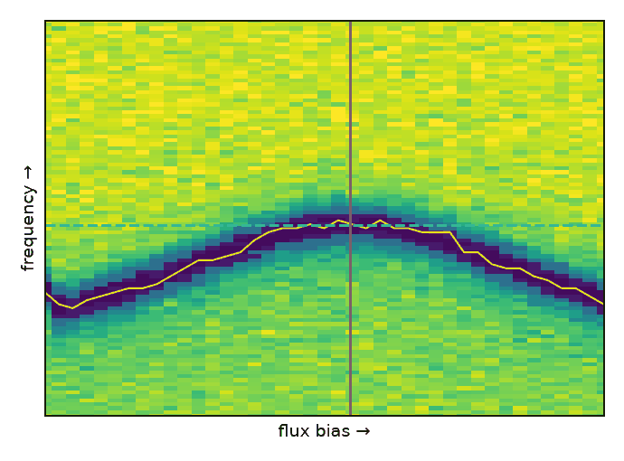
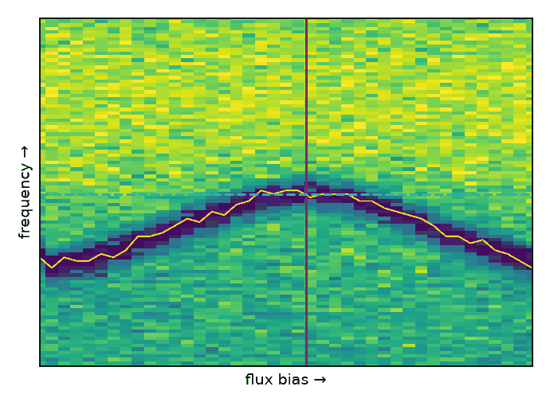

### F6 — Minimum reported on the opposite branch between identical repeats  (seen 3x)

**Signature:** Two back-to-back repeats of the same sweep both show a crest at essentially the same flux, but the trough marker appears on opposite sides of it, with no visible disagreement between the two figures. Occurs whenever roughly one period spans the window, where both branches are geometrically valid.

**Prescription:** Do not difference the minimum across runs — the sign flip is a branch choice, not drift. Pin a branch convention (e.g. always the trough on the lower-flux side of the crest) or widen the flux range so a full period is unambiguous.

**Exemplars:** AS_10TQ9TC/#311_06_resonator_spectroscopy_vs_flux_083211/q5, AS_10TQ9TC/#332_06_resonator_spectroscopy_vs_flux_093652/q5

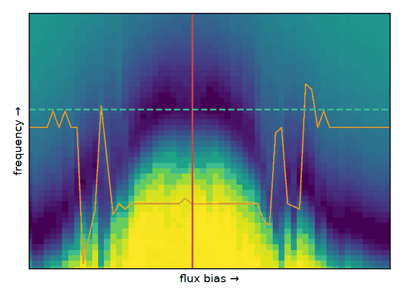

### F7 — Crest position unstable across identical repeats  (seen 9x)

**Signature:** Repeats at identical settings, minutes apart and visually indistinguishable, place the crest marker at flux positions differing by an appreciable fraction of the arch's own width; the crest is broad enough that the shift is invisible in the geometry.

**Prescription:** Require ≥2 identical repeats agreeing to within a small fraction of the arch width before adopting the offset. If they do not agree, narrow the flux range ~2x around the crest (or widen it if the crest is flat-topped) to localize it, rather than accepting the last value.

**Exemplars:** AS_10TQ9TC/#330_06_resonator_spectroscopy_vs_flux_093400/q6, AS_10TQ9TC/#332_06_resonator_spectroscopy_vs_flux_093652/q6, IQCC_QOP37/#52_06_resonator_spectroscopy_vs_flux_213237/qA2, IQCC_QOP37/#567_06_resonator_spectroscopy_vs_flux_181215/qC2

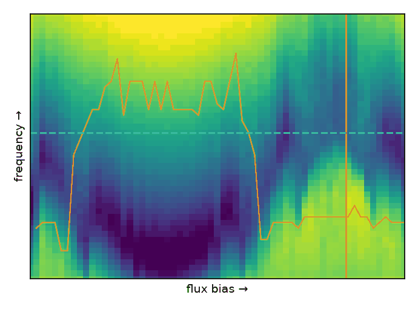
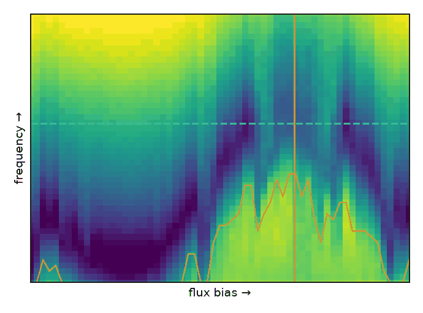
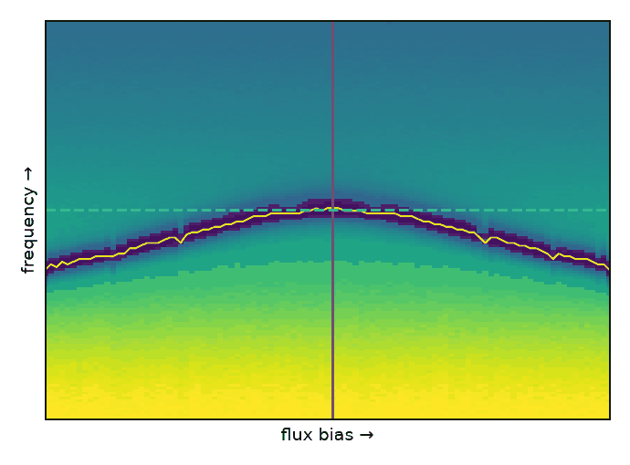

### F8 — Reported resonance position drifts between identical repeats  (seen 2x)

**Signature:** Two identical back-to-back runs on the same target produce reported resonance positions differing by about as much as the shift the node itself claims to have measured, while the two panels are indistinguishable.

**Prescription:** Treat the single-run value as non-authoritative: average over ≥2 repeats or require the run-to-run spread to be small compared with the claimed shift before writing. Investigate readout/LO stability if the spread persists.

**Exemplars:** AS_10TQ9TC/#231_06_resonator_spectroscopy_vs_flux_200400/q5, AS_10TQ9TC/#231_06_resonator_spectroscopy_vs_flux_200400/q6

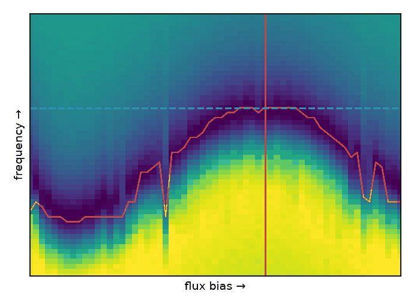
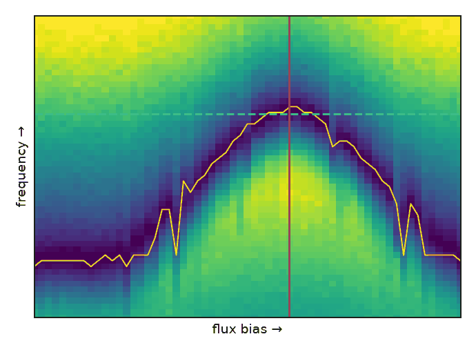

### F9 — Success without state update  (seen 25x)

**Signature:** Not visible in the figure: every target of the run is reported successful and the run writes no parameters, or writes only a subset of its successful targets.

**Prescription:** Do not count such a run as a calibration. Decide explicitly whether the run was a verification pass; if an update was intended, re-issue the write from the stored fit rather than re-acquiring.

**Exemplars:** AS_10TQ9TC/#334_06_resonator_spectroscopy_vs_flux_094025/q6, IQCC_QOP37/#523_06_resonator_spectroscopy_vs_flux_133555/qD1, SNU_1Q/#25_06_resonator_spectroscopy_vs_flux_184132/q17, CQT/#239_02e_resonator_spectroscopy_vs_flux_qdac_083002/q1

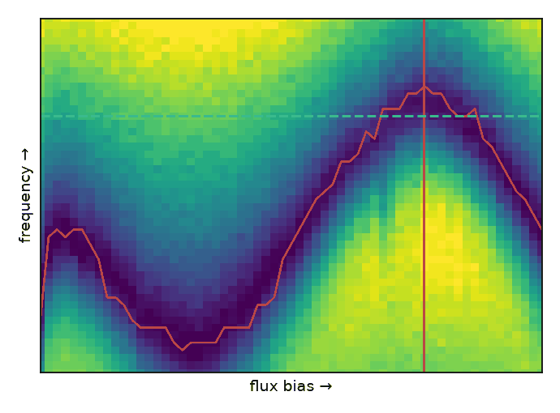
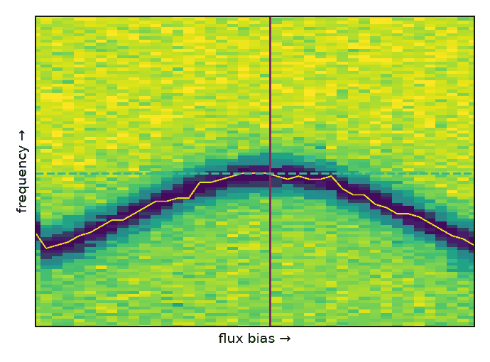
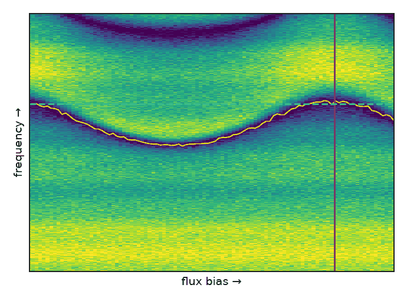

### F10 — Marker gaps over an intact band  (seen 8x)

**Signature:** The dark band is continuous and unbroken, but the extracted marker series is absent over one or more stretches — usually a flank between the trough and the crest — so the traced ridge has holes the band does not.

**Prescription:** An extraction gap, not an acquisition gap: do not add shots. Accept the fit if it lands on the band on both sides of the gap and the crest region itself is covered; otherwise re-extract with a relaxed dip-detection threshold.

**Exemplars:** AS_10TQ9TC/#311_06_resonator_spectroscopy_vs_flux_083211/q7, AS_10TQ9TC/#334_06_resonator_spectroscopy_vs_flux_094025/q7, IQCC_QOP37/#524_06_resonator_spectroscopy_vs_flux_140428/qD1

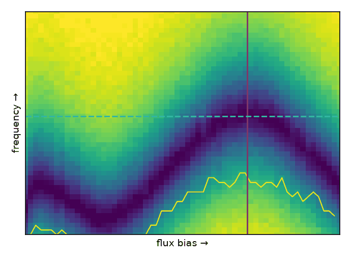
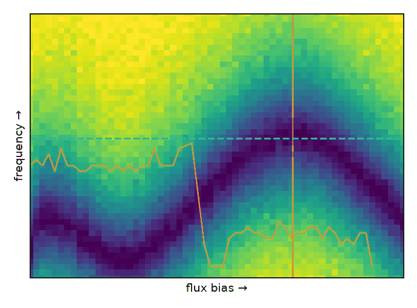
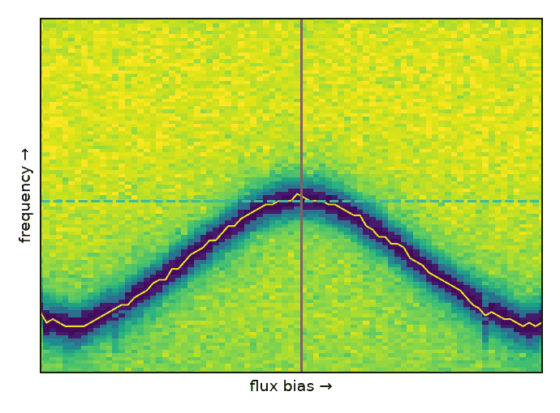

### F11 — Coverage metric uninformative  (seen 20x)

**Signature:** The record reports full ridge coverage next to a failed or flat verdict, or next to a trace that visibly alternates between two bands. A broad trough always yields a lowest pixel per column, so coverage saturates on exactly the maps where it would be most useful.

**Prescription:** Do not gate on coverage alone. Require trace continuity (single-branch, no height steps) and a dip contrast floor alongside it. Where coverage is high and the fit failed, inspect the figure before acting.

**Exemplars:** AS_10TQ9TC/#330_06_resonator_spectroscopy_vs_flux_093400/q8, CQT/#235_02e_resonator_spectroscopy_vs_flux_qdac_080732/q1, SNU_1Q/#9_06_resonator_spectroscopy_vs_flux_173425/q11, CQT/#241_02e_resonator_spectroscopy_vs_flux_qdac_083427/q3

### F12 — Vertical per-flux-column striping  (seen 12x)

**Signature:** The band is intact but ragged: the map is broken into column-to-column stripes, markers scatter above and below the fitted curve rather than lying on it, and isolated columns show sharp vertical discontinuities that displace the band locally. Distinct from broadband speckle — the band still has a core.

**Prescription:** An acquisition fault, not a shot-noise one: check for interference/settling between flux steps and add a settle delay or dither the step order before doubling shots. A repeat at identical settings has recovered a clean map without any parameter change.

**Exemplars:** AS_10TQ9TC/#331_06_resonator_spectroscopy_vs_flux_093544/q6, IQCC_QOP37/#524_06_resonator_spectroscopy_vs_flux_140428/qC1, IQCC_QOP37/#567_06_resonator_spectroscopy_vs_flux_181215/qC1

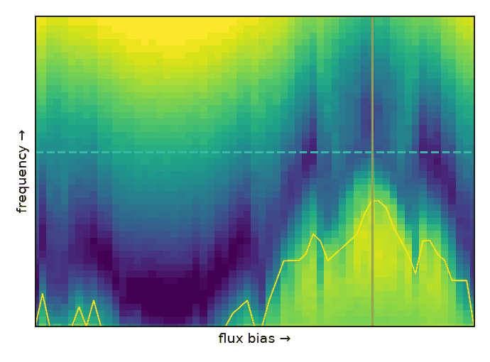

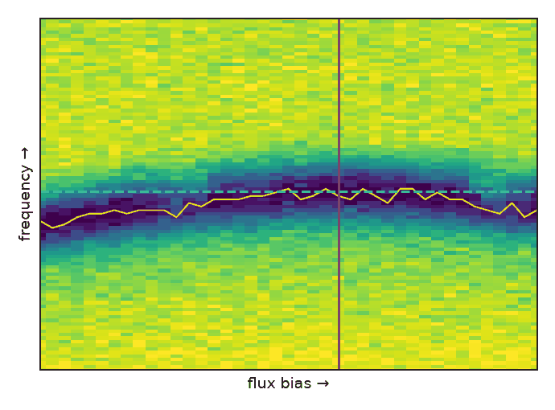

### F13 — Broadband pixel speckle  (seen 10x)

**Signature:** Point-to-point speckle over the whole map with no column structure; the band, where present, is thin relative to the surrounding mottling or has no core at all, and single-column noise competes with the dip contrast.

**Prescription:** This is the one defect that averaging fixes: double the shots (or restore averaging if it was removed) at unchanged windows. If coverage does not recover, the dip contrast — not the variance — is the limit; retune readout instead.

**Exemplars:** AS_10TQ9TC/#235_02e_resonator_spectroscopy_vs_flux_qdac_080732/q1, SNU_1Q/#10_06_resonator_spectroscopy_vs_flux_173913/q17, CQT/#325_02e_resonator_spectroscopy_vs_flux_qdac_113737/q5

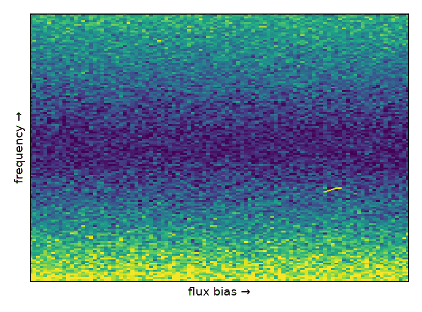
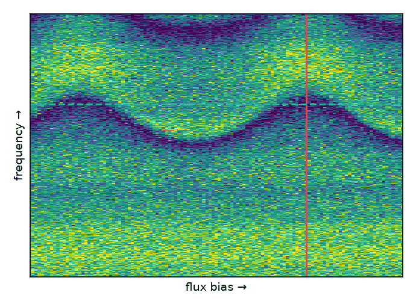

### F14 — Bright plume crossing the dip band  (seen 3x)

**Signature:** A bright, high-amplitude feature cuts upward through the band over a limited stretch of flux, pulling the dip trace off the band without splitting or jumping it — so the trace acquires an excursion that looks like modulation where there is none.

**Prescription:** Reduce the readout amplitude a few dB and re-run; if the plume persists, narrow the frequency span to exclude it or mask that stretch before extraction. Never read a crest from a stretch a plume overlaps.

**Exemplars:** AS_10TQ9TC/#330_06_resonator_spectroscopy_vs_flux_093400/q8, AS_10TQ9TC/#331_06_resonator_spectroscopy_vs_flux_093544/q8, AS_10TQ9TC/#332_06_resonator_spectroscopy_vs_flux_093652/q8

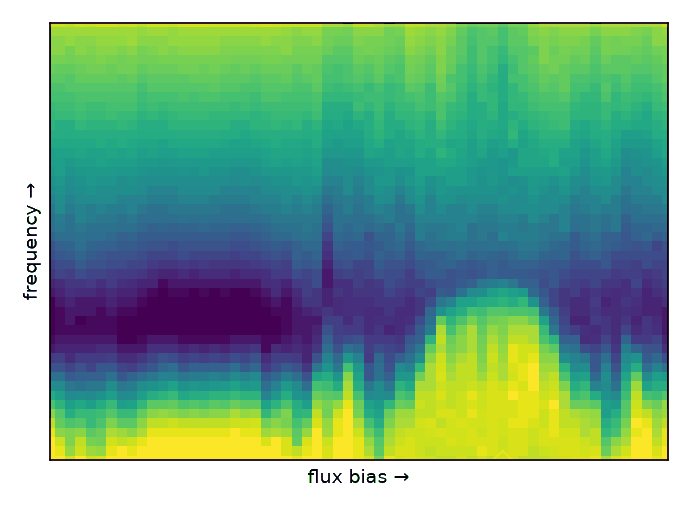
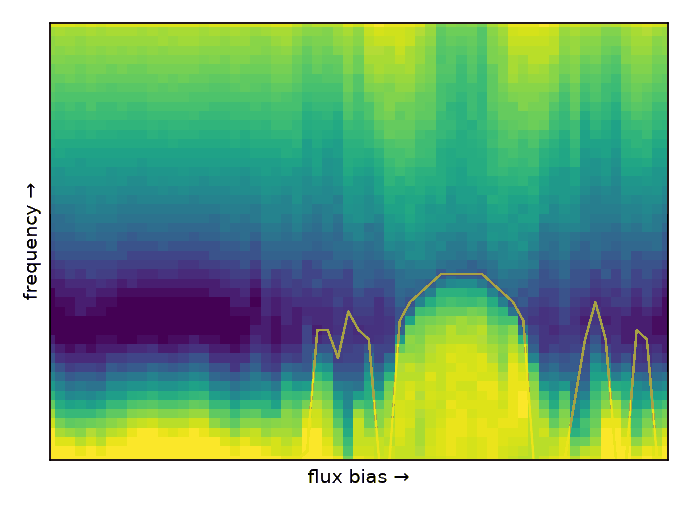

### F15 — Fit systematically offset from the marker chain  (seen 5x)

**Signature:** Over one flank or near the crest the markers run consistently on one side of the fitted curve rather than scattering about it, while the two agree elsewhere; the reported crest is displaced from where the marker crest appears.

**Prescription:** Prefer the marker crest over the fitted crest when the two disagree, or refit with the offending flank down-weighted. Do not re-acquire; this is a model/weighting defect.

**Exemplars:** IQCC_QOP37/#537_06_resonator_spectroscopy_vs_flux_002252/qC4, IQCC_QOP37/#537_06_resonator_spectroscopy_vs_flux_002252/qC3, IQCC_QOP37/#114_06_resonator_spectroscopy_vs_flux_234122/qA1

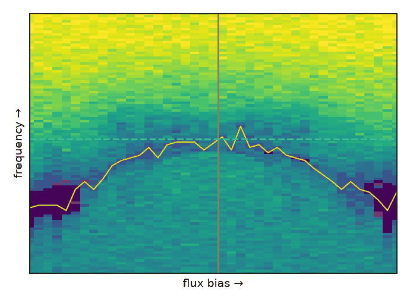
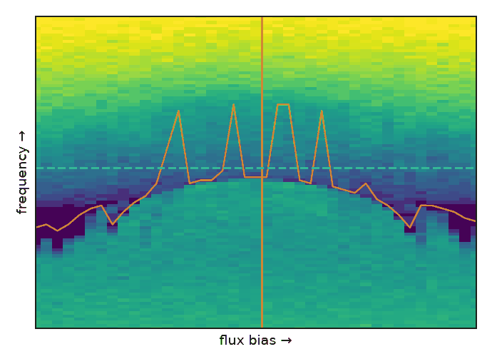
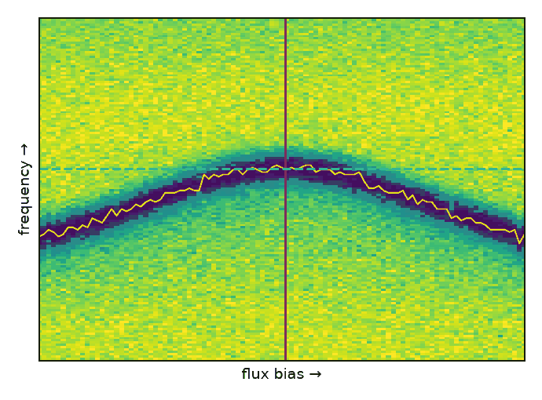

### F16 — Second, non-modulating band in the window  (seen 10x)

**Signature:** A second dark band shares the panel and stays level across the whole flux axis while the tracked band bows. Benign in itself — the only question is which band the extraction owns.

**Prescription:** Confirm the fit owns the modulating band (a static band is a neighbour, not this resonance). If the extraction ever touches the static band, narrow the frequency span to exclude it. No re-acquisition otherwise.

**Exemplars:** SNU_1Q/#18_06_resonator_spectroscopy_vs_flux_181825/q4, SNU_1Q/#18_06_resonator_spectroscopy_vs_flux_181825/q17, CQT/#328_02e_resonator_spectroscopy_vs_flux_qdac_114336/q3

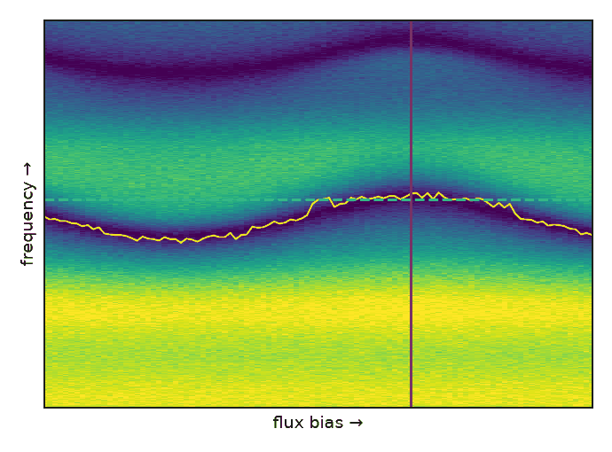
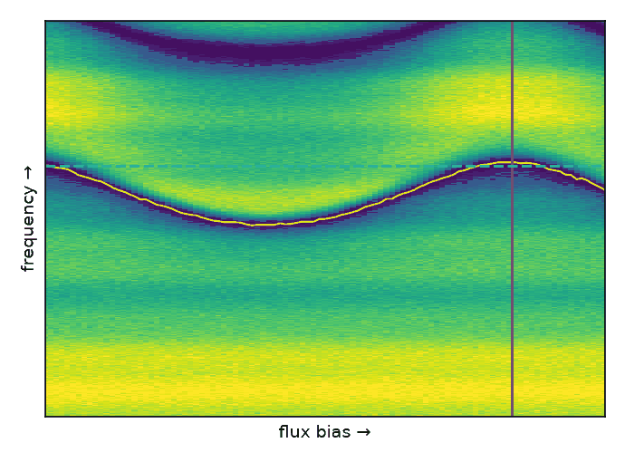

### F17 — Common-mode curvature — background bows like the band  (seen 6x)

**Signature:** An untracked bright ridge and/or a second dark region in the panel bow with the same sense and roughly the same magnitude as the tracked band, so part or all of the apparent modulation may belong to the background rather than to this resonance.

**Prescription:** Do not adopt from this map alone. Acquire one control map with the bias line disconnected (or the bias held fixed while the nominal axis is stepped); if the background curvature survives, subtract or exclude it before extracting.

**Exemplars:** CQT/#323_02e_resonator_spectroscopy_vs_flux_qdac_113200/q1, SNU_1Q/#9_06_resonator_spectroscopy_vs_flux_173425/q10, SNU_1Q/#18_06_resonator_spectroscopy_vs_flux_181825/q10

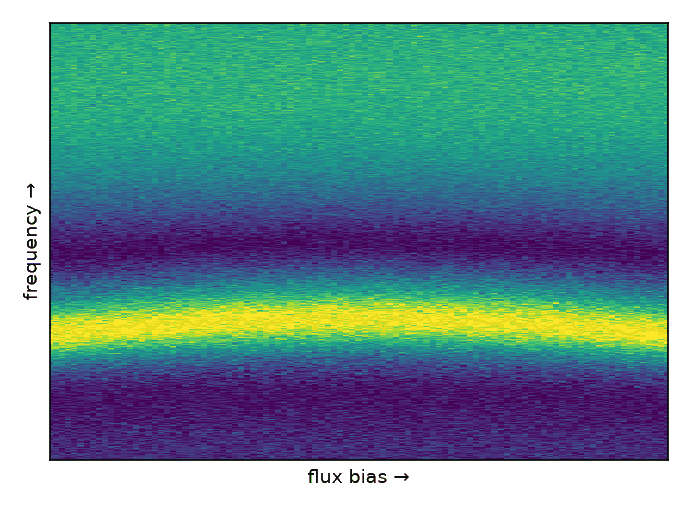
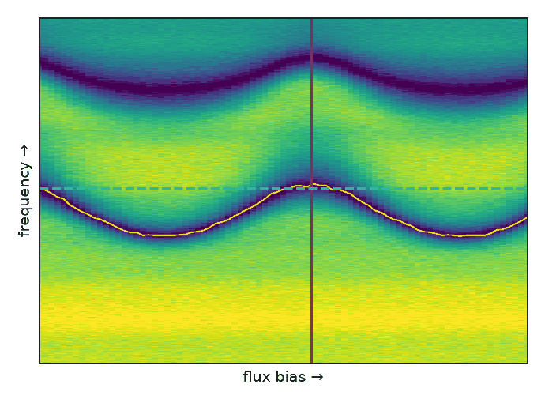
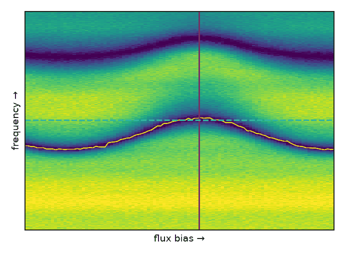

### F18 — Claimed optimum where the band is not visible  (seen 2x)

**Signature:** The reported operating point sits at a flux where the band has left the frequency window or where no markers exist, while the fit's other turning point sits on visible data.

**Prescription:** Refuse the value outright. Widen the frequency span ~3x (or narrow the flux range) until the claimed optimum is inside the visible band, then re-read it.

**Exemplars:** SNU_1Q/#7_06_resonator_spectroscopy_vs_flux_162458/q1

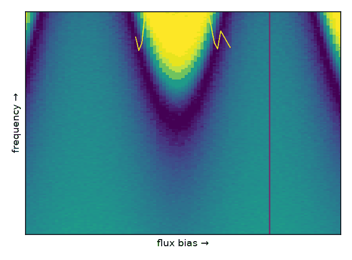

### F19 — Verdict flipped by the previous run's own update  (seen 4x)

**Signature:** An identical repeat, with no parameter or chip change, gives the opposite verdict to its predecessor — because the predecessor wrote a new resonance position that re-centred the frequency window and brought a second band (or a different band) into view.

**Prescription:** After any run that writes a resonance position, treat the next map as a NEW window: re-verify band ownership before trusting its verdict, and never interpret a verdict change immediately after such a write as physics.

**Exemplars:** SNU_1Q/#25_06_resonator_spectroscopy_vs_flux_184132/q6, SNU_1Q/#26_06_resonator_spectroscopy_vs_flux_185020/q6, CQT/#328_02e_resonator_spectroscopy_vs_flux_qdac_114336/q3

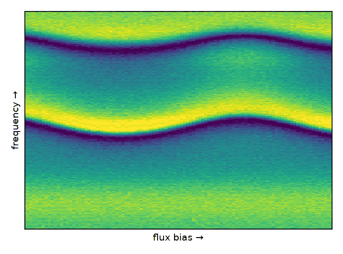
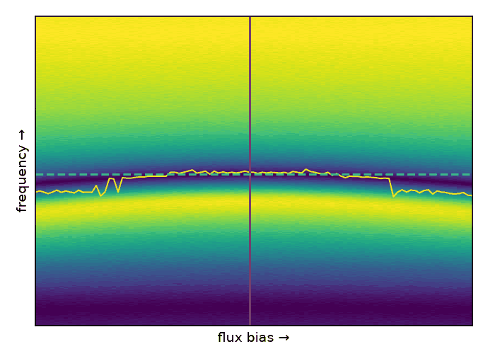

### F20 — Sibling panels of one multiplexed run given opposite verdicts  (seen 7x)

**Signature:** Within one multiplexed figure, a panel whose curvature and coverage are not visibly weaker than accepted neighbours receives no fit, or accepted neighbours differ from it only in band thickness.

**Prescription:** Use the accepted siblings as the calibration of the gate: if the refused panel's excursion-to-linewidth ratio is comparable, treat the refusal as an extraction threshold artefact and re-extract rather than re-acquire.

**Exemplars:** IQCC_QOP37/#537_06_resonator_spectroscopy_vs_flux_002252/qC1, IQCC_QOP37/#523_06_resonator_spectroscopy_vs_flux_133555/qC1

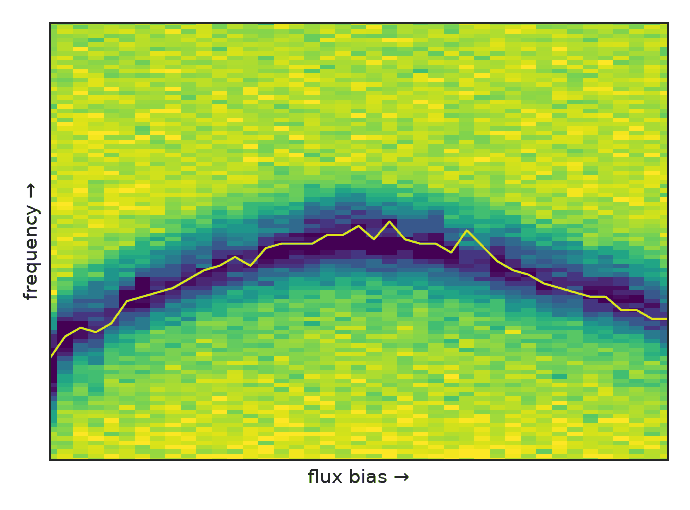
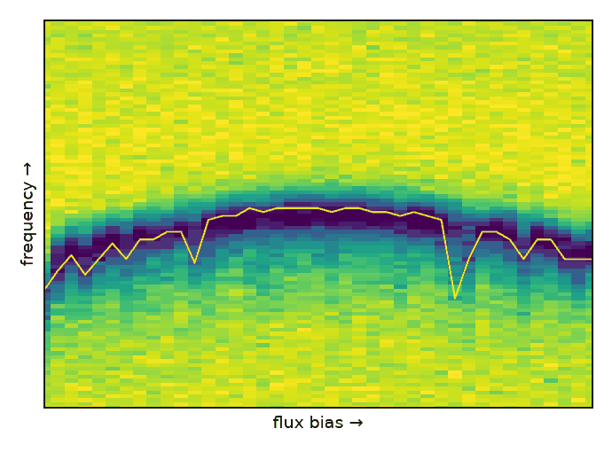

### F21 — Axis unit label inconsistent with its tick values  (seen 2x)

**Signature:** A panel axis is labelled with a unit that does not match the magnitude of its own tick values.

**Prescription:** Do not read absolute numbers off the figure; take them from the record. Fix the plotting label before the figures are used for any cross-run comparison.

**Exemplars:** AS_10TQ9TC/#235_02e_resonator_spectroscopy_vs_flux_qdac_080732/q1, AS_10TQ9TC/#236_02e_resonator_spectroscopy_vs_flux_qdac_080819/q1

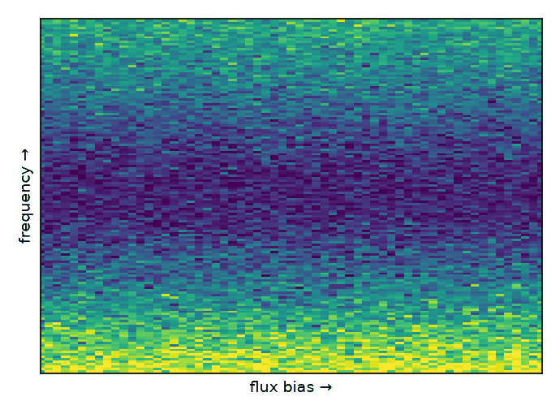

### F22 — Panel aspect distortion in multiplexed figures  (seen 4x)

**Signature:** Panels within one figure differ greatly in aspect ratio; a tall narrow panel exaggerates vertical excursions and a wide short one flattens them, so geometry-only judgements ('rises then falls', 'scatter comparable to the excursion') are not equally reliable across panels of the same run.

**Prescription:** Record that the case was read under compressed scale, and re-plot at a common aspect (or give the target a dedicated full-width run) before a borderline shallow/flat verdict is trusted.

**Exemplars:** CQT/#275_02e_resonator_spectroscopy_vs_flux_qdac_094428/q7, AS_10TQ9TC/#308_06_resonator_spectroscopy_vs_flux_082351/q5

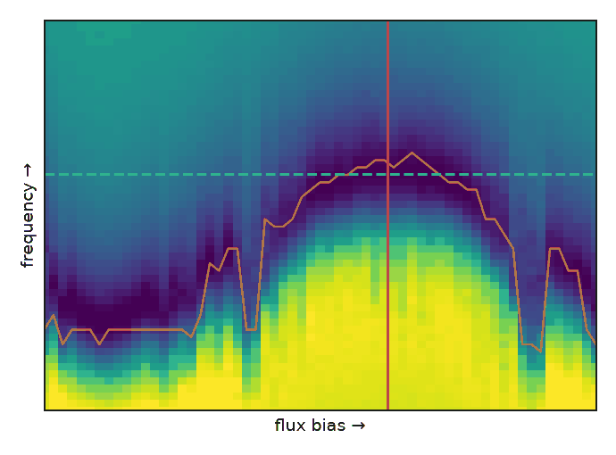

### F23 — Inductance-side outputs never populated  (seen 38x)

**Signature:** Not visible in the figure: the record's mutual-inductance and bias-current fields are empty across an entire session even where the flux-per-period field is populated.

**Prescription:** Do not consume those fields. Decide whether they are meant to be computed at all for this node; if they are, they need a flux-to-current calibration that this map does not provide.

**Exemplars:** AS_10TQ9TC/#308_06_resonator_spectroscopy_vs_flux_082351/q6, AS_10TQ9TC/#228_06_resonator_spectroscopy_vs_flux_195719/q5

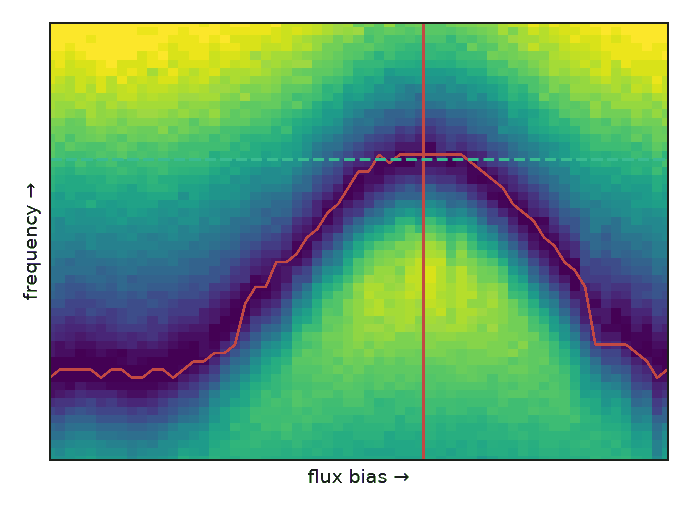
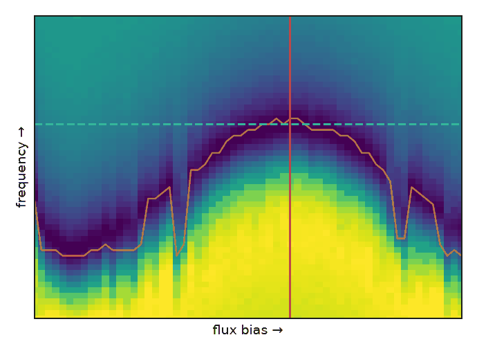

### F24 — Refusal with no reason recorded  (seen 2x)

**Signature:** Not visible in the figure: the fit fields are empty while the record's own diagnostics both report the map as adequate (coverage full, flat-response false) and no reason is stored.

**Prescription:** Treat as an unusable record: the run cannot be re-planned from it. Require the analysis to name which gate fired; until then, adjudicate from the figure.

**Exemplars:** IQCC_QOP37/#297_06_resonator_spectroscopy_vs_flux_050441/qB3

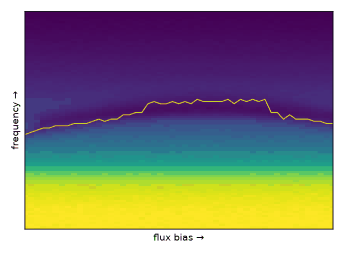

### F25 — Verdict is a property of the swept range  (seen 5x)

**Signature:** The same target on the same day reads flat over a narrow bias range, fits a shallow dome over an intermediate one, and shows a clear interior extremum over a wide one — the shape class changes with the sweep, not with the device.

**Prescription:** Never record a shape verdict without the range it was obtained over. Before writing off a target, require at least two bias ranges differing by ≥3x and, separately, two frequency spans differing by ≥3x.

**Exemplars:** CQT/#238_02e_resonator_spectroscopy_vs_flux_qdac_082551/q1, CQT/#239_02e_resonator_spectroscopy_vs_flux_qdac_083002/q1, CQT/#240_02e_resonator_spectroscopy_vs_flux_qdac_083306/q1

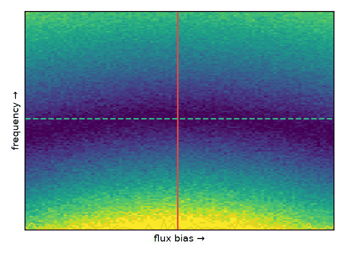
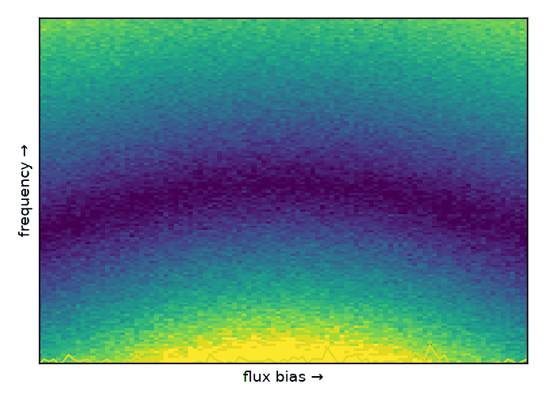

### F26 — Flat criterion diluted by a wide frequency span  (seen 2x)

**Signature:** The same modulation that was fitted at a narrow frequency span is declared flat once the span is widened several-fold — the excursion is unchanged but is now small next to the amount of empty spectrum swept around it.

**Prescription:** Make the flatness test scale-free: judge the excursion against the band's own linewidth, never against the swept span. Re-judge any flat verdict obtained at a span much wider than the band.

**Exemplars:** CQT/#323_02e_resonator_spectroscopy_vs_flux_qdac_113200/q1

### F27 — Asymmetric lever arm — crest far from the sweep centre  (seen 3x)

**Signature:** The crest sits close to one flux boundary so that the flank beyond it is much shorter than the flank before it; the curvature is constrained almost entirely by the long branch.

**Prescription:** Extend the flux range ~30-50% on the short-flank side only and re-run before adopting; the crest position is the value being written and it is the least constrained part of this geometry.

**Exemplars:** CQT/#257_06_resonator_spectroscopy_vs_flux_092518/q4

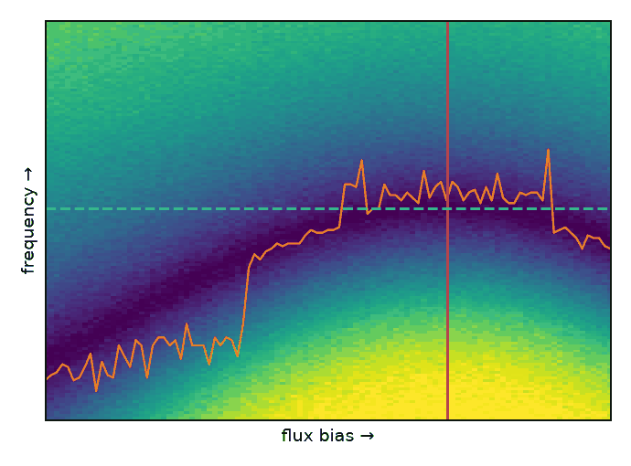

### F28 — Broad flat-topped crest  (seen 8x)

**Signature:** The maximum is a long level region rather than a point, so the chosen operating flux is only weakly localized along the flux axis even though its height on the band is correct.

**Prescription:** Accept the value only if the run-to-run spread of the crest is small compared with the crest's own flat width; otherwise narrow the flux range ~2-3x around the crest at the same point count to sharpen it.

**Exemplars:** CQT/#239_02e_resonator_spectroscopy_vs_flux_qdac_083002/q1, IQCC_QOP37/#523_06_resonator_spectroscopy_vs_flux_133555/qC2, IQCC_QOP37/#567_06_resonator_spectroscopy_vs_flux_181215/qC2

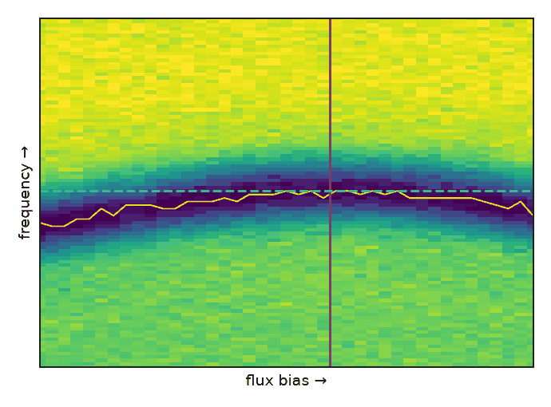

### F29 — Markers ride the edge of the dark region, not its core  (seen 2x)

**Signature:** The traced line sits along the upper or lower boundary of the dark region rather than at its darkest part, so the reported dip position is biased toward one side of the true minimum.

**Prescription:** Re-extract with a centroid/minimum rule rather than a threshold-crossing rule; do not re-acquire. Any offset taken from this trace carries a one-sided bias.

**Exemplars:** CQT/#275_02e_resonator_spectroscopy_vs_flux_qdac_094428/q7

### F30 — Sparse markers drawn on a continuous ridge  (seen 4x)

**Signature:** Only a handful of markers are plotted although the band is continuous and the fit lies on it end to end; coverage in the record is nevertheless complete.

**Prescription:** Do not read this as a coverage failure — it is plotting sparsity. Judge coverage from the band and the record, not from marker density.

**Exemplars:** IQCC_QOP37/#12_06_resonator_spectroscopy_vs_flux_000728/qA1, SNU_1Q/#109_06_resonator_spectroscopy_vs_flux_012344/q17, IQCC_QOP37/#567_06_resonator_spectroscopy_vs_flux_181215/qC2

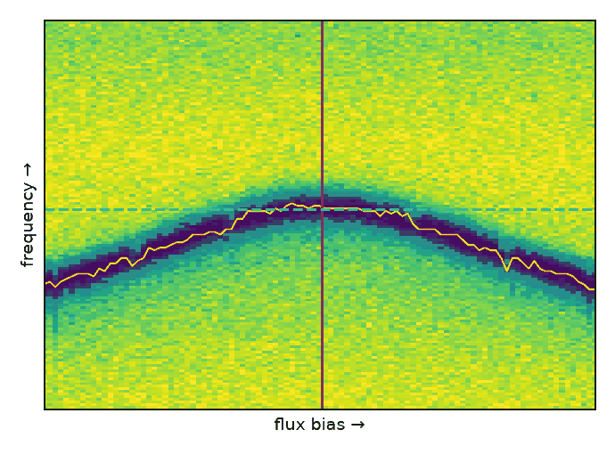

## Rules

### RULE-1 — An offset is adoptable only if its turning point was observed

Write an idle/joint offset only when the corresponding turning point lies strictly inside the swept flux range, the band is visible at that flux, and the fit lies on the darkest pixels through the crest region. Never adopt an offset read at a flux where the band has left the frequency window or where no markers exist (SNU_1Q/#7/q1), and never adopt a turning point that sits at the sweep boundary — that is an extrapolation, not a measurement.

### RULE-2 — Period and flux-quantum quantities require BOTH turning points

Do not write a period, flux-per-quantum or any derived bias-current quantity unless a maximum AND a minimum are both observed inside the window with the band turning on both. A window holding a single extremum constrains only the operating point; the period from it is curvature extrapolation. Several runs here report a period while the trough marker stands on the frame edge (IQCC_QOP37/#523/qD2, qD4).

### RULE-3 — The reported minimum is branch-degenerate near one period

When roughly one period spans the window, the minimum may legitimately be reported on either side of the crest. Never difference the minimum across runs as a drift or consistency signal, and never treat a sign change of it as a contradiction; pin an explicit branch convention or widen the flux range until a full period is unambiguous.

### RULE-4 — Flat is a statement about the swept ranges, never about the qubit

A no-flux-response verdict is valid only as 'flat over this flux range and this frequency window'. Before recording it, require at least two flux ranges differing by ≥3x and at least two frequency spans differing by ≥3x. The same target has read flat, shallow-dome and clear-arch on one day purely from range changes (CQT q1 across #238/#239/#240).

### RULE-5 — Judge modulation depth against the band's own linewidth

The only chip-independent discriminator between shallow-but-real and flat is the excursion measured in units of the band's own thickness — never in absolute frequency and never as a fraction of the swept span. A criterion scaled to the span flips the same data from fitted to flat when the span is widened (CQT/#323/q1 vs #239/q1).

### RULE-6 — Coverage is not evidence; continuity is

Ridge coverage saturates on exactly the failing maps — a broad trough always has a lowest pixel per column, and a chain alternating between two bands is 'complete'. Gate on single-branch trace continuity (no height steps, no interleaved segments) and on dip contrast, and treat a full-coverage-plus-failed-fit record as carrying no information about the map.

### RULE-7 — Never accept, refuse or flat-label a map with more than one band until ownership is pinned

If two or more dip bands share the frequency window, declare which band the extraction owns before any verdict. Branch hopping produces a nearly constant trace mean, which is precisely what a flatness test measures — so it manufactures false flat verdicts on visibly modulating data (SNU_1Q q11/q15/q5/q6 across five runs). Isolating a band by narrowing the frequency span is the cheapest fix; disabling multiplexing is not (verified ineffective).

### RULE-8 — A refusal must name its gate

Any run that produces no fit must record which criterion fired. A record with empty fit fields, full coverage and flat-response false is unactionable and forces figure-by-figure adjudication (IQCC_QOP37/#297/qB3). Conversely, a refusal whose stated reason contradicts the figure (flat claimed where no dip exists) must be suppressed downstream rather than propagated.

### RULE-9 — Zero acquisition variance is an instrument verdict, not a physics one

A map with no column-to-column variation and markers on an exactly straight line means the swept axis produced no measurable change. A genuinely flux-insensitive resonator still shows shot noise varying column to column. Never report such a map as flat; route it to a wiring/bias-source check, and confirm with a panel from the same multiplexed acquisition on another channel.

### RULE-10 — Fix the frequency window before the flux window

When a map fails, the observed search order that works is: re-centre and widen the frequency span first, then adjust the flux range, then add shots. Widening flux first was the losing move in two labs (SNU_1Q #6→#7; CQT's morning of narrow-span retries), and opening the frequency span by roughly an order of magnitude is what made the same qubits fit run after run.

### RULE-11 — Any write of a resonance position invalidates the next map's window

Updating the resonance re-centres the following run's frequency window and can bring a new band into view, flipping the verdict with no parameter or chip change (SNU_1Q/#25/q6 and #26/q6 right after #18 patched it). After such a write, re-verify band ownership on the next map and never read a verdict change across that boundary as physics.

### RULE-12 — Adopt only what reproduces

Require at least one identical repeat before writing an offset, and require the crest to agree to within a small fraction of the arch width. Observed spreads across minutes-apart identical repeats reach an appreciable fraction of the arch width, and the reported resonance position has drifted between identical repeats by as much as the shift the node itself claimed.

### RULE-13 — Multiplexed runs are judged panel-against-panel

Within one multiplexed acquisition the panels share the acquisition, so cross-panel comparison is legitimate evidence: a refusal beside accepted siblings of comparable excursion-to-linewidth indicts the gate, and a noiseless panel beside a noisy one indicts that channel. Equally, panels differing greatly in aspect ratio must not be judged with the same geometric language.

### RULE-14 — Success is not application

Record and check whether a successful run actually wrote anything. Runs that succeed on every target and write nothing are common here and must not be counted as calibrations; conversely, a run that writes only a subset of its successful targets must say so. The update decision is an axis independent of the map shape.

### RULE-15 — Distinguish contrast faults from variance faults before spending shots

Broadband speckle is fixed by averaging; column striping is fixed by settling/step-order; a broad diffuse dip is fixed by readout retune (lower amplitude, narrower span); a plume crossing the band is fixed by lowering readout amplitude or masking. Adding shots to any of the last three buys nothing, and all four collapse into the same 'weak/noisy' symptom if not separated.

### RULE-16 — Never fit a single smooth curve through a discontinuity

A split or jump localized to a narrow flux interval (an avoided crossing) and a trace that steps between two bands are both discontinuities; a sinusoidal fit through either is meaningless. Exclude the interval, or choose an operating point away from it, and escalate to a qubit-vs-flux measurement to identify what is crossing.

### RULE-17 — Do not consume fields the node never populates

Inductance-side outputs were empty across an entire multi-day session even where the flux-per-period field was written. A consumer must treat unpopulated derived fields as absent, never as zero, and the loop must not gate on them.

## What the reader reports, and which case it means

The reader measures shapes and returns a semantic signal; this table is where that meets the manual's own vocabulary.

| reader signal | case |
|---|---|
| `curve_arch_vertex_inside` | C1 |
| `curve_broken_ridge` | C17 |
| `curve_empty` | C13 |
| `curve_flat_no_response` | C7 |
| `curve_full_swing` | C2 |
| `curve_monotonic_vertex_outside` | C4 |
| `curve_multi_period` | C3 |
| `curve_partial_ridge` | C16 |

One turning point maps to the sub-period case and two to the full-swing case, because that is exactly what the reader can count; three or more is the multi-period case.

## Exemplar images

Axes are NORMALISED and UNLABELLED: no absolute frequency, power or flux leaves this pack, and a picture without numbers cannot teach an absolute scale (Clause B). Orientation follows the labs' own convention: frequency rightwards, the swept quantity upwards. Overlays: orange = the tracked feature, cyan dashed and magenta dotted = the record's own frequency claims, red = the sweep value it chose. Markers are the RECORD's claims, drawn even when they contradict the map — that contradiction is the lesson in the mislabelled and off-feature cases. Whether the feature is a dip or a peak is MEASURED per run, because the readout rotation decides it and it differs between labs.

## Cross-lab evidence

FIVE labs were expected; the annotations carry FOUR distinct lab tokens — AS_10TQ9TC, CQT, IQCC_QOP37, SNU_1Q — across two node spellings (06 on OPX flux, 02e on a QDAC-biased line, the latter appearing under both AS_10TQ9TC and CQT). Any claim below about "all labs" therefore rests on four.

INVARIANT across every lab and both node spellings: (a) the healthy signature is ONE thin dark band arcing smoothly, with the fit overlaid on its darkest pixels and a crest marker on the turning point; (b) wherever a fit curve is drawn at all, it lies on the visible band — across ~149 targets there is essentially no case of a misplaced optimum on a well-traced band, including panels the node then rejected. The failures of this family are extraction, coverage and window-placement failures, not fitting failures; (c) a period-like output appears only when a trough enters the window, and the record is internally consistent about this in all four labs; (d) the operating point is chosen on the maximum-frequency side of the trace; (e) the flat verdict is applied to at least three geometrically distinct situations (true flat, branch hopping, no-dip-at-all) in every lab that produced failures, so the label alone never identifies the map; (f) "full ridge coverage" is reported alongside failed and flat fits in all four labs.

WHAT LOOKED UNIVERSAL BUT IS ONE LAB'S CONVENTION:
- "The crest sits just to the positive side of flux zero." True of nearly every IQCC_QOP37 and AS_10TQ9TC panel, and it is a chip/bias convention, not physics — SNU_1Q/#18/q9 has its crest on the negative side and the record's negative offset matches. Do not build a sign prior from it.
- "One band per window." An IQCC/AS property. In SNU_1Q two bands in one window is the NORM, and that is the entire origin of that lab's failure population. A loop tuned on IQCC data will meet branch hopping unprepared.
- "Both turning points are visible." Dominant in AS_10TQ9TC (their standard window is close to one period) and in the IQCC D-series; the IQCC C-series and the whole CQT set are single-extremum windows. Same draft case R1, different adoptable outputs.
- Plot furniture (magenta fit, red maximum line, orange minimum line, black dip markers; "FLAT — no flux response" panel title) is a shared plotting/node convention, not evidence about the data. The axis-unit label mismatch seen on the AS QDAC panels is a plotting defect of that surface only.
- Panel aspect ratio and qubits-per-figure vary from 1 (CQT survey, SNU #109) to 10 (IQCC #537), and the tall-narrow multiplexed panels exaggerate vertical excursion — a geometry-only verdict is not equally reliable across them.
- Node/axis identity: the 02e QDAC variant sweeps an external DC bias in volts on a line that is not an OPX flux port; the 06 variant sweeps the OPX flux axis. Every case in this manual applied unchanged to both, EXCEPT that the two pathologies unique to the QDAC node — zero-variance identical columns (CQT q3, five runs) and the parallel static-band pair (CQT/#325/q5) — both point at bias delivery rather than at the resonator, which is the one place the node identity changes the prescription.

LAB CHARACTER, briefly: AS_10TQ9TC is a mature 4-qubit group, textbook shapes, and its instructive content is entirely acquisition quality (column striping, a plume) and record-level habits (success without patches; inductance fields never written). CQT is the QDAC bring-up: one qubit per run, range hunts, and the batch's only instrumentation-class failures; it also supplies the cleanest OPX control (CQT/#257/q4). IQCC_QOP37 is the mature multiplexed case where the ONLY disputed axis is shallow-vs-flat — the same qubit flips verdict four times across a session with no change in figure shape. SNU_1Q is early bring-up and contributes every window-placement case (flux-striped, ridge-leaves-window) plus the branch-hopping population; it is also the only lab that demonstrated the search order (widen frequency, not flux) end to end.

## Open questions

1. Where exactly is the shallow/flat boundary? Every disputed verdict in this corpus lands on excursion-vs-linewidth. A domain expert must set the ratio (and whether it is measured against the fitted band width or the extracted-marker scatter), because the same qubit at the same settings has been accepted and refused on either side of it.
2. Should the flatness test operate on a branch-continuity-filtered trace? A chain alternating between two bands has a near-constant mean and reliably produces false flat verdicts. If yes, what defines band ownership when two bands are in the window — deepest contrast, continuity from the previous run, or an operator declaration?
3. Is a period from an edge-pinned trough ever adoptable, and if so with what widened uncertainty? Several runs write it today with the trough marker on the frame edge.
4. What is the branch convention for the reported minimum when roughly one period spans the window? Without one, minimum-offset differences across runs are noise dressed as drift.
5. How much crest flatness is tolerable before an operating point is refused? A long level maximum gives the right height and a badly localized flux.
6. Is a run that succeeds required to write? The corpus contains many green runs with no patches and some that patch only a subset of successful targets, with no recorded distinction between verification and calibration intent.
7. Are the mutual-inductance and bias-current outputs meant to be produced by this node at all? They are empty across an entire multi-day session even where the flux-per-period field is written; producing them needs a flux-to-current calibration this map does not supply.
8. Who owns the zero-variance QDAC channel failure (identical columns, no shot noise, invariant to a fourfold range change), and what is the standing triage — source output, trigger/enable, or wiring?
9. Should the node be forbidden from emitting a flat verdict when no frequency-localized dip exists (striped, empty, or flank-only maps)? Three labs show that label applied where flatness is not even a meaningful claim.
10. On a QDAC-biased line, is the maximum-frequency side still the intended idle point, or does the external bias line change the convention?
11. In the presence of common-mode curvature (background features bowing like the band), what control measurement is required before curvature may be attributed to the resonance?
12. What repeatability gate should stand between a fit and a write — number of identical repeats, and the allowed crest spread as a fraction of the arch width?
13. Is the axis-unit label mismatch on the QDAC panels a plotting bug or a real unit change? Until resolved, figures from that surface cannot be used for cross-run numeric comparison.

## Fit-vs-figure disagreements

- CQT/#240_02e_resonator_spectroscopy_vs_flux_qdac_083306/q1 — markers trace a clean continuous arch with a broad interior maximum and the dark band bows with them, yet no fit curve and no offset marker are drawn and every quantity is absent; the same shape at a narrower bias range was fitted successfully minutes earlier.
- CQT/#244_02e_resonator_spectroscopy_vs_flux_qdac_084012/q1 — the same interior-extremum arch survives halving the flux-point density and stays continuous and unambiguous, and the node still returns nothing; grid density is therefore not the discriminator.
- CQT/#323_02e_resonator_spectroscopy_vs_flux_qdac_113200/q1 — record declares no flux response at full coverage while its own markers form a smooth arch whose rise is several times the marker scatter; confounded only by a bright ridge and a lower dark region bowing the same way, which is why the verdict needs a bias-disconnected control rather than acceptance.
- CQT/#331_02e_resonator_spectroscopy_vs_flux_qdac_115446/q5 — the record blames a flat flux response, but the dark region runs off the low-frequency edge and no dip minimum lies inside the window at all; marker scatter also exceeds the apparent modulation and a contiguous stretch of flux columns yields no marker.
- IQCC_QOP37/#537_06_resonator_spectroscopy_vs_flux_002252/qC1 — a continuous, fully marked chain traces a shallow crest right of centre with curvature not visibly weaker than two accepted sibling panels in the same multiplexed figure, and no fit or offset is drawn; the same qubit fits successfully earlier and later the same day at unchanged shape.
- IQCC_QOP37/#297_06_resonator_spectroscopy_vs_flux_050441/qB3 — an unbroken smooth marker chain bowing into a shallow apex, the same shape as the two accepted panels beside it, with no fit curve, no offsets, and both of the node's own diagnostics (full coverage, flat-response false) saying the map is fine; no reason recorded.
- SNU_1Q/#6_06_resonator_spectroscopy_vs_flux_162317/q1 — labelled flat, but the map is vertical column striping with no frequency-localized band anywhere and scattered non-continuous markers; flatness asserts a dip that does not move and there is no dip to move.
- SNU_1Q/#6_06_resonator_spectroscopy_vs_flux_162317/q3 — same mislabelling: alternating bright/dark flux columns, markers sprinkled at unrelated heights, no band; the qubit fits cleanly one minute later once the frequency span is widened and the flux range halved.
- SNU_1Q/#9_06_resonator_spectroscopy_vs_flux_173425/q11 — flat claimed at full coverage while BOTH visible bands bow with flux; the markers sit on the upper band over some flux stretches and the lower band over others, so the chain is discontinuous and its mean is what the flatness test measured.
- SNU_1Q/#9_06_resonator_spectroscopy_vs_flux_173425/q15 — strong lower band sagging to a trough and a weaker curved upper band; markers occupy the upper band mid-sweep and the lower band on the flanks, switching where the bands approach, and the run is stamped flat.
- SNU_1Q/#10_06_resonator_spectroscopy_vs_flux_173913/q11 — identical contradiction reproduced with averaging removed: two clearly curving branches, markers split between them, flat verdict repeated — reproducibility here is not evidence of correctness.
- SNU_1Q/#10_06_resonator_spectroscopy_vs_flux_173913/q15 — upper and lower bands both bow, markers change branch where they approach, flat claimed with full ridge coverage.
- SNU_1Q/#18_06_resonator_spectroscopy_vs_flux_181825/q5 — two curving dip branches plus a dark region whose centre shifts with flux; the marker chain steps between heights instead of running continuously, and the panel is titled flat.
- SNU_1Q/#18_06_resonator_spectroscopy_vs_flux_181825/q11 — markers hold the upper branch across the middle and the lower branch on both flanks; both branches visibly bow; flat verdict, full coverage.
- SNU_1Q/#18_06_resonator_spectroscopy_vs_flux_181825/q15 — an upper branch arcing down into mid-sweep and a lower branch along the bottom, two disjoint marker chains, flat claimed.
- SNU_1Q/#25_06_resonator_spectroscopy_vs_flux_184132/q5 — unchanged two-branch structure from the preceding identical run, both branches curved, no fit, flat verdict at full coverage.
- SNU_1Q/#25_06_resonator_spectroscopy_vs_flux_184132/q6 — the most instructive disagreement in the corpus: the immediately preceding run at IDENTICAL settings tracked a single band, fitted it and wrote the resonance position, which re-centred this window so a second band entered; the markers now step between two bands in four segments and the qubit is stamped flat, with no parameter or chip change.
- SNU_1Q/#25_06_resonator_spectroscopy_vs_flux_184132/q11 — two visibly curving branches, marker chain split between them, flat verdict for the fourth consecutive run.
- SNU_1Q/#25_06_resonator_spectroscopy_vs_flux_184132/q15 — upper branch curving through mid-sweep, lower branch taking the markers on the right half, two chains at different heights, flat claimed at full coverage.
- SNU_1Q/#26_06_resonator_spectroscopy_vs_flux_185020/q5 — the two-branch trace and the flat verdict survive turning multiplexing OFF, proving the discontinuity is an extraction-geometry effect and not crosstalk from simultaneous probing.
- SNU_1Q/#26_06_resonator_spectroscopy_vs_flux_185020/q6 — the success-to-flat flip caused by the previous run's own frequency update reproduces sequentially, with the marker chain stepping between the two bands in the same four segments.
- SNU_1Q/#26_06_resonator_spectroscopy_vs_flux_185020/q11 — fifth flat verdict for this qubit in the session, every one contradicted by two curving branches in the figure.
- SNU_1Q/#26_06_resonator_spectroscopy_vs_flux_185020/q15 — upper branch arcing down through mid-sweep, lower branch carrying the right-hand markers, flat claimed with full coverage, unchanged by disabling multiplexing.

## Blind verification

Agree on 8 of 10; both disagreements are the CQT QDAC q3 pair. All six AS_10TQ9TC targets (#308 q5, #330 q7, #332 q6, #334 q8, #228 q5, #231 q8) are unambiguous R1 - smooth sinusoidal dip trace with both a minimum and a maximum inside the +/-0.6 V window and the idle offset placed on the max-frequency side; the two with cov 90% (#330 q7, #332 q6) have extra dip scatter but remain traceable over the whole sweep, so R7 does not apply. The two IQCC targets (#12 qA1, #523 qD3) are R1 as claimed even though only about half a period is swept: in both, the curve is non-monotonic with the maximum clearly inside the window, which is R1's criterion and not R3's. The disagreement: #241 q3 and #275 q3 are, in my reading, ordinary R2 flat, not a new 'degenerate_identical_columns' case. I tested the claim directly against the raw cubes rather than the rendered image, because the figures look suspiciously noiseless: flux_bias sweeps 101 distinct values over +/-2 V, all 101 rows of IQ_abs are distinct, and the row-to-row spread is ~0.1% of the dip depth - i.e. real independent measurements with an unusually high SNR (dip depth 2.4e-2 / 3.3e-2 against ~3.1e-5 residual noise), which is why every column renders identically. The dip is strong and present, its centroid wanders only 0.010-0.018 MHz peak-to-peak with no trend, and the node's own analysis stamps flat_response=1 with all fit outputs NaN. 'The dip does not move with flux' is precisely draft case R2, so the data does not need an extension here - and the extension's name asserts something (identical columns) that the cube contradicts.