# Resonator spectroscopy vs power -- case manual (v1)

**Family:** `resonator_spectroscopy_vs_power` (punch-out) | **Authored:** 2026-08-21 from the docs/129 pilot (95 real runs / 172 targets, two chips) + expert review round 1.

This file and `cases.json` are generated from ONE source and say the same thing; `cases.json` is what SM loads (with the Clause-B lint), this file is what humans and the judge read. Geometry and prescription language is chip-independent by rule: relative positions, shapes and bounded knob moves only -- never absolute frequencies/powers, never sizes relative to the swept window.

**Physics.** A 2-D map of the readout resonator response vs (frequency, readout power). At low power the resonator sits at its qubit-DRESSED frequency; as power rises the response snaps to the BARE cavity frequency (punch-out). The node picks the dressed frequency and a readout power below the punch-out. The dressed-bare offset direction varies PER QUBIT on both pilot chips -- no rule may assume a shift direction.

## Map cases

### C1 -- clean punch-out  (seen 77x)

**Geometry:** Two branches with a visible transition inside the window: at high power the dip sits at the power-independent bare position; below a knee it jumps (or steps within a few rows) to the dressed position and holds it over a wide power span; the node's chosen frequency sits on the dressed branch and the chosen power below the knee, above the noise onset. Line cuts show two distinct dip locations for hot vs cold rows.

**Prescription:** Accept. No re-run needed unless the chosen power is flagged floor-pinned (see F1) — then re-run once with the floor raised by a bounded fraction of the window height. Optionally one identical confirm if the device is known to be intermittent (F6).

**Exemplars:** AS_10TQ9TC/#314/q6, AS_10TQ9TC/#12/q3, AS_10TQ9TC/#348/q6, CQT/#135/q2, CQT/#192/q14, CQT/#352/q10, CQT/#996/q20

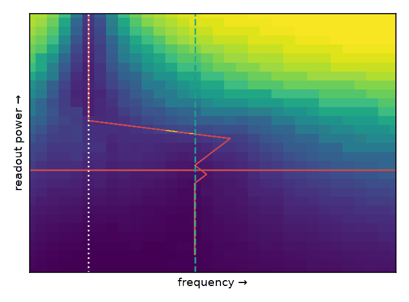
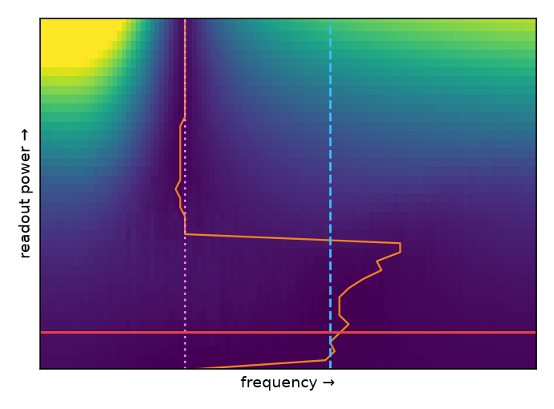
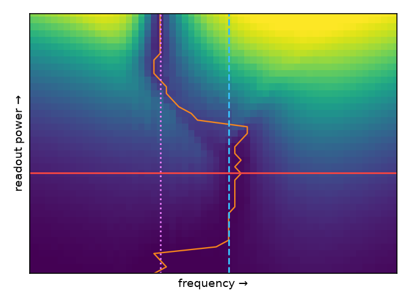

### C2 -- ceiling-below-punch-out  (seen 12x)

**Geometry:** Only the dressed branch is demonstrated: a single dip at fixed frequency through the whole power range, OR the per-row dip position just begins deflecting in the topmost rows without the bare branch ever establishing (onset clipped at the ceiling). Bare frequency and optimal power are not determined by this window; a 'punchout=true' claim from such a window is unsupported.

**Prescription:** Raise the power ceiling by a bounded step (roughly half the current window height) keeping the floor; do NOT repeat unchanged — three identical repeats on one chip reproduced the same verdict byte-alike. If the node wrote a ceiling-power fallback, treat that value as poisoned (F2).

**Exemplars:** CQT/#41/q1, CQT/#995/q20, CQT/#255/q4, AS_10TQ9TC/#9/q9, CQT/#1350/q15

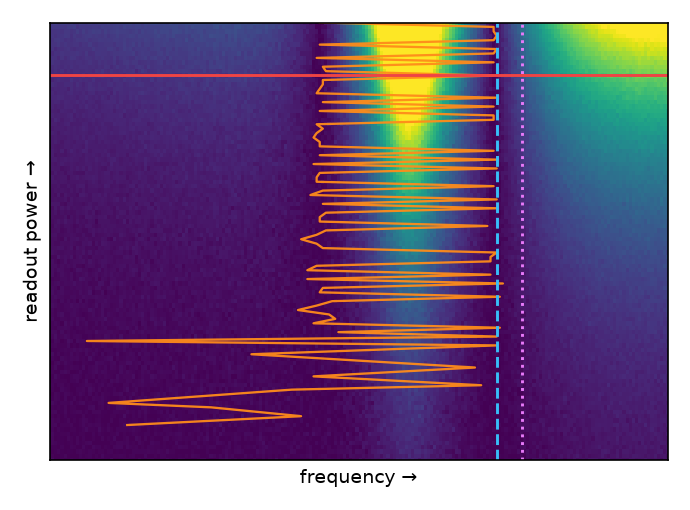
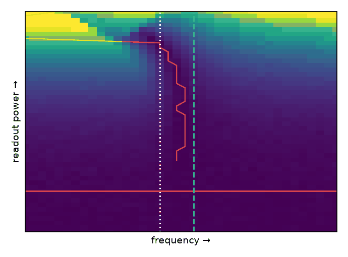
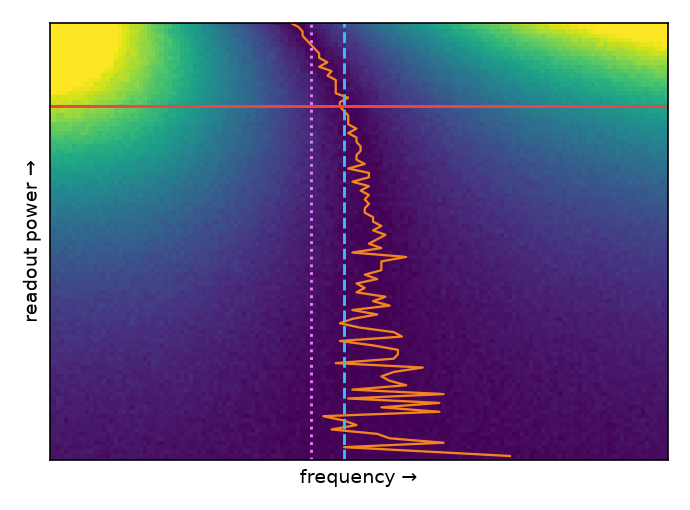

### C3 -- stationary-line (no dressed branch)  (seen 13x)

**Geometry:** One feature whose position does not shift with power anywhere in the window — typically pinned at the bare position, with identical dip shape in every line cut. Distinguish four causes ONLY from session context, never from the single figure: (a) power floor above the band where the dressed branch is visible; (b) qubit decoupled by the current flux operating point (feature also displaced from its usual position); (c) run-to-run intermittency (an adjacent identical run resolved two branches); (d) genuinely dead/far-detuned qubit.

**Prescription:** Check adjacent evidence before touching knobs: if a sibling run minutes away showed two branches, repeat once unchanged (intermittency); if interleaved nodes just moved the flux point, fix the operating point first — widening the sweep is the wrong move; else lower the power floor by a bounded step. If two bounded window moves fail, escalate to qubit spectroscopy to test detuning.

**Exemplars:** AS_10TQ9TC/#321/q6, AS_10TQ9TC/#341/q7, CQT/#727/q12, CQT/#1351/q20, AS_10TQ9TC/#7/q8

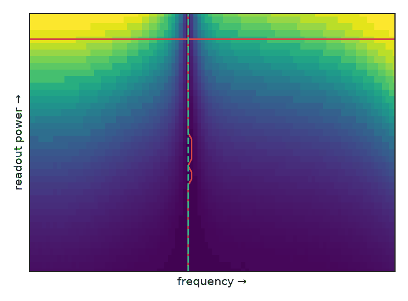
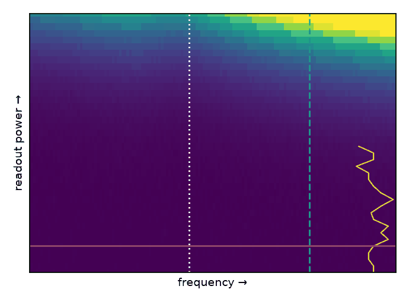

### C4a -- gradual-pull crossover  (seen 10x)

**Geometry:** Both branches and the crossover visible, but the dip position drifts smoothly and continuously (S-bend / shark-fin) over a broad power band instead of snapping. Both plateaus resolvable; the transition power is a band, not a row. Fittable — sharpness of the crossover and trustworthiness are different axes.

**Prescription:** Accept the dressed frequency; place the operating power below the bottom of the drift band with margin (not at its foot). Optionally densify power steps around the crossover to localize the band. No re-run required for the frequency.

**Exemplars:** CQT/#76/q6, CQT/#391/q1, CQT/#1117/q6, CQT/#481/q8, AS_10TQ9TC/#307/q6

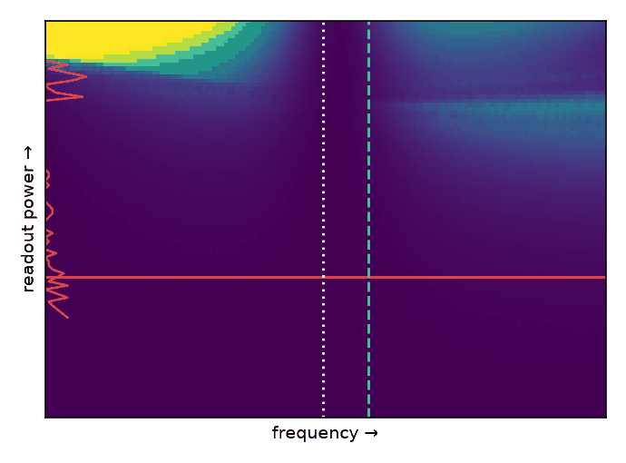
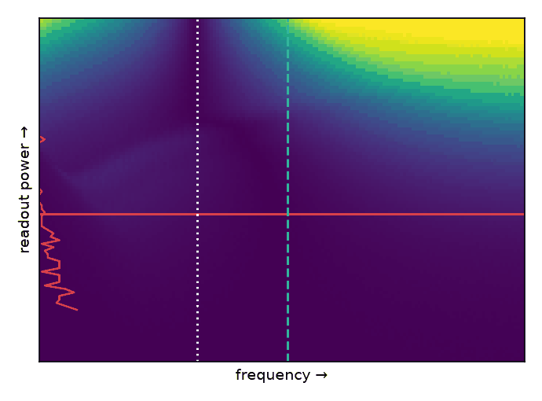
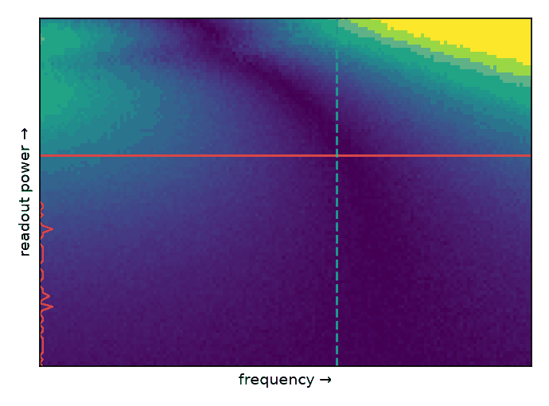

### C4b -- bistable/coexisting crossover  (seen 12x)

**Geometry:** Over a several-dB power band BOTH branches' dips coexist in the same line cut, the tracked dip hops between them, and consecutive identical runs disagree on the bare frequency by several linewidths. Often accompanied by chaotic/asymmetric swings in the rows above the transition. This is exactly what breaks single-dip-per-row fitters.

**Prescription:** Densify power steps and add averaging around the coexistence band; place readout power well below the band; take the bare frequency by agreement across at least two runs, never from one. Pushing the ceiling further into the chaotic region buys nothing.

**Exemplars:** AS_10TQ9TC/#335/q6, AS_10TQ9TC/#345/q6, CQT/#176/q18, AS_10TQ9TC/#8/q9, CQT/#349/q10

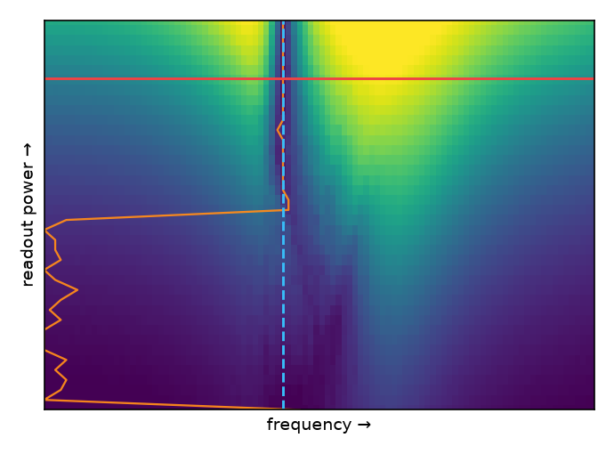
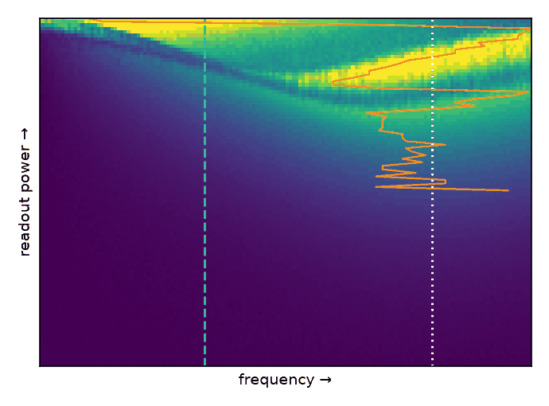

### C5 -- multi-feature window (real neighbor lines)  (seen 10x)

**Geometry:** More than one genuine resonance line in the frequency window (same-feedline neighbors): multiple dip-like columns or a second sloping/broad dark band. Risk: the tracker excursions onto, or locks, the wrong line. The target line is identified geometrically as the one whose position SHIFTS with power.

**Prescription:** Narrow the frequency window around the power-DEPENDENT line and re-run; if the tracker still excursions at high power, narrow further or cut the ceiling just above the target's transition. Record the neighbor's position for the feedline map.

**Exemplars:** CQT/#382/q18, CQT/#394/q5, CQT/#1352/q9, CQT/#347/q9

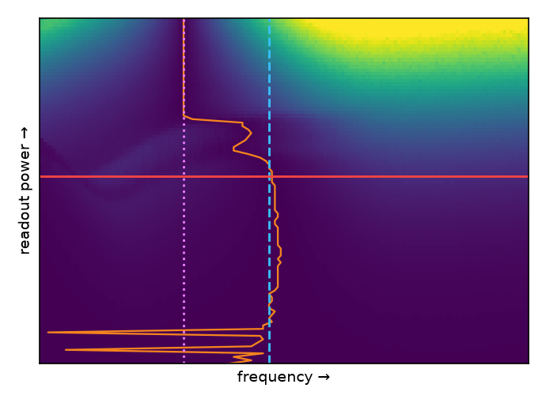
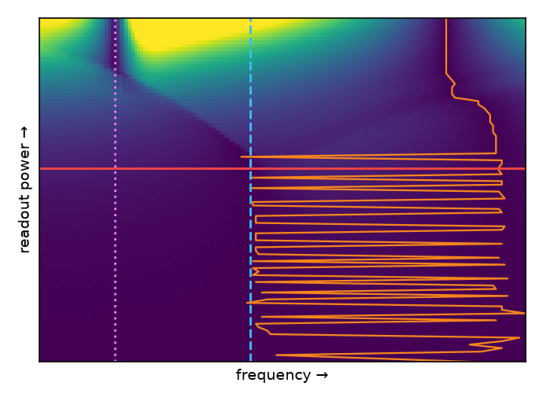
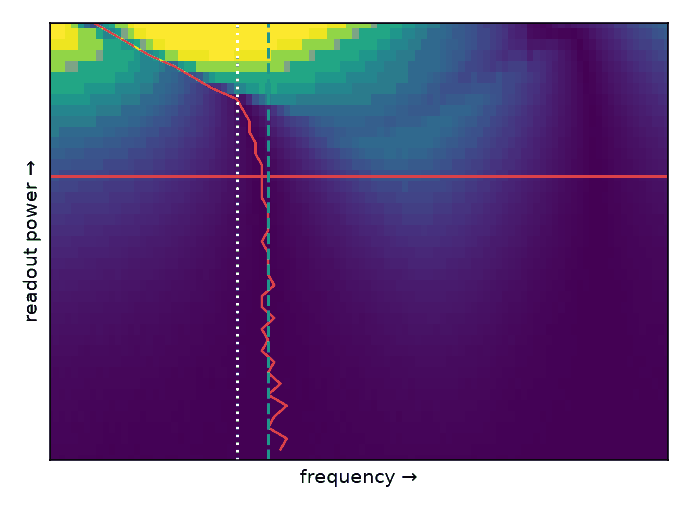

### C6 -- empty window  (seen 4x)

**Geometry:** No credible feature anywhere: flat or smoothly-graded background at every power, dip trace scattering across the full span. Must first be distinguished from N5 off-window (monotonic brightening toward one frequency edge) and N1 snr-floor (structure present in the upper rows only).

**Prescription:** Check the edges for an off-window shoulder first; if truly featureless, widen the frequency span severalfold, then raise the ceiling by a bounded step. If still empty, escalate to a wide feedline spectroscopy scan rather than iterating this node.

**Exemplars:** CQT/#1089/q19, CQT/#1116/q6, CQT/#175/q18

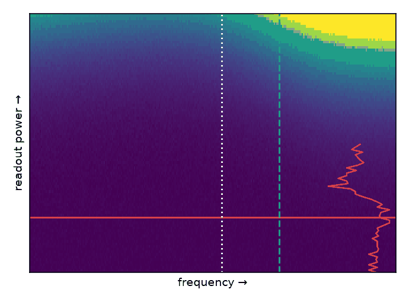
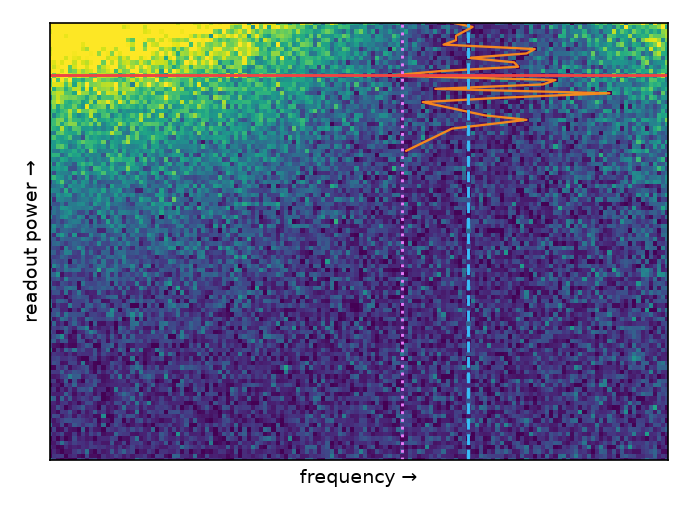
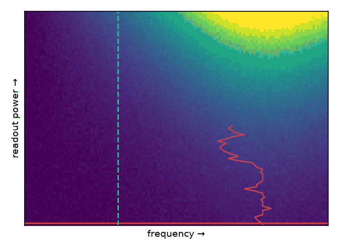

### N1 -- snr-floor (window under the noise floor)  (seen 13x)

**Geometry:** The lower portion of the power window is pure speckle — the dip is untraceable there even though the line itself is healthy in the upper/mid rows (sometimes a full punch-out is visible above the speckle). The dressed-dip gate and/or the optimal-power search operate in the noise rows and fail or pick garbage. The inverse of C3(a): here the floor is too LOW, not too high.

**Prescription:** Raise the power floor out of the speckle by a bounded step, and/or add shots/averaging, and/or raise full-scale output while lowering amplitude for the same power. NEVER widen the frequency span to fix this — no window change converted an SNR failure into a success in any session; if the map above the speckle already shows both branches, a manual read is legitimate.

**Exemplars:** CQT/#624/q9, CQT/#179/q16, CQT/#335/q9, CQT/#357/q16, AS_10TQ9TC/#9/q8

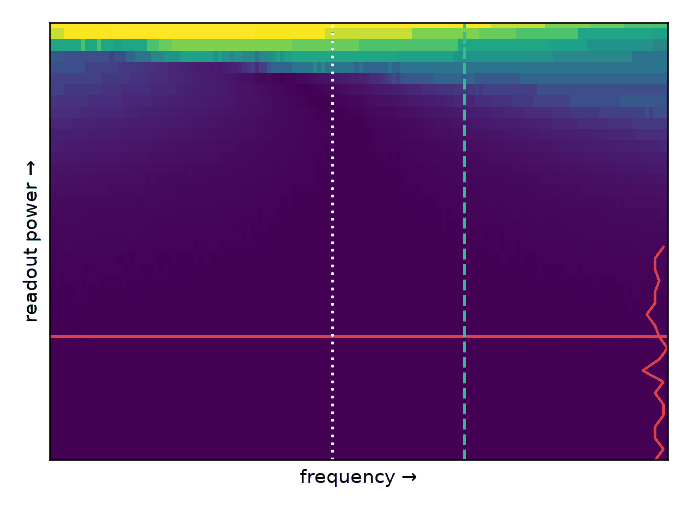
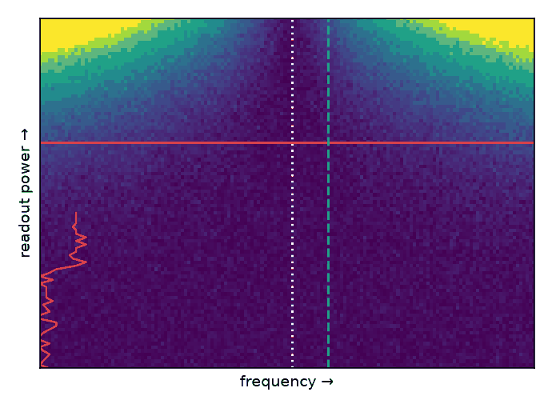
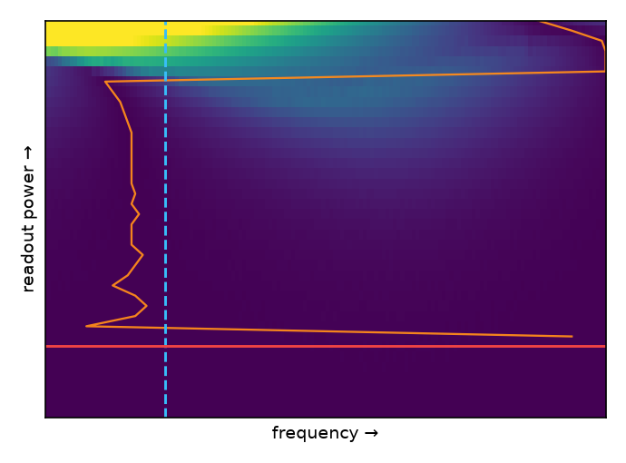

### N2 -- spur-lock (false accept on a non-resonator artifact)  (seen 1x) | **PROVISIONAL P3**

**Geometry:** The analysis latches onto a narrow, power-INDEPENDENT spike far from the real resonator and reports success. Distinguishing test in the line cuts: the real dressed feature is a DIP that participates in the punch-out; a spur is an upward spike (peak) whose position never moves with power. Distinct from C5, which is real neighbor resonators.

**Prescription:** PROVISIONAL P3 -- Reject the fit outright: this is the dangerous false-accept class. Line-cut test (adopted provisionally, expert Q10): an upward SPIKE whose position never moves with power is a spur; the real dressed feature is a DIP that participates in the punch-out. Narrow the frequency window to exclude the spike and re-run; verify any accepted dressed frequency shows dip-shaped line cuts and a plausible few-linewidth separation from the bare line of sibling runs.

**Exemplars:** AS_10TQ9TC/#8/q8

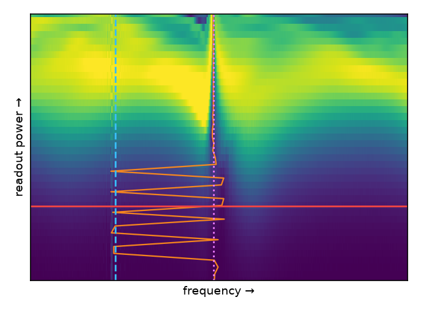

### N3 -- unresolved-shift (sub-linewidth dispersive shift)  (seen 6x)

**Geometry:** The dressed-bare separation is smaller than the dip linewidth (small chi), so the map shows a single dip sliding by less than its own width — no jump is visible even when the transition is inside the window, and punch-out claims are untestable from the figure. The qubit is alive; neither the ceiling (C2) nor the floor (C3) is at fault.

**Prescription:** Adopt the DRESSED frequency only -- the bare value is not required (expert Q7) and stays UNRECORDED rather than unverified-but-written. Shrink the frequency span so the linewidth covers many pixels and densify frequency steps if a punch-out verdict is still wanted; escalate to a dispersive-shift measurement only when the bare value actually matters downstream.

**Exemplars:** AS_10TQ9TC/#315/q6, AS_10TQ9TC/#315/q7, AS_10TQ9TC/#347/q7, AS_10TQ9TC/#11/q9

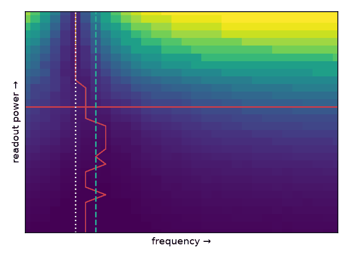
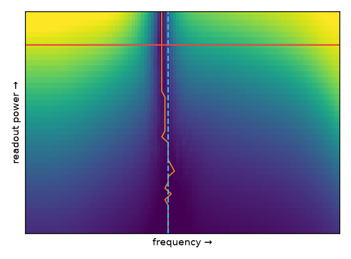

### N4 -- edge-clipped (frequency window mis-centered on a visible feature)  (seen 3x)

**Geometry:** The resonance hugs or crosses the frequency-window edge so the dip shape is cut off; neither branch position is verifiable, and the fitter may promote a spurious mid-window feature to 'bare'. A window-placement failure, not a power-window one.

**Prescription:** Re-center the frequency window on the visible feature and re-run once — identical retries cannot succeed (four were burned on one qubit before the re-center fixed it in one shot). Keep the power window unchanged.

**Exemplars:** CQT/#350/q10, CQT/#351/q10, AS_10TQ9TC/#306/q7

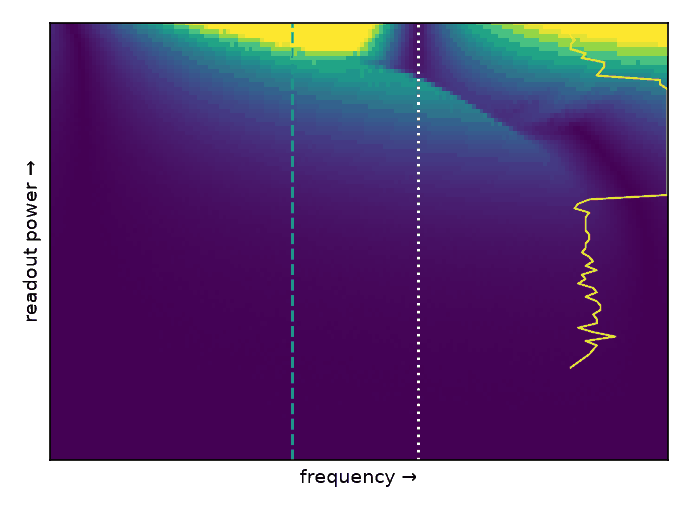
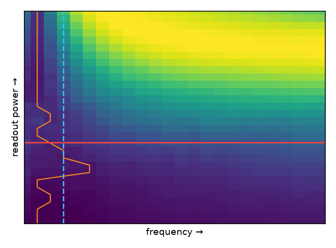

### N5 -- off-window (resonance outside the frequency span)  (seen 1x)

**Geometry:** No dip in the map, but the background brightens monotonically toward one frequency edge at every power — the shoulder of a feature just outside the span (typically a stale seed frequency). Distinguishable from C6 (truly flat) and decisive: the fix is entirely different.

**Prescription:** Widen the frequency span severalfold (biased toward the brightening edge) or re-seed the center from the last known good value; power knobs unchanged. A pre-run sanity check of the seed against the last known resonance skips this run class entirely.

**Exemplars:** CQT/#40/q1

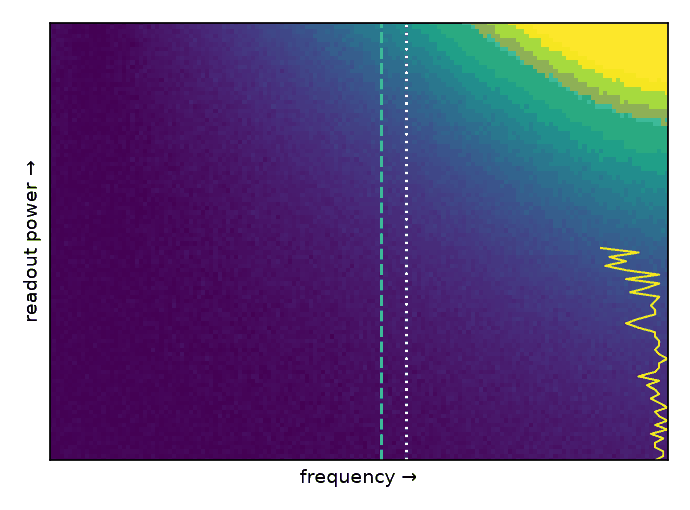

### N6 -- resolution-mismatch (span too wide for the branch step)  (seen 3x)

**Geometry:** The frequency span is so wide that a real few-linewidth branch step spans about one pixel, so a true two-branch map reads as a stationary line (false C3). Same physics, wrong magnification — narrow-window sibling runs of the same qubit show the step plainly.

**Prescription:** Narrow the frequency span per-resonator (to a small multiple of the expected separation) before concluding bare-only; never classify C3 from a survey-width map. Wide spans are for FINDING lines, not for punch-out verdicts.

**Exemplars:** AS_10TQ9TC/#9/q8, AS_10TQ9TC/#318/q7, AS_10TQ9TC/#320/q6

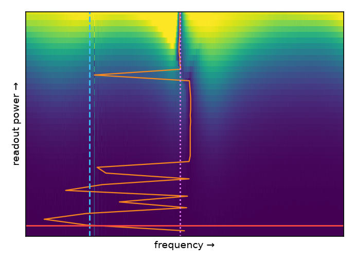
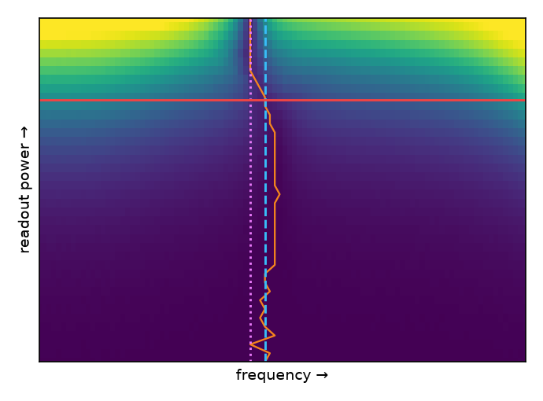

### N7 -- weak-contrast / asymmetric lineshape  (seen 8x) | **PROVISIONAL P2**

**Geometry:** The feature is a shallow local minimum riding a strongly sloped background, often with an adjacent bright peak-like ridge (Fano-like/dispersive shape), so the 'dip position' itself is ill-defined for the tracker; per-row minima wobble by more than any systematic drift and no branch pair is resolvable.

**Prescription:** PROVISIONAL P2 -- Re-measure once with the power ceiling raised by a bounded step (expert Q9; several of these qubits never had the ceiling raise tried). If the lineshape stays asymmetric/low-contrast, flag for expert review -- possibly weak coupling by design, in which case this prescription will be revised. Do not trust the automatic dip pick, any claimed shift, or a floor-pinned optimum on these qubits meanwhile.

**Exemplars:** CQT/#377/q19, CQT/#378/q19, CQT/#1033/q12, CQT/#1079/q12, CQT/#1352/q17

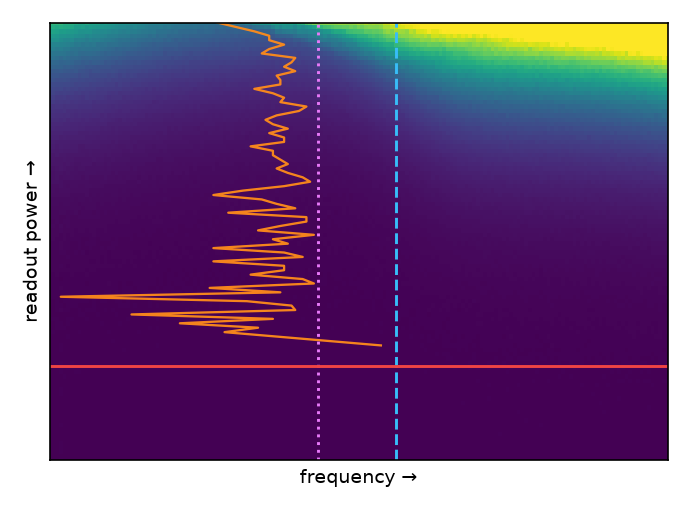
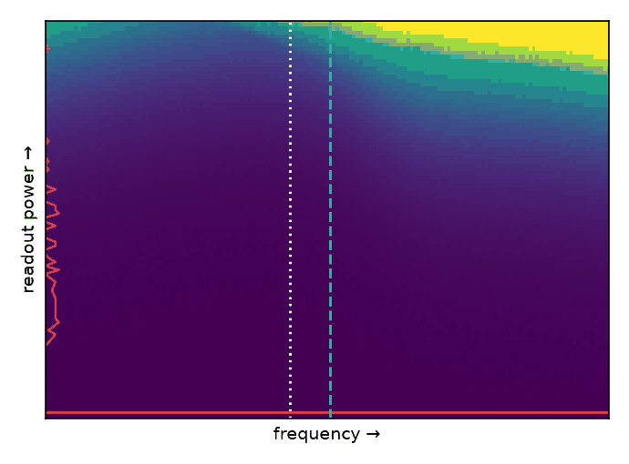
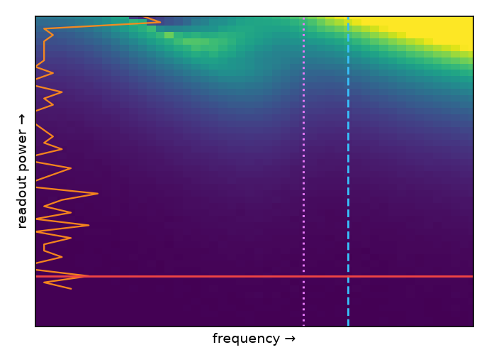

### N8 -- saturation-artifact rows  (seen 4x)

**Geometry:** At the highest powers, bright/dark streaks span the ENTIRE frequency axis (output-chain/amplifier saturation) — whole-row artifacts, not resonator physics. The minimum trace is meaningless there, and a fitter can misread the streaked rows as a punch-out transition; two qubits on one feedline receiving the identical 'optimal' power is the tell.

**Prescription:** Lower the ceiling to just below the streaked rows (or mask them); a transition claimed only at streaked rows is invalid. Annotators must not read trace excursions inside these rows as features.

**Exemplars:** AS_10TQ9TC/#342/q6, AS_10TQ9TC/#342/q7, CQT/#135/q1, CQT/#76/q6

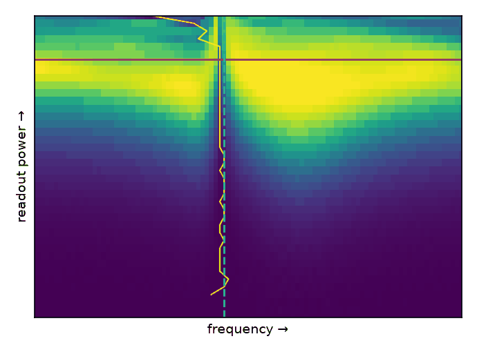
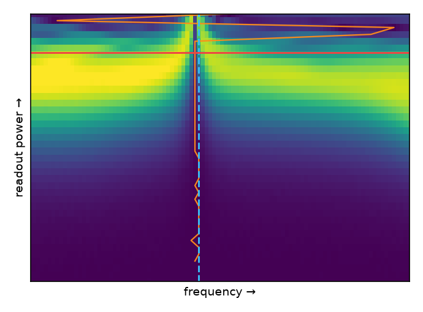
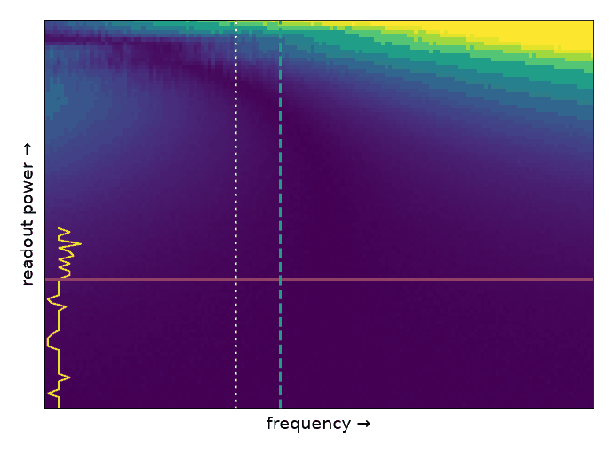

## Flags (orthogonal to map geometry)

A flag can sit on ANY map case -- a textbook C1 can still carry F1.

### F1 -- floor-pinned optimum (flag, orthogonal to map case)  (seen 15x)

**Signature:** The map may be a clean C1, yet the reported optimal power sits at/near the scan's bottom edge, typically 15-35 dB below the knee, in rows where the dip contrast is fading or gone — a boundary artifact of the power-choice rule, not a physics statement. Also covers optima reported BELOW the swept floor (impossible extrapolations from failed fits).

**Prescription:** The reported power value is REFUSED -- never written (expert Q3). Re-run once with the floor raised by a bounded fraction of the window so the picker cannot reach the edge; a reported optimum outside the swept range invalidates that field unconditionally. (In archive replay, where re-running is impossible, the refusal is scored and the re-run is recorded unscoreable.)

**Exemplars:** AS_10TQ9TC/#318/q6, AS_10TQ9TC/#10/q8, AS_10TQ9TC/#232/q5, CQT/#347/q9, CQT/#1352/q17, CQT/#378/q19

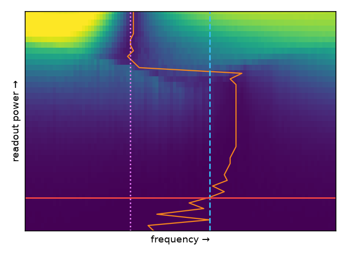
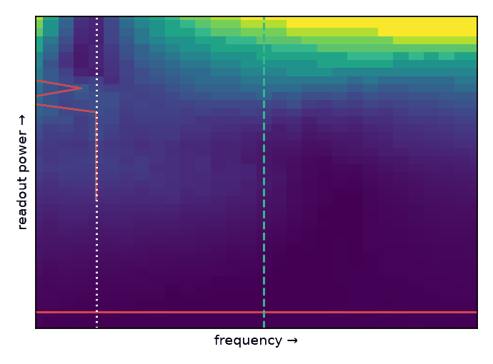

### F2 -- fallback-write poisoning (flag)  (seen 14x)

**Signature:** The node returns success with punchout=false and writes fallback values into state — ceiling power and/or the amplitude cap — degrading subsequent runs on the same feedline (huge readout amplitude can suppress the dressed dip in the very next map). 'Succeeded but wrote a sentinel' is invisible to map-only classification.

**Prescription:** AUTO-REVERT (expert Q4): SM reverts the fallback-written ceiling power / amplitude-cap values before the next run on that feedline -- the one-button session authorizes the write-back, and this is the poisoned-first-button class the whole loop exists to stop. Then re-run with the corrected window. Any session where a no-punch-out fallback write precedes a streak of SNR failures is re-read with this flag in mind.

**Exemplars:** AS_10TQ9TC/#320/q7, AS_10TQ9TC/#321/q6, AS_10TQ9TC/#327/q6, AS_10TQ9TC/#347/q6, CQT/#41/q1

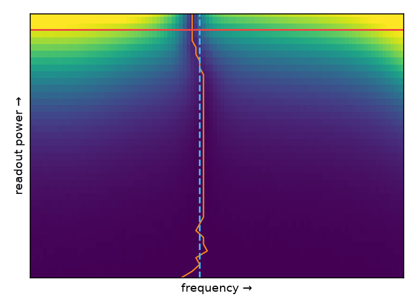

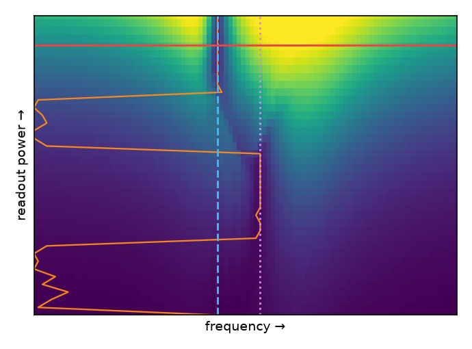

### F3 -- branch-label swap / bare contradiction (flag)  (seen 11x)

**Signature:** The fit's dressed/bare assignment contradicts the figure's geometry: 'bare' pinned on the low-power branch (the power-independent hot-row position is bare by definition), or the reported bare frequency lands in featureless background or on the opposite side from where the high-power dip visibly moves. Independent of data quality — the map can be textbook.

**Prescription:** OFFICIAL RULE (expert Q5 -- "the figure IS the physics"): geometry overrides fit labels. The power-independent hot-row position is bare by definition; re-derive branch identity from geometry and adopt the corrected values. FILE UPSTREAM: this is a fitter defect report -- window changes and retries provably cannot repair a labeling defect. Suspect an adjacent bright interference peak as a root cause where present.

**Exemplars:** AS_10TQ9TC/#326/q6, AS_10TQ9TC/#319/q6, AS_10TQ9TC/#346/q6, CQT/#1351/q14, CQT/#1213/q15

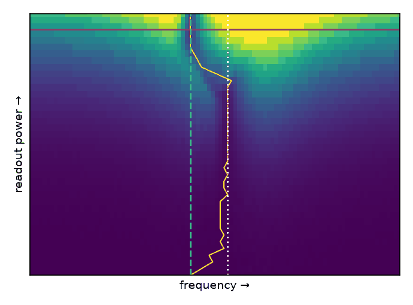
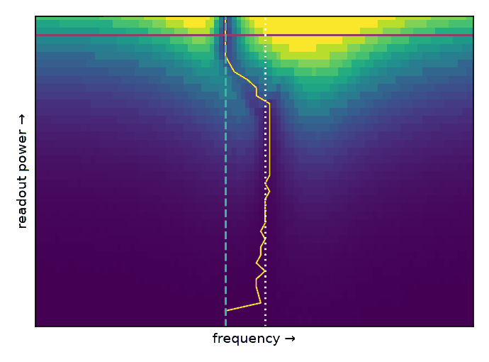
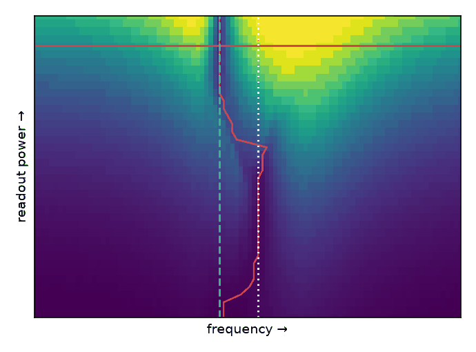

### F4 -- off-feature fit on the correct line (flag)  (seen 4x)

**Signature:** A SUCCESS whose dressed marker sits a few linewidths off the visible dip on the RIGHT line (not a wrong-line lock, not a spur): the tracker followed the feature but the fitted center landed beside it, or between branches.

**Prescription:** Re-read the figure before adopting; if the dip is visible, take the frequency manually or re-run once. Consecutive-run agreement (within a fraction of a linewidth) is the acceptance test.

**Exemplars:** CQT/#342/q9, CQT/#1212/q15, CQT/#1352/q19, AS_10TQ9TC/#323/q6

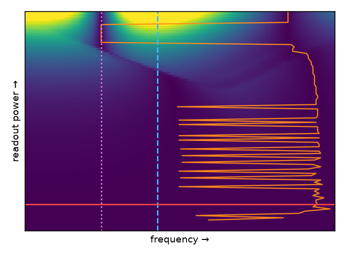
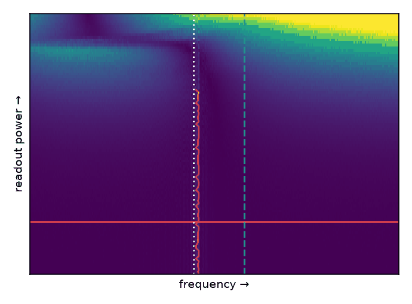
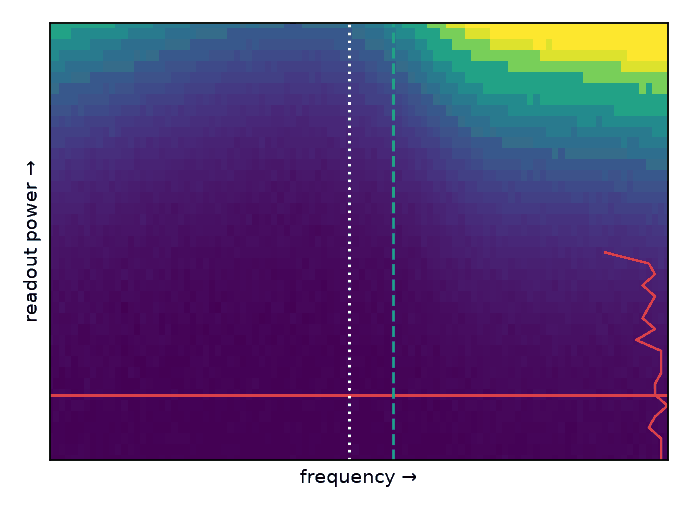

### F5 -- verdict-figure mismatch at the gate (flag)  (seen 8x)

**Signature:** The node refuses a visually fittable map at the gate margin (including messages that read as arithmetic nonsense after rounding, e.g. 'SNR 5.4 < 5'), or accepts a map that supports nothing. Marginal-SNR features flip S/F across identical back-to-back runs — verdict instability is the session-level signature.

**Prescription:** On a marginal refusal with a good-looking map: add averaging rather than re-running unchanged (identical retries are a coin flip); a manual read of a clear map is legitimate. On S/F flicker across identical runs, stop repeating — change the SNR (shots, full-scale/amplitude split), not the window.

**Exemplars:** CQT/#346/q9, CQT/#348/q10, CQT/#624/q9, CQT/#995/q20, AS_10TQ9TC/#326/q6

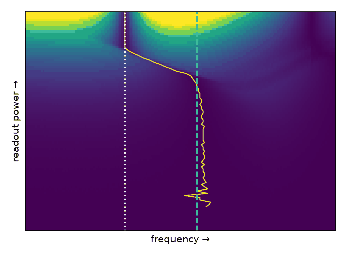
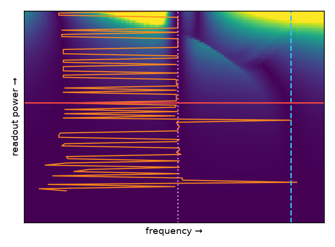

### F6 -- intermittent dressing / run-to-run bistability (session-level flag)  (seen 5x) | **PROVISIONAL P1**

**Signature:** The dressed feature is present in one run and completely absent in the next under identical settings, minutes apart (clean C1 followed by C3 of the same qubit). One phenomenon, not two cases — a per-figure taxonomy cannot express it; only adjacent-run comparison reveals it.

**Prescription:** PROVISIONAL P1 -- Re-run once with slightly PERTURBED parameters (small bounded jitter on the window edges/steps -- expert Q8), not an identical repeat: identical repeats are a coin flip here. If the feature still flickers, treat as a device/operating-point problem (flux stability, TLS) and stop calibrating this qubit; widening windows is provably useless and invites F1/F2 damage. Cross-check any adopted value against the agreement cluster of the runs where the feature was present.

**Exemplars:** AS_10TQ9TC/#315/q6, AS_10TQ9TC/#321/q6, CQT/#1352/q16, CQT/#1351/q17

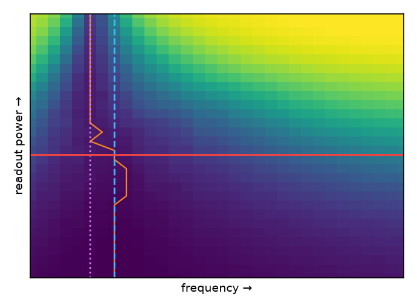

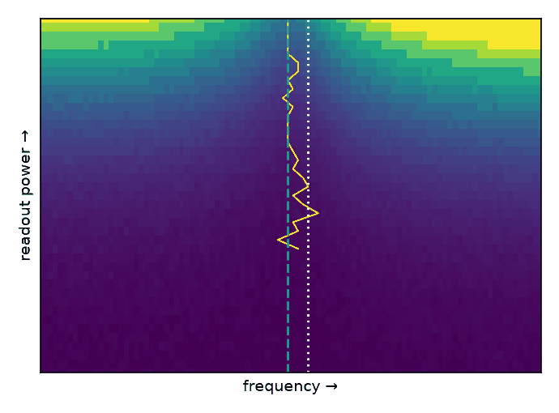

## Exemplar images

Axes are NORMALISED and UNLABELLED: no absolute frequency or power leaves this pack, and a picture without numbers cannot teach an absolute scale (Clause B). Orientation follows the labs' own convention: frequency rightwards, readout power upwards. Overlays: orange = per-row dip track (rows where no dip clears the noise are simply absent), cyan dashed = the record's dressed frequency, magenta dotted = its bare frequency, red = its chosen power. Markers are the RECORD's claims, drawn even when they contradict the map — that contradiction is the lesson in the branch-swap and off-feature cases.

## Rules

### R-semantics -- fit-record semantics (expert Q1, CONFIRMED)

frequency_shift in this node's fit record is the UPDATE DELTA versus the previously stored resonator frequency -- it is NOT the dressed-bare separation. bare_resonator_frequency is sometimes absent and sometimes contradicts the figure; never treat it as authoritative without the map.

### R-batch -- multiplexed batch punch-out (expert Q6, conditional)

Batch (multi-qubit) punch-out runs are allowed ONLY as re-confirmation of qubits previously calibrated individually, at windows individually validated -- never for first calibration or failure recovery (one 8-qubit batch failed 7/8 and cost an afternoon of feedline-by-feedline repair). If more than a third of batch members fail, abort to per-feedline singles instead of retrying the batch.

### R-bias -- cross-session adoption after a bias move (expert Q12)

Adopting a value measured before a known flux/bias move is allowed, but SM runs ONE sanity re-measurement before dependent nodes execute -- adoption without re-verification is what left a stale evening state unchecked in the pilot corpus.

### R-c4split -- C4a/C4b ambiguity (expert Q11, recorded-skip)

The gradual-pull vs bistable split was assigned retroactively; about 7 of 29 original C4 annotations are ambiguous between C4a and C4b. Recorded, not yet expert-resolved -- do not quote the C4a/C4b counts as settled.

### R-gatemsg -- gate-margin message wording (expert Q2, deferred)

The 'SNR 5.4 < 5'-style refusal message (rounding vs real comparison) is explicitly out of scope for this manual version.

## Provisional registry

These prescriptions are expected to change -- they are managed as a separate category (expert direction, 2026-08-21) and may be revised or deleted as evidence accumulates:

- **P1** -- run-to-run flicker: perturb-and-retry (from F6, expert Q8)
- **P2** -- Fano/low-contrast: raise-ceiling re-measure (from N7, expert Q9)
- **P3** -- spur line-cut test (from N2, expert Q10; n=1 evidence)

## Edge-case references

Concrete archived runs kept as references (reference material for the manual and the judge, NOT model-training data). Absolute values are permitted HERE because these cite specific runs; the case definitions above stay chip-independent.

### ER-1 -- AS_10TQ9TC/#326 (q6, q7)  [F3]

Textbook punch-out step on the figure; the node reports punchout=false with inverted branch labels, a ceiling optimum above the step, and (q7) an optimum below the swept floor. SM must adopt the geometry-corrected values on its own -- this is the reference case for the figure-overrides-labels rule.

### ER-2 -- AS_10TQ9TC/#347 (q6)  [F2/F3]

success=true alongside the node's own 'no punch-out: widen sweep' banner and a nonzero frequency_shift -- an internally inconsistent record. The node is wrong; SM must catch the self-contradiction from the record alone, before any figure is consulted.

### ER-3 -- CQT/#1212 (q15)  [F4]

A SUCCESS whose fitted frequency sits off the visible dip and above where every later run converges, with the optimum below the SNR floor. SM must catch this from data (figure + record), unaided.

### ER-4 -- CQT/#624 (q9)  [N1/F5]

A usable punch-out map refused at the gate margin; the recorded numbers sit off the visible dip and the optimum lands in pure noise. SM must re-read the map and recover the value the refusal threw away.

### ER-0 -- AS_10TQ9TC/#8 (q8)  [N2]

The spur-lock false accept (success on a power-independent spike far from the resonator). EXCLUDED from the verification round by expert decision -- retained here as the only known exemplar of the class.